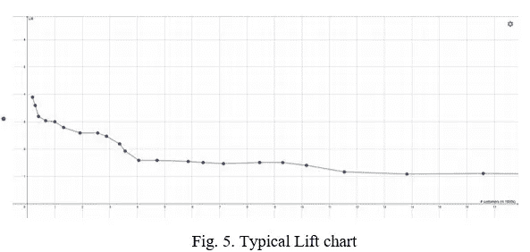

# 分类模型评估

> 原文：<https://medium.com/analytics-vidhya/classification-model-assessment-4187948269d8?source=collection_archive---------11----------------------->

> **简介**

人脑是一个复杂的器官，能够通过一生中的许多经历来识别模式、规则和不规则。当我们知道一个有经验的医生正在给一个刚毕业的人做手术时，我们会保持冷静和自信。这是因为一个刚毕业的学生通过几个小时的学习获得了知识，并从一些书籍中找到了一套规则，相比之下，一个有经验的专业人员通过几个小时的学习，之前已经做了很多类似的手术。他/她可以快速识别复杂过程(如手术)中的各种模式和细微差别，并对可能出现的不同挑战做出相应的反应。以类似的方式，机器学习是一种通过对各种数据严格训练计算机程序来构建算法的技术，以高效地识别任何模式或异常。与基于规则的识别机制相比，机器学习在识别模式方面极其有效，是人工智能的关键概念之一。

***分类车型***

分类的核心思想是将输入分类为 N 种不同可能性中的一种。这可以分为两类(二元分类)或多类(多类分类)。分类的类型由分类器试图建模的问题决定。

有许多业务情况需要分类，如识别潜在客户是否购买，以及贷款是否可以支付。在机器学习中，分类可以用于识别数字、一副牌、交通信号等。这可以通过使用正确的数据来训练模型，并选择最适合当前情况的模型来实现。一些最常见的分类算法是随机森林/决策树、逻辑回归和神经网络。只有在测试和验证阶段对每个模型进行全面评估，才能选择合适的模型。

接下来，我们将介绍用于评估的不同技术和指标，并详细说明我们应该如何、在哪里以及在什么情况下使用不同的方法。

> **模型评估基础知识**

模型的性能可以根据其验证数据的结果来衡量。我们使用验证数据，因为输入所属的实际类是已知的，并且我们根据实际值来度量模型性能。

***评估分类模型的术语和指标***

*混淆矩阵—* 将预测的类绘制到实际的类，这给了我们一个混淆矩阵。混淆矩阵有助于快速可视化模型结果并识别模型性能

*准确度* : 定义为正确预测的类别占模型做出的所有预测的百分比(50+25)/(50+25+10+15) = 0.75

*真阳性(TP)* :被正确预测的实际阳性类别数(50)

*假阳性(FP)* :被错误预测为阳性的实际阴性类别的数量(15)

*真阴性(TN)* :被正确预测的实际阴性类别的数量(25)

*假阴性(FN)* :被错误预测为阴性的实际阳性类的数量(10)

*敏感度(也称为回忆)*:是对所有阳性实际值中有多少个阳性类别被模型正确预测的度量，即 TP/TP+FN = (50)/(50+10)=0.83

*特异性*:测量所有阴性实际值中有多少阴性类别被模型正确预测— TN/TN+FP = (25)/(25+15) = 0.62

*精度*:顾名思义，衡量模型正确预测正类的有效性——TP/TP+FP =(50)/(50+15)= 0.77

> **这些指标什么时候有意义？**

总的来说，模型的准确性是一个非常基本的衡量标准，并不总是呈现正确的画面。在其中一个类别很少出现的情况下，这是一种误导。比如预测疾病、贷款拖欠或欺诈交易等。这种情况下的想法是识别异常，并正确预测不发生的情况并没有真正的帮助。只有在正面和负面类别的预测同等重要且它们在现实世界中的发生概率相似(平衡数据)的情况下，准确性才被视为评估使用的有效衡量标准。

*   在我们试图预测销售的营销领域，您可能需要考虑准确性来评估分类模型。客户同样可能购买或不购买，组织可能希望根据预测发送不同的活动/优惠

如果准确性不是预测很少发生的积极情况的好方法，我们需要用别的方法。查看不同指标的公式，我们发现灵敏度=TP/(TP+FN)是一个更好的指标。因此，在动机是识别欺诈或流失等事件的情况下，关注敏感度比整体准确性更重要。

*   让我们以一家试图预测欺诈活动的银行为例，这里我们主要关注的是预测欺诈的发生，而不发生则一切如常。在这种情况下，强调敏感度高于其他指标有助于选择正确的模型

在重点是确保正确识别阴性类别的情况下，特异性(=TN/(TN+FP))是有意义的，因为它提供了模型正确分类实际阴性病例的概率。

*   在某些情况下，正确预测不发生也很重要。一个例子是预测疾病的传播。在疫情的情况下，如果接触者追踪应用程序错误地将病例标记为阳性，可能会导致不必要的匆忙赶往医院和检测中心。在这种情况下，重点应该放在选择模型的特殊性上。

最后，我们看看精度(=TP/(TP+FP))，这提供了理解模型如何正确预测正类的能力。这是一个指标，有助于理解模型是否将太少/太多实际上积极的类标记为积极的。

*   如果预测欺诈的模型效率不好，精度低，那么可能会给银行客户带来不必要的不便。这可能会导致大量帐户和交易被冻结，这是一种糟糕的客户体验

> **多类分类模型的度量**

到目前为止，我们讨论的度量在二进制分类场景中仍然适用，并且可以直接查看。但是对于多类的情况，我们将不得不在每个类的基础上考虑相同度量的稍微修改的形式。

在多类场景中，我们试图将一组输入分组到它们可能属于的两个以上的类中。机器学习中多类分类的一个例子是处理图像并识别图像中的对象，以进行自动标记，如树、云等。

我们对多类分类模型使用相似的度量，但是在这种情况下，假设一个对象属于一个类或者不属于一个类，则为每个类单独计算度量。也就是说，不是问一个特定的图像是一棵树还是一朵云，而是问这个图像是否包含一棵树，或者不包含？图像是否包含云呢？

这种模型标记图像的能力的准确性可以在平均值的帮助下确定，如下所示(k 是类的总数)。

上述灵敏度、特异性和精确度的计算考虑了所有类别的同等权重，我们称这些计算为宏观水平。这意味着可能有一个类具有更少的观察值，并且扭曲了度量。在这种情况下，另一种方法是考虑加权指标，我们称之为微观水平。当选择最佳的多类模型时，我们可能希望同时考虑宏观和微观级别的度量。

注意:有关更多信息:[1]，[17]

> **其他评估技术**

***接收机工作特性(ROC)曲线***

ROC 曲线是在多个阈值的真阳性率(TPR)和假阳性率(FPR)之间绘制的曲线，其中 TPR 与灵敏度相同，FPR 为(1-特异性)。它有助于识别模型清楚地识别正类和负类的能力(可分性)。

随机选择的 ROC 看起来像一条 45 度角的直线，因为模型对阳性和阴性类别进行分类的概率相等且为 0.5。

在待评估的不同模型的曲线上绘制多个阈值将提供 ROC 曲线，如下所示

这里要考虑的最佳模型之一是绿色模型，它具有最高的 TPR 和最低的假阳性率。它是最有效地测量两个类别之间的可分性的模型。ROC 曲线有助于快速直观地识别最佳模型。

注意:有关更多信息:[8]、[10]、[11]、[12]

***【AOC】***曲线下面积

ROC 曲线下的面积有助于通过测量这种可分性来量化模型的有效性。好的模型 AUC 应该是最高的。随机模型的面积为 0.5，而完美模型的面积为 1，也就是说，它几乎总能识别输入所属的正确类别[6]。

面积的计算方法是将曲线分割成多个小矩形，然后将各个面积相加。下图显示了一个示例，[8]以了解更多信息

这是计算 AUC 的最简单方法。然而，有其他技术可以用来计算更复杂的情况。

在我们试图预测疾病或灾难等罕见事件的情况下，ROC 和 AUC 是很好的评估选项。这是因为它与阶级分布无关。而准确性和其他更多的是基于每类结果的数量。

注意:有关更多信息:[9]、[8]、[11]、[16]

***升降图***

在某些受限的情况下，我们希望最大化模型结果中的正类。对于有限的样本选择，提升图有助于为这种情况选择最佳模型。

一个例子是直接营销活动，由于预算限制，一家公司可能只能瞄准少数几个潜在客户。然而，他们希望通过此次活动最大限度地增加新客户。为此，使用提升图来选择最佳模型，以最大化其 ROI(投资回报)。

Lift 的计算方法是，使用该模型(挑选接受要约概率最高的类别)与不使用该模型(平均接受)相比，可以获得的积极类别的数量

注意:有关更多信息:[7]、[13]、[14]、[15]

提升图绘制了提升度量与样本数量的关系。这个想法是为选择的少量样本提供高升力。这是一个样本

> **总结**

我们很快看到了一个有助于理解机器学习及其意义的类比，然后我们看到了什么是分类模型以及衡量有效性的基本指标。我们还研究了每个指标何时有意义，以及如何使用 ROC 曲线和 lift chart 等一些高级技术来为手头的场景选择最佳模型。

> **参考文献**

[1] V. Foss，“寄生虫 ID |多类分类模型评估”，寄生虫. ID .[在线]。可用:【https://parasite.id/blog/2018-12-13-model-evaluation/. 【访问时间:2020 年 7 月 26 日】。

[2] Bishop，神经计算教授 Christopher M，模式识别与机器学习。纽约州纽约市:斯普林格出版社，2006 年。

[3] S. Bhattacharya，“分类模型的模型评估技术”，走向数据科学，2018 年 12 月 6 日。【在线】。可用:[https://towards data science . com/model-evaluation-techniques-for-class ification-models-EAC 30092 c 38 b。](https://towardsdatascience.com/model-evaluation-techniques-for-classification-models-eac30092c38b.)【访问时间:2020 年 7 月 26 日】。

[4] I. Dey，“评估分类模型—走向数据科学”，走向数据科学，2019 年 5 月 24 日。【在线】。可用:[https://towardsdatascience.com/hackcvilleds-4636c6c1ba53.](https://towardsdatascience.com/hackcvilleds-4636c6c1ba53.)【访问时间:2020 年 7 月 26 日】。

[5]一个 Kassambara。“分类模型准确性的评估:要点”。Sthda.com。【在线】。可用:[http://www . sth da . com/English/articles/36-class ification-methods-essentials/143-evaluation-of-class ification-model-accuracy-essentials/。【访问时间:2020 年 7 月 26 日】。](http://www.sthda.com/english/articles/36-classification-methods-essentials/143-evaluation-of-classification-model-accuracy-essentials/.)

[6] R. Ng，“评估一个分类模型”，Ritchieng.com。【在线】。可用:[https://www . ritchieng . com/machine-learning-evaluate-class ification-model/。](https://www.ritchieng.com/machine-learning-evaluate-classification-model/.)【访问时间:2020 年 7 月 26 日】。

[7] S. Sayad，“模型评估”，Saedsayad.com。【在线】。可用:[https://www.saedsayad.com/model_evaluation_c.htm.](https://www.saedsayad.com/model_evaluation_c.htm.)【访问时间:2020 年 7 月 26 日】。

[8] O. Shalev，“回忆、精确、F1、ROC、AUC 和一切——初创企业——中型企业”，初创企业，2019 年 5 月 27 日。【在线】。可用:[https://medium . com/swlh/recall-precision-f1-roc-AUC-and-everything-542 aedf 322 b 9。](/swlh/recall-precision-f1-roc-auc-and-everything-542aedf322b9.)【访问时间:2020 年 7 月 26 日】。

[9]陈振聪，“什么是 ROC 曲线以及如何解释它| displayr”，Displayr.com，2018 年 7 月 5 日。【在线】。可用:[https://www . displayr . com/what-is-a-roc-curve-how-to-interpret-it/。](https://www.displayr.com/what-is-a-roc-curve-how-to-interpret-it/.)【访问时间:2020 年 7 月 26 日】。

[10]即 Statsdirect.com 布坎的“ROC 曲线分析”。【在线】。可用:[https://www . stats direct . com/help/default . htm # nonparameter _ methods/roc . htm .](https://www.statsdirect.com/help/Default.htm#nonparametric_methods/roc.htm.)【访问时间:2020 年 7 月 26 日】。

[11] S. Narkhede，“了解 AUC-ROC 曲线-走向数据科学”，走向数据科学，2018 年 6 月 26 日。【在线】。可用:[https://towardsdatascience . com/understanding-AUC-roc-curve-68b 2303 cc9c 5。](https://towardsdatascience.com/understanding-auc-roc-curve-68b2303cc9c5.)【访问日期:2020 年 7 月 26 日】。

12s .埃克伦德。“ROC 曲线——什么是 ROC 曲线，如何使用 ROC 曲线？，“Acutecaretesting.org。【在线】。可用:[https://acutecaretest . org/en/articles/roc-curves-what-is-they-they-how-they-they-used。【访问时间:2020 年 7 月 26 日】。](https://acutecaretesting.org/en/articles/roc-curves-what-are-they-and-how-are-they-used.)

[13] D. Bhalla，“理解增益和升力图”，Listendata.com。【在线】。可用:[https://www . listen data . com/2014/08/excel-template-gain-and-lift-charts . html](https://www.listendata.com/2014/08/excel-template-gain-and-lift-charts.html.)【访问时间:2020 年 7 月 26 日】。

[14] P. Braak，“理解升程图”[在线]。可用:[http://https:/paultebraak . WordPress . com/2013/10/31/understanding-the-lift-chart/。](http://https:/paultebraak.wordpress.com/2013/10/31/understanding-the-lift-chart/.)【访问时间:2020 年 7 月 26 日】。

[15]诉拉奥。“理解和解释增益和提升图表”，Datasciencecentral.com。【在线】。可用:[https://www . datascience central . com/profiles/blogs/understanding-and-interpreting-gain-and-lift-charts。](https://www.datasciencecentral.com/profiles/blogs/understanding-and-interpreting-gain-and-lift-charts.)【访问时间:2020 年 7 月 26 日】。

[16] N. Kawwa，“如何计算和使用 AUC 分数——走向数据科学”，走向数据科学，2020 年 2 月 9 日。【在线】。可用:[https://towardsdatascience . com/how-to-calculation-use-the-AUC-score-1 fc 85 C9 a 8430。](https://towardsdatascience.com/how-to-calculate-use-the-auc-score-1fc85c9a8430.)【访问时间:2020 年 7 月 26 日】。

[17] B. Shmueli，“简化多类指标，第二部分:F1 得分”，走向数据科学，2019 年 7 月 3 日。【在线】。可用:[https://towards data science . com/multi-class-metrics-made-simple-part-ii-the-f1-score-ebe 8 b 2c a1。](https://towardsdatascience.com/multi-class-metrics-made-simple-part-ii-the-f1-score-ebe8b2c2ca1.)【访问时间:2020 年 7 月 26 日】。