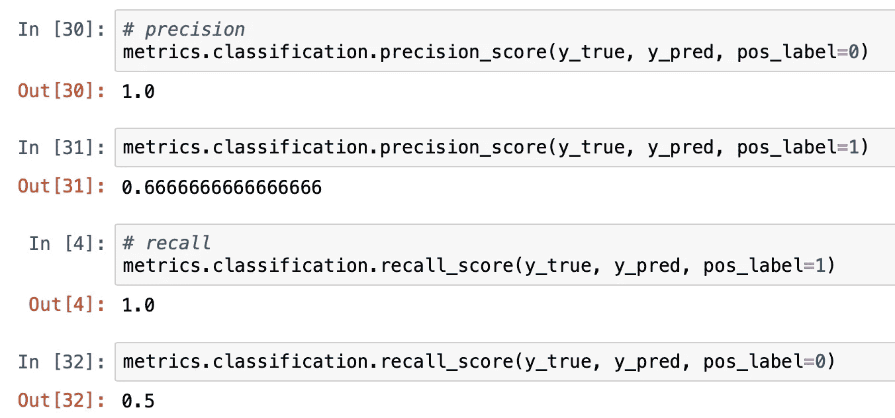
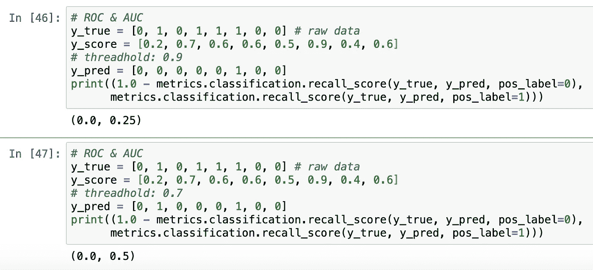
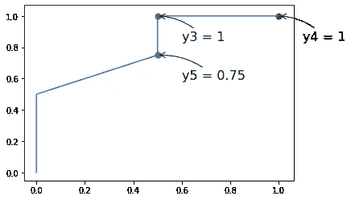

# 分类模型评估

> 原文：<https://medium.com/analytics-vidhya/classification-model-evaluation-cc18a80861ec?source=collection_archive---------23----------------------->


# 混淆矩阵

对于分类问题，我们首先需要知道的是混淆矩阵。从这个矩阵中，我们可以获得一些有用的信息，包括准确度、精确度、召回率和 f1 分数。

在这里，我们假设只有两种可能的结果，积极的和消极的。在二元分类问题中，正(或者用数字 1)总是指人们真正关心的结果。例如，如果我们正在构建一个银行欺诈检测模型，则肯定的结果意味着存在欺诈交易。


混淆矩阵

根据上图，我们有一个包括 TP、FP、FN 和 TN 的矩阵。第二封信指的是我们样本的预测，第一封信显示我们的预测是否正确。我们在 Python 中使用 sklearn 的时候，矩阵是不一样的，但是思路是一样的，只是一些行和列的交换。让我们在 sklearn 中实现吧。

```
binary classification, the count of true negatives is
:math:`C_{0,0}`, false negatives is :math:`C_{1,0}`, true positives is
:math:`C_{1,1}` and false positives is :math:`C_{0,1}`
```


sklearn 中的混淆矩阵

```
from sklearn import metricsy_true = [0, 1, 0, 1, 1, 1, 0, 0] # raw data
y_pred = [0, 1, 1, 1, 1, 1, 0, 1] # final predictionmetr = metrics.classification.confusion_matrix(y_true, y_pred)
metr
```

这个问题的混淆矩阵是:


抽样输出

样本数据中有 4 个正类和 4 个负类。所以每列的总和是 4。

TN:原始数据和预测都是 0。我们有两个。

FP:预测是 1，但原始数据是 0。我们有两个。

FN:预测是 0，但原始数据是 1。这些都不是。

TP:原来和预测是 1。我们有四个。

我们也可以使用 Seaborn 来可视化我们的混淆矩阵。

```
from sklearn.metrics import confusion_matrix
import numpy as np
import matplotlib.pyplot as plt
import seaborn as sns# visualize
figure = plt.figure(figsize=(4, 4))
sns.heatmap(metr, cmap='Blues')
plt.xlabel('Predicted labels')
plt.ylabel('True labels')
plt.show()
```


样本混淆矩阵

# 评估指标

对于以前没有见过的人来说，矩阵本身可能会令人困惑。也许这就是它被称为混乱矩阵的原因。从矩阵中提取一些可理解的数据是一个好主意，这就是为什么我们有精确度、准确度、召回率和 F1 分数。

**准确率:正确预测/预测总数。**


那是对角线上的项目总和除以项目总数！

**精度:正确正预测/正预测总数**


Precision 大多数时候只关心正类(有时候我们有负的预测值，它只关心负类)。

**灵敏度(回忆):正确的阳性预测/阳性类别总数(在原始数据中)**


回忆显示了我们的模型捕捉正面类的能力。例如，它显示了我们的模型可以检测到多少百分比的银行卡欺诈。我们一直希望召回规模越大越好，因为我们不想遭受任何交易欺诈。

简而言之，准确性不依赖于标签，但精确度和召回率依赖于标签，我们需要指定数据的正面标签。对于一个不平衡的数据集，准确率总是不能成为一个好的指标，我们应该用准确率和召回率来代替。



使用 sklearn 计算这些指标非常容易。只需注意 pos_label 参数！

# **ROC 曲线**

**ROC** 指**接收机工作特性**。那是一个相当长的时期。但背后的想法并没有那么复杂。


**AUC** 指**曲线下面积**，顾名思义，曲线下面积。我们使用 AUC 来评估我们的模型。

首先，让我们绘制一个样本 ROC 曲线！

```
y_true = [0, 1, 0, 1, 1, 1, 0, 0] # raw data
y_score = [0.2, 0.7, 0.6, 0.6, 0.5, 0.9, 0.4, 0.6] # problistic likelyhood 
# y_pred = [0, 1, 1, 1, 1, 1, 0, 1]x, y, thed = metrics.roc_curve(y_true, y_score, pos_label=1)import matplotlib.pyplot as plt
%matplotlib inline
plt.plot(x, y)
```


样本 ROC 曲线

纵轴显示**真阳性率(TPR)**，等于阳性回忆。而 x 轴表示**假阳性率(FPR)** ，等于 1-(负类召回)。总体数字显示了我们的模型在所有阈值下的性能。


对于 TPR，如果它等于 1，则意味着 FN 为 0，并且我们的模型已经捕获了所有正项。

对于 FPR，它是 1-(我们的模型捕获了多少个负类)，这意味着，我们的模型没有捕获多少个负类。我们希望它是 0，对吗？

现在，我们来谈谈我们之前提到的门槛。


当概率结果大于阈值时，我们的预测将是 1。因此，对于不同的阈值，我们可以在 ROC 曲线中得到不同的点。



通过使用不同的阈值𝜃值(默认为 0.5，范围为[0，1])，我们可以得到许多 TPR 和 FPR 对，并将这一点绘制成图，我们将得到 ROC 曲线。

如何选择最佳阈值？


我们来看点 y2 和 y1，它们的 x 轴是一样的，但是 y2 的 y 轴更高，所以 y2 更好。



y3 和 y2 呢？答案是，看情况。在某些场景中，例如，银行欺诈检测，y3 更好，因为我们希望尽可能多地捕获正面类。相比之下，对于一些推广欺诈检测(有人可能注册了很多账户)，也许我们可以容忍一些欺诈，因为我们的目标是激励客户。