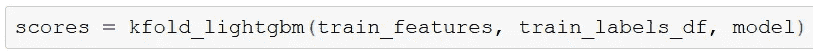

# 贷款违约风险预测的分类模型

> 原文：<https://medium.com/analytics-vidhya/classification-model-for-loan-default-risk-prediction-98c2cc7ef1bf?source=collection_archive---------3----------------------->

图片来源:[http://www.communitylinkfcu.com/secure-online-loan/](http://www.communitylinkfcu.com/secure-online-loan/)

> 在金融领域，贷款是指一个或多个个人、组织或其他实体向其他个人、组织等发放的贷款。收款人(即借款人)产生债务，通常有责任支付该债务的利息，直到偿还为止，还应偿还所借的本金。

在现实世界中，及时贷款能使借款人达到财务目标。同时，与贷款相关的利息为贷方创造收入。

然而，贷款总是存在风险，尤其是在客户信用记录不足或不存在的情况下。如果借款人拖欠一笔贷款，那么这笔贷款就成为贷款人的*不良资产*(或 NPA)。任何不良贷款都会触及贷款机构的底线。

因此，每个贷款机构都努力评估与贷款相关的风险。首先，他们希望在决定批准和发放贷款之前，提前评估客户的还款能力。

在这篇博客中，我们将建立一个监督分类模型来预测贷款违约风险。

现在，当我们谈论构建一个迎合特定用例的监督分类器时，例如，对贷款违约风险进行分类，我们会想到以下三件事:

1.  **数据**适合我们试图解决的业务需求或用例
2.  我们认为(或者说评估)最适合我们解决方案的**分类** **模型**
3.  **优化**所选型号以确保最佳性能

# 让我们从数据开始

当然，我们需要与贷款机构的贷款相关的数据。 [Home Credit](http://www.homecredit.net/) 为[本次 Kaggle 比赛](https://www.kaggle.com/c/home-credit-default-risk)分享了他们的贷款申请历史数据。与他们的贷款申请相关的数据子集被用来建立我们的分类器。锦上添花的是，家庭信用共享数据字典的这一数据。这在很大程度上有助于理解数据。

## 了解二元分类标签

训练标签存储在变量' **TARGET** 下。值如下所示:

**0**’:将按时偿还贷款

**1** ':将难以偿还贷款或将违约

为此，我们将构建一个**监督二进制分类器**。

## 使用这些数据的一点点预处理

对数据执行了以下步骤

1.  处理异常值
2.  处理缺失值
3.  编码分类变量
4.  特征缩放
5.  降低数据的维度

**处理异常值:**在这里，我检查了功能上不可能的值。这些异常值被 NaN 取代。

比如一个人 365243 天不能就业！

显示 DAYS_EMPLOYED 异常值处理的代码片段

以类似的方式，检查了其他一些列。这项工作的细节可以在[这里](https://github.com/tanmoybanerjee2003/dataScience/tree/master/Udacity_data_science_capstone)找到。

**处理缺失值:**这个分析有点意思。

缺失数据的百分比

如我们所见，有些列丢失了超过 60%的数据。但是，这些列都没有被删除。

相反，我用中位数估算缺失值。

输入缺失数据的代码片段

**编码分类变量:**数据集中有 16 个分类变量。

分类变量列表

以下两种策略用于插补:

1.  如果分类变量中的类别数等于 2，则应用**标签编码**
2.  如果分类变量中的类别数大于 2，则应用**一键编码**

众所周知，一键编码增加了数据的维度。我们将很快降低维度以避免[维度诅咒](https://en.wikipedia.org/wiki/Curse_of_dimensionality)。

**特征缩放:**特征缩放确保所有特征在监督分类器模型中获得同等重要性。MinMaxScaler 用于缩放数据中的所有要素。

使用 MinMaxScaler 的代码片段

**数据降维:**编码后的数据维数为 240，不包括输出标签。在高维空间中处理数据通常会导致这个问题，被称为[维度的诅咒](https://en.wikipedia.org/wiki/Curse_of_dimensionality)。

sklearn 的 [PCA](https://scikit-learn.org/stable/modules/generated/sklearn.decomposition.PCA.html) 用于对数据进行主成分分析。这有助于找到数据中方差最大的向量。相应的碎石图如下:

碎石图

从这个 scree 图中，我们可以看到大约 40 个主成分可以覆盖超过 80%的数据方差。因此，我们进行了 PCA:

显示应用 PCA 降低维度的代码片段

这样，我们可以减少 83.33%的维度，仍然保留 82.41%的数据可变性。

更多详情请看[这里](https://github.com/tanmoybanerjee2003/dataScience/tree/master/Udacity_data_science_capstone)。

## 让我们更深入地研究一下我们的数据

**阶层失衡问题**

我们在探索数据时遇到的第一个挑战，是[阶层失衡](http://www.chioka.in/class-imbalance-problem/)问题。

我们可以看到，在数据中，只有大约 8%的标签是 1，大约 92%的标签是 0。

显示“目标”分布的饼图

**更少的观察**

我们计算了每个变量和目标之间的皮尔逊相关系数。

与“目标”呈正相关的前 4 名:受雇天数、地区评级客户城市、地区评级客户、姓名收入类型工作

与“目标”负相关的前 4 名:外部 _ 来源 _3、外部 _ 来源 _2、外部 _ 来源 _1、出生日期

这一分布表明，新就业的人更有可能申请贷款。

外部源 1 和外部源 3 的核密度估计(或 KDE)图

上述图表显示，当外部来源 1 和 3 的评级较低时，支付困难的风险较高。同样，当这些来源的评级较高时，偿还的机会也较高。

出生天数的核密度估计(或 KDE)图

上述图表显示，面临还贷困难的年轻申请人的趋势略高。

我们对贷款申请数据很满意。现在，是时候选择我们的分类模型了。

# 我们需要我们的指标

模型的选择需要评估，而评估需要一个好的度量标准。这的确很重要。如果我们基于不正确的度量来优化模型，那么，我们的模型可能不适合业务目标。

我们有许多指标可供选择，例如准确度、召回率、精确度、F1 分数、受试者操作特征曲线下面积。

对于贷款违约风险的分类，我们将选择接受者操作特征曲线下的[面积(或 ROC AUC 得分)作为我们的度量。](https://developers.google.com/machine-learning/crash-course/classification/roc-and-auc)

现在，问题是:为什么是 AUC？我宁愿说，为什么不呢？

让我们从问题背景和困惑矩阵开始:

混淆矩阵

在我们的环境中，

输出= 1 意味着客户将有支付困难

output = 0 表示客户将及时还款

ROC 曲线和 AOC

ROC 是概率曲线，AUC 代表可分性的程度或度量。它告诉我们模型在多大程度上能够区分不同的类。

TPR 或真阳性率是对“回忆”或敏感度的一种度量。FPR 或假阳性率是对模型中假阳性预期的度量。

TPR = TP / (TP + FN)

FPR = 1 —特异性= 1 — TN / (TN + FP) = FP / (TN + FP)

AUC 值的范围从 0 到 1。AUC 越高，模型就能更好地预测谁会及时偿还贷款，谁会在偿还贷款时遇到困难。

AUC 作为一个指标适用于我们的问题，原因如下:

1.  AUC 提供了对所有可能的分类阈值的综合绩效衡量。
2.  AUC 是**比例不变的**。它衡量预测的排名，而不是它们的绝对值。
3.  AUC 是**分类阈值不变**。它测量模型预测的质量，而不管选择什么分类阈值。

# 让我们选择我们的分类模型

我们已经选择了度量标准。是时候选择我们的模式了。

评估了以下模型:

1.  物流回收
2.  随机森林分类器
3.  梯度推进分级机
4.  决策树分类器
5.  高斯安 b
6.  XGBClassifier
7.  lgbm 分类器

他们的 ROC 曲线和 AUC 如下:

**物流回归的 ROC 曲线和 AUC**

**RandomForestClassifier** 的 ROC 曲线和 AUC

**梯度增强分类器**的 ROC 曲线和 AUC

**决策树分类器**的 ROC 曲线和 AUC

**高斯的 ROC 曲线和 AUC b**

**XGBClassifier** 的 ROC 曲线和 AUC

**lgbm 分类器**的 ROC 曲线和 AUC

相当多分类模型在我们的数据集上得分很高。然而，LGBClassifier 是表现最好的。

因此，我们将使用[光梯度推进模型](https://lightgbm.readthedocs.io/en/latest/pythonapi/lightgbm.LGBMClassifier.html)(或 LGBMClassifier)对我们的贷款申请数据进行风险分类。

# 现在让我们优化我们选择的模型

我们选择了我们的分类器，即 **LGBMClassifier** ，这是基于我们贷款申请数据的 ROC AUC 得分。然而，我们需要调整我们的模型，以便表现得更好。

让我们看看可以调整的超参数列表:

LGBMClassifier 的超参数列表

**目标函数**对参数进行 K 倍交叉验证，并使用 ROC AUC 评分。它的目标是最大化分数。

我们还需要目标函数中的**提前停止**来避免过拟合。

超参数调整涉及一组值的选择。在这个选择过程中，我实施了以下两个策略:

**网格搜索**:网格搜索方法尝试网格中值的所有组合，用目标函数评估超参数的每个组合，并将集合和分数一起记录在“记录历史”中

**随机搜索**:顾名思义，该算法从网格中随机选择下一组超参数。这是不知情的搜索，这意味着下一次超参数的选择不依赖于过去的评估结果。其余过程与网格搜索方法相同。

在优化我们的 lgbm 分类器模型后，我们确实观察到 ROC AUC 评分的改善，尽管是边缘性的。

这个优化的细节可以在[这里](https://github.com/tanmoybanerjee2003/dataScience/tree/master/Udacity_data_science_capstone)找到。

# 我们选择的模式对业务有益吗

如果任何银行或金融机构批准预算，开始昂贵的数据科学之旅，以建立分类器模型，这是一个合乎逻辑的问题。让我们看看。

## 我们的模型有多稳健

这里，模型已经在多组数据上进行了测试，并且对于每组数据，已经计算了 ROC AUC 得分。

显示对 KFold 拆分的数据运行 LGBMClassifier 的代码片段

我们已经检查了得分的均值和方差，以查看模型是否稳定。

我们已经观察到最终的 LGBMClaissifer 模型是相当稳健的。我们已经在 5 组数据上测试了该模型。我们得到的 ROC AUC 平均值为 0.680479，方差为 0.000613。

## AUC 评分的解释

将近 0.7 的 AUC 分，也没那么差。

正负曲线的分布

AUC 代表可分性的程度或度量。AUC 越高，模型预测 0 为 0 和 1 为 1 的能力越强。

当 AUC 为 0.7 时，意味着有 70%的机会模型能够区分阳性类别和阴性类别。这意味着，我们的模型在识别有拖欠贷款风险的借款人时有 70%的概率是正确的。

# 生活并不是一片安乐窝

这确实是真的！这个项目面临着多重挑战。

所选数据集存在类别不平衡问题。

选择的 lgbm 分类器的优化被发现是非常计算密集的。

作为一个提示，请看看这个:

显示网格搜索组合数量的代码片段

这是我选择的超参数的**子集**的组合数量。尽管如此，普通计算机完成所有这些组合的交叉验证仍需要**年**！

为了解决这个问题，只能使用数据的**子集和超参数**的**子集。类似地，只能执行**有限次数的迭代**。这反过来又导致了模型的微小改进。**

然而，如果可以获得所需的硬件资源，所选择的模型和相关策略将总是对完整数据起作用。

# 到目前为止的总结

目的是建立一个分类器，可以根据贷款申请数据预测贷款违约风险。

我们从 [Home Credit](http://www.homecredit.net/) 获得了可以用于我们项目的数据。

我们可以评估各种分类器，并选择最适合我们的数据集。

最后，我们可以为我们的模型演示多种优化策略。

正如我们在这个博客和相关工作中看到的，构建成功分类器的关键方面是:

1.  根据目的或问题陈述选择正确的数据，
2.  正确处理和理解数据，
3.  选择模型，
4.  优化模型。
5.  是的，请不要低估对巨大计算能力的需求

# 改进

在 [Jupyter 笔记本](https://github.com/tanmoybanerjee2003/dataScience/tree/master/Udacity_data_science_capstone)中实现的几个方面可以改进。

**改进 1:输入缺失值**

在输入缺失值的情况下，NaN 用“中值”填充。对数据进行排序时,“中位数”效果很好。更好的方法当然是使用监督学习模型来“预测”NaN 值。

然而，数据插补意味着通过数据分析引入数据。这总是会增加一些偏差，不管它的影响有多小。某些型号如 [XGBoost](https://xgboost.readthedocs.io/en/latest/python/python_api.html) 可以处理 NaN in 数据。

**改进 LGBMClassifier 的超参数选择**

我们选择了超参数的一个子集，在其上我们执行网格搜索和随机搜索来选择超参数上的最佳集合值。

然而，更聪明的技术将结合随机搜索和网格搜索，如下所示:

1.  使用大型超参数网格进行随机搜索
2.  使用随机搜索的结果，围绕最佳性能超参数值构建重点超参数网格
3.  在这个缩减的超参数网格上运行网格搜索。我们可以限制迭代次数，也可以不限制，这取决于可用的硬件资源或允许的最大时间。

# 参考

[Github 储存库](https://github.com/tanmoybanerjee2003/dataScience/tree/master/Udacity_data_science_capstone)包含 Jupyter 相关工作的笔记本

数据由[家庭信贷](http://www.homecredit.net/)提供