# 分类:模特对决

> 原文：<https://medium.com/analytics-vidhya/classification-model-showdown-713fd9b31470?source=collection_archive---------11----------------------->

这是“分类”文章，是监督机器学习的一部分。它指定数据元素所属的类。在这里，我们将借助 Kaggle 提供的巨大数据集，研究各种分类算法，即 SVM、随机森林、KNN、朴素贝叶斯、梯度推进。

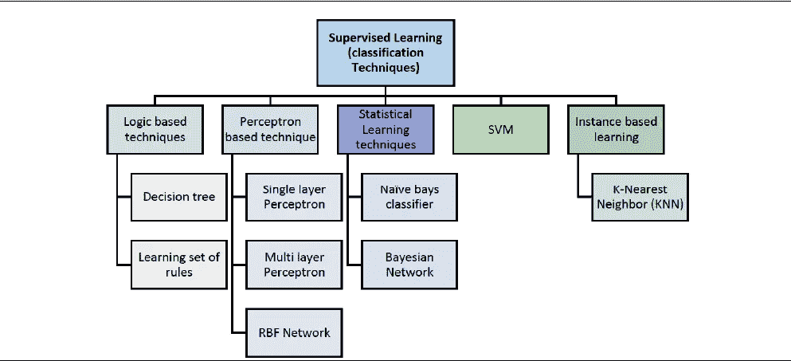

# 分类:用例

使用分类案例的一些关键领域:

*   找出收到的电子邮件是否是垃圾邮件。
*   来发现病人是否患有癌症。
*   是晴天还是雨天。
*   情绪分析(是/否，肯定/否定)

# k-最近邻(KNN):

k-最近邻算法用于根据相似性度量将数据点分配给聚类。它使用监督方法进行分类。

*   选择 k 的数量和距离度量。(如果有偶数个类，K 的数量将是奇数)
*   查找要分类的样本的 k 个最近邻
*   通过多数投票分配类别标签。

这里我们有巨大的数据集，你必须建立一个预测模型来回答这个问题:“什么样的人更有可能生存？”使用乘客数据(如姓名、年龄、性别、社会经济阶层等)。幸存是标签(0 =否，1 =是)。

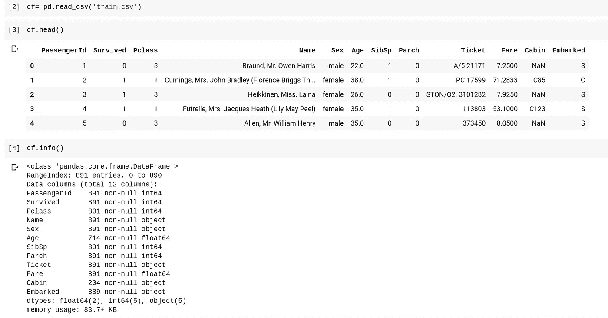

泰坦尼克号数据集的数据框架

这里我分析了，删除了列名称、机票、客舱、登机，因为 Pclass(乘客级别)和票价特征足以给出关于乘客的客舱和机票号码的概念。虽然您可以包括这些功能，但这完全取决于您。

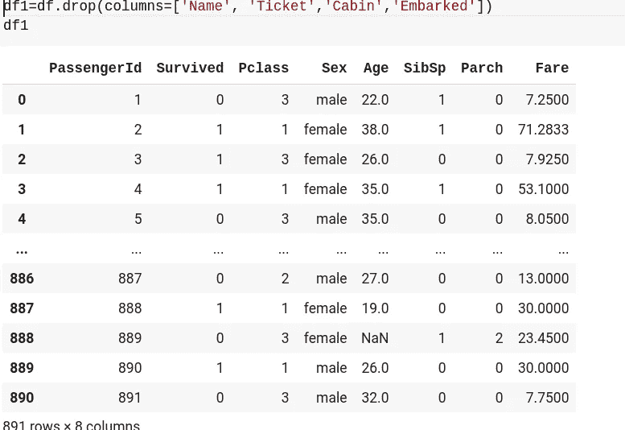

放下柱子

现在，使用标签编码器将列“性别”转换成数字形式。**标签编码**是指将标签或列转换成数字形式，从而转换成分类数据。

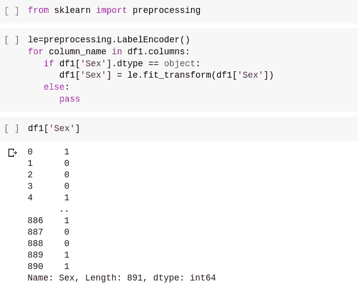

标签编码器的使用

然后检查数据帧中是否有空值，如果有，你必须删除它们。**真实世界的数据肯定会有缺失值。这可能是由许多原因造成的，例如数据输入错误或数据收集问题。不管是什么原因，处理缺失数据是很重要的，因为任何基于具有非随机缺失值的数据集的统计结果都可能有偏差**。此外，许多 ML 算法不支持带有缺失值的数据。

**如何识别缺失值？**我们可以使用 pandas 函数检查数据集中的空值，如下所示:

**df.isnull.any()。sum()** 其中 df 是数据帧名称。

从 sklearn.model_selection 导入 train_test_split 并拆分训练数据:

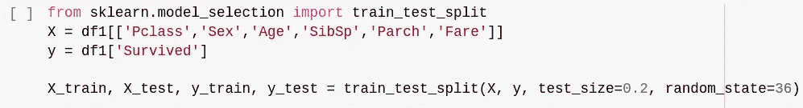

对数据集应用 train_test_split

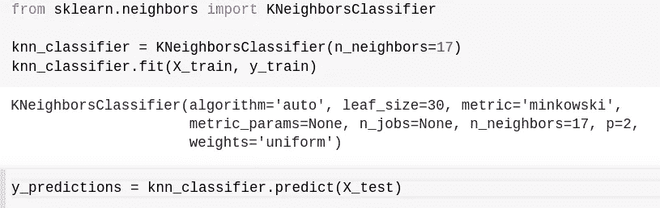

应用 Knn 分类器算法

最后，引入度量来计算模型的精度:

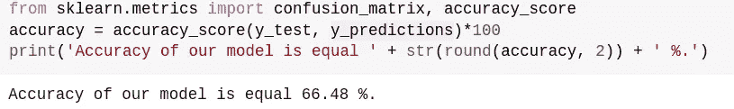

knn 分类器模型的准确性

# 梯度提升:

梯度推进是另一种执行监督机器学习任务的技术，如分类和回归。这种技术的实现可以有不同的名称，最常见的是 Gradient Boosting machines(缩写为 GBM)和 XGBoost。这些单个模型的预测能力很弱，容易过度拟合，但是将许多这样的弱模型组合成一个整体将导致整体结果的改善。

现在使用 GradientBoostingClassifier 并应用于同一数据集:

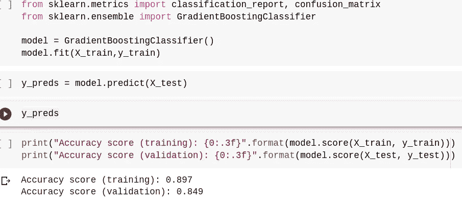

在这里，你可以看到结果比 KNN 的算法好得多。准确率为 84%。

# 朴素贝叶斯:

朴素贝叶斯方法是一组基于应用贝叶斯定理的监督学习算法，其“朴素”假设是在给定类变量的值的情况下，每对要素之间的条件独立性。

朴素贝叶斯分类器是基于**贝叶斯定理**的分类算法集合。

**P(B/A)=P(A/B)/P(A)*P(B)**

*   步骤 1:计算给定类别标签的先验概率
*   第二步:找出每个类别的每个属性的可能性概率
*   第三步:将这些值放入贝叶斯公式并计算后验概率。
*   步骤 4:考虑到输入属于概率较高的类，查看哪个类的概率较高。

P(A)和 P(B)是先验概率，其中 A 和 B 是标签。

**P(A/B)和 P(B/A)是后验概率。**

对同一数据集使用朴素贝叶斯分类器(导入高斯 b):

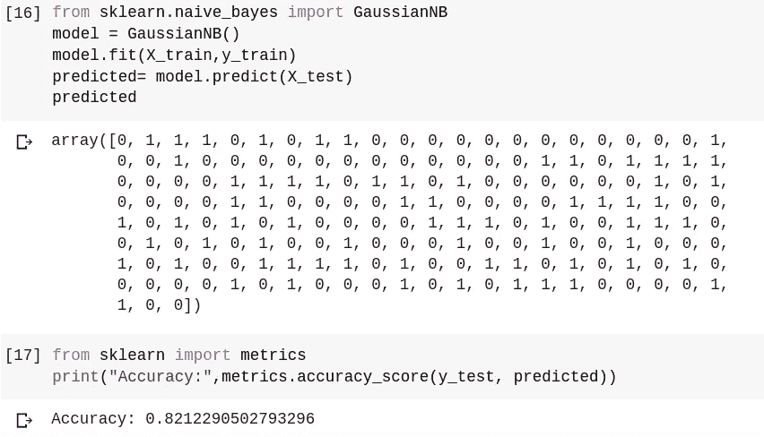

朴素贝叶斯分类器。准确率为 82%

# 随机森林:

随机森林对随机选择的数据样本使用决策树，从每棵树获得预测，并选择最佳解决方案。它也为**特性的重要性**提供了一个很好的指示器。它是监督机器学习中最流行的算法之一，既可以用作分类器，也可以用作回归器。

它分为四个步骤:

1.  从给定的数据集中选择随机样本。
2.  为每个样本构造一个决策树，从每个决策树中得到一个预测结果。
3.  对每个预测结果进行投票。
4.  选择得票最多的预测结果作为最终预测。

下面是随机森林分类器的实现:

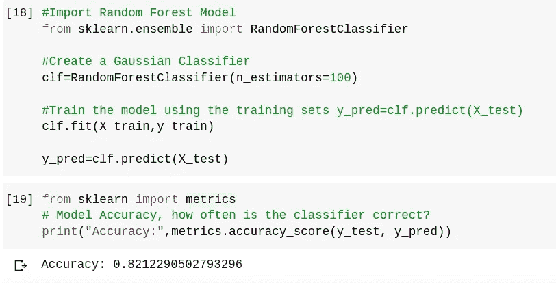

随机森林分类器，准确率为 82%

# SVM:

支持向量机也是监督机器学习中流行的算法之一。它既可以用作分类器，也可以用作回归器，但主要用作分类器。与其他分类器(如逻辑回归和决策树)相比，它提供了更好的准确性。 **SVM 找到了一个有助于分类新数据点的最佳超平面。**

以下是 SVM 模型在同一数据集上的实现:

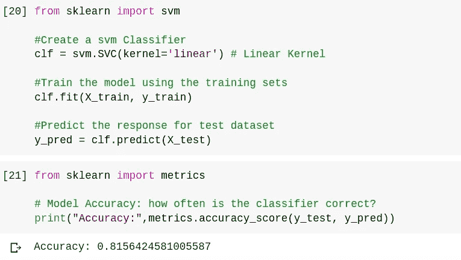

SVM 分类器，模型准确率为 81%

# 结论:

在本文中，您介绍了各种分类算法及其在 titanic 数据集上的实现，我们必须根据 0 和 1 来预测存活率。