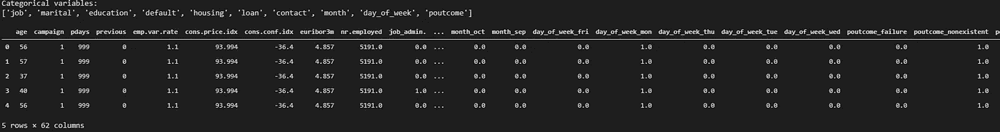

# 利用分类模型构建银行机构定期存款预测模型

> 原文：<https://medium.com/analytics-vidhya/classification-models-7d0849c613cb?source=collection_archive---------35----------------------->

# **概述**

这个项目的目标是预测客户是否会认购银行定期存款。这些数据是从 [UCI ML](http://archive.ics.uci.edu/ml/datasets/Bank+Marketing) 网站上下载的，关于这些数据的更多细节可以从该网站上阅读。

本文将重点关注在将数据输入模型之前对其进行的预处理。我们还将重点评估不同型号的不同性能指标，并选择最佳指标。探索性数据分析可以在这个 [tableau 仪表盘](https://public.tableau.com/profile/ken.mbaya#!/vizhome/BankInstitutionTermDepositPredictiveModelDataExploration/Story1)上找到。这个项目的代码可以在这里找到。

# **预处理**

## **编码**

为了在数据上运行模型，我们必须将所有非数字特征转换为数字特征。有两种方法可以做到这一点:一个热编码和标签编码。

在**一个热编码**中，为特征列中的每个唯一值创建一个新列。但是，这种方法增加了列的数量，因此在具有许多唯一值的列中使用它时必须小心，因为它可能会导致维数灾难。下面我们使用一个热编码来编码我们所有的分类列。

在**标签编码**中，不同的数字被分配给每个唯一值，而不创建额外的列。这种技术适用于具有有意义的顺序的数据。由此产生的一个潜在问题是，模型假设标签大小代表权重，即 2 大于 1 或 0。

## **缩放数据**

由于数据有多个测量速率，我们必须使用最小最大缩放器来缩放数据。这将所有特性标准化为 0 到 1 之间的值。

## **将数据分为训练集和测试集**

# 阶级不平衡

从上面的图中我们可以看到，数据集是高度不平衡的。说不的人数明显多于赞成的人数。这可能导致模型中的偏差，因为大多数数据属于一个组。类别不平衡可以通过使用**综合次要过采样技术(SMOTE)来解决。**

## **重击**

SMOTE 是一种过采样技术，它在现有少数实例之间合成新的少数实例。在我们的例子中，SMOTE 将为 yes 组创建新的实例，以便平衡数据。

# **创建模型**

用于解决分类问题的模型有逻辑回归、随机森林分类器、Xgboost、决策树和 MLP 分类器。我使用 Kfold 作为交叉验证技术。

**模型评估**

我使用以下指标来评估模型的性能:准确度、精确度、召回率、曲线下面积(AUC)和 F1 值。

**准确度**

准确度是正确预测的观测值与总观测值的比率。然而，人们可能会认为我们的模型具有高精度是好的，但人们必须使用其他参数来真正评估您的模型的性能。

**精密**

精度是正确预测的正观测值与总预测正观测值的比率。它回答了这样一个问题:在所有被贴上“是/否”标签的人中，有多少人实际上对定期存款持“是/否”态度。

**召回**

召回率是正确预测的正面观察与实际课堂中所有观察的比率——是的。它回答了这个问题，在所有回答“是/否”的人中，我们正确标记了多少。

**F1 得分**

这是准确率和召回率的加权平均值。

**AUC**

这是 ROC 曲线下的面积

下表显示了我们每个型号的表现

## 结论

使用的前 3 个模型是逻辑回归、Xgboost 和 MLP 分类器。与其他模型相比，这些模型具有最高的 ROC_AUC、精确度和召回率。

## 推荐

为了提高模型性能，我们可以做一些超参数调整和特征减少。这将在以后的博客中完成。

感谢我在 10academy 的所有同学和导师，感谢他们的支持和激励。我把这些放在一起作为第三批[10academy.org](http://10academy.org/)培训的一部分。