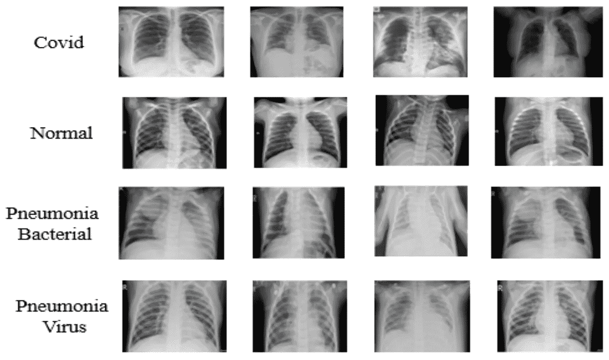

# 使用 PyTorch 对胸部 x 射线进行分类

> 原文：<https://medium.com/analytics-vidhya/classification-of-chest-xrays-using-pytorch-d50eddd9ebb0?source=collection_archive---------6----------------------->

亚当·尼西奥鲁克在 [Unsplash](https://unsplash.com?utm_source=medium&utm_medium=referral) 上拍摄的照片

肺炎是一种单侧或双侧肺部感染。细菌、病毒和真菌导致它。这种感染会导致肺部气囊发炎，这些气囊被称为肺泡。肺泡充满液体或脓，使呼吸困难。

新冠肺炎(冠状病毒疾病 2019)是由严重急性呼吸综合征冠状病毒 2 型(新型冠状病毒)引起的高度传染性疾病。

【COVID 的胸部 X 线影像学新冠肺炎的胸部 X 线影像学特征为非典型肺炎或机化性肺炎。这意味着新冠肺炎病和肺炎之间的区别是微妙的。尽管它们都有肺实变的特征(通常充满肺部小气道的空气被其他东西取代。根据病因的不同，空气可能被替换为:液体，如脓、血或水。(胸部 X 线片上的实变表现为“白肺”区)，毛玻璃样阴影(肺看起来有一层灰色玻璃状和无光泽的贴面))但在新冠肺炎病中，胸腔积液是罕见的(3%)。胸片上肺实变的分布似乎是双侧的、周围的，在新冠肺炎更多的是在下叶。

胸腔积液是胸腔壁和肺部之间的积液。像肺实变一样，在胸部 x 光片上，它看起来像白色区域，与较暗的充满空气的肺相对。由于积液是一种相对开放空间内的流体，当你改变位置时，它通常会因重力而移动。

肺实变也可能是流体，但它在你的肺里面，所以当你改变位置时它不能移动。这是你的医生区分两者的一种方式。

最终，根据疾病控制中心(CDC)的说法，即使胸部 CT 或 X 射线显示新冠肺炎，病毒检测也是诊断的唯一具体方法。

在最上面一行，“白肺”区域(实变)位于新冠肺炎两肺的下叶或部分区域(也更靠近边缘(为了清晰起见，请查看最上面一行的第三张图像)。)

然而，在其他类型的肺炎中，实变似乎更为普遍。

**数据集**

数据被组织到 2 个文件夹(训练、测试)中，训练和测试都包含 3 个子文件夹(COVID19、肺炎、正常)。该数据包含总共 6432 张 x 射线图像，测试数据占总图像的 20%。

让我们导入以下相关的库

Kaggle 平台用于这项工作。让我们加载数据并从数据中创建数据集。

通过将 train_dir 文件夹传递给 ImageFolder 函数，创建并转换了 Pytorch 数据集。然后使用变换参数对其进行变换。在这里，我调整了它们的大小以加快训练时间，将它们转换为张量，并使用数据集的平均值和标准差对它们进行归一化。

让我们看几张图片。

让我们想象一下这些图像

在这里的 **showexample** 函数中，我们必须对图像的维度进行重新排序，使通道数成为我们使用 matplotlib 库的最后一个通道。

我将通过应用种子生成器和 random_split 函数，将 train_dir 文件夹中的训练数据集拆分为训练集和验证集。

我需要使用 RandromCrop、RandomHorinzontalFlip 和 ColorJitter 对训练集进行一些额外的转换，以创建额外的特征供我的图像分类器学习。

确定 train 变量中存在的类的计数的函数

数据集似乎不平衡。因此，我们将使用 WeightedRandomSampler 对少数类进行过采样。计算权重并将其传递到上面的采样器中，然后将训练数据和验证数据传递到各自的数据加载器函数中。我将 batch_size 设置为 28，以防止使用 Kaggle 内核的会话崩溃。

现在我们已经准备好了数据加载器，我们可以定义我们的模型和一些用于训练、验证和预测准确性的辅助函数。

让我们借助一些辅助函数将选定的模型传输到 GPU。

在上面的单元格中，模型、训练集和验证集被传递到 DeviceDataLoader 中

我们可以看到一批 28，3 x 128 x128 的输入，得到 28，3 的输出。对于 28 个输入图像中的每一个，我们得到 3 个输出，每个类一个。

拟合函数的超参数被传递到优化函数中，模型被训练和验证四个时期，损失和验证精度被记录。

我做的卷积神经网络的验证精度是 0.6762。我训练了其他模型(Resnet-50，Resnet-101(0.6491，0.6638)。

Resnet-18、wide-resnet-101 和 alexnet 的表现非常糟糕，平均准确率为 20%。

这里验证损失比训练损失高得多，但是随着重量衰减和梯度剪辑的使用，验证损失开始下降。

观察到 Res-nets 变化比卷积神经网络具有更高的验证损失。

表现不佳的 wide res-net 的培训和验证损失 101

表现良好的 resnet-50 的训练和验证损失(使用 CNN val_acc 作为基准)

让我们做一些预测，好吗？测试数据被转换并传递到数据加载器中。然后调用一个辅助函数来帮助我们进行预测。请注意，测试准确度分数与验证准确度分数接近。

在这里，我们看到了预测肺炎的模型，而实际类别是新冠肺炎，这可能是因为肺炎患者和新冠肺炎患者的胸部 x 光片之间只有细微的变化。

在不久的将来，我想使用一个集合模型来提高性能(我目前正在研究一个集合模型，但 Kaggle 和 Google Colab 会话一直崩溃)。我还会尝试使用暗网分类器和对象检测框架(YOLO)的图像分割技术(在[https://github.com/muhammedtalo/COVID-19](https://github.com/muhammedtalo/COVID-19)有售)

这就是了。我会很快发布这个分类任务的更新。

# **参考文献**

[https://www . health line . com/health/lung-consolidation # vs .-胸膜腔积液](https://www.healthline.com/health/lung-consolidation#vs.-pleural-effusion))

沙科迪·BD、Kwadwo Osei-Poku2 和 Edmund Brakohiapa(2020 年)

https://medical-case-reports . imed pub . com/diagnosing-covid 19-from-chest-x ray-in-resource-limited-environment case-report . pdf