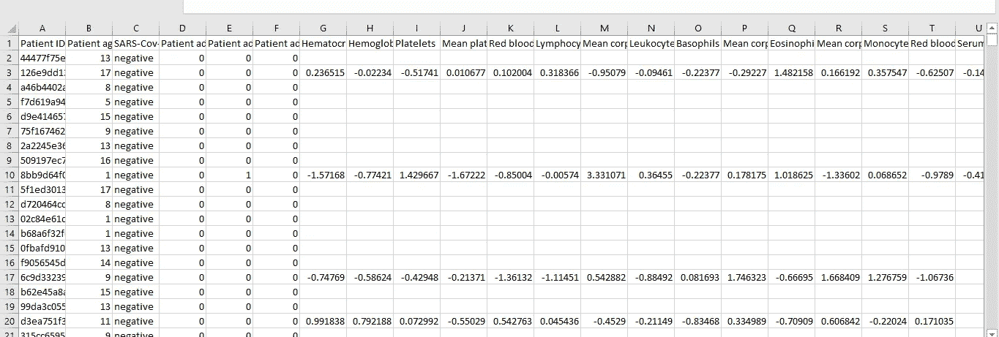
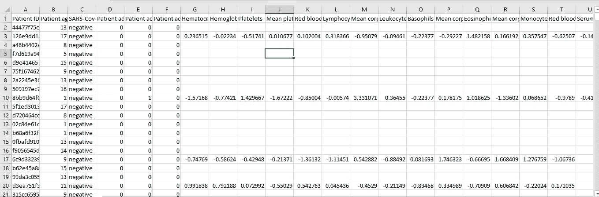
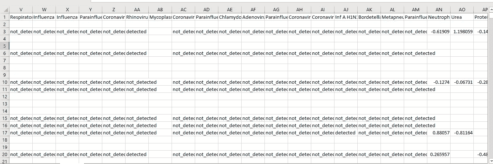

# 使用机器学习模型对新冠肺炎受害者进行分类。

> 原文：<https://medium.com/analytics-vidhya/classification-of-covid-19-victims-using-machine-learning-models-d70daee964ff?source=collection_archive---------17----------------------->

## 介绍(当前需要)

机器学习主要应用于医学领域，自动化破解数字运算算法等。

新冠肺炎是人类有史以来面临的最黑暗的时代之一，它全力以赴争取 2020 年，给我们的后代留下了一个黑点。

研究人员、学者和专业人士在他们各自的领域都在努力使我们摆脱疫情的困境。

现在是我们在各自的专业领域为他们的工作做出贡献的时候了。这个博客是关于 COVID 受害者的分类，分为轻度、重度和危重。基于此，我们可以建议是否将患者隔离、送入医院或使用呼吸机，这只是解决问题的一种幼稚方法，可以通过批判性思维和利用复杂的算法进入下一阶段。

## 关于数据集

数据集取自 Kaggle，它包含许多对构建模型至关重要的属性，还包含特定患者的病史、血样、糖尿病、疾病等。

数据集非常庞大，包含浮点数据和分类数据。

**主要观察结果**

1.  这里的关键观察点是，数据集作为一个整体是稀疏的，并且没有特定字段下的所有必需数据，由于样本未被收集或不可用于该字段，一些数据丢失。
2.  数据集中的所有属性对我们将要构建的机器学习模型都没有显著贡献。
3.  输入分类特征可能会导致没有意义的虚假元组。所以我们忽略了数据集中的分类特征。

这是数据集的几幅图像



这只是数据集的样本视图。

正如我们所见，有许多值是未知的或 Nan 值，因此我们必须在应用模型之前填补这些漏洞。

## 如何估算数据集？

在跳到我们的想法之前，让我们先探索一下常规的方法。

1.  **简单地忽略列—** 但在这种情况下不能这样做，因为这是一个稀疏的数据集，删除后我们将只剩下少量的属性，重要的属性可能会丢失。
2.  **用集中趋势**进行估算——在传统的机器学习模型中，我们使用整个列的 **NaN** 值和 ***mean*** 进行估算，因为每个列都很稀疏，所以很难找到平均值，因为由于缺少太多的值，找到的平均值不会接近实际平均值。

因此，在这种情况下，我们必须打破常规，因为非常时期需要非常手段。

我们首先训练一个模型来预测丢失的值，但这也不简单，因为我们必须拥有领域和统计方面的专业知识。

但这是为了说明多元线性回归在剔除无关紧要的属性中的应用。

对数据集进行插补的方式是:

1.  在分类的第一阶段忽略分类数据，因为由于它们的二元“是”或“否”属性，输入它们是没有意义的。
2.  用适当的集中趋势度量来估算真实值。

## 机器学习模型是如何应用的？

一旦我们估算了数据集，现在我们需要使用反向消除法(多元线性回归)从数据集中消除无关紧要的属性。

逆向淘汰的概念在我之前的博客里有详细的解释，这只是之前博客的延续。

一旦上述程序完成，现在就可以开始应用各种分类模型了。

给出最佳结果的模型是

1.  支持向量机(90.8%)
2.  决策树分类器(89.54%)

我利用混淆矩阵来形象化输出如何分布在不同的类中。

代码如下所示

```
import numpy as np
import pandas as pd
import matplotlib.pyplot as pltdataset = pd.read_csv("dataset1.csv",encoding = 'latin1')
datasetx = dataset.iloc[:,1:-4].values
y = dataset.iloc[:,-4].values**#Imputing values**
from sklearn.preprocessing import Imputer
imputer = Imputer(missing_values = 'NaN',strategy = 'mean')
imputer = imputer.fit(x[:,:])
x[:,:] = imputer.transform(x[:,:])**#LabelEncoding Y part**
from sklearn.preprocessing import LabelEncoder
labelencoder_y = LabelEncoder()
y = labelencoder_y.fit_transform(y) **#Dividing the dataset into training and testing**
from sklearn.model_selection import train_test_split
x_train,x_test,y_train,y_test = train_test_split(x,y,test_size = 0.2,random_state = 0)#**Standardize using StandardScaler** from sklearn.preprocessing import StandardScaler
sc_X = StandardScaler()
x_train = sc_X.fit_transform(x_train)
x_test = sc_X.fit(x_test)import statsmodels.formula.api as sm
**#Applying the Backward Elimination**
def BackwardElim(x,sl):
    n = len(x[0])
    for i in range(0,n):
        regressor_OLS = sm.OLS(y,x).fit()
        maxp = max((regressor_OLS.pvalues).astype(float))
        if maxp > sl:
            for j in range(0,n-i):
                if(maxp == regressor_OLS.pvalues[j].astype(float)):
                    x = np.delete(x,j,1)

    regressor_OLS.summary()
    return xsl = 0.05
x_opt = x
x_model = BackwardElim(x_opt,sl)
x_model.shapefrom sklearn.model_selection import train_test_split
x_train,x_test,y_train,y_test = train_test_split(x_model,y,test_size = 0.2,random_state = 0)**#Applying RandomForest** from sklearn.ensemble import RandomForestClassifier
classifier = RandomForestClassifier(n_estimators = 10,criterion = 'entropy',random_state = 0)
classifier.fit(x_train,y_train)y_pred = classifier.predict(x_test)from sklearn.metrics import confusion_matrix
cm = confusion_matrix(y_test,y_pred)
classifier.score(x_test,y_test)**#Applying SVM** from sklearn.svm import SVC
classifier = SVC(kernel = 'linear',C=1)
classifier.fit(x_train,y_train)y_pred = classifier.predict(x_test)from sklearn.metrics import confusion_matrix
cm = confusion_matrix(y_test,y_pred)
classifier.score(x_test,y_test)**#Applying Decision Tree** from sklearn.tree import DecisionTreeClassifier
classifier = DecisionTreeClassifier(criterion = 'entropy',random_state = 0)
classifier.fit(x_train,y_train)y_pred = classifier.predict(x_test)from sklearn.metrics import confusion_matrix
cm = confusion_matrix(y_test,y_pred)
classifier.score(x_test,y_test)
```

以上是我用于分类的确切代码，如果有人需要数据集，他们可以给我发消息。

## 未来范围

该模型可以在其应用和准确性方面进一步完善。

1.  为了提高精确度，我们可以利用我们忽略的分类变量。
2.  我们可以使用 k-fold 交叉验证、梯度增强、集成学习等来调整参数。

剩下的就交给你了，让你集思广益来解决这个问题。