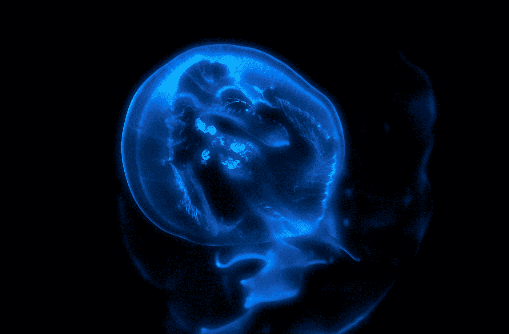
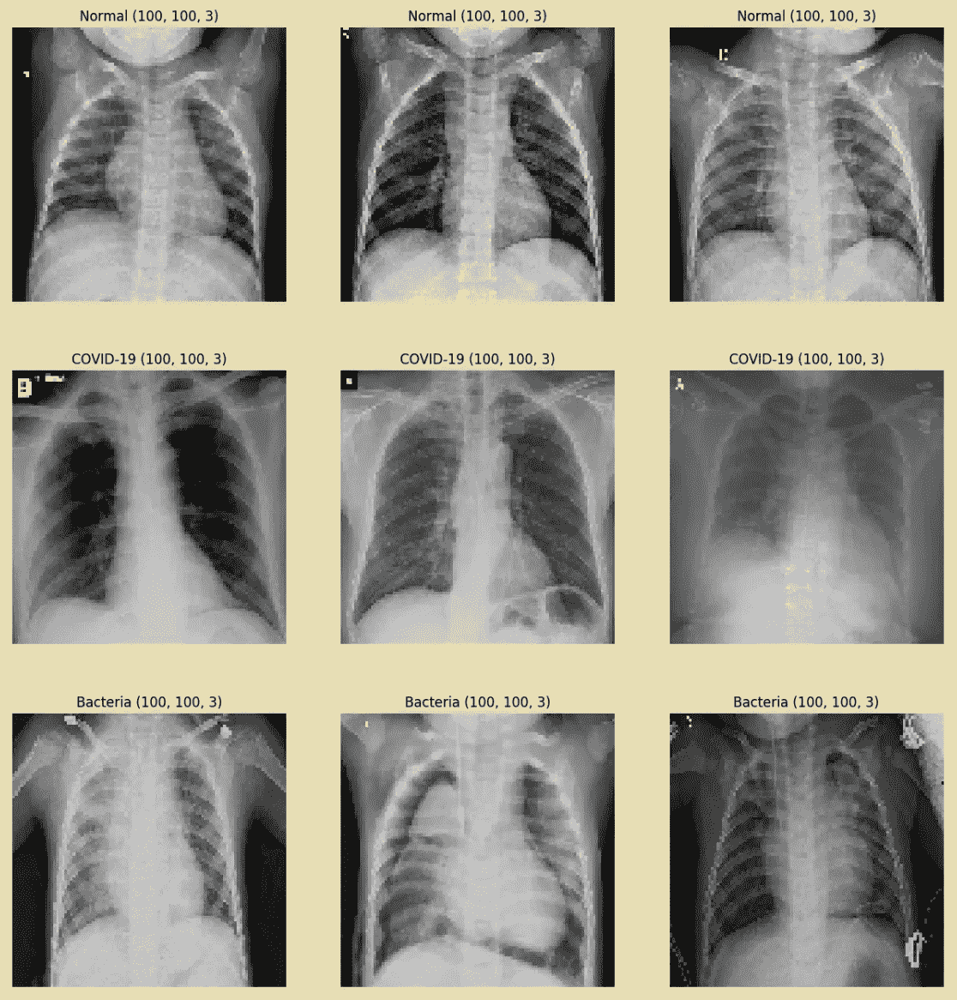
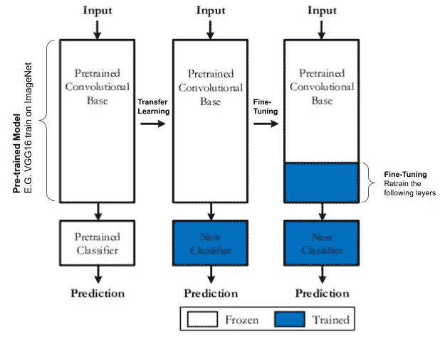
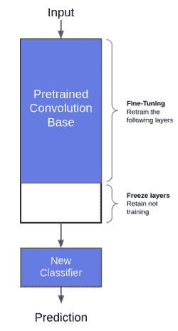
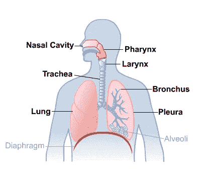
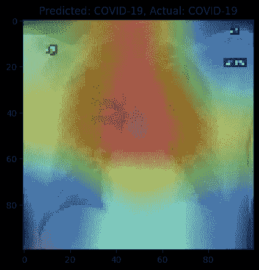
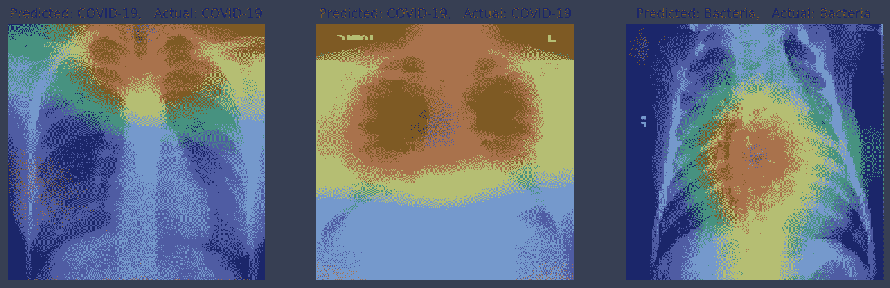
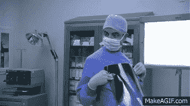

# 基于 Keras 的新冠肺炎 X 射线图像分类及其潜在问题

> 原文：<https://medium.com/analytics-vidhya/classification-of-covid-19-x-ray-images-with-keras-and-its-potential-problem-e31b3ff16f24?source=collection_archive---------16----------------------->



罗伯特·祖尼科夫在 [Unsplash](https://unsplash.com?utm_source=medium&utm_medium=referral) 上拍摄的照片

***免责声明:*** *本帖探讨的方法和技术是为了教育和分享的目的。这不是一项科学研究，也不会发表在期刊上。*

这个项目最初是受 Adrian Rosebrock 的一个帖子的启发，使用 X 射线图像来建立一个检测器来对新冠肺炎患者进行分类。正如世卫组织总干事所强调的，所有国家都要做检测，因为我们需要确定感染者，以减少传播。所以我想，如果有可能对它们进行高准确度的分类，数据科学界可以为那些难以获得检测试剂盒的国家建立一个权宜之计。

> 一月下旬，一个中国小组发表了一篇论文，详细描述了新冠肺炎临床和临床前特征。他们报告说，利用患者胸部 CT 扫描来分类新冠肺炎、流感或健康患者。他们的深度学习模型能够达到 86.7 %的准确率。

世卫组织强调所有国家检测新冠肺炎

# **总结**

以下是常用图像分类中使用的步骤。

1.  数据集的收集
2.  创建图像生成器
3.  定义我们的模型
4.  训练我们的模型
5.  我们模型的评估

# 1.数据集的收集

在这个项目中，我使用了来自[*covid-chestx ray-dataset*](https://github.com/ieee8023/covid-chestxray-dataset?fbclid=IwAR3yCPo_e55khIvhhqDdPhCI6OMCLXjZKEziNnUzZWC9_h3NkyhqdjTqD5c)的数据集，并且只提取了**新冠肺炎**的 x 光图像。此外，我使用来自 Kaggle 的 [*胸部 x 光图像*](https://www.kaggle.com/paultimothymooney/chest-xray-pneumonia) 的数据集，提取**正常**和**细菌**图像

我选择 3 个不同类别的原因是，只有新冠肺炎图像，我担心模型会通过计算白色阴影像素来学习。因为这些被感染的病例肺部会有白色斑块。但是对于 3 个类别，该模型将被迫学习细菌和病毒病例之间的模式。另外，请注意，我已经通过为每个类选择相同数量的图像来平衡数据集。这对于确保我们的模型不会偏向任何一个职业非常重要。**新冠肺炎是一种病毒感染。*

数据集由以下图像组成:

```
Total covid_images: 179
Total normal_images: 179
Total bacteria_images: 179
```

# 2.创建图像生成器

**增强**

由于数据集中的图像数量有限，我在训练时使用了增强来增加模型的变化。我想强调的一个增强是使用伽马对比度来改变图像中白色像素的强度和图像的随机裁剪。这些方法用于防止模型仅学习计算白色阴影像素。此外，我们的扩充不应盲目进行，而是有选择地解决我们面临的某个问题。我为这个项目使用了下面的 [*imgaug*](https://github.com/aleju/imgaug) 包。

我想分享的是，在我们开始训练我们的模型之前，我们应该总是从生成器生成一些图像以供查看。这是为了确保我们的生成器产生预期的增强结果。因为当我们的模型不工作时，它将节省我们的宝贵时间，并且我们确信我们的发电机不是问题的一部分。

**从小处着手，快速迭代**

另一个建议是，在开始时，我们应该尽量保持我们的训练图像尽可能小。是的，这可能会影响我们从高分辨率图像中学习的建模能力。但是更小的图像将允许我们通过不同的模型和超参数更快地迭代实验。找到这些参数后，我们就可以放大图像进行进一步的训练。这样我们可以在探索过程中节省时间。

下面是我们的生成器的一些例子。



# **3。定义我们的模型**



对[https://www . research gate . net/figure/TOP-LEVEL-DIAGRAM-OF-TRANSFER-LEARNING-FROM-A-PRE-TRAINED-CNN-MODEL _ fig 4 _ 333882146](https://www.researchgate.net/figure/TOP-LEVEL-DIAGRAM-OF-TRANSFER-LEARNING-FROM-A-PRE-TRAINED-CNN-MODEL_fig4_333882146)

**迁移学习**

迁移学习是一种利用现有模型的知识来学习另一项任务的方法。这个模型中的知识将作为我们新任务的初始化权重。使用迁移学习的好处是，与从头开始训练相比，该模型能够用更少的数据获得更高的精度，并且收敛速度更快。

**微调模型**

另一种称为微调的常见做法是冻结预训练网络的前几层的权重，只训练最后几层。这是因为前几层捕捉到了对分类问题有用的曲线和边等一般特征。通常，我们会保留这些一般特征，并将培训集中在我们问题的更具体的特征上。(例如骨骼、肺的形状)



项目建议书网络，VGG16 微调

但是对于这个项目，人们发现微调前几层会产生更好的结果。我对此的猜测是，ImageNet 预训练网络没有捕捉到太多的 X 射线曲线和边缘。因为 x 光图像被认为是私人信息，所以 ImageNet 建立在公共领域的图像之上。此外，ImageNet 是在彩色图像上训练的，我们的数据集是灰度的。你可能会问，ImageNet 权重对于 X 射线图像分类没有用，但我认为使用 ImageNet 比使用随机权重更好。

下面是创建分类模型的代码。

```
# VGG16 transfer learning
def create_model(input_shape, n_out):
 model = Sequential() 
 model.name = “VGG16_Model”
 pretrain_model = VGG16(include_top=False, weights=’imagenet’, input_tensor=Input(shape=input_shape)) 

 # Set all layers to be trainable
 for layer in pretrain_model.layers: 
   layer.trainable = True
 for layer in pretrain_model.layers[-4:]: # last 4 layer freeze
   layer.trainable = False x = pretrain_model.output
 x = AveragePooling2D(pool_size=(3,3))(x)
 x = Flatten()(x)
 x = Dense(64, activation=’relu’)(x)
 x = Dropout(0.5)(x)
 x = Dense(n_out, activation=”softmax”)(x) model = Model(pretrain_model.input, x) 
 return modelTotal params: 14,747,715
Trainable params: 7,668,291
Non-trainable params: 7,079,424
```

# **4。训练我们的模型**

为了训练我们的模型，使用“Adam”优化器并将“分类 _ 交叉熵”作为损失函数。我还会在平稳状态下降低学习速度，并提前停止以防止过度适应。有关培训的详细信息，请参考提供的[笔记本](https://github.com/Niellai/ObjectDetection/blob/master/6_COVID19%20ClassifierV2.ipynb)。

我会推荐使用 FastAI 实现寻找学习率和适合一个周期的策略来训练模型，但这将是另一个时间的另一篇文章。以下链接很好地解释了“适合一个周期”政策。

[](https://towardsdatascience.com/finding-good-learning-rate-and-the-one-cycle-policy-7159fe1db5d6) [## 找到好的学习率和一个周期的政策。

### 介绍

towardsdatascience.com](https://towardsdatascience.com/finding-good-learning-rate-and-the-one-cycle-policy-7159fe1db5d6) 

# 5.我们模型的评估

为了衡量我们模型的性能，我们可以查看每个班级的 f1 分数。我们可以看到，我们的模型能够区分病毒和细菌感染，我们的准确率为 97%，即使我们的图像分辨率为 100x100。

```
 precision    recall  f1-score   support

      Normal       0.97      0.95      0.96        60
    COVID-19       0.98      0.98      0.98        60
    Bacteria       0.95      0.97      0.96        60

    accuracy                           0.97       180
   macro avg       0.97      0.97      0.97       180
weighted avg       0.97      0.97      0.97       180
```

**梯度加权类激活映射(Grad-CAM)**

但是理解模型性能还不够好，我们需要知道模型已经学习了什么以及模型实际看到了什么来确定分类。这是当[](https://arxiv.org/abs/1610.02391)****进入画面时。Grad-CAM 是一种为基于 CNN 的模型的决策提供“视觉解释”的技术，使模型变得透明。它使用流经决策层最后一个卷积层的梯度信息。我使用 [Keras-Vis](https://github.com/raghakot/keras-vis) 包来实现这个项目的 Grad-CAM。****

****在实现 Grad-CAM 的时候一定要注意，你需要将你的最终图层激活改为线性。如果不是，你将不会从梯度中得到任何结果。****

```
**layer_idx = utils.find_layer_idx(model, model.layers[-1].name)
model.layers[layer_idx].activation = **linear**
model = utils.apply_modifications(model)**
```

********

****肺解剖学****

********

******样本 1，** Grad-CAM 新冠肺炎****

> ******免责声明:**下面的解释很明显是在看 Grad-CAM 给出的内容和一些关于肺炎感染的谷歌搜索。我不是医生，也无法验证模型是否正确。****

****从上面的示例 1 中，我们可以看到我们的模型正在拾取“气管(windpipe)”区域来对新冠肺炎进行分类。我们知道新冠肺炎是一种呼吸道病毒，也许这就是为什么该模型将重点放在肺和气管的上部进行分类。****

********

****样本 2，Grad-CAM 随机样本****

****从样本 2 中，我们可以看到病灶的细菌感染区域是不同的。模型集中在肺的中心部分，虽然细菌感染可以通过空气传播，但也有其他途径被感染。传染源可能来自身体的其他部位，如肾脏。细菌可以从任何来源进入血液，并沉积在肺部。****

****[](https://www.emedicinehealth.com/bacterial_pneumonia/article_em.htm#what_causes_bacterial_pneumonia) [## 细菌性肺炎传染期、治疗和症状

### 细菌性肺炎定义肺炎是肺部的真菌、病毒或细菌感染。肺炎是一种…

www.emedicinehealth.com](https://www.emedicinehealth.com/bacterial_pneumonia/article_em.htm#what_causes_bacterial_pneumonia) 

# 附加注释



我不是医生，但我知道我在做什么。相信我=D

在所有的实验和阅读之后，在我看来，我认为 x 光图像很可能不足以识别受感染的病人和阻止新冠肺炎病毒的传播。原因是我收集的这些 X 射线图像很可能是在病人入院时拍摄的，并且一开始就有呼吸困难。该模型将不能识别无症状的人。我们仍然需要依靠检测试剂盒来鉴别这些病例。目前，我们最好的选择是呆在家里，以防止任何方式的传播。所以，如果你真的需要外出，回家后马上洗手，请戴上口罩。注意安全。**** 

******参考******

****[](https://github.com/Niellai/ObjectDetection/blob/master/6_COVID19%20ClassifierV2.ipynb) [## niel lai/对象检测

### permalink dissolve GitHub 是 4000 多万开发人员的家园，他们一起工作来托管和审查代码，管理…

github.com](https://github.com/Niellai/ObjectDetection/blob/master/6_COVID19%20ClassifierV2.ipynb) [](/analytics-vidhya/how-to-train-siamese-network-on-covid-19-x-ray-images-639a993b35a3) [## 如何在新冠肺炎 X 射线图像上训练暹罗网络

### 您可能对另一种 X 射线图像分类方法感兴趣。在这篇文章中，我不解决任何与新冠肺炎相关的问题，而是探索暹罗网的概念和实现…

medium.com](/analytics-vidhya/how-to-train-siamese-network-on-covid-19-x-ray-images-639a993b35a3) [](https://www.pyimagesearch.com/2020/03/16/detecting-covid-19-in-x-ray-images-with-keras-tensorflow-and-deep-learning/) [## 使用 Keras、TensorFlow 和深度学习- PyImageSearch 检测 X 射线图像中的新冠肺炎

### 在本教程中，您将学习如何使用自动检测手动创建的 X 射线图像数据集中的新冠肺炎

www.pyimagesearch.com](https://www.pyimagesearch.com/2020/03/16/detecting-covid-19-in-x-ray-images-with-keras-tensorflow-and-deep-learning/) [](https://www.kaggle.com/paultimothymooney/chest-xray-pneumonia) [## 胸部 x 光图像(肺炎)

### 5，863 张图片，2 个类别

www.kaggle.com](https://www.kaggle.com/paultimothymooney/chest-xray-pneumonia) [](https://github.com/ieee8023/covid-chestxray-dataset?fbclid=IwAR3yCPo_e55khIvhhqDdPhCI6OMCLXjZKEziNnUzZWC9_h3NkyhqdjTqD5c) [## IEEE 8023/covid-chest Xray-dataset

### 我们正在用胸部 x 光或 CT 图像建立一个新冠肺炎病例数据库。我们也在寻找新冠肺炎病例…

github.com](https://github.com/ieee8023/covid-chestxray-dataset?fbclid=IwAR3yCPo_e55khIvhhqDdPhCI6OMCLXjZKEziNnUzZWC9_h3NkyhqdjTqD5c) [](https://github.com/aleju/imgaug) [## aleju/imgaug

### 这个 python 库可以帮助您为您的机器学习项目增加图像。它转换一组输入…

github.com](https://github.com/aleju/imgaug) [](https://towardsdatascience.com/does-imagenet-pretraining-work-for-chest-radiography-images-covid-19-2e2d9f5f0875) [## Imagenet 预处理对胸部放射摄影图像有效吗(新冠肺炎)？

### Imagenet 训练模型在新冠肺炎 x 射线上的性能

towardsdatascience.com](https://towardsdatascience.com/does-imagenet-pretraining-work-for-chest-radiography-images-covid-19-2e2d9f5f0875) [](https://fairyonice.github.io/Grad-CAM-with-keras-vis.html) [## 带有 keras-vis 的 Grad-CAM

### 设$a^k \在\mathbb{R}^{u\textrm{ x } v}$是最后一个卷积图层的第$ K$个要素地图($k=1，\cdots，k $)

仙妮莎. github.io](https://fairyonice.github.io/Grad-CAM-with-keras-vis.html)****