# SOC 环境中误报安全警报的分类

> 原文：<https://medium.com/analytics-vidhya/classification-of-false-positive-security-alerts-in-soc-environment-5b6fa97ac2ef?source=collection_archive---------12----------------------->

# **SOC 简介**

SOC 代表安全运营中心，是网络安全事件监控和事件响应的集中单元。SOC 通过采用高级威胁搜寻功能，负责检测、分析和报告
未经授权或恶意的网络活动。
以下是 SOC 功能的一长串列表。

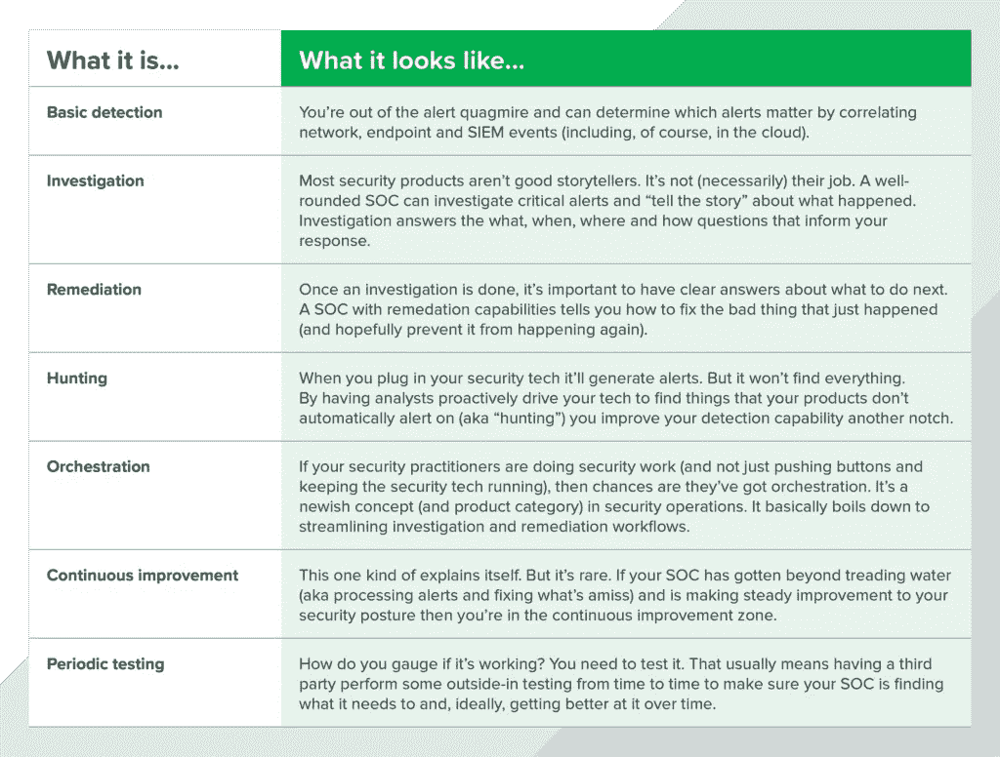

图片来源—[https://exclude . io](https://expel.io/)

要在任何组织的 SOC 中实现这些功能，成本可能从几百万美元到十亿美元不等。根据组织的规模，构建 SOC 需要在流程、人员和技术方面进行投资。

任何 SOC 的关键部分都是响应警报和事件的流程。警报是通过网络上的各种设备生成的，它们被送到第一级分析师那里进行初步审查。如果第一层无法解决事件，则会升级到下一层，下一层的人员拥有更高级的知识和事件响应工具。

很多时候，在 SOC 团队的第一层分析中，需要花费时间来确定警报是真阳性还是假阴性。如果警报是真的，那么 SOC 团队将进行下一级警报分析，否则他们将丢弃该警报。这里需要机器学习来将警报分类为真肯定或假否定。通过考虑机器学习方法，可以节省大量 SOC 操作时间。

让我们看看如何做到这一点…

# **数据收集和再处理**

我使用 Spyder Python 框架来分析数据。让我们导入必要的 python 库。

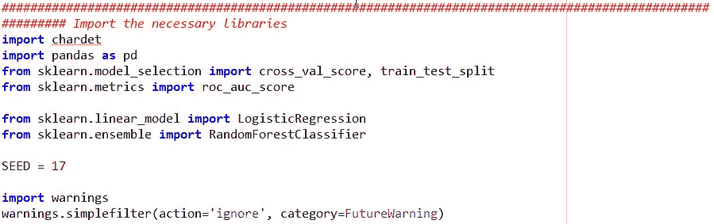

SOC 团队提供了 2 个数据集 csv 文件。我需要将这两个文件合并成一个，但在此之前，我们需要了解它们的字符编码。

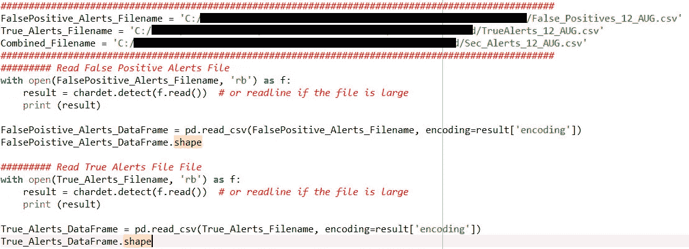

第一个 False_Positive.csv 文件采用 ascii 编码，其他文件采用 ISO-8859–1 编码。使用这些编码格式，可以读取 csv 文件并创建数据帧。

创建新列并为其分配二进制值，以指示警报的类型。确保两个数据框中的列名正确且有序。

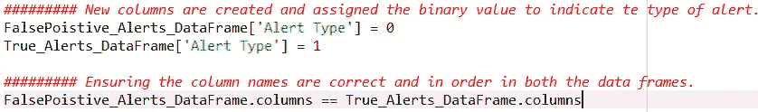

让我们合并两个数据帧。第二个数据帧被附加到第一个数据帧，但是它需要对数据进行混洗，以便很好地混合两种类型的警报。

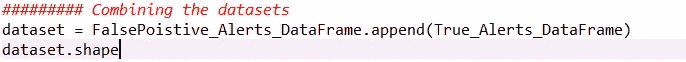

现在我们有 935 个警报，有 39 个属性。

**处理 NaN 值**

39 个属性中有更多的属性具有 NaN 值。下面的代码片段有助于查找值为 null 且百分比大于 50 的属性。

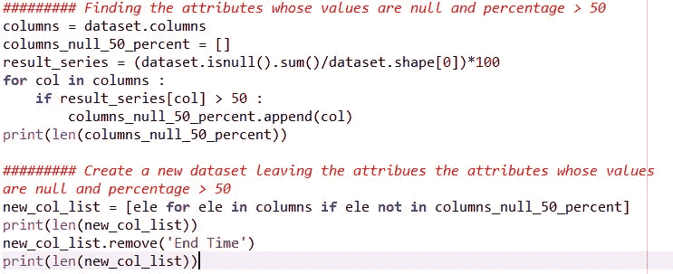

创建一个新的数据框，保留值为空且百分比大于 50 的属性。我将删除“结束时间”,因为这些值是唯一的，不会给分析增加任何值。新的数据框有 13 个属性，包含大量用于分析的信息。尽管如此，它仍有价值，需要适当的对待。在此之前，混洗数据，并分配给新的数据框 new_dataset_shuffled。

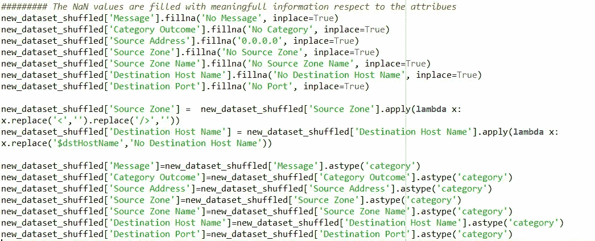

现在，下一步是以 80:20 的比例将数据集分为训练和测试。

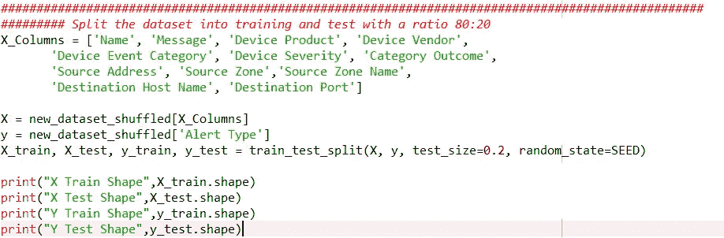

除预警类型属性外，其他属性均为非数值类型。因此，我将应用 **one hot 和哈希编码技术**将数据转换为数字数据。

# 编码、建模和评估

让我创建一个助手函数来拟合一个模型，评估测试集并返回分数。

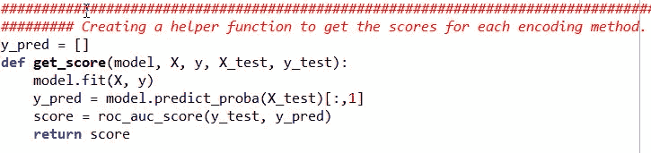

创建逻辑回归和随机森林分类模型的对象。

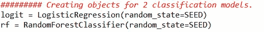

**现在我将按照下面的步骤对每一种编码技术进行操作。**

1.  将编码技术应用于训练和测试数据集
2.  用编码的训练数据集训练模型
3.  为编码的测试数据集测试模型

**带一个热编码**

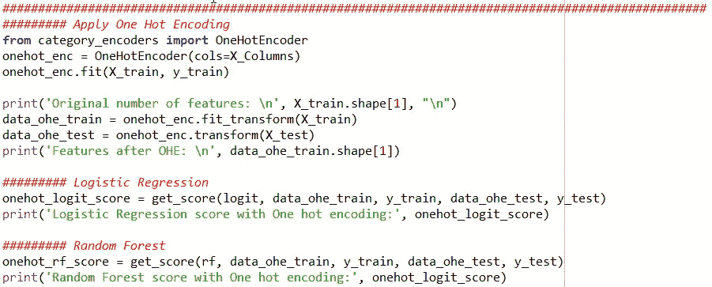

具有一个热门编码的逻辑回归得分:0.9799516908212561
具有一个热门编码的随机森林得分:0.996060607

**采用哈希编码**

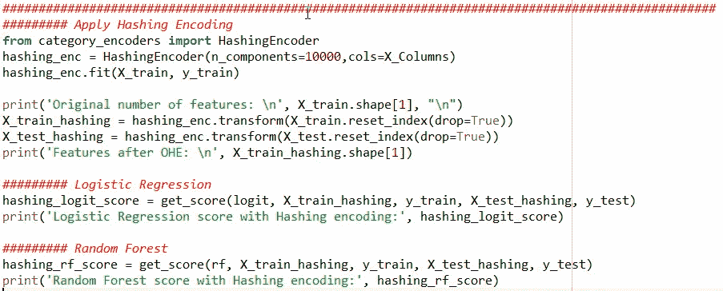

使用哈希编码的逻辑回归得分:0.9794685990338163
使用哈希编码的随机森林得分:0.9799000001

# 结论

从结果中，我们可以得出结论，具有一个热编码的逻辑回归表现更好，为 97.99%

git hub 中提供了源代码。

 [## teggi 2481/案例研究

### 此时您不能执行该操作。您已使用另一个标签页或窗口登录。您已在另一个选项卡中注销，或者…

github.com](https://github.com/teggi2481/case_studies)