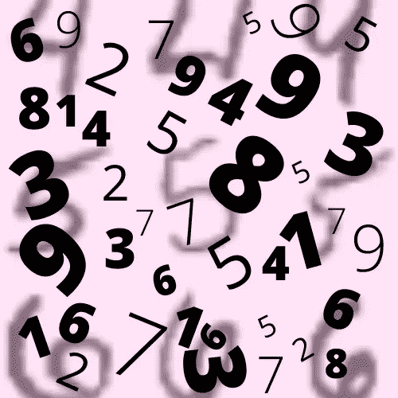
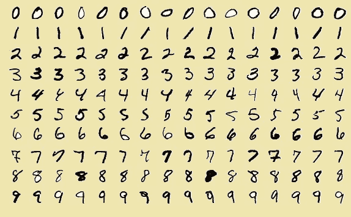
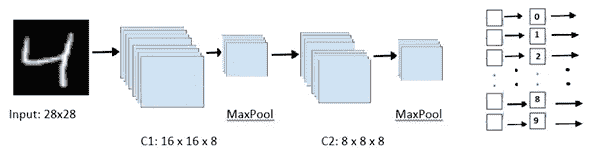
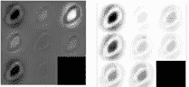
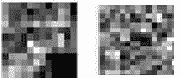
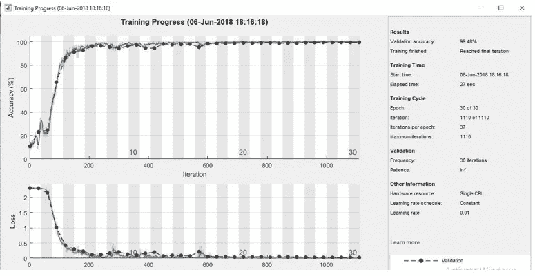
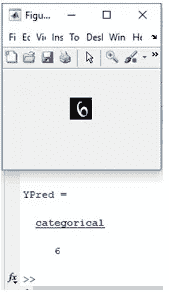

# 基于 Matlab (CNN)的手写数字分类

> 原文：<https://medium.com/analytics-vidhya/classification-of-handwritten-digits-using-matlab-cnn-37ad45c32057?source=collection_archive---------10----------------------->

如今，文档的数字化已经成为发展中国家的主要共识。这不仅列出了灰色经济，也是为了跟踪数字世界的基础设施发展。这包括转换现有的手写和文本扫描，并制作电子计算机生成的版本。

> 这篇文章是关于使用现有的 MNIST 数据集训练一个基本的神经网络模型，在 Matlab 中预测手写数字。该模型可以通过扫描来创建手动编写的脚本的数字化版本。

**数据集:**

国家科学技术研究所(NIST)的修改数据库***【MNIST】***十多年来一直是数字识别的庞大训练数据集。该数据库包括用于机器学习模型的 60K 训练和 10K 测试图像。图像为 28x28，只有灰色通道。然而，对于 RGB 和多通道，我们的彩色图像的尺寸可能要长得多。

数字的例子(摘自维基百科)

**模型架构:**

卷积神经网络(CNN)适用于多类分类，因为它们足以在数据点之间绘制非线性曲线。CNN 一般结合 SoftMax，pooling，全连接层。这个完全连接的网络通过数据集的训练和验证来调整其参数，然后测试网络对手写字母进行分类的性能。主要目标是设置最佳参数，并比较这些参数对精度和成本函数的重要性。

模型的架构

**特征提取:**

特征工程对于任何机器学习模型的收敛都是最重要的。有了监督学习，跟踪从通道学习的权重变得容易。conv1 和 conv2 的学习滤波器是层的输出。网络获得图像的相同样本。第一卷积层的激活不如第二卷积层的激活那样清楚。在实践中，激活是一个滤波器输出，它可以区分不同图像的特征。理论上，早期层比最新层学习得慢。下面提供了两层学习的权重。

由数字“0”上的第 1 层和第 2 层获得的特征

可以注意到两个层如何聚焦于零位数的曲线，并在反向传播中调整它们的权重和偏差。下面是第一个卷积和第二个卷积层的权重视图。

权重矩阵的显示

权重矩阵的大小取决于我们在网络公式中初始化的参数。这些矩阵被进一步改造，使它们更适合蒙太奇的可视性。具有更多输出的隐藏层拥有更大范围的权重和偏差，因此它们返回更高维的矩阵。增加层数会增加训练时间。

# 标准化层

添加批量标准化层的主要目的是标准化连续层的权重和误差激活，使其在某种程度上相等，并以这种方式加速学习梯度和降低灵敏度。这样，网络的性能会更好。

该图将更加稳定，这意味着精度值将是有限的，不会变化太大。因此，网络将更容易达到最高价值，更好的性能。更值得注意的是，当我们以高学习率训练网络时，激活能量的无限变化将导致不稳定的准确度图。我们将学习率提高到 0.15，下图显示了有无该层的情况。

**结果:**

最后，验证准确度为 99.48%意味着网络已经为大多数新图像提供了正确的结果，并且这总体上是非常好的性能。对于图像识别中的一些情况，由于在敏感任务中使用的微妙性质，这是不可接受的。

培训和验证期间的损失和准确性曲线

***点评成绩*** *。*

随机摘录

理想情况下，在最初的几个时期，成本较高，精度很低，因为网络没有最佳的权重和偏差。开始时，权重和偏差的值是随机选择的，输出的校正值尽可能低，但随着我们继续研究其他时期，我们看到精度增加得更快，然后几乎保持稳定。

我们从测试集中随机选择一幅图像用于手写数字的分类，网络给出的结果与图像中显示的数字一致。

**关于过滤器尺寸的进一步直觉**:

1.卷积层中过滤器尺寸的增加影响局部感受野，并粗略地影响性能和训练时间。

2.增加完全连接层的数量将通过影响训练时间来增加验证准确性。训练网络需要更多的时间，因为它有更多的参数。消失梯度当然是另一个问题。

3.批量的微小变化不会特别改变准确度。

**结论:**

神经网络通常容易过度拟合，为了防止这种情况，通常在算法中部署一些技术，如丢弃和正则化。神经网络是通用的近似器，可以更好地处理预测和图像处理问题。如果训练不顺利，模型可能会出现两种异常情况，通常是欠拟合和过拟合。欠拟合只是高偏差和低方差。而过度拟合更为常见。这些特征是通过学习图形来观察的。

此外，人工神经网络正被用于解决几个复杂的问题，需求也随着时间的推移而增加。神经网络处理大量的应用，包括图像处理、人脸识别和预测。

参考资料:

 [## 尼尔坎瓦尔/MNIST 的图像分类

### 目标是实现由完全连接的层构成的基于深度学习的分类器。分类器应该能够…

github.com](https://github.com/NeelKanwal/ImageClassification_for_MNIST) 

维基百科，https://en.wikipedia.org/wiki/MNIST_database MNIST 数据库，

[陈丽](https://ieeexplore.ieee.org/author/37085621618)等(2015)[第三届 IAPR 亚洲模式识别大会(ACPR)](https://ieeexplore.ieee.org/xpl/conhome/7484414/proceeding)