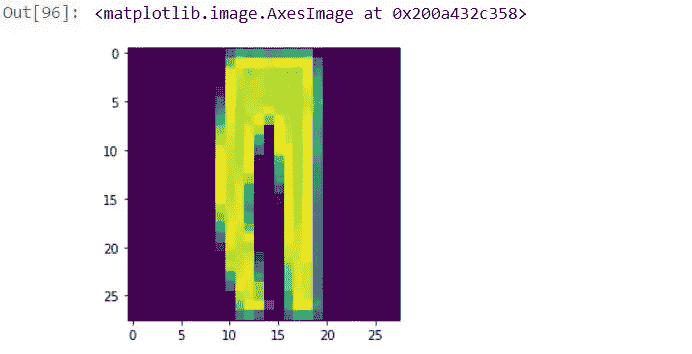
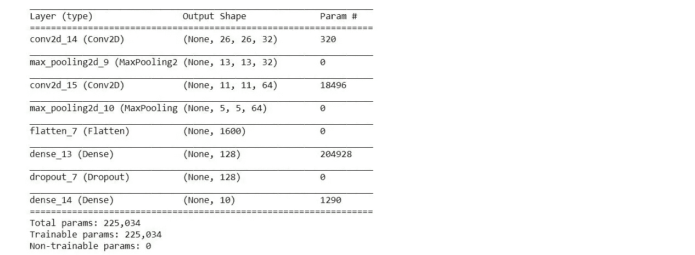
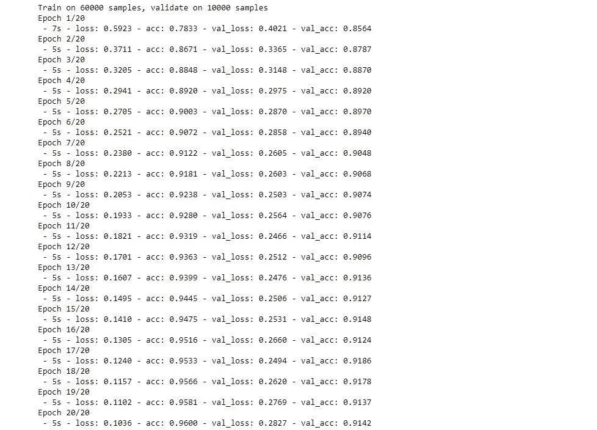
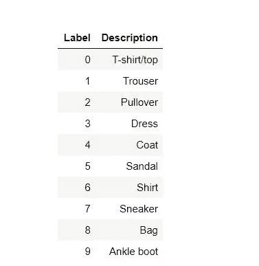

# 基于时尚 MNIST 数据集的图像分类

> 原文：<https://medium.com/analytics-vidhya/classification-of-images-based-on-fashion-mnist-dataset-bb11e4bcdefb?source=collection_archive---------7----------------------->


时尚大师

图像分类是深度学习中最受欢迎的任务之一，在深度学习中，我们给定一幅特定的图像，模型必须预测图像的类别。深度学习库，如 Tensorflow 和 Pytorch，不要忘记 Tensorflow 上非常简单的 Keras API，提供了直观而简单的方法来轻松执行图像分类。检测图像并对其进行分类是当今所有工业领域的主要应用，无论是在自动驾驶车辆分类、交通信号还是在医学成像中，这个列表永远不会结束。是不是很神奇！！

在本文中，我们将使用非常流行的时尚 MNIST 数据集对服装、鞋类和其他相关商品进行分类。所以，让我们开始吧。

# 时尚 MNIST 到底是什么？

时尚-MNIST 是 Zalando 文章图像的数据集，由 60，000 个样本的训练集和 10，000 个样本的测试集组成。每个示例都是 28×28 灰度图像，与来自 10 个类别的标签相关联。时尚 MNIST 旨在作为原始 MNIST 数据集的直接替代，用于机器学习算法的基准测试。
原始 MNIST 数据集是一组手写数字，从 0 到 9，灰度为 28 x 28 像素大小。

在这里，我们将利用 Keras API 和 Tensorflow 后端来完成我们的任务。

# 使用 Keras 对图像进行分类

对于这个任务，您将需要设置一个环境，最好是在 Anaconda 中，使用 Tensorflow GPU 和其他用于对象检测的依赖项。具有 GPU 的系统对于更快的训练是优选的，但是也可以用具有 CPU 的系统来完成。否则，你可以使用 Google Colab，它提供了一个非常好的 GPU 运行时，如 Tesla K80，来训练你的模型。

为了设置 tensorflow 环境进行物体探测，我发现了一个非常有用的链接，你可以在下面找到它。

 [## 安装- TensorFlow 对象检测 API 教程文档

### 有两种不同的 TensorFlow 版本，您可能希望安装，这取决于您是否愿意…

tensor flow-object-detection-API-tutorial . readthedocs . io](https://tensorflow-object-detection-api-tutorial.readthedocs.io/en/latest/install.html) 

对于该任务，首先让我们导入 keras 和其他将在内部使用 Tensorflow 的库。

```
from keras.datasets import fashion_mnist
from keras.models import Sequential
from keras.layers import Dense,Conv2D,Dropout,MaxPooling2D,Flatten
from keras.utils import np_utils
```

然后，将时尚 MNIST 数据集加载到训练集和测试集中。

```
(x_train, y_train), (x_test, y_test) = fashion_mnist.load_data()
```

对图像进行整形和标准化，以便可以输入到模型中。

```
trainX = x_train.reshape((x_train.shape[0], 28, 28, 1))
testX = x_test.reshape((x_test.shape[0], 28, 28, 1))
trainX = trainX/255
testX = testX/255
```

让我们用 matplotlib 查看特定的图像。

```
import matplotlib.pyplot as plt
%matplotlib inline
plt.imshow(x_test[2])
```



裤子

现在，让我们对目标值 y_train 和 y_test 进行热编码。这是因为机器学习和深度学习算法需要数字输入和输出变量。一个整数和**一个热编码**用于将分类数据转换成整数数据。我们有 10 类图像。

```
trainY = np_utils.to_categorical(y_train,10)
testY = np_utils.to_categorical(y_test,10)
```

让我们用 Keras 层建立模型。在此模型中，我们将有 2 个 Conv2D 层，每个层有 32 个和 64 个过滤器，后面是大小为 2 x 2 的最大轮询层。使用 **relu** 激活功能。我们还添加了一个比率为 0.2 的辍学正则化层，以防止任何过度拟合。最后，该模型有一个 softmax 层，输出 10 个必需的类。

```
classifier = Sequential()
classifier.add(Conv2D(filters=32, kernel_size=(3,3),strides=(1, 1), input_shape=(28,28,1), activation='relu'))
classifier.add(MaxPooling2D(pool_size=(2,2)))
classifier.add(Conv2D(filters=64, kernel_size=(3,3),strides=(1, 1), activation='relu'))
classifier.add(MaxPooling2D(pool_size=(2,2)))
classifier.add(Flatten())
classifier.add(Dense(units=128,activation='relu'))
classifier.add(Dropout(rate=0.2))
classifier.add(Dense(units=10, activation='softmax'))
```

对于我们的优化器，我们将使用 Adam，我们想要的指标是准确性。

```
classifier.compile(optimizer='adam',loss='categorical_crossentropy',metrics=['accuracy'])
```

让我们来看看我们到目前为止建立的模型。

```
classifier.summary()
```



模型 Keras

接下来，我们训练模型并将训练数据存储在历史记录中。我已经训练了 20 个纪元，在训练集和验证集上分别获得了 96%和 91.4%的准确率。你总是可以增加历元的数量，也许还可以调整图层和过滤器的数量以获得更好的精确度。这是所有关于实验和探索，所以去吧，没有人能阻止你。

```
history = classifier.fit(trainX, trainY,
 batch_size=128, epochs=20,
 verbose=2,
 validation_data=(testX, testY))
```



训练我们的模型

耶，现在是时候对新图像进行预测了。加载图像并将其传递给分类器。

```
from keras.preprocessing import image
import numpy as np
test_img = image.load_img(‘Data\\Fashion_mnist\\bag.jpg’, target_size=(28, 28))
test_img = image.img_to_array(test_img)
test_img = test_img[:,:,1].reshape(1,28,28,1)
test_img = test_img/255
classifier.predict_classes(test_img)
```

这将输出一个包含分类值的数组，其中 **1** 位于预测类的位置，其他为 **0** 。

如[0，0，0，0，0，0，0，0，0，1，0]

你可以查阅这个表格来查阅这些课程。



时尚 Mnist 类

耶，就这样。感谢您的耐心，并希望您喜欢阅读。非常欢迎您的宝贵反馈。快乐学习！！！。