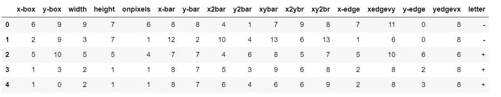
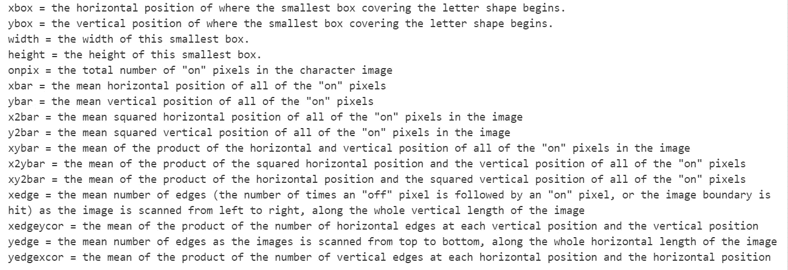
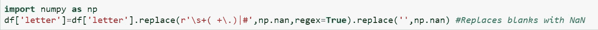
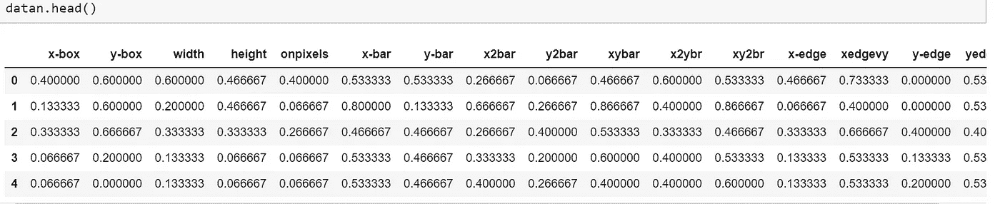
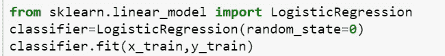
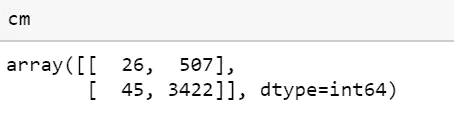
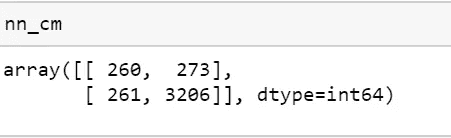

# 机器学习中的分类问题:“字母挑战”

> 原文：<https://medium.com/analytics-vidhya/classification-problem-in-machine-learning-letter-challenge-5a2189199de1?source=collection_archive---------13----------------------->

> 当我们需要预测分类问题的结果时，如男性或女性、有工作或没有工作、有或没有等，这种问题经常出现。以下数据由 20，000 个字母图像实例组成，两者都具有+/-16 个特征。20，000 个实例的所有特征都是数字的，除了目标变量(字母)。一些特征像 x-条、y-条、宽度、高度等。所以，这些特征指的是一个特定的符号是如何书写的，我们需要预测一个符号是否是+/-。

数据集

因此，数据集中有 20，000 行和 17 列。

**特征信息:-**

详细特征

> 因此，通过组合所有这些特征，就形成了一幅图像。

## 数据清理:-

当我们检查缺失值时，没有必要使用“？”在信件栏里。因此，我们需要确保字母列只包含字母+/-。因此，使用下面的语法将空格替换为 NaN。然后，用“-”填充空格。

因此，用“-”替换空格后，“-”的总数为 17240，“+”的总数为 2760。

## 数据标准化:-

数据规范化是指将实数值属性重新调整到 0 和 1 的范围内。

标准化数据

出于分类的目的，我们将'+'存储为 0，将'-'存储为 1。

*让我们用一些机器学习算法来预测结果。*

## 建立逻辑回归模型:-

因此，我们需要预测字母，它是目标变量，其余的特征是输入变量。我选择了 20%的测试规模来测试模型。

> Scikit Learn 是一个优秀的库，用于监督和非监督学习。

导入逻辑回归

导入 Logistic 回归后，我们将通过导入 ***accuracy_score，使用 Scikit Learn Metrics 来发现模型的准确性。***

> Logistic 回归的准确率为 86.2%，是一个较好的预测模型。

**混淆矩阵:-**

混淆矩阵用于确定模型对测试数据的性能，这也会导致真阳性、真阴性、假阳性和假阴性。

混淆矩阵

在 4000 次观察中，3448 次被正确预测，其余 552 次被错误预测。

> 我们现在将使用神经网络算法模型来预测字母

## 神经网络:-

同样，通过使用 Scikit Learn，我们为具有隐藏层 100 & 30 的神经网络算法导入 ***多层感知器*** 分类器。所以， ***NNModel*** 得到的准确率是 ***86.6%。***

***混淆矩阵:-*** 现在通过从 sklearn.metrics 导入混淆矩阵，我们得到如下矩阵。

在 400 次观察中，3466 次被正确预测，其余的被错误预测。

通过比较两种算法的准确率得分，神经网络的准确率略高于 Logistic 回归。

让我们进一步应用随机森林算法。想了解更多关于兰登森林的信息，请点击此 [*链接*](/@nsiddharthasharma/advanced-machine-learning-algorithms-6b3c51b4b0bf) *。*

## 随机森林:-

> Random Forrest 是决策树的集合。系综是一个聚合函数。

因此，我们从 sklearn.ensemble 导入***RandomForestClassifier***来使用 100 个估计器进行预测，这是指默认的树的数量。

> 在随机森林中获得的准确度是 **99.5%** ，这是预测字母的最佳模型。

总之，随机森林是预测目标变量“字母”的最佳模型，其准确率为 99.5%。随机森林随机选择数据样本，并建立许多树来预测输出。

所以，这样，我们就可以用机器学习来预测分类问题。

完整代码请点击[https://github.com/siddhu21/Letter-Challenge](https://github.com/siddhu21/Letter-Challenge)