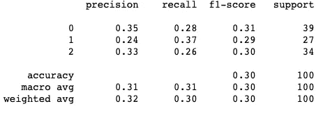

# 分类报告

> 原文：<https://medium.com/analytics-vidhya/classification-report-257189f8fd5c?source=collection_archive---------8----------------------->


您可能已经遇到过类似这样的分类报告



让我们详细讨论这份报告

## 班级

```
0, 1, 2 are the three different classes
```

## 支持

> 支持就是可用于测试的测试样本的数量

```
In this exampleTotal test samples available = 100Test samples that belong to class 0 = 39Test samples that belong to class 1 = 27Test samples that belong to class 2 = 34
```

## 精确

假设在学习算法的帮助下，您已经预测到 100 个测试样本中有 31 个属于 0 类

在您预测的属于 0 类的 31 个样本中，只有 11 个实际上属于 0 类

> 因此，这 11 个被认为是真阳性，因为它们被正确分类为属于 0 类，而其余的被认为是假阳性，因为我们预测它们属于 0 类，但它们不属于 0 类

```
True Positives = TP = 11False Positives = FP = 20Precision = (TP)/(Total samples that were predicted as positives)Precision = (TP)/(TP + FP)Precision = 11/31 = 0.35
```

## 回忆

有 39 个样本属于类别 0

假设在学习算法的帮助下，我们预测这 39 个样本中有 11 个属于 0 类

11 →真阳性

其中 28 个被预测为不属于 0 类，但实际上属于 0 类

28 →假阴性

```
True Positives = 11False Negatives = 28Recall = TP/Total samples that were actually positiveRecall = TP/(TP + FN)Recall = 11/39 = 0.28
```

## f1-分数

> F1 分数提供了精确度和召回率之间的关系。因此，这有助于我们更好地量化我们的学习算法，并在精确度和召回率之间取得平衡

```
f1-score = (2 * precision * recall) / (precision + recall)
```

> 如果精确度和召回率都很小，f1 的分数也会很小

```
precision of class 0 = 0.35recall of class 0 = 0.28f1-score = (2 * 0.35 * 0.28) / (0.35 + 0.28) = 0.31
```

## 准确(性)

> 在学习算法的帮助下被分类到正确类别的样本总数

测试样本总数→ 100

在我们的学习算法的帮助下被分类到正确类别的样本→ 30

```
accuracy = 30/100 = 0.3
```

## 宏观平均值

> 不考虑比例，计算平均值

```
precision_class_0 = 0.35precision_class_1 = 0.24precision_class_2 = 0.33macro-avg precision = (0.35 + 0.24 + 0.33)/3
```

## 加权平均值

> 考虑比例计算平均值

```
precision_class_0 = 0.35precision_class_1 = 0.24precision_class_2 = 0.33samples_class_0 = 39samples_class_1 = 27samples_class_2 = 34total_samples = 100proportion_class_0 = 39/100 = 0.39proportion_class_1 = 27/100 = 0.27proportion_class_2 = 34/100 = 0.34w-avg precision = ((0.35 * 0.39) + (0.24 * 0.27) + (0.33 * 0.34))
```

类似地，计算宏观平均召回率、加权平均召回率等。可以做到