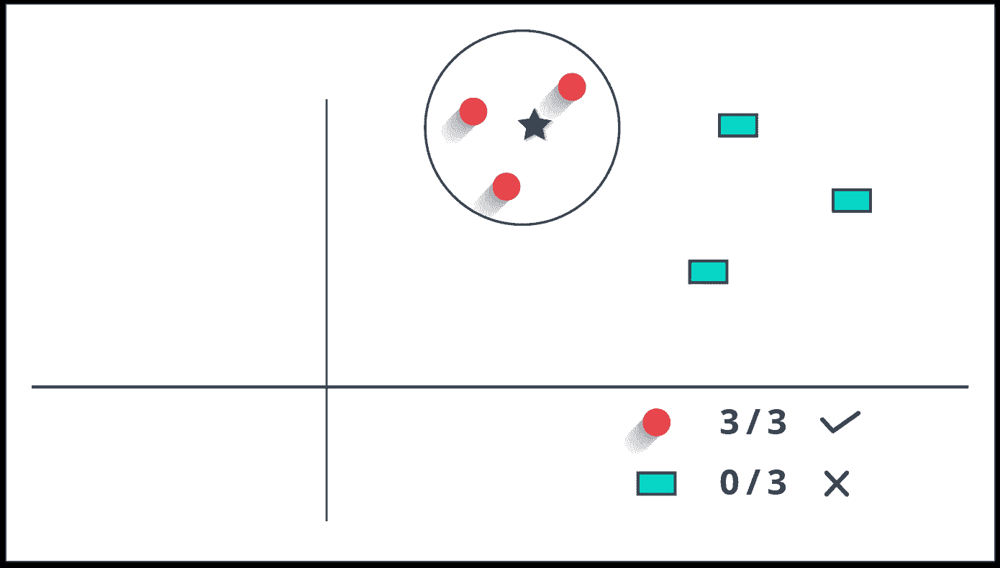

# 使用长短期记忆和手套(单词表示的全局向量)进行分类

> 原文：<https://medium.com/analytics-vidhya/classification-using-long-short-term-memory-glove-global-vectors-for-word-representation-254d02d5e158?source=collection_archive---------9----------------------->

基于长短期记忆和手套词嵌入的多类文本分类。

来源:[https://D1 jnx 9 ba 8 s6j 9 r . cloudfront . net/blog/WP-content/uploads/2018/12/KNN-机器学习-算法-Edureka.png](https://d1jnx9ba8s6j9r.cloudfront.net/blog/wp-content/uploads/2018/12/KNN-Machine-Learning-Algorithms-Edureka.png)

# 目标:

在本文中，我们将了解对 Word2Vec 和预训练单词嵌入 Glove(单词表示的全局向量)的基本理解。然后我们将建立一个…