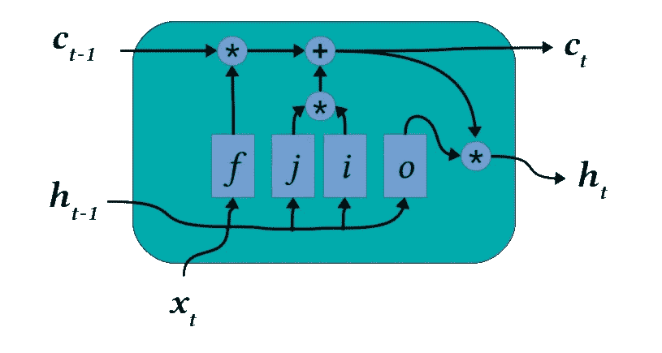
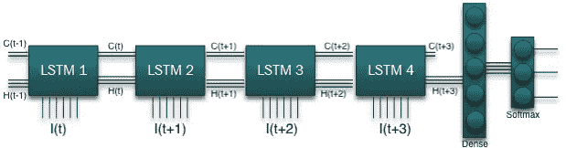

# LSTM 多类分类法——直观描述和 Pytorch 代码

> 原文：<https://medium.com/analytics-vidhya/classification-with-classic-lstm-visual-description-and-pytorch-code-d7d734573fbb?source=collection_archive---------7----------------------->

很久以前我就想写这篇文章，但是我没有太多的时间。事实上，这篇文章是基于我对 LSTM 的理解困难而写的，因为我开始了解 LSTM 分类器。因为我很难理解如何获取 LSTM 输出并进行分类。我相信一些新手可能会像我早期一样面临同样的问题。

首先，让我们简短地讨论一下 LSTM。那么什么是 LSTM 呢？简而言之，这是一种长期的短期记忆，是自然语言处理的特殊形式。然而，由于它的多功能性，它被广泛应用于能源、股票和自然语言处理。如果你对 LSTM 感兴趣并有深入的了解，在' [Colah](https://colah.github.io/posts/2015-08-Understanding-LSTMs/) [博客](https://colah.github.io/posts/2015-08-Understanding-LSTMs/)有非常好的 GitHub 源码。

那么有多少种类型的 LSTMs 可用呢？基于架构，到目前为止，我已经使用了 5 种类型的 LSTMs。你可以在[这里](https://blog.exxactcorp.com/5-types-lstm-recurrent-neural-network/)看到关于 LSTMS 类型的非常深入的讨论。然而，我要讨论的只是经典的 LSTM。

我相信你已经看过前面的链接了，那么 LSTM 细胞是由什么组成的呢？它有隐藏、输入和输出，如图 1 所示。它接受一个向量作为输入，给出另一个向量作为输出(暂时忽略 c)。



图 1:一个经典的 LSTM 电池[【1】](https://blog.exxactcorp.com/5-types-lstm-recurrent-neural-network/)

这只是一个 LSTM，所以它只能处理一个向量。然而，如果你有一系列的数据，那么你如何积累呢？嗯，有一个很酷的方法来处理这个问题。正如你所看到的，它接受输入并给出输出，因此，如果你需要在网络中添加另一个 LSTM，那么第一层的输出将作为下一层输入的隐藏，这个过程将持续到最后一个 LSTM。

你困惑了吗？嗯，为了让你更好的理解，我给你画一张照片。如图 2 所示，我有 4 个 LSTMs。所以，第一个 LSTM 是把 I(t)作为输入隐藏 H(t-1)并提供 H(t)作为输出。这表明第一个 LSTMS 输出作为下一个 LSTM 的输入。这个过程还在继续。



图 2: LSTM 分类器

在 LSTM 4 分类的最后，我们刚刚得到了最后一个 LSTM 的输出，你必须通过简单的前馈神经网络。例如，我放置了一个密集层来减少输出的维度，这样我就可以将数据放入 softmax 层并获得分类结果。所以，让我们从数学上看一切，然后我们将跳转到代码中

```
Input Dimension =[4*25] # Here 25 is features
Hidden Input = [1*50]
target = 12 CATEGORY / CLASSLSTM 1 
input = [1*25] #1st vector of the input
hidden = [1*50]
output = [1*50]LSTM 2
input = [1*25]  #2nd vector of the input
hidden = output(LSTM 1)
output = [1*50]LSTM 3
input = [1*25]  #3rd vector of the input
hidden = output(LSTM 2)
output = [1*50]LSTM 4
input = [1*25] #4th vector of the input
hidden = output(LSTM 3)
output = [1*50]Dense
input = output(LSTM 4)
output = [1*12]Softmax
input = output(Dense)
output = CLASS
```

那么，如何用代码来实现呢？

```
class Network(nn.Module):
    def __init__(self):
        super(Network, self).__init__()
        self.lstmCells = nn.LSTM(25, 50, 4)   
        self.linearLayer = nn.Linear(50, 12)  # equivalent to Dense in keras 
        self.softAct = nn.Softmax()

    def forward(self, x):
        clsf, _ = self.lstmCells(clsf)
        clsf = self.linearLayer(clsf[:,-1,:])
        clsf = self.softAct(clsf)
        return clsf
```

这里，在代码上方，我用 24 个输入 50 个隐藏和 4 个单独的 LSTM 初始化了一个 LSTM。我在一个函数中写了所有 3 个，你可以这样做，因为 Pytorch 库自己管理它，你不用担心。我将最后一层的输出“clsf[:，-1，:”推送到密集层，在密集层中将其缩小到我的目标类的数量，我们都设置好了！现在我们为网络的训练过程做好了准备。干杯！！

因此，我已经讨论了如何与 LSTM 合作进行分类。如果你正在解决回归问题，这都是一样的，只要用你的线性/非线性激活将密集层合并到一维，你就会做得很好。