# 用 Keras 分类

> 原文：<https://medium.com/analytics-vidhya/classification-with-keras-8d9d0f315d08?source=collection_archive---------1----------------------->

## 使用 CNN 神经网络模型


你好，在我今天的文章中，我将评论一个使用其他辅助库的简单应用程序，尤其是可以在 Tensorflow 上工作的 Keras 库。作为一个 IDE，我将使用运行在 localhost 上的 Jupyter IDE。我强烈推荐你使用。先说一点信息吧。

**什么是 Keras？**

👉Keras 是用 Python 编写的开源神经网络库，可以在 CPU 和 GPU 上流畅运行。今天我要在后台使用 Tensorflow。然而，像 Theano 和 CNTK 后端引擎可用。你想用什么都可以。现在，让我们导入库。

```
import numpy as np
import pandas as pd 
from keras.preprocessing.image import ImageDataGenerator, load_img
from keras.utils import to_categorical
from sklearn.model_selection import train_test_split
import matplotlib.pyplot as plt
import random
import os
```

👉这样，我们强调了教育所需的图书馆。当我们运行代码时，可以看到反馈必须返回。

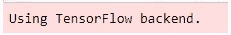

预期反馈

👉然后，在工作目录中，我们可以列出要与 os.listdir()一起使用的训练和测试数据。我们可以用这个命令看到目录中包含哪些数据。

**检查数据集**

可以从 Kaggle 中的 [**猫狗**](https://www.kaggle.com/c/dogs-vs-cats) 数据集免费下载。

```
print(os.listdir("../Data/"))
```

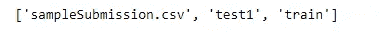

目录中的文件夹

顺便说一下，这个项目使用多层类别图像的深度学习进行分类。我们将在图像中使用狗和猫的标签。

```
filenames = os.listdir(“Data/train”)
categories = []
for filename in filenames:
 category = filename.split(‘.’)[0]
 if category == ‘dog’:
   categories.append(1)
 else:
   categories.append(0)
```

👉它在训练数据中改变为 1 或 0 标签、狗和猫标签。狗和猫的标签变成了 1 或 0。

```
df = pd.DataFrame({
    'filename': filenames,
    'category': categories
})
```

👉我们可以用熊猫图书馆读写数据。我们可以将文件名和类别关联为数据帧中的文件名和类别。category 变量指定图像是猫还是狗。之后，在该数据帧中，使用 head()命令作为缺省值来检索前 5 个数据。

```
df.head( )
```

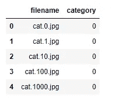

前 5 个数据检索

👉首先，猫和狗进行处理转换为 0 或 1。

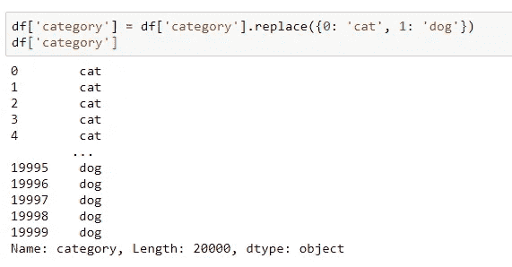

控制 20000 张图像

```
test_df[‘category’]=test_df[‘category’].replace({‘dog’: 1, ‘cat’: 0 })
```

👉为了以后用作最新操作，在测试过程中，1 和 0 标签被重新转换为猫和狗类别。

```
df[‘category’].value_counts().plot.bar()
```

👉通过用 value_counts()对上面数据集中的 category 类中带有 0 和 1 标签的数据进行计数，根据 matplotlib 用 bar()函数提取条形图。

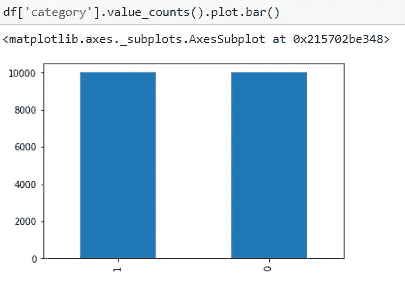

如预测 10000 只猫和狗的图像

**从数据集检索随机图像**

```
sample = random.choice(filenames)
image = load_img(“Data/train/”+sample)
plt.imshow(image)
```

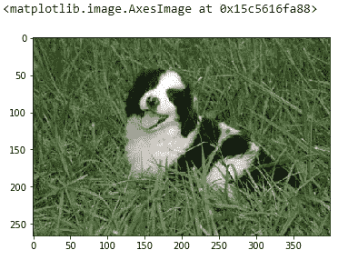

如果我们在总共 20000 幅图像上执行数据集的分离，则有 12000 个训练和 8000 个测试数据。这个项目中 60%的数据集用于教育，40%用于测试数据集。

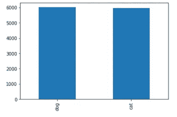

12000 个训练集值的图形化

❗️CNN 是一种神经网络模型，用于通过对图像进行各种层的处理来对图像进行分类。CNN 根据图像中感兴趣的不同区域对该区域中物体的存在进行分类。

❗️For:我们将使用 CNN 神经网络模型，这是必要的，以了解结构提供给我们的层次，并设计好模型。我将展示在这个项目中使用的神经网络架构。CNN 模型由卷积层、池层和全连接组成。通常，通过各种正则化方法(辍学、提前停止等)来防止过度学习。)以防止过度拟合。我在这项研究中没有使用任何正则化方法，你可以使用它来获得更好的结果。

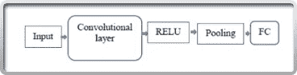

CNN 层架构

👉该项目使用一个卷积层，RELU 函数作为激活函数，卷积神经网络由池层和全连接层组成。

**层模型的结构**

出于分类的目的，它具有这样的架构，即卷积网络是[输入-conv-RELU-池-FC]。第一个结构 INPUT 包含要使用的图像数据。选择数据集中的 20000 张猫狗图片作为输入图像。选择 CNN 神经网络模型对这些图像进行分类。

👉首先，用一定数量的内核(kernel_size 可以任意选择)创建了称为卷积的卷积层。利用这个卷积核，应用滤波器来提取图像的属性。这一层是 CNN 模型的构建块。你可以把它想象成图像处理中的逐像素应用，比如均值、高斯、拉普拉斯、索贝尔滤波器。我的图片尺寸是 64 x 64，IMAGE_CHANNEL 是 3。下面显示了选择为 RGB 的颜色通道在图像像素上的表现。

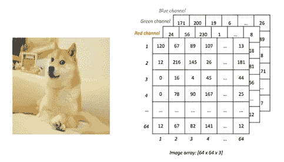

对 RGB 通道应用卷积滤镜

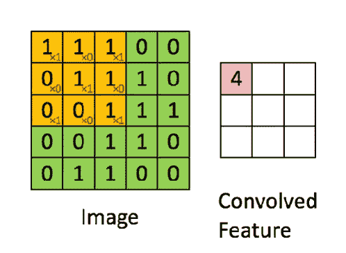

卷积层特征提取

🤗通过这个卷积层，对图像进行特征提取，称为特征检测。这些特征的例子有猫眼、狗尾巴。这样，图像就加深了。然后将激活函数 RELU 应用于特征图上。

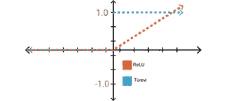

ReLU 函数

👉多层神经网络中的激活是密集的，这意味着它需要大量的处理。网络中的一些神经元是活跃的，并且激活是稀疏的，因此期望获得高效的计算负载。使用 ReLU，计算负载比其他激活函数更有效。

👉在来自卷积层的图像和属性上，称为池化的池化层有发言权。有了这一层，在不降低性能的情况下，通过减少参数的数量来降低模型的复杂性。它会对图像中的每一项进行识别，以避免影响分类。同时，这个过程也防止了被称为过拟合的过度学习过程。MaxPooling 用作池结构。这样，取最大数量的内核大小。通过这个过程，包含足够信息的较小输出被用于神经网络的正确决策。

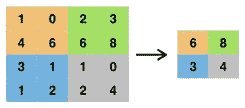

最大池化的可视化

👉对于架构的最后一层和**完全连接的**层，数据将被转换成具有 getting 内核的单个输入矩阵。全连接层中的神经网络是完全互连的。每个神经元都有一个单独的权重值。这里要创建的网络将仅由这些层组成。这是通过**展平()**完成的。然后，该数据通过密度过滤器与**密度**相一致。在这一层，在输入端接收的输入数据准备用于全连接层。

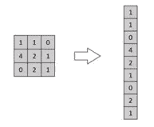

获取单一输入数据

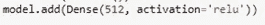

添加致密层

**用 Python 代码创建 CNN 架构**

```
from keras.models import Sequential
from keras.layers import Conv2D, MaxPooling2D, Dropout, Flatten, Dense, Activation, BatchNormalizationmodel model = Sequential()model.add(Conv2D(64, (3, 3), activation='relu',use_bias=True, input_shape=(IMAGE_WIDTH, IMAGE_HEIGHT, IMAGE_CHANNELS)))
model.add(MaxPooling2D(pool_size=(2, 2)))model.add(Flatten())
model.add(Dense(512, activation = 'relu',use_bias=True))
model.add(Dense(2, activation = 'relu',use_bias=True))model.compile(loss='categorical_crossentropy', optimizer='rmsprop', metrics=['accuracy'])
model.summary()
```

👉在卷积层，我有 64 个滤镜和 kernel_size (3，3)。在第一个 Conv 层中，必须输入图像的宽度和高度值。将根据这些值进行过滤。其中的激活函数已经被指定为 relu。如果你愿意，你可以在密集层使用 softmax。在人工神经网络中的权重更新期间计算的 Z 信号的公式中还必须包括偏差值。因为本文中也使用了偏置值，所以我指定 use_bias = True。在池层，我创建了一个 pool_size (2.2)并减少了数据。由于在我的神经网络结构中有 2 个隐藏层，我根据完全连接进行交易。

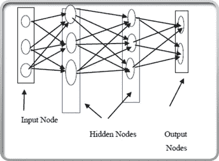

人工神经网络的结构

❗️As:你知道，在人工神经网络中有一个成本计算。在这次计算中，我们希望成本最小。因此，计算损失值对我们来说非常重要。

👉为了编译我们创建的模型，必须选择要使用的损耗参数。对于这一点，Keras 中关于 [**使用 loss**](https://keras.io/losses/) 有很好的解释。我使用**categorial _ cross entropy**是因为我做了两个类别的分类。

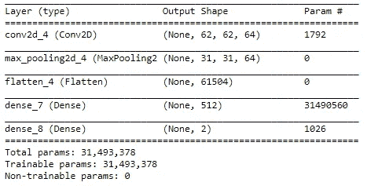

模型摘要

👉项目中使用的 batch_size 变量已被均衡为 100。

```
batch_size=100
```

👉然后，为了增加数据，我们切换到数据扩充过程。通过指定切割和旋转间隔，应用数据增量方法，如缩放、缩放、旋转、水平旋转。

```
train_datagen = ImageDataGenerator(
    rotation_range=15,
    rescale=1./255,
    shear_range=0.1,
    zoom_range=0.2,
    horizontal_flip=True,
    width_shift_range=0.1,
    height_shift_range=0.1
)#Data augmentation
train_generator = train_datagen.flow_from_dataframe(
    train_df, 
    "Data/train/",
    x_col='filename',
    y_col='category',
    target_size=IMAGE_SIZE,
    class_mode='categorical',
    batch_size=batch_size
)
```

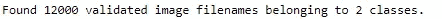

2 个类别的验证训练集

```
plt.figure(figsize=(12, 12))
for i in range(0, 9):
 plt.subplot(5, 3, i+1)
 for X_batch, Y_batch in example_generator:
 image = X_batch[0]
 plt.imshow(image)
 break
plt.tight_layout()
plt.show()
```

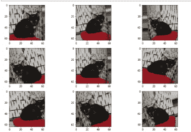

数据扩充结果的图形化

👉随后，分别使用 100、500 和 1000 个时期来训练数据。在这些值之后，由于损失值，精度值开始降低。100 次迭代的过程如下所示。

```
epochs=1 if FAST_RUN else 100 
history = model.fit_generator(
    train_generator, 
    epochs=epochs,
    validation_data=validation_generator,
    validation_steps=total_validate//batch_size,
    steps_per_epoch=total_train//batch_size,
)
```

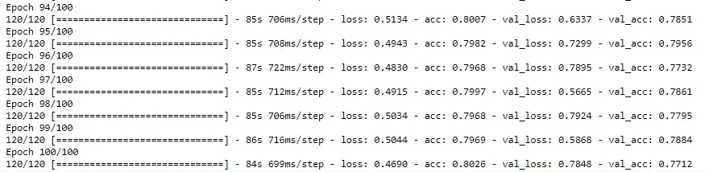

100 个历元的损失和精度结果

👉对于损失值和准确度值的变化图，通过运行以下代码段来创建图形。

```
fig, (ax1, ax2) = plt.subplots(2, 1, figsize=(12, 12))
ax1.plot(history.history['loss'], color='b', label="Training loss")
ax1.plot(history.history['val_loss'], color='r', label="validation loss")
ax1.set_xticks(np.arange(1, epochs, 1))
ax1.set_yticks(np.arange(0, 1, 0.1))ax2.plot(history.history['acc'], color='b', label="Training accuracy")
ax2.plot(history.history['val_acc'], color='r',label="Validation accuracy")
ax2.set_xticks(np.arange(1, epochs, 1))legend = plt.legend(loc='best', shadow=True)
plt.tight_layout()
plt.show()
```

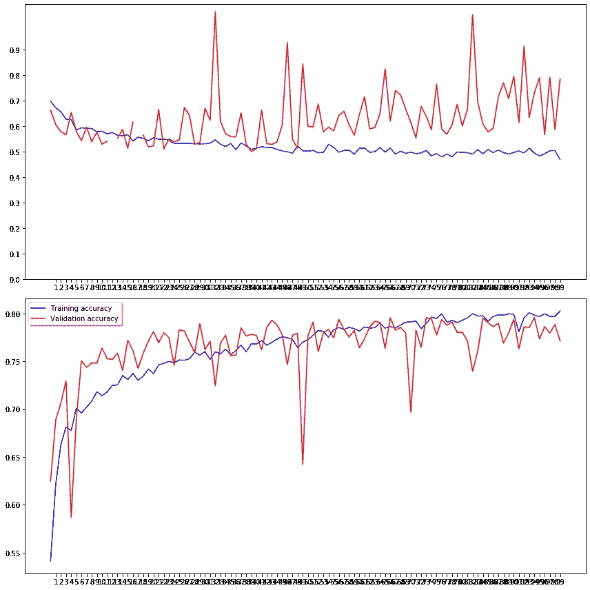

损失和准确度变化图

👉然后，评估阶段通过，文件夹中的测试图像被提交到机器。

```
test_filenames = os.listdir("Data/test1")
test_df = pd.DataFrame({
    'filename': test_filenames
})
nb_samples = test_df.shape[0]
```

❗️还对测试图像进行数据扩充。

```
test_gen = ImageDataGenerator(rescale=1./255)
test_generator = test_gen.flow_from_dataframe(
    test_df, 
    "Data/test1/", 
    x_col='filename',
    y_col=None,
    class_mode=None,
    target_size=IMAGE_SIZE,
    batch_size=batch_size,
    shuffle=False
)
```

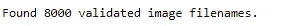

👉该模型是通过 predict 方法预测的，在上面的类别中创建的标签表示 1: dog 0: cat，但是现在下面修改了这个标签。

```
predict = model.predict_generator(test_generator, steps=np.ceil(nb_samples/batch_size))test_df['category'] = np.argmax(predict, axis=-1)
label_map = dict((v,k) for k,v in train_generator.class_indices.items())
test_df['category'] = test_df['category'].replace(label_map)
test_df['category'] = test_df['category'].replace({ 'dog': 1, 'cat': 0 })
```

👉然后，通过标记 CSV 文件来打印预测结果。

```
submission_df = test_df.copy()
submission_df[‘id’] =submission_df[‘filename’].str.split(‘.’).str[0]
submission_df[‘label’] =submission_df[‘category’]
submission_df.drop([‘filename’, ‘category’], axis=1, inplace=True)
submission_df.to_csv(‘Test_submission.csv’, index=False)
```


生成的 CSV 文件

为了确保对生成的 CSV 文件的控制，首先考虑 id 为 1085 和 1079 的图像。图像显示的是猫。在 CSV 文件中，类别被指定为 0 和 1。通过控制它，该信息也在文件夹中提供。

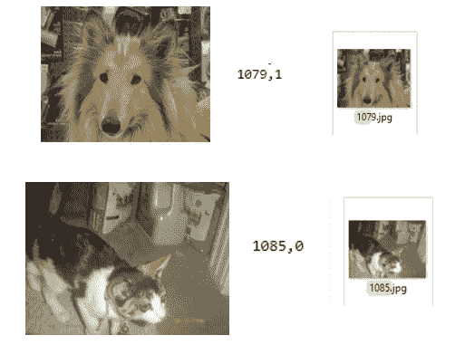

预测控制

👉包含测试数据的 CSV 文件的视图；

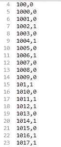

CSV 文件中的标签

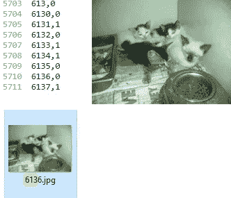

图片 6136:猫

我希望我告诉你的可能对你有用。祝大家编码好，日安[😇](https://emojipedia.org/smiling-face-with-halo/)