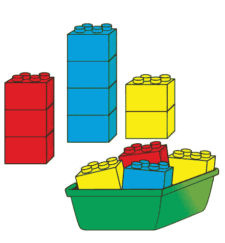

# 用逻辑回归分类。

> 原文：<https://medium.com/analytics-vidhya/classification-with-logistic-regression-7577ef64b6c6?source=collection_archive---------14----------------------->

简单的分类表示。

分类是确定一个新观察值或新实例属于哪一组类别(也称为子群体)的过程。在确定新实例之前，应该使用已经分类的训练数据来训练模型，然后才有可能对新成员执行分类。