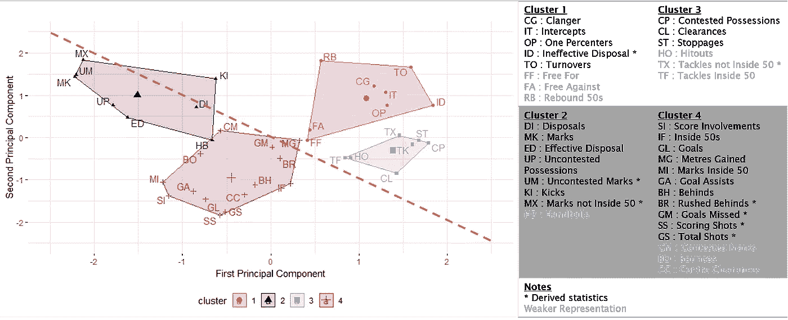
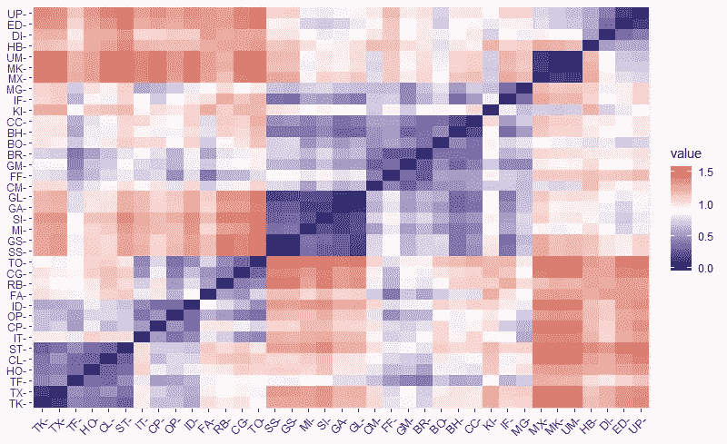

# 分类 AFL 球队统计

> 原文：<https://medium.com/analytics-vidhya/classifying-afl-team-stats-cd163f3c42e8?source=collection_archive---------20----------------------->

## 使用聚类分析识别 AFL 团队统计中有意义的结构

[*“北墨尔本 V 港阿德莱德# 3”*](https://www.flickr.com/photos/40201951@N00/5826450439)*BY*[*NatalieTracy*](https://www.flickr.com/photos/40201951@N00)*是*[*CC BY-SA 2.0*](https://creativecommons.org/licenses/by-sa/2.0/?ref=ccsearch&atype=rich)

球队风格和质量很难评估，因为这是单个球员、他们的位置以及他们如何组成一支球队并与对手互动的融合。这项练习的一个自然起点是探索可从公开网站获得的信息内容的结构，以便(1)客观地对统计数据进行分组,( 2)有意义地形成一个关于球队和比赛的故事。

[聚类分析](https://en.wikipedia.org/wiki/Cluster_analysis)根据相似性对统计数据进行分组。聚类是一种无监督的机器学习技术，是一种发现数据集中固有的有意义的结构、解释性潜在过程、生成特征和分组的过程。

*聚类分析就像把一堆没有标记的数据扔给计算机，让它去发现有趣的结构。*

球队分析的结果表明，数据集可以大致按照(1)球的所有权和(2)球相对于中场的位置来组织。能够通过细分来描述团队可以提供对*团队如何产生高质量比赛(前锋 50 之外的动作)的背景以及高质量机会的*数量和执行*(球门区内的动作)的洞察。*

集群组和组件

有趣的是，与得分聚类相关的“非得分”类型统计是有争议的分数，在 50 分以内和 50 分以内，对后两者来说更强烈。

## 数据

从 2015 年到 2019 年赛季，从 [Footywire](https://www.footywire.com/afl/footy/ft_match_statistics?mid=9917&advv=Y) 的每场比赛的个人页面上搜集了公开的统计数据。总共将近 2000 个匹配的数据被用于分析。

原始数据集包括球员统计数据，这些数据被总计为团队总数，以用于该分析。原始数据按原样使用——没有根据团队得分进行调整。只使用了团队统计数据，因此数据集中没有“对立”的概念。

在聚类分析之前，统计数据被归一化-该过程考虑了 2015-2019 赛季期间其组内每个统计数据的相对排名(或与均值的距离)，因此不知道获胜球队拥有更多踢球次数的可能性。

一些新的统计数据被派生出来，比率类型的统计数据(如进球准确率)被从计算中移除。总共使用了 37 种不同的统计数据。

## 主成分和相关距离

数据集的分类需要一些计算成对观察值之间的距离或相似性的方法。考虑到统计数据之间的高度相关性，在计算相关距离之前，首先使用[主成分分析](https://en.wikipedia.org/wiki/Principal_component_analysis) (PCA)来分解变量。

图 1:成对变量之间的相关性

主成分分析将数据集的维数减少到尽可能少的解释变量，同时信息损失最小。这些称为主成分的新变量对应于原始变量的线性组合，按照对数据集方差贡献的重要性进行组织。

聚类距离是根据前两个(或最重要的)主成分计算的，这解释了数据集中约 40%的方差(前 10 个主成分解释了 80%的方差)。

图 2:前两个主成分之间的聚类距离

从视觉上，我们可以看到至少 3-4 个不同的大星团——尽管其中一些星团可以进一步分解——这与其说是科学，不如说是艺术。

## **解释主成分和聚类**

聚类分析通过对变量之间的相关距离进行加权来对彼此相似相关的变量进行分组。使用 [k 均值](https://en.wikipedia.org/wiki/K-means_clustering)算法对变量进行聚类。

四个聚类用于直观地描述数据的广泛结构，这不是很理想，但它允许我们更容易地分割和描述象限。密切相关的变量代表相同的概念，并得到几乎两倍的权重，从而在该类中扭曲了概念。

图 3:集群组和组件

## **讨论**

我花了很长时间查看聚类结果。虽然主成分和聚类是强大的统计算法，但有时解释并不总是直截了当的。一些观察结果如下:

*   由于数据已经标准化，实际值的意义不大，我们在相对的基础上解释聚类位置。大致上，集群在四个象限的每一个中占据主导区域。聚类中心是根据 2015-2019 年所有观察值的平均值计算的，其方差小于单个匹配。
*   第一个主成分(x 轴)-似乎对应于控球-其中负值表示球在同一队的球员之间转移，正值表示球在该队和其对手之间转移(或中断)。
*   第二个主成分(y 轴)似乎更难解释。与第一主成分一起考虑，y 轴上较低的值代表球队更积极的行动，这取决于球是否在球队的控制之下。
*   从网格的左上角到右下角的对角线很好地代表了中场的活动。从这条理论线上，我们可以看出对角线左边的前区的动作和对角线右边的防守区的动作。还要注意，前锋 50 与防守队员 50 处于截然相反的位置。
*   聚类 1 主要表示在对方区域的球，可能与防守 50 更密切相关。
*   聚类 2 代表占有链或无争议的占有——标记和处置。
*   集群 3 代表压力足球或有争议的财产——与其他团队的互动。
*   聚类 4 是最常见的与在球门广场中相关联的统计，并因此得分。有趣的是，与得分(相对于获胜)高度相关的“非得分”统计数据在 50 分以内，分数在 50 分以内，以及有争议的分数。

## 反光

结果以下列形式指向下一阶段的分析:

*   探索性数据分析变量与四个聚类象限中的每一个都密切相关，尤其是得分。
*   从现有的统计数据中创建和使用更多的特征，例如，非线性或比率统计数据，如从财产中得分投篮。
*   使用两个团队的统计数据来理解团队之间的互动风格以及他们在所定义的集群环境中的对立。(顺便说一句，当排名靠前的球队与排名靠后的球队比赛时，很容易预测比赛结果——预测处于混乱中间的球队之间的获胜概率会更有趣)。
*   为了预测模型的目的，在不影响整体质量的情况下，消除不相关的变量(和目标统计)。聚类分析对于理解数据集中的结构和分段是有用的；但是，鉴于预测模型中考虑的所有统计数据之间存在高度共线性，因此并非所有统计数据都应在预测模型中使用-方法之一是在边界上而不是在每个聚类的区域内选择变量。

总的来说，尽管我的主观描述，聚类算法在分割相似类型的游戏方面做得非常好。探索性分析表明，统计数据中包含的信息可以大致分为(1)球的所有权和(2)球相对于中场的位置。

能够通过聚类来描述团队还可以提供对*团队如何产生高质量行动(前锋 50 之外的行动)以及高质量机会的*数量和执行*(前锋 50 之内的团队行动)的背景的洞察。*

## **参考文献**

1.  聚类分析因 Rajan Sambandam ( [链接](https://www.trchome.com/component/content/article/66-published-articles/146-cluster-analysis.html))而变得复杂
2.  UC 业务分析 R 编程指南:K 均值聚类分析([链接](https://uc-r.github.io/kmeans_clustering))
3.  UC 商业分析 R 编程指南:主成分分析([链接](https://uc-r.github.io/pca))
4.  PCA—Alboukadel Kassambara 的主成分分析要点([链接](http://www.sthda.com/english/articles/31-principal-component-methods-in-r-practical-guide/112-pca-principal-component-analysis-essentials/))
5.  约翰尼斯·哈尔金斯的团队风格分组([链接](https://www.optasportspro.com/news-analysis/blog-grouping-team-styles/)
6.  Footywire 比赛统计([链接](https://www.footywire.com/afl/footy/ft_match_statistics?mid=9917&advv=Y)