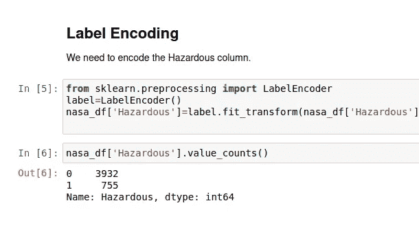
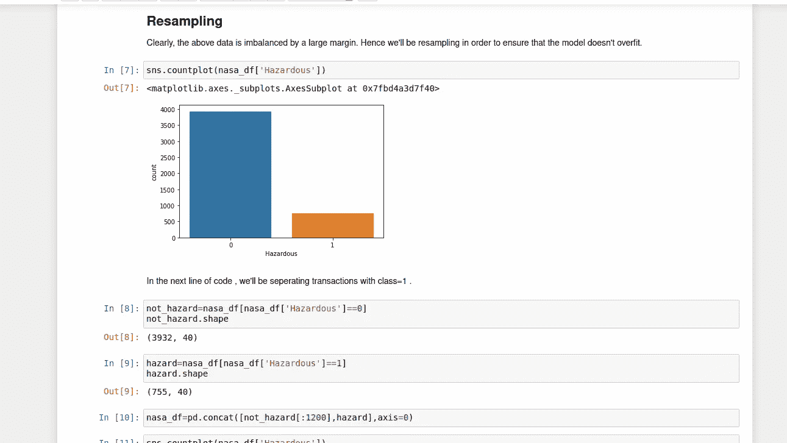

# 用最大似然法分类小行星:初学者的故事(第 1 部分)

> 原文：<https://medium.com/analytics-vidhya/classifying-asteroids-using-ml-a-beginners-tale-part-1-f4385458f13?source=collection_archive---------28----------------------->

机器学习爱好者你好！这是关于机器学习的分类算法的两部分初级教程。所以，不要再拖延了，让我们直接投入进去吧。

# **关于数据集**

我们将在本教程中使用的数据是由 NASA 提供的关于小行星的原始数据。它有 50 列，其中一列对小行星是否危险进行分类。在这类教程中，解释数据的特征(列)是一种常见的做法，但我不会这样做，也不会要求你研究它。我希望你能利用手头的数据，发现其中可能包含的洞见。通过这种方式，你会亲自感受到数据分析的美妙之处。你可以在这里找到数据集****。****

# ****导入库并上传 CSV****

****

**从上面的 pic，你可以看到我已经导入了 pandas，numpy，seaborn 和 matplotlib 库。**

**一旦完成了库的导入，下一步就是上传 csv 文件。这通常通过使用 pandas 的 read_csv 函数来完成，然后将上传的文件存储在一个变量(nasa_df)中。为了查看文件的内容，我们使用了 nasa_df.head()来显示文件，最多显示 5 行。**

# ****探索性数据分析****

**一旦我们完成了文件的上传，下一步就是执行探索性的数据分析。不要被这个花哨的术语吓到。它只是意味着，从数据中获得洞察力，如果需要的话，将它标准化，去掉那些对我们想要预测的变量没有太大贡献的项。**

**对于该数据集，我将涵盖以下分析主题:**

*   **标签编码**
*   **重采样**
*   **删除某些功能**
*   **相关热图**

****标签编码****

**通常执行标签编码以将标签转换成数字形式，使得它们容易被机器解释。在我们的数据集中，我们有危险列，标签为真和假。我们将使用相同的标签编码。**

****

**允许我们这样做的方法是 sklearn 的 LabelEncoder。value_counts 函数返回特定列中唯一值的计数。从返回的值中，我们可以看到数据非常不平衡，因为 0 的数量多于 1。为此，我们将执行重采样。**

****重采样****

**当我们有一个不平衡的数据集时，执行重采样。有很多方法可以做到这一点，但对于本教程，我使用的是我觉得最简单的一种方法，它适合处理手头的问题。**

****

**我们简单地将对应于两个标签的所有特征分成两个不同的数据帧。然后，我们通过限制在标签为 0 的情况下放入的值的数量来连接这两个数据帧。此后，分布变得平衡。**

****删除某些功能****

**除了对目标变量贡献不大的特性之外，还有许多原因可以使特性被删除。**

****

**从上面可以看出，我们删除了大部分值，因为它们是以不同形式存储的相同值。我们将使用千米作为度量单位。**

****

**接下来，我们删除整个列中只有一个唯一值的特性。在这种情况下，特征是轨道体和春分点。**

**以类似的方式删除大部分值后，我们将执行的下一步是绘制关联热图。了解一下。**

**我将在第 2 部分讨论相关性热图、归一化值和实现机器学习算法。**

**点击这里的 **，进入第二部分。****

**希望你读这篇文章的时候觉得有趣，并且学到了一些新的东西！！如果你愿意，留下一些掌声和评论。**