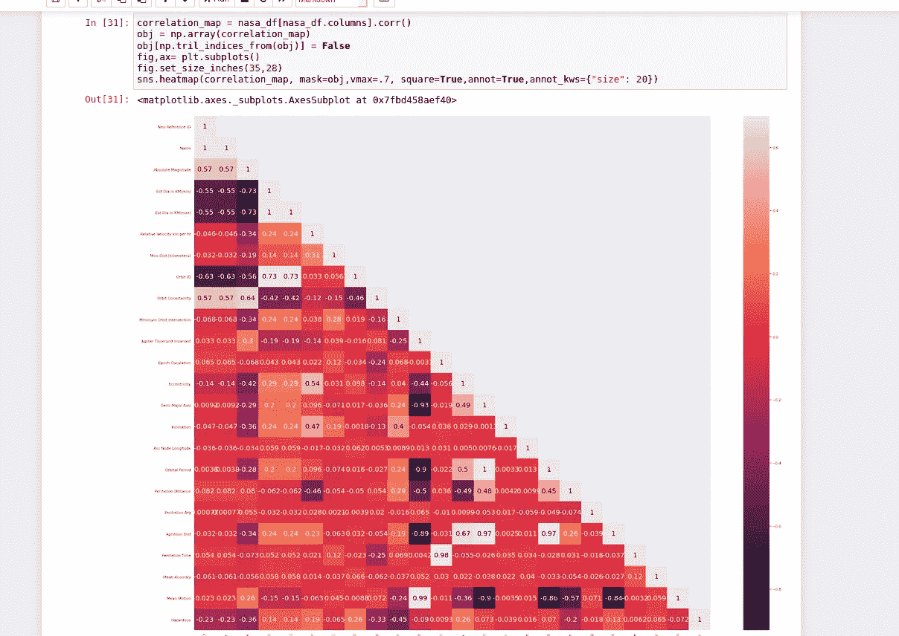
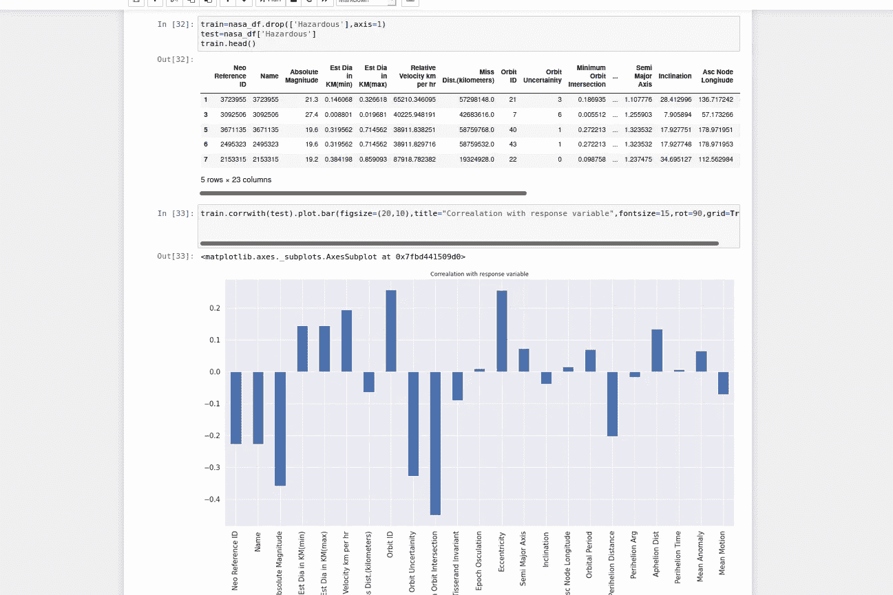
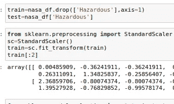
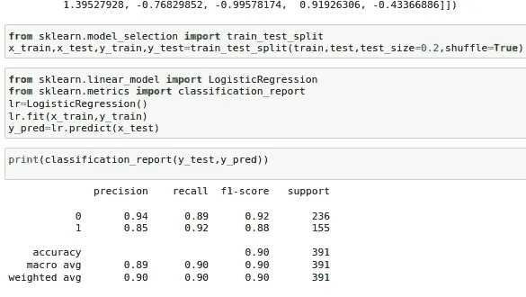

# 用最大似然法分类小行星:初学者的故事(第二部分)

> 原文：<https://medium.com/analytics-vidhya/classifying-asteroids-using-ml-a-beginners-tale-part-2-1e379f7a781d?source=collection_archive---------29----------------------->

嗨！这是使用 ML 第 1 部分分类小行星的后续文章。在第一篇文章中，我介绍了一些非常基本的东西，如导入库、上传文件、执行标签编码、重采样以及出于与目标变量无关的原因而丢弃要素。如果你不知道如何做到这一切，我建议你访问以前的文章 [**这里**](/@tarushipathak/classifying-asteroids-using-ml-a-beginners-tale-part-1-f4385458f13) 。

在这篇文章中，我将涵盖以下内容:

*   相关热图
*   标准化变量
*   实现最大似然算法

那我们开始吧！

# 相关热图

在删除列(这里的原因不是它们对目标变量的贡献)并进行其他必要的分析之后，我们前进到关联热图。相关热图通过颜色告诉我们变量之间的相关性有多强。用于计算相关性的公式是皮尔逊相关系数。大于零的值具有正相关性，这意味着两个变量的变化方向相同。负相关意味着它们会向相反的方向变化。

相关性热图通常用于删除与目标变量不相关的特征。解释相关性热图时的一个新手错误是丢弃显示负相关性的变量。负相关并不意味着完全没有关系。从上面的关联图中，你可以看到关联被赋予了颜色。相关性越强，颜色就越亮。

然而，我，有时，发现很难阅读，尤其是当它有这么多的变量。所以我倾向于用另一种我觉得更直观的方式来描绘这种相关性。

与响应变量的相关性

从上面的图片中，您可以清楚地看到哪个特征与目标变量的相关性较弱。所以，我们会放弃 Dist 小姐。(千米)，木星组织和不变量，纪元密切度，半长轴，倾角，Asc 节点，经度近日点，Arg 轨道，周期近日点，时间，平均异常和平均运动。

现在，您将看到数据分析和 ML 的美妙之处。你对这 50 个变量一无所知，无论你放弃什么变量，都只是因为它们对目标变量没有贡献。如果你有天文学领域的知识，特别是关于小行星的知识，也许，去掉这些变量会太明显，但是，你没有，你仍然得出同样的结论。这就是数据分析的美妙之处。

# **归一化变量**

如果特征变量的值太大，那么它们最终会对目标变量贡献更多，即使它们不相关。这就是为什么在对它们实现算法之前，我们必须对它们进行规范化。用于执行此操作的库称为标准缩放器。

您只需分离特征和目标变量，从 sklearn.preprocessing 导入标准 Scaler，并将其用于特征变量。

现在我们的数据可以进行预测了。

# 实现机器学习模型

由于 sklearn 库，这实际上是最容易的部分之一。我们将使用逻辑回归，因为它是高度用于二元分类的模型之一。首先，我们使用 train_test_split 函数将数据集分为训练集和测试集。

在这之后，我们简单地实现逻辑回归。

“拟合”方法可以拟合定型集上的模型，而“预测”方法可以帮助您对测试数据进行预测。然后将预测值与原始值进行比较，以返回精确度。分类报告是一个 sklearn 指标，它返回 F1 分数、精确度和召回率以及准确度。他们告诉你你的**分类**模型有多好。

# **祝贺成功分类小行星！**

希望你学到了一些东西！如果你愿意，留下一些评论和掌声吧！