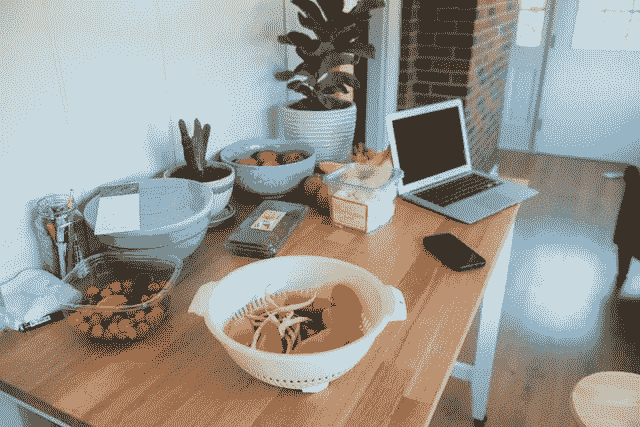

# 用朴素贝叶斯分类食物

> 原文：<https://medium.com/analytics-vidhya/classifying-food-with-naive-bayes-e720fdb5b379?source=collection_archive---------17----------------------->

照片由[德鲁·邓普西](https://unsplash.com/@drewdempsey?utm_source=unsplash&utm_medium=referral&utm_content=creditCopyText)在[的 Unsplash 上](https://unsplash.com/s/photos/computer-food?utm_source=unsplash&utm_medium=referral&utm_content=creditCopyText)

朴素贝叶斯算法是一种简单的算法，它使用概率规则对数据进行分类。有三种不同类型的朴素贝叶斯算法:高斯算法、多项式算法和伯努利算法。我们将重点研究基于单词分类的多项式朴素贝叶斯算法。虽然在垃圾邮件过滤器中最常见，但它可以在您需要将一组单词或文档归类到两个类别之一的任何时候使用。为此…