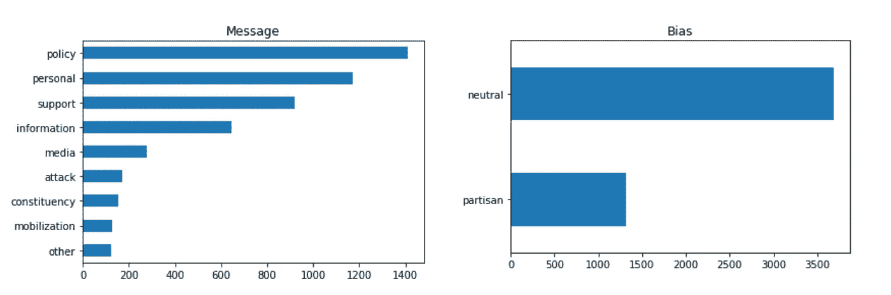

# 利用自然语言处理对政治社交媒体帖子进行分类

> 原文：<https://medium.com/analytics-vidhya/classifying-political-social-media-posts-with-natural-language-processing-5b92c9e3ac67?source=collection_archive---------11----------------------->

由 [Joshua Hoehne](https://unsplash.com/@mrthetrain?utm_source=unsplash&utm_medium=referral&utm_content=creditCopyText) 在 [Unsplash](https://unsplash.com/s/photos/twitter?utm_source=unsplash&utm_medium=referral&utm_content=creditCopyText) 上拍摄的照片

# 介绍

对社交媒体帖子的分析可能会像投票记录或传统投票一样告诉我们用户的政治观点。在本文中，我将解释如何在自然语言处理的帮助下，构建分类器来预测政治帖子的党派偏见和信息。这个项目使用的数据可以在 [Kaggle](https://www.kaggle.com/crowdflower/political-social-media-posts) 上获得，其中包含了 2015 年收集的 5000 篇来自政客的脸书和推特帖子。该项目的完整代码可在 [GitHub](https://github.com/AvonleaFisher/dsc-mod-4-project-v2-1-onl01-dtsc-ft-070620) 上获得。

# 探索数据

加载数据后，我绘制了两个感兴趣的因变量的计数值:

正如这些图所示，大多数帖子都被标为中性。最常见的信息类别是“政策”、“个人”、“支持”和“信息”下面的单词云提供了中立和党派帖子中最常见的单词的信息视觉。

## 党派职位

党派帖子的显著特点是讨论政策或立法问题的词汇，如“奥巴马医改”、“法案”、“法律”和“国会”。这是一份党派文章的打印样本:

## 中立职位

另一方面，中性帖子倾向于使用“退伍军人”、“家庭”和“社区”等词。可以说，这些术语迎合了两党的价值观，比与政策相关的术语更容易引起争议。以下是中立帖子的示例:

# 分类党派偏见

分类模型要求对推文进行清理和数字编码。下面的函数用于在帖子被格式化为字符串列表后对其进行清理:

使用 sklearn 的 **TF-IDF 矢量器**将帖子转换成数字数据。TF-IDF 是以下权重的乘积:

*   **词频:**一个词在文档中出现的次数/文档中的总字数
*   **逆文档频率:**文档总数/包含该单词的文档数的日志

假设“bias”变量是二进制的，那么只需使用`pd.get_dummies`对其进行编码，删除中间列，并使用`ravel()`将列值转换为数组:

这产生了由 0(中立)和 1(党派)值组成的数组“y”。

正如我们在上面看到的，偏见类别严重失衡，大多是中性标签。这种不平衡导致初始测试中模型性能不佳。我使用**合成少数过采样技术(SMOTE)** 对训练数据中的少数类进行过采样:

然后，使用`RandomizedSearchCV`，我创建了一个具有最优参数的随机森林模型。

下面的混淆矩阵显示了模型在测试和训练数据上的表现。

该模型在训练和测试数据上都表现良好，总体准确率为 91%。

# 对帖子的消息进行分类

我使用相同的预处理步骤——过采样和数字编码——对帖子的信息进行分类。标签编码用于为消息列中的每个唯一值分配一个整数，而不是哑编码。假设使用 KNN 模型搜索整个参数网格在计算上没有那么昂贵，`GridSearchCV`用于寻找最佳参数:

该模型在训练数据上具有近乎完美的性能，在测试数据上具有 87%的准确性。这不是特别令人印象深刻，但是考虑到大量的类，它的表现也大大优于随机猜测。在一个具有平衡类的新数据集中，随机猜测预计只能正确分类 11%的帖子。

在每个类行中，与预测标签相匹配的真实标签的百分比最高。然而，该模型将大约一半的个人职位和 27%的支持职位错误分类为政策职位。

# 根据新数据做出预测

使用 Tweepy 和 Twitter 的 API，我编写了一个函数来收集 Twitter 上最近的帖子，并在上面测试模型。该功能用于检索 2020 年总统选举候选人的推文。

在对每个推文列表重复预处理后，我使用随机森林模型对帖子的偏见进行分类，并打印了 5 个被分类为党派的帖子:

在这两组被归类为党派的推文中，肯定有非中性的语言(“最差”、“好得多”)和针对政治对手的批评。

接下来，KNN 模型被用来对推文信息的实质进行分类。下面列出了一些例子。

在这条推文中，乔·拜登向美国人保证，选票将被计算在内，并鼓励他们投票。这种鼓励，如果正确地归类为“支持”，是对担心民主进程可能受到干预的美国选民的支持。

这前三条推文为特朗普政府及其政策辩护。这些推文特别提到了政府对经济和新冠肺炎疫情的处理。底部两条推文反而表达了对美国士兵的支持，或许归类为“支持”更合适。

# 结论

随机森林模型可以用来高精度地预测社交媒体帖子是党派的还是中立的。在收集了推文或其他社交媒体帖子的最新数据后，可以识别和提取党派帖子，供有兴趣了解特定政治家观点的选民或组织审查。

KNN 模型可以以比随机猜测高得多的准确度对帖子的消息进行分类，并且在以下类别上表现得特别好:攻击、选民、媒体、动员和“其他”。

探索性分析表明，被视为党派的帖子往往包含与特定政策或立法问题相关的词/词配对，如“法律”、“医疗保健”和“移民改革”。当试图收集党派帖子时，可以在查询中使用这些术语。

给定该数据的年龄以及政治话语的动态性质，更近的相似类型的标记数据可以支持在新帖子上具有更高准确度的分类器的开发。