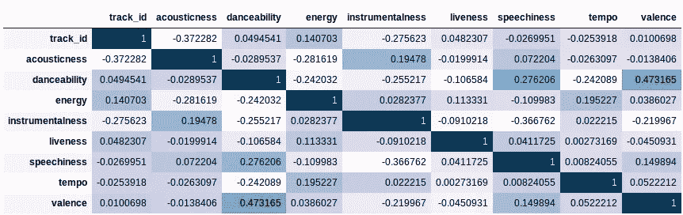
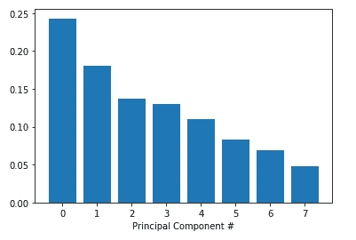
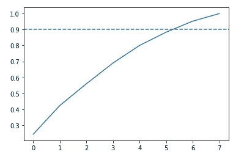
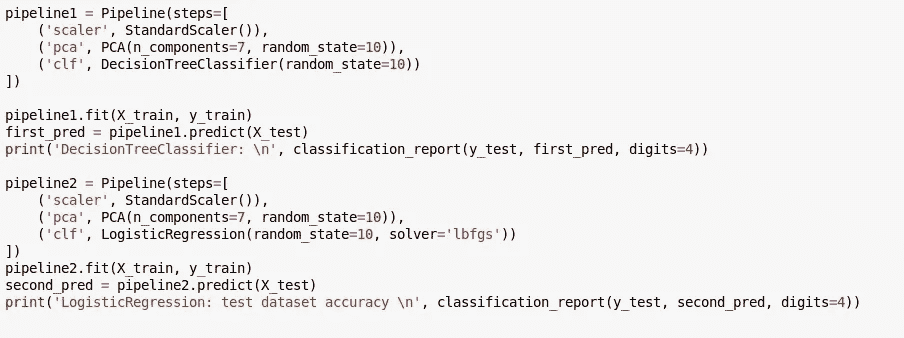
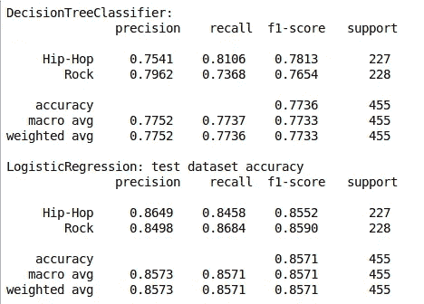
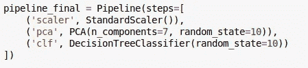
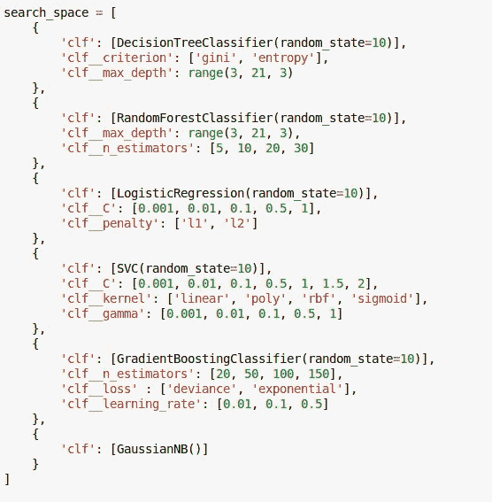

# 用管道对歌曲流派进行分类

> 原文：<https://medium.com/analytics-vidhya/classifying-song-genres-with-pipelines-c7186f66cebd?source=collection_archive---------21----------------------->

在本文中，我们将探索如何使用管道来改善机器学习分类问题的工作流程。我们将通过向一个模型输入歌曲的特征来预测歌曲类型是摇滚还是嘻哈，这些特征是:声音、舞蹈性、活力、乐器性、生动性、语速、节奏和效价。这些数据是由一个名为 Echo Nest 的研究小组汇编的，该项目本身是基于 DataCamp 的一个名为“从音频数据中分类歌曲流派”的项目。在我们进入管道之前，让我们探索一下原始项目，然后与管道模型进行比较。此外，在 [github](https://github.com/paulovictorcorreia/song_genre_classification) 上可以找到包含原始笔记本和用于管道的笔记本以及所用数据的存储库。

由[布雷特·乔丹](https://unsplash.com/@brett_jordan?utm_source=medium&utm_medium=referral)在 [Unsplash](https://unsplash.com?utm_source=medium&utm_medium=referral) 上拍摄的照片

# 艰难探索歌曲类型

项目的第一部分是导入包含在两个数据集中的数据: *fma-rock-vs-hiphop.csv* 和 *echonest-metrics.json.* 然后下一步是在 *echonest-metrics.json* 的 dataframe 和 *fma-rock-vs-hiphop.csv* 的“track_id”和“genre_top”列之间进行合并目标列是“genre_top”。

下一步是检查数据集的变量之间是否存在相关性。为此，需要打印用相关值着色的相关矩阵。这样做是为了检查是否有任何高度相关的变量可以从数据集中删除。

变量的相关矩阵。

正如我们所看到的，没有任何高度相关的变量，所以在这个数据帧上没有通过这个方法删除的列。

现在，为了尝试降低问题的维度，我们将使用主成分分析(PCA)并检查有多少结果成分描述了数据方差的 90%。尽管如此，我们首先需要将数据分割成特征的数据帧和目标“genre_top”向量，然后使用 sklearn 的 StandardScaler 将数据标准化。在这样做之后，我们将 PCA 算法应用到特征中，并且以降序获得以下组件。

按降序排列的主成分。

在这幅图中，我们可以看到特性#0 解释了几乎 25%的差异，而组件#7 解释了大约 5%。为了减少维度，我们设置了 90%的截止点，在这个截止点上，我们将选择解释这个百分比的特征。为此，我们将看到每个成分方差的累积图。

每个分量方差的累积图。

如该图所示，在#6 特征上，我们解释了 90%以上的方差，总共有 7 个分量，这意味着我们减少了 8 个特征数据框架中的 1 个维度。

虽然我们已经减少了数据的维数，但另一个问题仍然存在:我们的目标列是不平衡的。为了解决这个问题，我们进行了欠采样，减少了最常见的目标类别，即摇滚流派，有 3892 个样本，嘻哈歌曲有 910 个样本。因此，我们将 3892 个样本减少到 910 个，以消除预测模型中对摇滚歌曲的偏见。

最后，我们根据歌曲的特征训练了两个模型，分别是决策树分类器和逻辑回归，这两个模型都使用了 sci-kit learn 的默认超参数。在此之前，我们将数据分为训练和测试数据集，其中 *test_size* 为数据集大小的 25%。

利用这些模型和 PCA 算法的 7 个组件，决策树分类器在训练数据集的交叉验证上实现了 78.82%的平均准确度，而它具有 79.78%的测试准确度。LogisticRegressor 在训练数据集的交叉验证上实现了 85.27%的平均准确率，在测试数据集上实现了 85.9%的平均准确率。有趣的是，数据集的训练精度比测试精度差，这可能是由于我们对数据进行了欠采样而导致的欠拟合。

现在，我们将在下一节中通过使用 sklearn 的管道来简化我们到目前为止所做的所有工作。

# 使用管道

这一部分的工作流程与上一部分类似。我们将使用相同的预处理步骤，并将它们作为步骤放到我们的管道中，除了数据集的平衡，它必须手动完成。在此部分之后，管道必须具有以下顺序:标准缩放数据，应用 PCA 提取组件，并应用所选模型。具有决策树分类器和逻辑分类器的管道的代码是:

决策树和逻辑回归器的流水线代码。

两条管道的分类报告如下:

流水线模型的分类报告。

与上一节相比，我们对两个模型的测试精度相似，决策树为 77.36%，逻辑回归器为 85.71%。决策树的交叉验证训练准确率为 80.44%，逻辑推理准确率为 85.5%。在这种情况下，只有逻辑回归器的训练分数略低于测试准确度分数，因此我们不再有信心认为模型是欠拟合的。

尽管我们已经简化了第一部分的工作流程，并且在两种情况下都表现得很好，但这并不是管道能为我们做的全部。如果我们想要一个更精确的模型，进行超参数调整是非常重要的，这就是调整模型的变量。当我们可以使用其他 sklearn 的分类器时，为什么只使用这两个模型呢？让我们使用其中的一些。

要在我们的管道上使用其他模型，我们必须定义一个基础管道模型，如下图所示:

这个问题的一般管道。

我们将保持 PCA 的组件数量等于第一部分，因此我们将只改变分类器“clf”及其超参数，以便网格搜索比原始逻辑分类器性能更好的超参数。我们将在 GridSearchCV 函数上使用的管道搜索空间是:

搜索空间以搜索更好的性能模型。

在这个搜索空间中，我们仍然有决策树和逻辑回归，尽管参数不同于默认值。此外，我们还添加了一个 RandomForestClassifier、一个 SupportVectorClassifier(SVC)、一个 GradientBoostingClassifier 和一个高斯朴素贝叶斯分类器。

在训练这个管道之后，在测试精度方面最好的性能模型是 SVC 模型，其中 C=2，gamma=0.1，kernel =“RBF”，精度为 87.25%，稍好的性能约为 2%，训练精度为 87.91%，也高于原始 LogisticRegressor。

# 结论

在所有这些工作之后，我们可以得出结论，我们使用的管道节省了我们更多的编码，特别是在超参数调整期间，其中大部分工作是确定 *GridSearchCV* 的搜索空间参数，使得在我们使用的参数网格内找到最优解更加容易和干净。

找到的最优解略好于上一节的最优逻辑回归，但并不明显更好，但由于流水线的原因，它是在比我们对每个分类器进行 gridsearch 更短的时间窗口中找到的，从而为找到好的机器学习模型提供了一个好的解决方案。