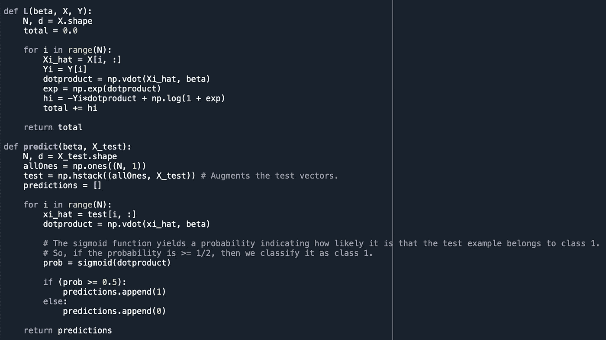

# SPOTIFY 音乐偏好分类:算法比较

> 原文：<https://medium.com/analytics-vidhya/classifying-spotify-music-preferences-a-comparison-of-algorithms-4a33fa7b1d59?source=collection_archive---------14----------------------->

如果有一种方法可以让你的电脑根据一首歌的特定特征来判断你是否喜欢这首歌，那会怎么样？大多数音乐流媒体应用程序使用基于艺术家和流派推荐歌曲的算法，但如果我们可以基于歌曲的复杂属性(如速度或歌曲的“可跳舞性”)来推荐歌曲，会怎么样？或许精确挑选的歌曲更符合听众的特定口味。

在这里，我在**ka ggle“Spotify 歌曲属性”**数据集上探索不同的机器学习算法，并试图形成一个可以决定用户是否喜欢一首歌的模型。

 [## Spotify 歌曲属性

### 尝试建立一个可以预测我是否喜欢一首歌的分类器

www.kaggle.com](http://www.kaggle.com/geomack/spotifyclassification) 

该数据集包含 2017 首不同的歌曲，每首歌曲都有相关的属性和标签。歌曲属性包括像“能量”、“音量”和“效价”这样的特征，这些特征都在下面的分类算法中使用。每首歌曲要么被分类为“1”(表示用户喜欢这首歌)，要么被分类为“0”(表示用户不喜欢这首歌)。我们的目标是能够根据一首歌的属性来预测用户是否喜欢这首歌。我在下面测试了四种不同的算法——**k 近邻、逻辑回归、套索回归和梯度推进**——并比较了它们在测试数据上的得分。

训练数据被定义为具有特征向量 *x1，x2，…，xN ∈ R13* 和相应的目标值 *y1，y2，…，yN ∈ {0，1}* 。为了准备数据，我删除了“歌曲标题”、“艺术家”和 ID 列，对剩余的数据进行了规范化，并将其转换为一个数组。我将数据分成 80%的训练集和 20%的验证集进行测试。在下面的每一种方法中，我都通过用正确预测的数量除以预测的总数来测试我的预测。

使用的第一个分类算法是**K-最近邻**。K-nearest neighbors 是一种分类和回归算法，用于以简单直观的方式预测测试观察的目标值。该算法通过进行测试观察 *x0* 并识别训练数据中最接近 *x0* 的 K 个点来工作。在回归问题中，这 K 个点的 *y* 值的平均值成为 *x0* 的预测值。在分类问题中，K 个最近邻居的 *y* 值进行投票，使得 *x0* 被分类到具有最多票数的类别。

这里，我使用 K = 10 从头开始实现 K-最近邻。该算法首先逐行扫描歌曲测试数据，然后计算该测试示例与训练数据中每首歌曲之间的欧几里德距离，然后根据它们在训练数据中的索引从最小到最大对这些距离进行排序，最后让前 10 个成员投票决定该测试示例属于哪个类。所有文本示例的预测都存储在一个列表中。

KNN 算法实现

该算法产生的准确度分数为 **69.8%** ，这还不算太差，但这个分数肯定可以从下面的至少一个算法中得到提高。在测试了 K 的多个值之后，10 似乎是最好的；任何高于或低于它的分数都会降低。

使用的第二种分类算法是**随机梯度下降的二元逻辑回归**。在逻辑回归中，我们使用逻辑模型对两个定性变量之间的关系进行建模，以执行两个类别(0 和 1)之间的分类。我们定义:

其中 *x^i* 是增强的特征向量。与 K-最近邻不同，逻辑模型输出测试示例属于类 1 的概率。对于一个特征向量 *xi* ，我们称其预测概率 *f(xi)* 并定义为:

*σ(u)* 是我们用来将标量转换成概率的逻辑函数。我们希望 *f(xi)* 与 *i = 1，2，…，N* 的地面真值概率 *yi* 一致。为了做到这一点，我们必须为其找到 *β*

是最小的。(我们使用交叉熵损失函数来衡量我们的预测概率和我们的地面真实概率之间的差异。)

在这种情况下，我们使用随机梯度下降使 *L(β)* 最小化，随机梯度下降使 *β* 朝着最陡下降的方向递增(与 *L(β)* 的梯度方向相反)。随机梯度下降从初始化称为 *β0* 的 *β* 值开始。然后，对于训练数据集的每次扫描，或时期，我们随机选择一个 *i* ，并将 *β* 更新为:

对于 *t = 1，2，3，…* 我们想要执行多少个时期。这里， *α* 是我们的学习率， *Li(β)* 的梯度就是 *l(yi，f())*的梯度。使用 *∇Li(β)* 代替 *∇L(β)* 与正常梯度下降相比，我们的算法负担更轻，并且将随机性引入模型。这有助于防止过度拟合，因为它抑制了模型过于紧密地跟随我们的训练数据中的噪声的能力。

当我们达到最终的 *β* 值时，我们现在可以将我们的测试数据分类如下:对于每个测试示例 *xi* ，如果我们的预测概率 *f(xi)* ≥ 12，那么我们将其分类为 1 类，否则我们将 *xi* 分类为 0 类。

在代码中，我使用 scikit-learn 的逻辑回归实现，该实现使用了正态和随机梯度下降，以及我自己从头开始的实现。 *β* 初始化为全零，alpha 为 0.001，历元数为 150。该代码还在每次迭代时计算成本函数，并绘制结果值。为了比较不同时期的精度差异，我使用 50 到 500 个时期来测试算法，并绘制每个精度分数与迭代次数的关系。

在我对 SGD 的精确度和迭代次数的比较中，您可以在下面的图 1 中看到迭代次数越多，精确度越低。精确度的下降是过度拟合的迹象——随着迭代次数的增加，我们的模型更容易出现跟随错误，因此只对训练数据而不是测试数据进行拟合。为了抑制这种情况，模型在 150 次迭代后停止，因为它似乎既是图 2 中的收敛点，也是图 1 中的高精度点。

图一。通过准确性观察过度拟合

图二。成本函数值与 SGD 的收敛性

出乎意料的是，无论是 scikit-learn 的实现还是我自己的实现，都没有打败 K 近邻的分数。我的 SGD 实现也获得了比 scikit-learn 的实现更高的分数(😊).Sci-kit learn 的常规逻辑回归算法产生了 **53.8%** 的准确度，他们的 SGD 算法产生了 **51.2%** 的准确度，而我的获得了 **58.5%** 的准确度。

在本节中，我们介绍一种称为**套索**的收缩方法，该方法在原始逻辑回归模型上附加一个正则化项或惩罚，以进一步减少过度拟合。之前，我们选择了 *β* ，目标是最小化 *L(β)* 。现在我们将选择 *β* 最小化*L(β)+λ*∩*β*∩*1*。这个第二项被称为*l*1-正则化项 *R(β)* ，并且表示非零 *β* 系数的数量。我们希望这个数字很小，这样我们就有非常少的非零 *β* 系数来提高稀疏度，并让模型专注于实际上有助于执行准确预测的特征。这被称为特征选择，它自然会减少过度拟合。

然而，添加 *R(β)* 需要新的最小化程序，因为该项不可微。梯度下降法在这里行不通，所以我们着眼于近似梯度法。这个方法让我们像以前一样初始化 *β* ，但是更新β如下:

对于 *t = 0，1，2，…* 其中 *l* 1 范数的近似算子定义为

如果超出| *αλ* |，则*修剪*功能将 *β^* 向下修剪到 *αλ* 。
否则， *β* 保持原样。像梯度下降一样， *β* 不断更新，直到上面的方程收敛到它的最小值。

我从头开始实现算法，设置 *λ* = 20， *α* = 0.0001，迭代次数为 60。在每次迭代中，如上所述更新 *β* ，并且计算每次迭代的 *L(β)* 的成本函数值，并将其存储在列表中，以便稍后在图形中绘制。

套索后精度提高到 **67.3%** ，但并不多。下面的图 3 显示了 *L(β)* 在大约 30 次迭代后收敛，但是为了安全起见，我让算法运行 60 次迭代。在图 4 中，可以看到 *β* 的大约 7 个系数的值几乎等于 0，这证明了它的稀疏性。 *β* 可以通过增加 *λ* 变得更稀疏，但是过大的 *λ* 会使模型易于欠拟合，从而降低精度。然而，我们可以看到，该模型发现歌曲的可跳舞性、持续时间、能量、音调、调式、节奏和效价是对一个人是否喜欢它进行分类的最重要的特征。

图 3。Lasso 代价函数值的收敛性

图 4。β系数的稀疏性。

我们使用的最后一个模型叫做**梯度推进**。梯度推进是一种回归和分类方法，采用决策树集合的形式。决策树本身是一种预测模型，它采用一个输入变量，对其进行观察(用分支表示)，并以类似流程图的结构对其目标值(用树叶表示)做出结论。决策树的集合仅仅是所有这些模型的组合，因此输入变量的最终目标值是其在每棵树中的目标值的平均值。决策树表示为 *T(xi)* ，其中 *xi* 是输入变量。

通过将训练集定义为特征向量 *x1，x2，…，xN ∈ R13* 和目标值 *y1，y2，…，yN ∈ {0，1}* 来开始二元分类的梯度提升。我们预测的观察目标值是

其中 *Tj* 是一棵回归树。类似于逻辑回归，我们的目标是选择最小化损失函数的 *Tm(xi)*

这可以用牛顿近似法进一步改写:

如果我们设置残差*ri =α(yiσ(fm1(Xi)))】*，那么可以观察到，该算法仅仅通过将回归树拟合到残差 *ri* 来找到 *Tm* 。

为了简单起见，我使用 XGBoost 提供的梯度推进算法进行分类。XGBoost 在其计算中包括一个正则化项来控制过拟合，并且已知在速度和精度上都优于梯度增强机器。在测试了 n_estimators(模型中的树的数量)的多个学习率和多个值之后，学习率为 0.01 和 n_estimators 为 1500 的效果最好。

XGBoost 被证明是这个例子中最好的算法，这并不奇怪，因为众所周知它是一个特别好的分类和回归算法。目前为止，该模型的最高准确率为 **80.4%** 。

总的来说，如果我要对这个数据集中最能预测一个人的歌曲偏好的算法进行排名，它将是:

**(1)梯度推进:**80.4% **(2)K-最近邻:**69.8% **(3)Lasso Logistic 回归:**67.3% **(4)My Logistic 回归与 SGD:**58.5% **(5)Sci-Kit Learn 的 Logistic 回归与 GD:** 53.8%

**我发现有趣的是，这个数据集是由最简单的分类算法和最复杂的分类算法最好地建模的。即使这样，我们也能正确预测一个人 80%的歌曲偏好，这是一个可靠的 B-。当然，这里还有改进的空间，我邀请下一位数据分析师来做这件事，无论是通过升级上面使用的算法，还是通过创建一个完全不同的模型。**