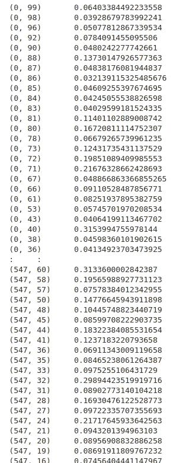

# 用自然语言处理(NLP)和机器学习对 Indeed.com 的技术数据职位发布进行分类

> 原文：<https://medium.com/analytics-vidhya/classifying-tech-data-job-postings-on-indeed-com-1fd8ca6e7cdd?source=collection_archive---------4----------------------->


谷歌的(大)数据中心(信用: [CNRS](https://news.cnrs.fr/opinions/does-big-data-cause-pollution)

随着计算和信息存储及处理系统的不断进步，以数据为中心的职位在过去几十年里已经*爆炸式增长*。一些人现在声称[大数据比石油更有价值](https://www.northridgegroup.com/blog/more-valuable-than-oil-data-reigns-in-todays-data-economy/)，国际数据公司(IDC)预测“到 2025 年，世界数据的总和将从今年的 33zb(本文于 2018 年撰写)增长到 175ZB，复合年增长率为 61%。随着前所未有的数字信息膨胀和革命在我们眼前发生，这可能会让一些人想知道:在这样一个技术先进的未来，工作会是什么样子？

一篇新闻文章强调了 11 个数据工作的例子，它们将对未来的形成产生巨大的影响。这些工作中的许多(如果不是大部分的话)将承担包括弄清楚如何从我们的机器和计算机收集和产生的海量数据中争论和获得洞察力的职责。其中一些工作包括“数据分析师”、“数据工程师”和“数据科学家”等头衔为了看到人们对这些的兴趣疯狂增长，我快速浏览了一下 2004 年以来这些搜索查询的 [Google Trends](https://trends.google.com/trends/explore?date=all&geo=US&q=%22data%20analyst%22,%22data%20scientist%22,%22data%20engineer%22,%22business%20intelligence%20analyst%22,%22full%20stack%22%20%22developer%22) (其中“商业智能分析师”被列为第四类，“全栈开发者”被列为第五类/控制类):


在谷歌上搜索趋势:“数据分析师”(蓝色)与“数据科学家”(红色)与“数据工程师”(黄色)与“商业智能分析师”(绿色)与“全栈开发人员”(紫色)

显然，“数据分析师”已经成为一个职位和技术能力有一段时间了(从 2004 年或更早)。然而，直到 2012 年末到 2013 年初，人们才开始在谷歌上搜索“数据科学家”这个词。从那时起，“数据科学家”的搜索量迅速上升，并与“数据分析师”的搜索量同步上升。其他 3 个类别(“数据工程师”、“商业智能分析师”、“全栈开发人员”)在过去 4-5 年中的搜索量也稳步增长(自 2013-2014 年左右开始)，但搜索频率不如其他两个类别。

人们，甚至是那些从事技术工作的人，经常想知道上述类型的工作到底有多大的不同。例如,“数据科学家”这个工作标签是不是只是一个更有经验/受过教育/经验丰富的数据分析师的更花哨或更浮夸的品牌？考虑到数据分析师和商业智能分析师都是涉及从数据中获取洞察力的分析师角色，他们的工作职责之间真的有任何形式的分离吗？当涉及到数据处理和计算机编程时，全栈开发人员做了很多工作，那么他们与其他“数据”角色有多大区别呢？

为了回答这些和其他问题，这篇文章调查并分析了一小部分来自[Indeed.com](https://www.indeed.com/)的当前招聘信息。然后，我们深入研究如何基于职位描述文本，使用自然语言处理(NLP)技术，构建用于对职位发布进行分类的机器学习模型的细节和步骤。最后，使用降维算法可视化工作发布数据，以在低维(2D)空间中可视化数据。

## **从 Indeed.com 获取招聘信息**

要开始，我们首先需要一个非常重要的东西——数据！我在网上找到了一个名叫 Michael Salmon 的人发布的[脚本，该脚本使用 Beautifulsoup Python 库从 Indeed.com](/@msalmon00/web-scraping-job-postings-from-indeed-96bd588dcb4b)搜集职位信息。然而，该脚本并没有完全按照我需要的方式工作，所以我必须做一些修改，使它能够用于这个应用程序(您可以在本文底部我的 Github 帐户的链接中找到修改后的代码)。

此外——完全披露——我曾在 2011 年至 2012 年期间为 Indeed.com 工作，担任在线营销技术分析师，我强烈建议，如果你真的从搜索结果页面获取数据，你只是出于自己的求知欲，非常轻微地抓取搜索结果页面(如果你太用力访问网站，它们会屏蔽/压制你！！).网页抓取的替代方法是 [Indeed API](https://opensource.indeedeng.io/api-documentation/) (如果你是他们合作伙伴计划的成员，就可以访问)。

为了跳过获取数据的大部分繁琐细节，您需要导入以下库来抓取数据:

```
import requests
import bs4
import string
from bs4 import BeautifulSoup
import numpy as np
import pandas as pd
import time
import random
```

数据将存储在 pandas DataFrame 对象中:

```
state_set = ("Texas", "California", "New York", "Florida", "North Carolina", "Colorado", "Washington")
job_title_set = ("business+intelligence", "data+analyst", "data+scientist", "data+engineer", "full+stack+developer")max_results_per = 10columns = ["state", "full_job_title", "company_name", "url", "job_class"]df = pd.DataFrame(columns = columns)
df["Text"] = ""
```

好的，所以在上面的代码中，我们指定我们将收集横跨 [7 个拥有高水平技术就业的美国州](https://www.ciodive.com/news/5-states-dominating-tech-employment/551315/)的职位列表结果，针对 5 个职位类别(上面列出)，硬限制为最多 10 个结果(每个州/职位对)。该脚本将在 Pandas DataFrame 对象中存储公司名称、url、职位分类和职位发布文本。

在运行脚本一段时间后(使用随机暂停来轻触 Indeed.com 的服务器)，我能够获得 500 多行数据:

```
df.tail()
```


我们填充的 DataFrame 对象的视图

太棒了，现在我们有了数据，让我们深入研究一下吧！

**数据清理/格式化/转换**

在基于文本的数据分析项目中，通常可以执行几项操作。以下是其中的几个例子:

*   小写文本
*   正在删除特殊文本(\n，\r，\t)
*   删除标点符号
*   删除停用词
*   符号化
*   生成 n 元语法

同样，为了让您省心，我在下面提供了执行必要的文本清理和准备的代码(以及必要的 Python 库导入):

```
from nltk import ngrams
from nltk.tokenize import word_tokenize
from nltk.corpus import stopwords
from nltk.tokenize import RegexpTokenizer#lowercase
df["Text_1"] = df.Text.str.lower()#remove \n
df["Text_2"] = df.Text_1.str.replace("\\n", " ")#remove punctuation and tokenize
df["Tokens"] = df.apply(lambda row: tokenizer.tokenize(row['Text_2']), axis=1)#remove stopwords
df['Tokens_1'] = df['Tokens'].apply(lambda x: [item for item in x if item not in stop_words])#merge tokens back into string text
df['Text_3']=[" ".join(txt) for txt in df["Tokens_1"].values]#create bigrams
df["Tokens_2"] = df["Tokens_1"].apply(lambda row: list(ngrams(row, 2)))
```

很好，现在让我们开始为我们的文本机器学习模型准备变量(独立/相关)。通常，我们的*自变量(X)* 将是给定工作的工作描述中包含的文本，它将用于*预测**因变量(Y)* —职位/类型(例如，“数据分析师”、“数据工程师”、“数据科学家”)。

**生成合适的标签(Y)**

为了快速方便地为我们的因变量生成标签，我们从 sklearn 库中导入 LabelEncoder，并将我们的 job_class 列编码为一个数字(0–4)以便处理:

```
from sklearn.preprocessing import LabelEncoderencoder = LabelEncoder()
y = encoder.fit_transform(df.job_class)
print(y)
```

**生成适当的特征向量(X)**

在这一点上，我们已经对工作描述文本做了一些重要的清理，但它仍然是原始文本格式，这对于我们的机器学习模型来说不是理想的。为了将文本转换成有用的东西，我们将原始的工作描述文本转换成 [TFIDF 格式](https://en.wikipedia.org/wiki/Tf%E2%80%93idf)，并选择初始的最大特征数(单词数)为 100:

```
from sklearn.feature_extraction.text import TfidfVectorizerv = TfidfVectorizer(max_features=100)
x = df["Text_3"]
v.fit(x)
x_tfidf = v.transform(x)
```

使用下面的 Python 命令，我们可以看到矢量器的*词汇*:

```
print(v.vocabulary_)
```


tfidf 矢量器对象的词汇表

根据我们自己的直觉，我们已经可以在词汇表中看到一些可能对分类有用的术语(例如，“sql”、“工程”、“bi”、“营销”、“报告”、“软件”、“开发”、“完整”、“机器”)。我们还会看到许多在分类任务中可能根本不重要的术语(例如，“高”、“跨”、“人”、“使用”、“必须”、“角色”、“寻找”、“需求”)。

我们可以使用以下命令检查与每个示例职位发布相关联的 TFIDF 向量:

```
print(x_tfidf)
```



与每个职位发布(0-547 个职位发布)的职位描述文本(单词 0-99)相关联的特征向量(X)

TFIDF 向量被收集到一个[稀疏矩阵](https://en.wikipedia.org/wiki/Sparse_matrix)格式中(如果矩阵中没有大部分条目是零的话，也是一样多)。看第一个文档(文档 0)，我们可以看到单词 71 和 40 具有相对较高的 TFIDF 值。使用上面的词汇表进行反向查找，我们可以看到 71 和 40 分别对应于单词“reports”和“intelligence”。因此，我们可以进行有根据的猜测(使用我们自己的直觉)来推测第一个文档可能与商业智能分析师的职位发布相关联。

我们人类的直觉是正确的，但我们的任务是建立一个*自动机器学习系统/模型*，它应该尽可能少地进行人工调整/微调，并能够处理大量数据(超过人类手动处理的能力)。因此，我们不会试图手动挑选哪些术语对工作类型分类任务有意义和无意义，而是让我们的机器学习模型来确定哪些对最佳文本分类重要，哪些不重要。

**使用支持向量机建立机器学习模型**

许多类型的机器学习模型都包含在 [scikit-learn Python 库](https://scikit-learn.org/stable/)中。虽然机器学习有许多可能的模型，但在本文中，我们将使用[支持向量机(SVM)](https://scikit-learn.org/stable/modules/svm.html) 作为我们的机器学习模型。

根据 scikit-learn 文档，支持向量机的一些优点是:

*   在高维空间有效。
*   在维数大于样本数的情况下仍然有效。
*   在决策函数中使用训练点的子集(称为支持向量)，因此它也是内存高效的。
*   通用:可以为决策函数指定不同的[内核函数](https://scikit-learn.org/stable/modules/svm.html#svm-kernels)。提供了通用内核，但是也可以指定定制内核。

在我们的例子中，我们的 X 特征向量包括 100 个变量，这可能符合“高维空间”的条件这也是为什么 SVM 模型是我们理想的开始选择的一个原因。

```
from sklearn import svm# Classifier - Algorithm - SVM
s = svm.LinearSVC(C=1.0)# fit the training dataset on the classifier
s.fit(x_tfidf, y)# predict the labels on validation dataset# make predictions using the trained model
s_pred = s.predict(x_tfidffrom sklearn.metrics import accuracy_score# Use accuracy_score function to get the accuracy
print("SVM Accuracy Score -> ",accuracy_score(s_pred, y)*100)
```

以及输出的准确度分数:

```
SVM Accuracy Score ->  87.22627737226277
```

该输出表明，使用仅 100 个单词的集合，我们最初尝试的模型能够在 87%的时间内预测正确的职称分类。对第一次开始来说还不错！

为了了解我们的模型在哪里工作得好(也许更重要的是，在哪里*没有*工作得好)，我们根据真实的工作标签绘制了我们结果的*混淆矩阵*(注意 *plot_confusion_matrix* 是使用本文底部 Github 链接中的代码定义的自定义函数):

```
import matplotlib.pyplot as plt
from sklearn.metrics import confusion_matrixclass_names = np.unique(y)plot_confusion_matrix(y, s_pred, classes=class_names, title='Confusion matrix')
```


困惑矩阵(0 =“商业+智能”)；1 = "数据+分析师"；2 =“数据+工程师”；3 =“数据+科学家”；4 =“完整+堆栈+开发人员”)

总的来说，这个矩阵看起来相当不错:

*   很高兴看到我们的混淆矩阵的对角线充满了高计数值(=高真阳性)，非对角线条目大多接近于零(=低假阳性)。这些属性反映了我们初始模型的大约 87%的准确性；
*   “全栈开发人员”工作的工作描述直观上比四个更具体的数据角色更不同——我们的模型显然认识到了这一事实，这反映在最后一行和最后一列几乎全是零，除了最低的对角线元素(4/4)几乎完全填满。这些方面表明，我们的模型不仅在正确分类全栈开发人员作业方面的准确率超过 98%，而且在涉及到*不将*其他“数据”作业误分类为全栈开发人员作业时，它也非常好。

也就是说，有几个非对角线条目似乎明显大于零。例如，第 2 类(=“数据工程师”)和第 3 类(“数据科学家”)之间似乎有点混淆。这很有意义，因为数据工程师和科学家通常都会使用复杂的算法处理大量数据(> 10 GB)，并且经常会在 AI/ML 应用的生产环境中部署机器和深度学习方法。为了更好地理解为什么我们的模型在某些情况下无法准确分类，我们为什么不看一个贴错标签的招聘启事样本呢？


请看左边的(贴错标签的)招聘启事，这个启事的职位名称是“助理数据科学家”因此，我们的方法应该将该职位发布分类为第 3 类(=“数据科学家”)。然而，我们训练有素的 SVM 将这个帖子归类为 0 级(=“商业智能”)。这是为什么呢？

首先，这个职位的技能/能力和知识非常一般——潜在的候选人必须能够读、写、说英语，了解数据、分析和报告，并且有风度、善于分析和独立。此外，工作描述包括“Tableau”和“Microstrategy”这两个词，它们是商业智能(BI)中经常使用的工具。最后，数据科学家和工程师使用的非常复杂的算法和工具(Hadoop、AWS、机器学习、Tensorflow、深度神经网络等。)似乎完全不在这份工作清单上。因此，现在我们深入研究了数据，这份工作可能应该被称为“商业智能”角色，而不是“数据科学家”角色！这表明，有时，与其说是我们的模型可能不准确，不如说是我们的数据并不总是被准确标记！

虽然观察一项工作可能很有趣，也很有启发性，但问题仍然存在:所有这些“数据”角色的重叠程度如何，我们是否有办法直观地检查这种重叠？

**可视化与 PCA 和 t-SNE 的重叠**

两种流行的降维方法是[主成分分析(PCA)](https://en.wikipedia.org/wiki/Principal_component_analysis) 和 [T 分布随机邻居嵌入(t-SNE)](https://en.wikipedia.org/wiki/T-distributed_stochastic_neighbor_embedding) 。虽然主成分分析已经存在了一段时间，但 t-SNE 是一种相对较新的方法，与主成分分析相比，它产生类似但数量不同的输出。

为了避免您了解这两种方法之间的所有差异，我们将只调用我们的自定义绘图函数(参见底部的 Github 链接，改编自 [scikit-learn 文档](https://scikit-learn.org/stable/auto_examples/model_selection/plot_confusion_matrix.html))并使用 PCA 和 t-SNE 绘制结果，以可视化我们的文本文档簇及其重叠。

首先，让我们试试 PCA:

```
plot_dim_red("PCA", features=x_tfidf.toarray(), labels=y, n_components=2)
```


PCA 输出，将 100 个特征减少到 2D 向量空间表示

文本职位描述数据的 2D 向量空间表示揭示了我们数据中的许多有趣模式:

*   ***【全栈开发者】(紫色)*** 在很大程度上与其他 4 种工作类型很好的分开。显然这是有意义的，因为我们选择了四个密切相关的数据角色，以及第五个不太关注数据而更关注前端和后端网站设计的全栈角色。
*   ***(红色)*** 与 ***数据分析师(黄色)*** 重叠最明显，这也是有意义的，因为他们都是分析师角色，具有相似的教育和技能要求。
*   ***数据工程师(蓝色)*** 也与 ***数据科学家(绿色)*** 高度重叠，呼应了我们 PCA 模型对这两个角色的混淆(如上图混淆矩阵所示)。
*   ***数据分析师(黄色)*** 在很大程度上与其他三个数据角色重叠。同样，这并不意外，因为数据分析通常是一项非常广泛的技能，在任何以数据为中心的角色中都可以使用。许多作为经验丰富的数据分析师工作多年的人也可能频繁地转换到作为工程师/科学家的更高级的角色，这是这种密切关系的另一个原因。

考虑 PC1 和 PC2 这两个变量的实际含义是很发人深省的:

*   查看上图中的 **PC1** ，绝大多数全栈作业位于其他“数据”作业的右侧。这种模式可以支持以下假设:对于给定的工作描述，PC1 得分越高，与该工作描述相关联的工作就越“像全栈”(例如，任何 PC2 > 0.2 的工作都有资格成为“全栈开发人员”工作)。
*   对于 **PC2** 来说，通常需要更多资历/教育/计算机科学技能的角色往往具有负的 PC2 值，而“分析师”类型的工作往往具有正的 PC2 值。因此，具有正 PC2 值的工作可能更倾向于“商业”或“报告”类型的工作，而具有负 PC2 值的工作可能倾向于需要算法、机器学习和/或大数据工具的知识。

当然，这些变量(PC1，PC2)分别代表什么，有很多解释！

那么 SNE 霸王龙呢？让我们看看可视化方法产生了什么！

```
plot_dim_red("TSNE", features=x_tfidf.toarray(), labels=y, n_components=2)
```


t-SNE 输出，将 100 个要素缩减为 2D 平面空间表示

关于 t-SNE 有几点需要注意:对于重叠组，这种方法比 PCA 产生更多的分离。此外，t-SNE 依赖于非确定性的随机过程，而 PCA 是确定性的。这意味着使用相同的数据，主成分分析始终具有相同的输出，而 t-SNE 输出低维数据的不同(随机化)表示。两者的比较可以在 StackExchange 文章中找到[这里](https://stats.stackexchange.com/questions/238538/are-there-cases-where-pca-is-more-suitable-than-t-sne)。

那么我们在 SNE 霸王龙身上看到了什么？与 PCA 一样，全堆栈作业显然属于自己的分组。数据科学家、数据工程师和商业智能(分析师)之间的重叠也少得多。然而，数据分析师数据点仍然与其他三个数据角色混杂在一起，这意味着，即使使用 t-SNE(它试图正确地映射*的本地邻居*，至少一些数据分析师角色看起来几乎与数据科学、数据工程师或 BI 分析师角色没有什么区别。在这个 t-SNE 迭代中，PC1 和 PC2 值的实际意义似乎也随着上述 PCA 中 PC1 和 PC2 的意义发生了变化。

**兜了一圈(没有双关语)**

我们可以看到，事实上，设计一个机器学习系统是可能的，它可以通过查看工作描述来预测给定工作的类型/职位/类别，精确度很高(~87%或更高)。此外，我们对我们的数据和其中的模式有了更好的理解，我们的系统在理论上可以*应用于任何工作发布/列表/描述的文本语料库！*

就*实际应用*而言，这种 ML 文本分类系统的一个应用可以是在线发布的新工作的新工作分类的自动化，这对于潜在的求职者缩小可能的工作机会列表非常有帮助。例如，如果一个人正在专门寻找一份 BI 分析师的工作，但不是数据科学或工程职位，他们可以使用该系统只检查“看起来”(从*文本角度* ) BI 分析师工作的工作。

接下来还有很多事情要做。以下是一些关于未来调查和分析哪些方向会富有成效的想法:

*   **获取更多(大)数据；将数据分成培训/测试组:**我们的数据包括略多于 500 个数据点/个人工作列表。有了数千个数据点，我们就有足够的数据通过测试和训练组来验证我们的模型(例如，避免过度拟合)。
*   **二元语法、三元语法、多元语法:**我们的分析只关注单个单词。更复杂的分析将包括 [n-grams](https://en.wikipedia.org/wiki/N-gram) (例如，“业务”和“智能”与“商业智能”)。
*   **测试不同的模型:**虽然我们只使用了一种分类方法(SVM)，但是还有许多其他的分类方法。一些可能适用于文本分类的方法包括[逻辑回归](https://en.wikipedia.org/wiki/Logistic_regression)、[朴素贝叶斯](https://en.wikipedia.org/wiki/Naive_Bayes_classifier)和[递归神经网络(RNNs)](https://en.wikipedia.org/wiki/Recurrent_neural_network) 。
*   **检查学习到的模型参数，以发现相关的工作技能:**另一个应用是以某种方式导出哪些技能对特定的职位有用。我不确定使用我们当前的 SVM 模型有多容易，但是其他模型(多项逻辑回归？)可能能够区分哪些单词/标记与哪种工作类型相关(例如，Tensorflow 可能与数据科学家和机器学习角色更相关，而 Tableau 可能与 BI 和分析报告角色更相关)。

如果你是一个在数据分析领域工作的人(即使你不是)，我希望你喜欢这篇文章。如果有，请鼓掌/喜欢！

Github 回购:[https://github.com/vincent86-git/Data_Job_Analysis](https://github.com/vincent86-git/Data_Job_Analysis)