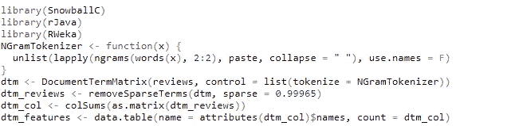

# 使用朴素贝叶斯对亚马逊产品的文本评论进行分类

> 原文：<https://medium.com/analytics-vidhya/classifying-text-reviews-of-amazon-products-using-naive-bayes-4a21c6fabaff?source=collection_archive---------12----------------------->

正如之前[提到的](/analytics-vidhya/the-naivety-of-naive-bayes-72c2a1738f80)，在文本分类方面，朴素贝叶斯是一种优秀的机器学习算法。对文本数据进行分类通常包括大量文本挖掘形式的预处理，然后才适合于构建模型。文本挖掘是将原始的、非结构化的文本数据转换成有意义的、结构化的形式以提取有价值的见解的过程。这里，我们将构建一个简单的朴素贝叶斯模型，该模型将获取亚马逊产品的文本评论，并将它们分类为“正面”或“负面”。

## 最初的步骤

这里使用的亚马逊精品评论[数据集](https://www.kaggle.com/snap/amazon-fine-food-reviews)取自 Kaggle。原始完整数据集包含 35172 行 10 个特征，其中我们只需要代表产品*得分*，评论*摘要*和完整评论*文本*的特征。

图一。包含必要要素的亚马逊数据集的子集。

我们将首先从*得分*特性构建*响应*变量，将*得分* > 3 的行标记为“正”，其他的标记为“负”。

图二。不同审核分数(上图)和不同回答(下图)的柱状图。

我们的目标是构建一个模型，该模型可以接收多行文本数据，并将相应的*响应*分类为“肯定”或“否定”。文本数据可以是评审*摘要*或评审*文本*。对于一个简单有效的模型，我们将考虑评审*总结*。

## **语料库创建和清理**

在我们到达模型构建阶段之前，原始文本数据必须经过几个步骤才能获得有用的形式。我们首先从评审摘要创建一个语料库，它只是一个摘要文本文件的集合。我们将语料库中的所有字母转换为小写，然后开始清理过程，去除不必要的数字、标点符号和不必要的单词(称为停用词，包括频繁使用的单词，如“I”、“or”、“and”、“the”等)，只取单词的词根(如表示“go”、“goes”、“going”的单个单词)，最后删除所有不必要的空格。

图三。语料库的创建和清理。

图 4。清洗过程之前(左)和之后(右)的语料库中的文本。

清理完语料库后，文本文件只剩下那些单词，与我们去掉的单词相反，它们可能对分类有用。

## **文档术语矩阵**

现在有了干净的语料库，我们将形成一个文档术语矩阵(DTM)。DTM 是一个矩阵，其中每行对应于语料库中的一个文本文件，列由语料库中找到的所有术语组成，每个( *i* ， *j* )条目是第 *j* 个术语在第 *i* 个文本文件中出现的频率。DTM 经常类似于稀疏矩阵，即具有很少数量的非零值的矩阵。因此，我们通常通过移除一些稀疏项来获取 DTM 的子集。

图五。通过移除稀疏项来获取 DTM 的子集。

这里，我们将稀疏度设置为 0.99965，这意味着我们将删除至少 99.965%的单元格为零的项。设置稀疏值没有特定的规则；不同的级别导致不同数量的术语，因此准确度值也不同。

## 可视化和词云

我们可以制作柱状图，显示不同单词在文本文件中出现的频率。这里，我们首先根据文本文件的*响应*类型对其进行了分区，并为每个分区制作了上述柱状图。

图六。柱状图显示单词在正面(顶部)和负面(底部)回答中出现的频率。

此外，当我们处理文本文件时，我们可以利用一种叫做文字云的东西来实现可视化。单词云是一种将 DTM 中出现的单词显示为云的图像，其中每个单词的大小表示其频率。所以，上面的柱状图可以用下面的单词云的形式来表示。

图 7。正面(左)和负面(右)回答中出现的单词的单词云。

## *朴素贝叶斯的工作*

让我们大致看看朴素贝叶斯在文本分类中是如何工作的。假设我们的语料库中有一个评论说“伟大的产品”，我们想对它的*响应*进行分类。朴素贝叶斯首先计算“肯定”和“否定”回答的概率。

接下来，它计算在“正面”和“负面”评论中获得“伟大”一词的概率。“产品”这个词也是如此。

到目前为止所做的计算可以用频率表的形式来概括。

现在，朴素贝叶斯分类器计算分数，帮助指示评论是“正面”还是“负面”。对于“阳性”标签，分数计算如下。

同样，对于“负面”标签。

这两个分数分别与评论为“正面”或“负面”的概率成比例，因为评论说的是“伟大的产品”。因为“正面”标签的分数较大，所以朴素贝叶斯将评论分类为“正面”。

## *拟合 H2O 朴素贝叶斯模型*

因为当所有的独立变量都是分类变量时，朴素贝叶斯工作得最好，所以我们将把每一项的频率转换成一个因子变量，如果频率大于 0，则用标签“是”，如果频率等于 0，则用标签“否”。然后，我们按照 8:2 的比例将数据分为训练数据集和测试数据集。使用简单的 *prop.table()* 函数，我们可以检查两个数据集中*响应*标签的分布是否相等，并且还可以获得基线精度。由于在两个数据集中，大约 77%的数据的*响应*为“正”，所以即使我们将所有数据标记为“正”，我们也肯定会得到 77%的准确度(基线)。

图 8。获得基线精度。

现在，我们继续从训练数据制作 H2O 朴素贝叶斯模型。为了考虑训练数据中存在但测试数据中可能缺失的任何项，我们将超参数*拉普拉斯*的值设为 1。这确保了我们不会从测试数据中得到任何项的概率为 0，而该概率在训练数据中不存在。所述模型给我们的结果具有几乎 83%的准确度，这优于基线。

## 模型改进:N-Gram 标记器

到目前为止，在确定*响应*类型*时，我们只考虑了文本文件中出现的单个单词。*在图 6 所示的两个柱状图中，我们可以看到许多单词同时出现在阳性和阴性反应中。因此，仅仅通过查看单个单词很难清楚地解释单词-响应关联。

记号化是将文本分割成记号列表的过程，记号可以是任何东西:单个字符、单词甚至句子。n-gram 记号赋予器所做的是将每个文本文件分割成包含 n 个连续单词的序列。相邻单词为它们与相应的*响应*类型的关联提供了更多的含义，因此可能会导致更好的结果。

图九。使用 2 克记号赋予器创建 DTM。

就像前面提到的图 6 一样，我们可以根据它们的*响应*类型制作柱状图，显示文本文件中出现的不同两个单词组合的频率。

图 10。柱状图显示了正面(顶部)和负面(底部)回答中出现的两个单词组合的频率。

现在，我们可以像以前一样遵循同样的步骤；唯一的区别是，我们现在考虑文本文件中出现的连续单词的两个单词组合，而不是单个单词，以便预测*响应*标签。

完整的代码可在[这里](https://github.com/gauravalley/Amazon-Review-Classification)获得。