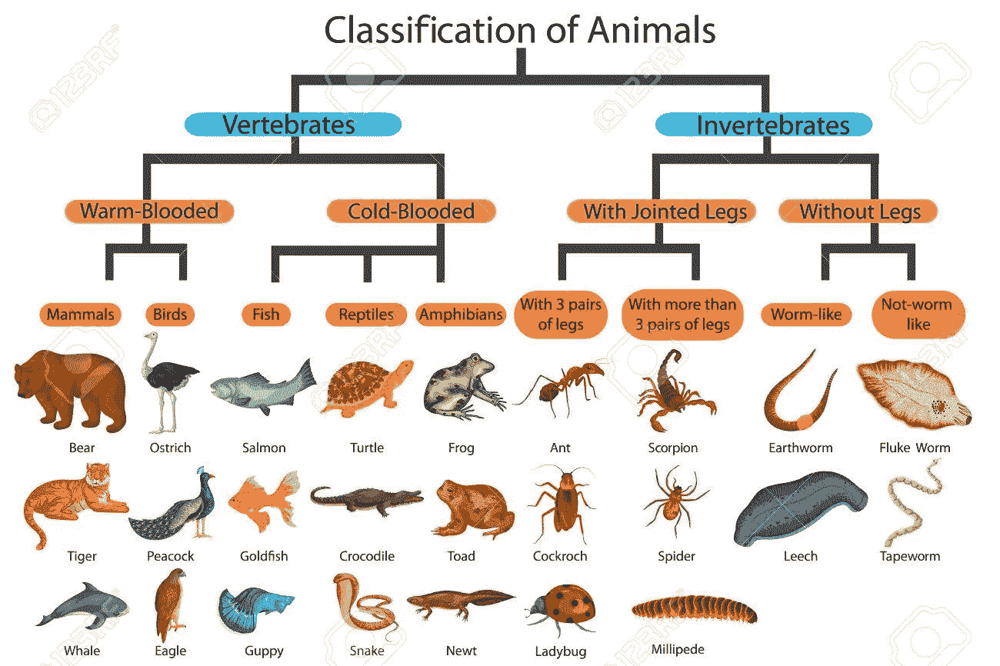
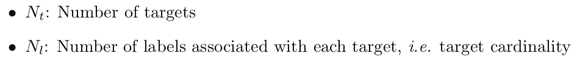
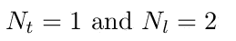
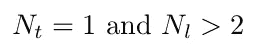
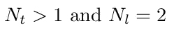
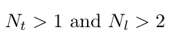
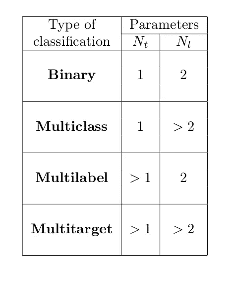

# 对分类进行归类

> 原文：<https://medium.com/analytics-vidhya/classifying-the-classifications-91db4e58fd0f?source=collection_archive---------27----------------------->

## 各种分类问题的介绍

分类是一种流行的监督机器学习方法，它根据可用的特征将一组数据分类成组。它的应用范围很广，如。图像识别、语音识别、医疗诊断、文档分类、垃圾邮件检测等等。然而，这个清单还在不断增加。分类任务的具体“类型”由所考虑的数据集的目标变量决定。当处理一个分类问题时，理解它属于哪个特定的“类型”是极其重要的，否则可能导致完全错误的结果。在这篇短文中，我将讨论您在处理真实世界数据时可能会遇到的不同类型的分类问题。

# 分类类型

在这一节中，我们将看看不同类型的分类。让我们定义两个参数，这两个参数对于定义每种类型都很重要:

**1。二元分类:**

这很可能是最简单的分类任务。在这种情况下，数据实例被分配给通常由 0 和 1 表示的两个组之一。这些 0 和 1 也被称为**标签**，它们一起构成了所谓的**二进制类**。每个数据实例只与一个标签相关联。因此，这种分类具有

二元分类的一个例子可以是针对单一医疗状况*的医疗诊断，例如。疾病(比如标签 1)对无疾病(标签 0)。*

## 2.多类分类:

在这种情况下，与数据实例相关联的标签不需要为 0 或 1，而是可以具有任何值，如 0、1、2、3……这些标签一起形成了一个**多类**。与二进制分类一样，在这里，一个数据实例可以有且只能有一个标签。所以在这种情况下，我们有

根据可能是狗(标签 0)、猫(标签 1)或兔(标签 2)的类型对一组动物图像进行分类是多类分类的一个例子。

## **3。多标签分类:**

在这里，一个数据实例可以同时附加多个标签。然而，标签只能是二进制类型*，即*0 或 1。这告诉我们，在这种分类中，需要处理的目标变量的数量基本上大于 1。因此我们有

基于文章的内容来识别与文章相关联的标签是多标签分类的一个示例，其中文章可以是不同非相同区域之间的重叠，*例如*，政治、体育、经济等等。

## **4。多目标分类:**

人们可以把它看作是多类和多标签分类的概括。这意味着一个数据实例可以有多个标签(类似于 multilabel)，其中每个标签可以取任何值，如 0，1，2，…(类似于 multiclass)。因此，对于这种分类，我们有

假设您想根据水果的类型和颜色对其进行分类。因此，在这种情况下，您有两个目标变量:“类型”和“颜色”。它们中的每一个都可以从一个大小不一定是 2 的有限集合中取值。例如，水果可以是任何类型的，如“苹果”、“香蕉”、“桔子”，也可以是任何颜色的“黄色”、“绿色”、“红色”。这是多目标分类的一个例子。

到目前为止，我们所了解到的情况可以总结到下表中:

# 进一步阅读

要了解如何使用 scikit-learn 解决不同类型的分类问题，您可以参考以下链接:

*   [https://scikit-learn.org/stable/modules/multiclass.html](https://scikit-learn.org/stable/modules/multiclass.html)
*   [https://towards data science . com/journey-to-the-center-of-multi-label-class ification-384 c 40229 BFF](https://towardsdatascience.com/journey-to-the-center-of-multi-label-classification-384c40229bff)
*   [https://medium . com/forward-artificial-intelligence/understanding-multi-label-class ification-model-and-accuracy-metrics-1 B2 A8 e 2648 ca](/towards-artificial-intelligence/understanding-multi-label-classification-model-and-accuracy-metrics-1b2a8e2648ca)