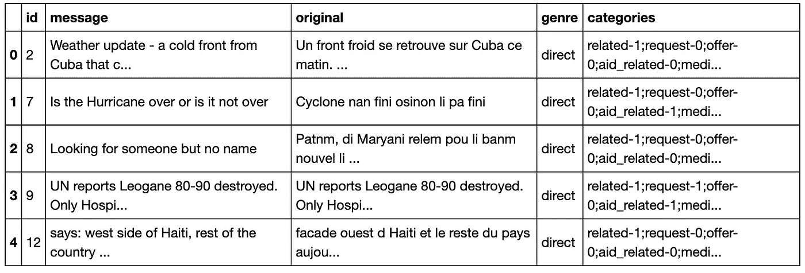
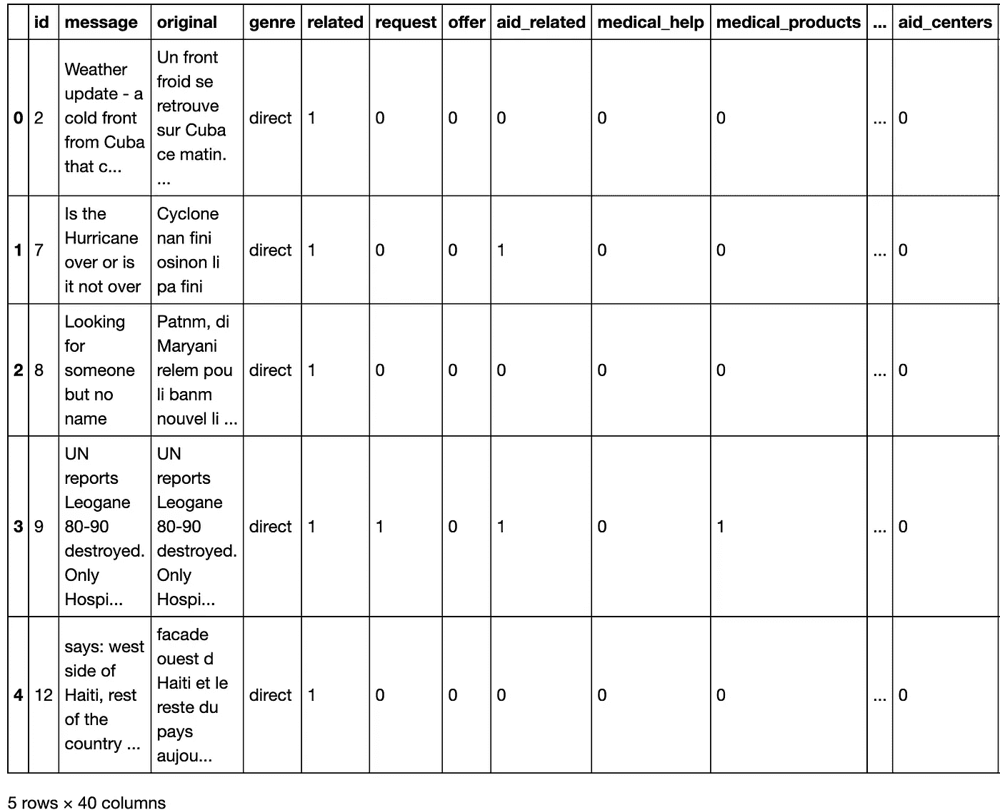

# 通过自然语言处理对 Twitter 灾难响应消息进行分类

> 原文：<https://medium.com/analytics-vidhya/classifying-twitter-disaster-response-messages-f551e9e60c71?source=collection_archive---------25----------------------->


女人坐在棕色混凝土地面旁边的棕色柳条篮子[1]

由于新冠肺炎病毒，我们正面临着一场全球健康危机——这场危机正在杀人，传播人类痛苦，颠覆人们的生活。但这不仅仅是一场健康危机。这是一场人类、经济和社会危机。

在疫情或自然灾害期间，快速响应人们的需求至关重要，这些需求通过各种渠道发送的信息来表达。**使用 NLP 的机器学习算法可以帮助对消息进行分类，以便它们可以被发送到适当的救灾机构**，这些机构负责医疗援助、水、住所、食物、物流等。本文使用由[图八](https://appen.com/)提供的包含在灾难事件期间发送的真实 Twitter 消息的数据集，来为对灾难消息进行分类的 API 建立模型。

该代码分为三个部分:

*   **ETL 管道**:管道读入数据，清理并存储在 SQL 数据库中。该脚本合并消息和类别数据集，将类别列拆分为单独的列，将值转换为二进制，并删除重复的列。
*   **机器学习管道**:使用自然语言处理转换数据，使用 GridSearchCV、RandomForest 训练机器学习模型，将推文背后的信息分为 36 类。
*   **Web 开发:** Flask app 和用于预测结果并显示结果的用户界面。


# ETL 管道

## 加载和合并数据

```
**# import libraries**
import pandas as pd
from sqlalchemy import create_engine**# load messages dataset**
messages = pd.read_csv('messages.csv')
# load categories dataset
categories = pd.read_csv('categories.csv')
# merge datasets
df = messages.merge(categories, on='id')**# Split categories into separate category columns.**
# create a dataframe of the 36 individual category columns
categories_split = df ['categories'].str.split (pat = ';', expand = True)
categories_split.head()
```



在将类别拆分到单独的列之前合并数据集

## 数据清理

```
**# rename the columns of 'categories'** *# select the first row of the categories dataframe*
row = categories_split.iloc [0]
*# use this row to extract a list of new column names for categories.*
category_colnames = row.apply (**lambda** x: x.rstrip ('- 0 1'))
categories_split.columns = category_colnames**# convert category values to 0 and 1** 
**for** column **in** categories_split:
    *# set each value to be the last character of the string*
    categories_split[column] = categories_split[column].str [-1]
    *# convert column from string to numeric*
    categories_split[column] = pd.to_numeric(categories_split[column], errors = 'coerce')***# drop the original categories column from `df`***
df.drop (['categories'], axis = 1, inplace = **True**)***# concatenate the original dataframe with the new `categories` dataframe***
df = pd.concat([df,categories_split], axis = 1, sort = **False**)***# drop duplicates***
df.drop_duplicates(inplace=**True**)
```



## 将数据帧保存在 SQL 数据库中

```
engine = create_engine(‘sqlite:///InsertDatabaseName.db’) df.to_sql(‘InsertTableName’, engine, index=**False**)
```

# **机器学习管道**

## 导入库并从数据库加载数据。

```
*# import libraries*
**import** **nltk**
nltk.download('punkt')
nltk.download('wordnet')
nltk.download('stopwords')
**import** **pandas** **as** **pd**
**from** **sqlalchemy** **import** create_engine
**from** **sklearn.pipeline** **import** Pipeline, FeatureUnion
**from** **sklearn.feature_extraction.text** **import** CountVectorizer, TfidfTransformer
**from** **sklearn** **import** multioutput
**from** **nltk.tokenize** **import** word_tokenize
**from** **nltk.stem.porter** **import** PorterStemmer
**from** **nltk.stem.wordnet** **import** WordNetLemmatizer
**from** **sklearn.feature_extraction.text** **import** TfidfVectorizer
**from** **nltk.corpus** **import** stopwords
**from** **sklearn.ensemble** **import** RandomForestClassifier,AdaBoostClassifier
**from** **sklearn.model_selection** **import** train_test_split
**from** **sklearn.metrics** **import** precision_recall_fscore_support
**import** **re**
**from** **sklearn.metrics** **import** fbeta_score, make_scorer
**from** **sklearn.model_selection** **import** GridSearchCV
**import** **pickle**
```

## 处理文本数据的符号化函数

```
**def** tokenize(text):
    *#normalize text*
    text = re.sub(r"[^a-zA-Z0-9]", " ", text.lower())

    *# stopword list* 
    stop_words = stopwords.words("english")

    *#tokenize*
    words = word_tokenize(text)

    *#stemming*
    stemmed = [PorterStemmer().stem(w) **for** w **in** words]

    *#lemmatizing*
    words_lemmed = [WordNetLemmatizer().lemmatize(w) **for** w **in** stemmed **if** w **not** **in** stop_words]

    **return** words_lemmed
```

**建立机器学习管道**

这个 ML 管道应该将消息作为 36 个类别的输入和输出分类结果。

```
pipeline = Pipeline([
        ('vect', CountVectorizer(tokenizer=tokenize)),
        ('tfidf', TfidfTransformer()),
        ('clf', multioutput.MultiOutputClassifier (RandomForestClassifier()))
        ])
```

# 火车管道

将数据分成训练和测试集以及训练管道

```
X_train, X_test, y_train, y_test = train_test_split(X, y, X_train, X_test, y_train, y_test = train_test_split(X, y, random_state = 22)
*# train classifier*
new_pipeline.fit(X_train, y_train)
```

# 测试您的模型

报告数据集每个输出类别的 f1 分数、精确度和召回率。您可以通过遍历列并在每个列上调用 sklearn 的`classification_report`来实现这一点。

```
y_pred = new_pipeline.predict(X_test)
*# Get results and add them to a dataframe.*
**def** get_results(y_test, y_pred):
    results = pd.DataFrame(columns=['Category', 'f_score', 'precision', 'recall'])
    num = 0
    **for** cat **in** y_test.columns:
        precision, recall, f_score, support = precision_recall_fscore_support(y_test[cat], y_pred[:,num], average='weighted')
        results.set_value(num+1, 'Category', cat)
        results.set_value(num+1, 'f_score', f_score)
        results.set_value(num+1, 'precision', precision)
        results.set_value(num+1, 'recall', recall)
        num += 1
    print('Aggregated f_score:', results['f_score'].mean())
    print('Aggregated precision:', results['precision'].mean())
    print('Aggregated recall:', results['recall'].mean())
    **return** results
#---------------------------------------------------------y_pred_tuned_ada = new_pipeline.predict(X_test)
results_tuned = get_results(y_test, y_pred_tuned_ada)
results_tuned
```

聚合 f_score: 0.940272096531
聚合精度:0.94022097111
聚合召回率:0.94022097

代码可以在这个[库](https://github.com/isakkabir/Disaster-Response-ML-Pipeline)中找到

参考资料:

1.  [https://unsplash.com/photos/iZ2v4FwtMLc](https://unsplash.com/photos/iZ2v4FwtMLc)
2.  [https://www . un . org/development/DESA/dspd/2020/04/新冠肺炎的社会影响/](https://www.un.org/development/desa/dspd/2020/04/social-impact-of-covid-19/)