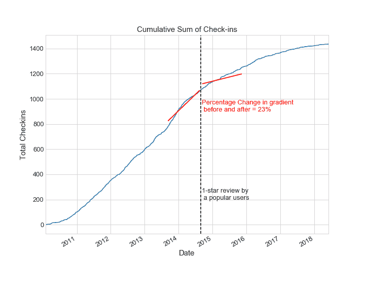
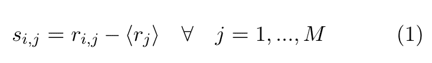
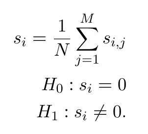
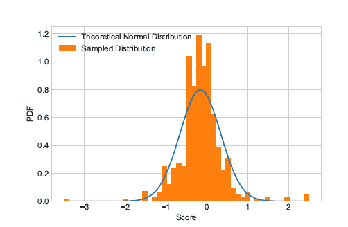
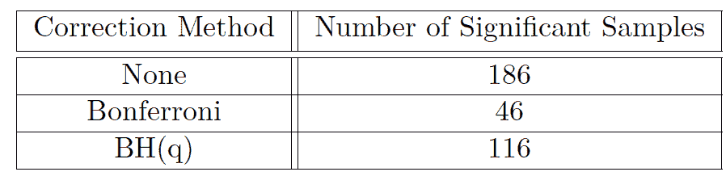
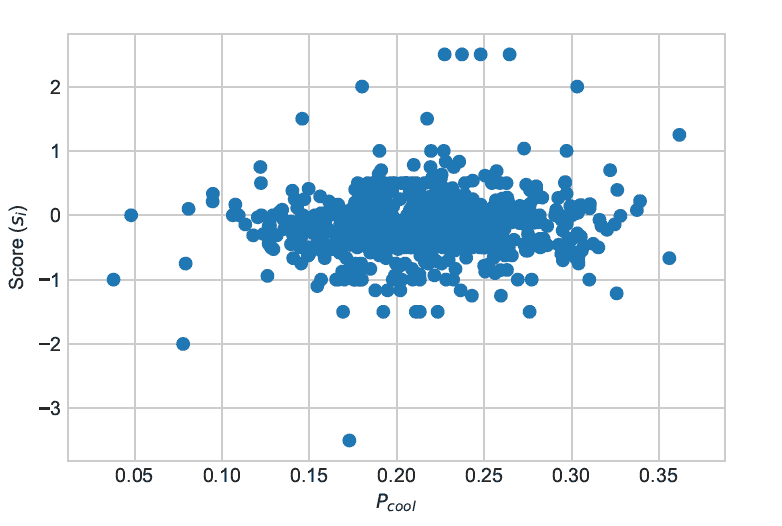
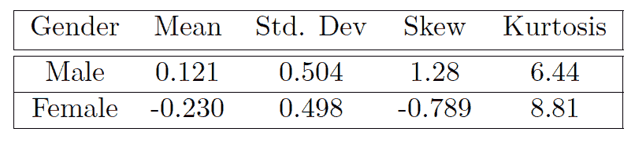

# Yelp 数据集——将用户分为“苛刻”或“宽容”两类

> 原文：<https://medium.com/analytics-vidhya/classifying-yelp-users-as-harsh-or-lenient-e8021a299567?source=collection_archive---------21----------------------->

# 动机

Yelp 数据集是为研究用途发布的数据集合。在这篇文章中，我们关注于使用数据来理解流行用户的影响；拥有大量粉丝并被 Yelp 授予*精英*身份的用户。

毫无疑问，这些受欢迎的用户对其他用户的决策有着深远的影响。然而，受欢迎的用户给予企业的评论或评级可能不反映企业的实际表现。正如社会上的任何意见一样，这些用户在本质上可能过于“苛刻”或“宽容”。

我们将首先设计一种方法来将流行用户分类为“苛刻”或“宽容”，以便其他用户在接受流行用户的话之前有额外的信息，使用来自多个假设测试的工具来确保这些结果的重要性。然后，我们将研究影响流行用户性质的一些属性。

# 受欢迎用户的重要性

流行用户是基于以下标准定义的

*   前 1%的粉丝群
*   连续两年或以上成为精英会员

共有 N = 752 个流行用户。

为了证明这些用户的重要性，我们将重点关注在热门用户发布评论前后τ = 60 天的时间窗口内某个企业的签到次数。

预计在负面评价(1 星评级)后，入住数量会减少，而正面评价(5 星评级)则相反。为此，我们遵循以下方法:

1.  获取发布大众用户评论的日期，t₀
2.  找出(m₀)之前和(m₁)之后的累计签到次数的梯度
3.  计算梯度的变化，δᴾᵒᵖᵘˡᵃʳ
4.  对 5 个正常用户重复上述操作，并找到他们梯度变化的平均值，δᴺᵒʳᵐᵃˡ
5.  在 5%的显著性水平上进行双尾假设检验，其中|h₀:μ=δᴺᵒʳᵐᵃˡ|和|h₁:μ≠δᴺᵒʳᵐᵃˡ|，μ= δᴾᵒᵖᵘˡᵃʳ.
6.  对所有受欢迎的用户评论重复上述步骤。

下面显示了一个例子，在这个例子中，在受欢迎的用户发布了一个糟糕的评级后，梯度就发生了明显的变化。

共有 923 个 1 星或 5 星的流行用户评论，其中 641 个通过了假设检验，为“显著”。因此，我们可以得出结论，69%的 1 星/5 星受欢迎用户评论在 95%的置信区间导致受评论业务的受欢迎程度下降/上升。

# 对流行用户进行分类

我们已经证明了流行用户的评论事实上是重要的。现在，我们将根据定义的标准将这些用户分为“苛刻”或“宽松”。

对于来自用户 *i* 的业务 *j* 的每个评论，分配一个分数

其中 m 是用户 *i* 评论过的餐厅总数，*r*ᵢⱼ*t5】是用户 *i* 给餐厅 *j* 和< *r* ⱼ > 是餐厅*j*的平均评分*

sᵢⱼ < 0 indicates a harsh score and sᵢⱼ > 0 表示宽松的分数。因此，可以取每个用户的所有分数的平均值，并且可以使用该标准对用户进行分类。然而，这些结果的显著性需要检验。相反，我们在 5%的显著性水平上进行双尾 t 检验，以获得 p 值 pᵢ，其中假设为

我们将 sᵢ称为用户 *i* 的平均评级偏差。t 检验假设 sᵢ服从正态分布，这是基于下图的合理假设。此外，当进行 Kolmogorov-Smirnov 检验时，返回的 p 值为 0.027，这意味着 sᵢ可以在 2.5%的显著性水平上用正态分布来描述。

# 多重假设检验

如果我们只测试了一个用户的分数，并得到 pᵢ ≤ 5%，那么我们拒绝零假设，并根据他们的分数对用户进行分类。然而，我们正在测试许多用户对同一数据导致的科学现象 *P-Hacking —* 操纵数据以获得具有统计意义的 P 值*(详见本文* [*文章*](/@i.pamuditha/p-hacking-part-01-introduction-what-is-p-value-7b78d2b3484) *)。这反过来增加了我们数据中假阳性的数量——不正确的重要结果。为了控制假阳性发生的数量，我们可以使用家庭式错误率(FWER)或假发现率(FDR)对此进行校正。*

FWER 是至少一个假发现的概率，因此我们将使用 Bonferroni 的方法来减少假阳性的数量。为了实现这一点，当 pᵢ≤α/ν时，零假设被拒绝，其中α是 5%显著性区间。可以看出，当我们有大的 N(大量测试)时，这个条件变得更加严格，我们最终会拒绝真阳性。这将显示在结果中。

为了解决拒绝真阳性的问题，我们可以使用限制较少的 FDR 标准来控制 1 型错误。为此，我们遵循 BH(q) (Benjamini-Hochberg 程序)。该过程如下

1.  按升序对 p 值进行排序
2.  找出最大的 p 值，使得 pᵢ≤q * I/ν
3.  剔除 p 值 *1，…，i*

这些不同的修正方法会对用户进行不同的分类。

# 探索用户属性

最后，我们将探索这些用户的一些属性。这将基于其他用户对一个受欢迎的用户给出的所有评论的反应，而这些评论又是由反应给出的；可爱的，有趣的，朴素的，作家的，火辣的，酷的。对于这些属性，这些值都被转换为概率，即用户 *i* 在其评论中获得“酷”反应的概率是多少。例如，如果用户对他们的评论有总共个 Rᵗᵒᵗᵃˡ反应，其中 Rᶜᵒᵒˡ是“酷”反应，则该用户的值为 Pᶜᵒᵒˡ = Rᶜᵒᵒˡ/Rᵗᵒᵗᵃˡ.所有反应的 P 之和应该等于 1。这些属性中的每一个与每个用户的平均评级偏差 sᵢ的相关性将通过执行回归分析来计算。

最后一个属性是流行用户的性别。Yelp 数据集不包含性别，而是使用 Python 上的 *genderize* 包根据用户的姓名来猜测性别。对此的分析将基于前四个时刻。

# 评估结果

不出所料，Bonferroni 方法在拒绝假设方面被证明是非常严格的。事实上，有| sᵢ > 1 |的用户(他们对企业的评级偏离平均企业评级超过 1 星)不会被拒绝。因此，在本例中，Bonferroni 方法大大减少了假阴性的数量，但代价是拒绝了更多的真阳性。使用 BH(q)校正进行多重假设检验被证明是一种较好的方法。我们可能会发现一些错误的发现，但只要大多数是正确的，这在这种情况下应该不是问题。

当绘制 p 对 sᵢ的每个反应时，趋势如下图所示，证明其他用户对受欢迎用户的评论的反应与受欢迎用户是严厉还是宽容之间没有关系。然而，这可能是因为所有的评论反应都是积极的。有一些负面反应会透露更多信息。

接下来我们来看看性别的影响。表 2 中显示的 4 个矩表明存在某种关系。总的来说，女性在评论时似乎比男性更苛刻。这可以从男性和女性的平均和偏斜的相反符号中具体看出。

为了进一步研究这个问题，我们建立了一个逻辑回归模型来预测用户是男是女，这取决于他们的评级与真实业务评级的偏差(sᵢ).该模型的样本内准确率为 66%，样本外准确率为 68%；证明这可能是进一步研究的一个有趣领域，特别是调整机器学习模型以改善该测试的结果。

摆弄 Yelp 数据集是发展你的数据分析技能的好方法。我强烈推荐下载数据集，玩玩看能不能得出什么有趣的结论。