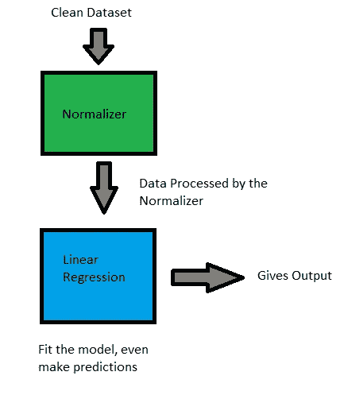

# 使用 Sklearn 管道清理数据科学工作流

> 原文：<https://medium.com/analytics-vidhya/clean-data-science-workflow-with-sklearn-pipeline-2b648634b29f?source=collection_archive---------11----------------------->

管道是步骤的容器，它们用于打包工作流并将模型放入单个对象中。流水线堆叠在彼此之上，从一个块获取输入，将输出发送到下一个块，下一个块获取输入并给出输出。就这么简单！

想象一下，有一个包含两个步骤的管道(I)规格化器和(ii)线性回归模型。数据将首先被传递到规格化器块，规格化器块将转换数据并将其发送到线性回归模型，线性回归模型将利用规格化器块的数据拟合模型。然后，线性回归可以训练模型并进行预测。*使用管道时，数据源保持不变，数据转换更改在内存中完成，因此数据源保持不变。*



两步流水线

通过以 **((name，task()))** → **(('Norm '，Normalizer())** 或**(' LR '，LinearRegression())** 的形式传递元组列表来初始化管道。管道可以执行的一些基本步骤:

1.  变压器

transformation(x，[y])对 X 应用变换

2.估计量

fit(X，Y)根据数据拟合模型对象

3.预言

predict(X_test)预测结果

```
#importing libraries
from sklearn.datasets import load_boston
from sklearn.preprocessing import StandardScaler
from sklearn.decomposition import PCA,KernelPCA
from sklearn.ensemble import RandomForestRegressor
from sklearn.model_selection import cross_val_score,GridSearchCV
from sklearn.metrics import mean_squared_error
from sklearn.pipeline import Pipeline
from sklearn.pipeline import FeatureUnion
import pandas as pd
import numpy as np
```

1.  **变换、估计和预测**

例如，我将使用**波士顿数据集**。第一步，我们将使用 **StandardScaler** 转换数据，然后将数据放入 **RandomForestRegressor** 中。最后一步，我们将把模型传递到**交叉值得分**。

```
X=load_boston()
df=pd.DataFrame(X.data,columns=X.feature_names)
y=X.target**#initializing and defining a Pipeline** pipe=[] 
pipe.append(('SC',StandardScaler()))
pipe.append(('rfr',RandomForestRegressor(n_estimators=200)))
model=Pipeline(pipe)**#cross val score** cv_results = cross_val_score(model, df, y, cv=5)
msg = "%s: %f (%f)" % ('Pipeline', cv_results.mean(), cv_results.std())
print(msg)
```

我们可以根据需要在流水线中增加 n 个步骤。让我们将 **PCA** 添加到**标准定标器**和**随机森林**之间的管道中。

```
pipe=[]
pipe.append(('SC',StandardScaler())) #step 0
pipe.append(('pca', PCA(n_components=8))) #step 1
pipe.append(('rfr',RandomForestRegressor())) #step 2
model=Pipeline(pipe)
```

我们可以使用 **model.steps[0]** 来访问管道的单独步骤

我们可以使用 **model.named_steps** 访问管道的所有步骤

**2。带管道的网格搜索 CV**

GridSearchCV 作为 pipeline 的一部分可以让你避免编写大量不需要的代码，如果你想在项目中执行多个超参数调优，Pipeline 会非常有用。根据上面创建的管道示例，我们可以执行两个超参数搜索(i)PCA 和(ii) RandomForestRegressor。

```
# defining the params for hyper-parameters
params = dict(pca__n_components=[2, 5, 10],
                  rfr__n_estimators=[100,200,300,400],
                  rfr__max_depth=[2,4,6,8,10])#Grid Search CV
gcv=GridSearchCV(model,param_grid=params,n_jobs=-1).fit(df,y)gcv.best_params_
**{'pca__n_components': 10, 'rfr__max_depth': 8, 'rfr__n_estimators': 200}**
```

3.特征联合


特征联合是将几个转换器的输出连接成一个的水平管道。在拟合过程中，每一个都独立地拟合到数据。转换器并行应用，它们输出的特征矩阵并排连接成一个更大的矩阵。我们可以使用 **PCA** 和**内核 PCA** 来转换数据，并获得两种分解的混合输出。

```
pipe=[]
pipe.append(('kernel_pca',KernelPCA(n_components=5)))
pipe.append(('pca',PCA(n_components=5)))
model=FeatureUnion(pipe)model.fit(df,y).shape
**(506, 10)**
```

结果是来自 PCA 的 5 个分量和来自内核 PCA 的 5 个分量的组合，连接成一个。我们可以尝试任何数量的组合，如[PCA，SelectKBest]最好的部分是代码将看起来干净和像样。如果你想取出一个零件并用其他零件替换它，这是非常模块化的。查看这个[链接](https://scikit-learn.org/stable/auto_examples/compose/plot_feature_union.html#sphx-glr-auto-examples-compose-plot-feature-union-py)，了解更复杂的管道示例。

管道的优势:

*   好写。写一次，用多次。
*   容易交换棋子。
*   不乱，干净，像样。
*   将所有中间步骤放在一起。