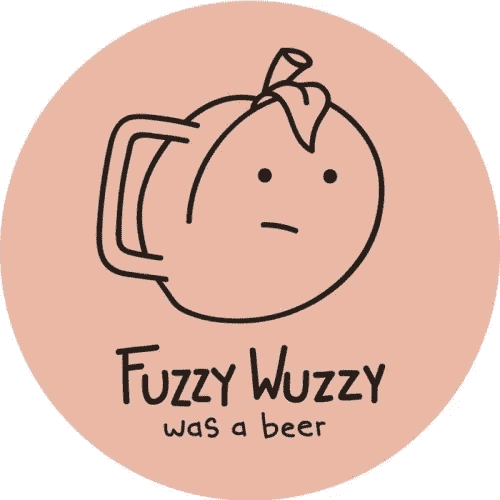
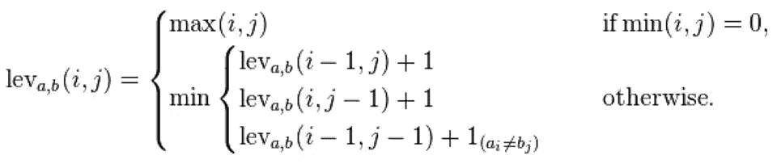
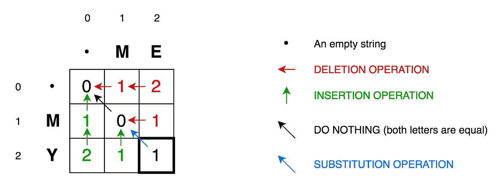
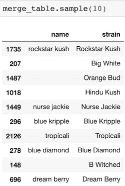
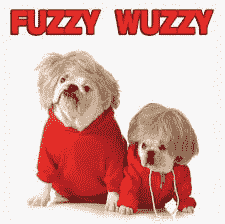

# 与 FuzzyWuzzy 的干净搭配

> 原文：<https://medium.com/analytics-vidhya/clean-matching-with-fuzzywuzzy-c19bb8a9f197?source=collection_archive---------14----------------------->

## Python 中使用 Levenshtein 距离的字符串匹配



很接近，但是没有雪茄

Python 配备了多种方法来处理字符串和整体语言(cue 自然语言处理)中的不一致，以将单词矢量化并转换为可用的格式进行分析。使用诸如。upper()，。title()，。strip()，。替换()等。可用于格式化文本，匹配两个相似的字符串变得非常简单。然而，Python 一次又一次地向我证明，几乎总有一种更简单的方法可以解决这种疯狂——或者接收错误消息。

这是我发现这个模糊不清的包裹的地方。当试图合并两个具有不同名称的数据帧时，这些数据帧大多相关但不完全相关，我最终耗尽了不同类型的连接和串联，以及数小时的头脑清醒，只是试图不丢失大多数不能直接匹配的行。与熊猫的结合比与 FuzzyWuzzy 的结合更具气质，FuzzyWuzzy 允许你设置你想要匹配的两条弦之间的最小距离的阈值。

这个距离以数学家 Vladimir Levenshtein 的名字命名，它计算将一个字符串直接更改为另一个字符串所需的字符编辑次数。两个字符串之间的距离由索引位置和从一个索引移动到另一个索引所需的计算成本来量化。



要理解 Levenshtein 距离算法的实现:

```
import numpy as npdef levenshtein_ratio_and_distance(s, t, ratio_calc = False): “”” levenshtein_ratio_and_distance:
 Calculates levenshtein distance between two strings.
 If ratio_calc = True, the function computes the
 levenshtein distance ratio of similarity between two strings
 For all i and j, distance[i,j] will contain the Levenshtein
 distance between the first i characters of s and the
 first j characters of t
 “”” # Initialize matrix of zeros 
 rows = len(s)+1
 cols = len(t)+1
 distance = np.zeros((rows,cols),dtype = int)# Populate matrix of zeros with the indices of each character of both strings
 for i in range(1, rows):
 for k in range(1,cols):
 distance[i][0] = i
 distance[0][k] = k# Iterate over the matrix to compute the cost of deletions, insertions and/or substitutions 
 for col in range(1, cols):
 for row in range(1, rows):
 if s[row-1] == t[col-1]:
 cost = 0 
# If the characters are the same in the two strings in a given position [i,j] then the cost is 0 else:
 # In order to align the results with those of the Python Levenshtein package, if we choose to calculate the ratio
 # the cost of a substitution is 2\. If we calculate just distance, then the cost of a substitution is 1.
 if ratio_calc == True:
 cost = 2
 else:
 cost = 1
 distance[row][col] = min(distance[row-1][col] + 1, # Cost of deletions
 distance[row][col-1] + 1, # Cost of insertions
 distance[row-1][col-1] + cost) # Cost of substitutions
 if ratio_calc == True:
 # Computation of the Levenshtein Distance Ratio
 Ratio = ((len(s)+len(t)) — distance[row][col]) / (len(s)+len(t))
 return Ratio
 else:
 # print(distance) # Uncomment print(distance) if you want to see the matrix showing how the algorithm computes the cost of deletions, insertions and/or substitutions# This is the minimum number of edits needed to convert string a to string b
 return “The strings are {} edits away”.format(distance[row][col])
```

使用这个函数时，我们可以确定与两个字符串之间的 Levenshtein 距离相关的值，以及进行直接匹配所需的编辑次数。

```
print(levenshtein_ratio_and_distance('3 Bears OG','Three Bears og'))
print(levenshtein_ratio_and_distance('3 Bears OG','Three Bears og', ratio_calc=True))The strings are 7 edits away
0.5833333333333334
```

取消对上述函数的 ***print*** *(距离)*部分的注释会返回一个矩阵，该矩阵直观地解释了匹配字符串的计算成本。右下角的数字表示匹配字符串所需的编辑次数，每个水平和垂直相邻的值分别表示插入和删除。如果行/列中的两个字符不匹配，对角相邻值的代价可以是 1，如果匹配，代价可以是 0。每个单元旨在最小化计算差异的本地成本。下面，我们有字符串“3 Bears OG”和“3 Bears OG”之间的字符差异矩阵。

```
[[ 0  1  2  3  4  5  6  7  8  9 10 11 12 13 14]
 [ 1  1  2  3  4  5  6  7  8  9 10 11 12 13 14]
 [ 2  2  2  3  4  5  5  6  7  8  9 10 11 12 13]
 [ 3  3  3  3  4  5  6  5  6  7  8  9 10 11 12]
 [ 4  4  4  4  3  4  5  6  5  6  7  8  9 10 11]
 [ 5  5  5  5  4  4  5  6  6  5  6  7  8  9 10]
 [ 6  6  6  5  5  5  5  6  7  6  5  6  7  8  9]
 [ 7  7  7  6  6  6  6  6  7  7  6  5  6  7  8]
 [ 8  8  8  7  7  7  6  7  7  8  7  6  5  6  7]
 [ 9  9  9  8  8  8  7  7  8  8  8  7  6  6  7]
 [10 10 10  9  9  9  8  8  8  9  9  8  7  7  **7**]]
```



红色的 1 表示需要 1 次操作来将 M 变成空字符串

漂亮但冗长，所以让我们通过安装和导入 Levenshtein 包来使它变得更加简单。

```
pip install python-Levenshtein==0.12.0import Levenshtein as levlev.distance('3 Bears OG','Three Bears og') = 7
```

Levenshtein 包返回匹配字符串所需的编辑次数，而不是调用距离函数时两者之间的实际距离。为了将从距离中获得的值投入使用，我们将 fuzzywuzzy 应用于我们的字符串或字符串列表，以收集相关的术语。Fuzzywuzzy 通过其 ratio 函数利用 Levenshtein 距离来计算两个字符串之间的字符差异。

```
pip install fuzzywuzzyfrom fuzzywuzzy import fuzz # Create a function that takes two lists of strings for matching
def match_name(name, list_names, min_score=0):
    # -1 score incase we don't get any matches
    max_score = -1
    # Returning empty name for no match as well
    max_name = ""
    # Iterating over all names in the second list
    for name2 in list_names:
        #Finding fuzzy match score
        score = fuzz.ratio(name, name2)
        # Checking if we are above our threshold and have a better score
        if (score > min_score) & (score > max_score):
            max_name = name2
            max_score = score
    return (max_name, max_score)
```

上述函数旨在从不同的数据帧中获取各种名称，以便基于相似性合并到一个数据帧中。对于我的特殊用途，我输入各种大麻品种的名称，以匹配不同网站文本中的偏差。例如，如上所述，菌株 3 Bears Og 出现在我参与的项目的所有三个数据框架中，但在不同的数据库中被写成“3 Bears OG”和“3 Bears Og ”,由于大写和拼写的差异，这在合并时产生了错误。

```
# List for dicts for easy DataFrame creation
dict_list = []
# iterating over df with more strains
for name in df1.strain:
    # Use our method to find best match, we can set a threshold here
    match = match_name(name, df3.name, 80)

    # New dict for storing data
    dict_ = {}
    dict_.update({"strain" : name})
    dict_.update({"name" : match[0]})
    dict_list.append(dict_)

merge_table = pd.DataFrame(dict_list)
```

上面的代码不包括两个字符串之间的距离得分，但这可以通过更新用匹配值创建的字典很容易地显示出来，这将在 DataFrame 中显示为一个新列。仅显示第一个匹配，如 *match[0]所示。*



匹配字符串的示例

在这里，我们可以看到具有小写值的菌株与标题案例中的菌株相匹配，而没有进行任何文本预处理。类似地，在计算蓝色的梦是否和蓝色的梦最相似时，撇号也被赋予了一个权重。

FuzzyWuzzy 可以与 NLP 一起使用，以改进分类变量在数据科学和分析的各个方面的使用。在它最简单的形式中，这只是一种有趣的方式，看看需要做多少工作才能使两个字符串相同。

