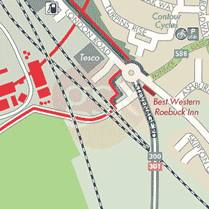

# 旅游信息分析

> 原文：<https://medium.com/analytics-vidhya/clean-up-travel-information-3a818f7c5af?source=collection_archive---------11----------------------->

GSK 地图

## **探索数据集。**

人的一生应该是在探索和实践的道路上，不管怎么探索和实践。旅游是最好的方式之一。虽然我还是个大学生，但是人生阅历并不丰富。但是每当假期来临，我会和我的父母或朋友一起去旅行。即使不是假期，我们都在路上。在我心目中，旅行只是一种放松的方式，很少用实际的数据和技术去进一步探索。我在 open MV 数据集上找到了这个 CSV 文件，其中有一些缺失的数据，这些数据是关于一个每天开车时使用应用程序跟踪 GPS 坐标的司机的。该应用程序收集位置和高度数据。数据集总结了大约 200 次旅行的数据。粗略的看了一下这个数据，我有一个疑问:旅行的目的地和日期与距离和速度有关吗？

## **清理丢失的数据！**

从读取的 CSV 代码中，我们可以清楚地看到这个文件中有 205 行 13 列数据。

然后，我又用 value_counts 统计了一遍原始数据。有两个端点，GSK 和 home。由于我们的数据是计算司机上班的路线和数据，这里只有五天，周一到周五。

我们整体数据清理的下一步是使用 isnull()来检查哪些行/列缺少数据。它显示这里只有“comments”和“FuelEconomy”列包含一些空白数据。

因为我注意到在数据集的标注中，FuelEconomy 一栏的数据不准确。为了避免最后一个偏差，我删除了这一栏中缺失的数据。此外，我注意到“comments”一栏有许多缺失的空白数据，我用 fillna 填写了这些数据。再次使用 isnull()检查应该没有更多要清理的数据。

# **重塑数据，使之可视化。**

在清理完所有丢失的数据后，我决定让我的数据可视化更加直观。所以让我们试着重塑他们吧！我使用 set_index 将一些可能用到的列放在一起。除此之外，我还使用了 unstack 来单独处理 endpoint 列。

## **调查结果**！

这使得我们可以使用 seaborn 来创建一个图像，显示驾驶员要去的地方以及离终点的距离。这是一个非常有趣的方向，人们倾向于住在离工作更远的地方。远离城市的房子不仅价格上有优势，居住条件也能得到很大改善。另一件事是，无论你开车到哪里，速度都没有太大的差异，只是一些低于平均水平的数据，和你开车回家时高于平均水平的数据。一般来说，司机保持稳定的速度，这是一个非常好的迹象——他们没有超速。

最后真正有意思的是，从图中可以看到，周一和周五的车速比其他三天慢，这也符合现实情况——周一和周五的驾驶高峰更严重。

