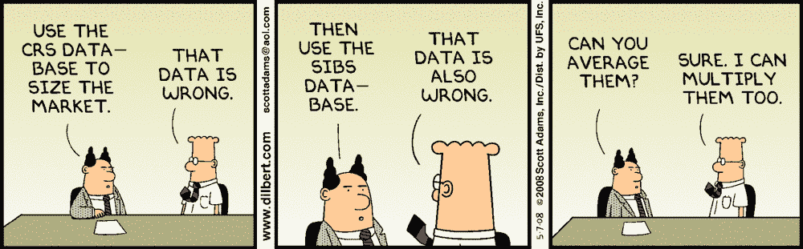

# 清理和理解多元时间序列数据

> 原文：<https://medium.com/analytics-vidhya/cleaning-and-understanding-multivariate-time-series-data-6554eefbda9c?source=collection_archive---------0----------------------->

## 时间序列预测世界入门指南！

无论分配给哪种数据科学项目，理解数据集并对其进行清理始终是成功的关键。第一步是使用探索性数据分析(EDA)来理解数据，因为它有助于我们创建逻辑方法来解决…