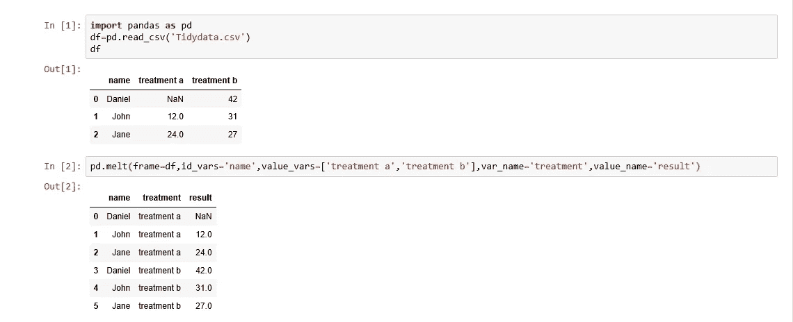
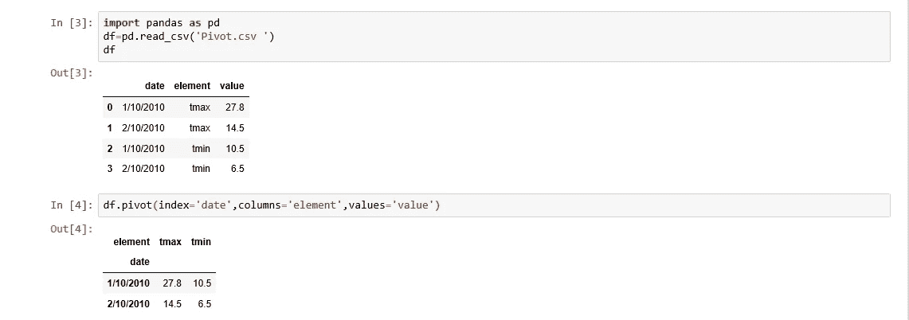
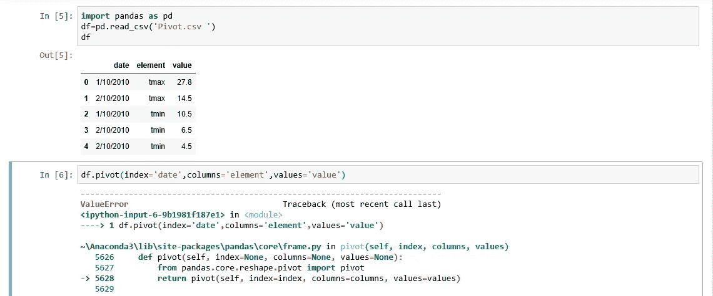
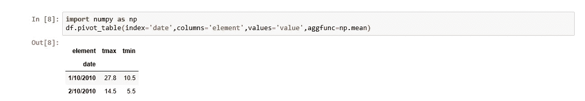

# 在 Python 中清理数据

> 原文：<https://medium.com/analytics-vidhya/cleaning-data-in-python-edfe6395ef77?source=collection_archive---------8----------------------->

在本教程中，我们将利用 Python 的 Pandas 和 NumPy 库来清理数据。清理数据时有多种情况，以下是其中一些情况:

*   不一致的列名
*   缺失数据
*   极端值
*   重复行
*   懒散的
*   需要处理列
*   列类型发出意外值的信号

# ***使用数据框时的基本步骤:***

读取 csv 文件并加载到数据帧 df : `df=pd.read_csv(“”)`

目测第一个和最后 5 个数据帧: `df.head(),df.tail()`

`df.columns`:返回列的索引。

`df.shape`:返回数据的行数和列数。

`df.info(*)*`:获取数据帧的附加信息。

列值的频率计数:`df.columnname.value_counts(dropna=False)`

# **整理数据含义:**

形式化我们描述数据形状的方式。

当格式化我们的数据时，它给我们一个目标。

在数据集中组织数据值的标准方式。

**整理数据的原则:**

该列表示一个单独的变量。

一行代表单独的观察。

观察单元形成表格。

*数据问题我们正在修复*:包含值而不是变量的列。

*解决方案* : `pd.melt()`



**数据旋转**:

不熔化:与熔化相反。

在融化中，我们把列变成了行。

旋转-将唯一值转换成单独的列。

分析友好数据形状以报告友好数据形状。



当存在重复条目时，在旋转时，我们会得到一个错误，所以我们需要使用 pivot_table 来代替它。



# **连接数据:**

数据可能不总是以大文件的形式出现，更容易存储和共享。

重要的是结合，然后清洁。

`result_dataframe=pd.concat([dataframe1,dataframe2])`

result_dataframe 将在 concat 后保留两个数据帧的原始索引，因此它将包含重复项。要解决此问题，我们需要使用以下命令重置索引。

`result_dataframe=pd.concat([dataframe1,dataframe2],ignore_index=True)`

默认情况下，它将按行连接数据帧，用于按列连接数据帧添加参数 axis=1。

*问题:*数据集少的话可以单独加载，但是数据集成千上万怎么办？

*解决方案:* glob 函数根据模式查找文件。

*-文件名的模式匹配*

*   *通配符:*？任何 csv 文件= *。csv，任意单个字符=file_？。战斗支援车*
*   *返回文件名列表。*
*   *我们可以使用这个列表加载到一个单独的数据帧中。*

**导入全球**

```
*csv_files=glob.glob(‘*.csv’)list_data=[]for filename in csv_files:data=pd.read_csv(filename)list_data.append(data)*
```

# ***合并数据:***

*类似于 SQL 中的连接表。*

*基于公共列组合不同的数据集。*

```
*Merged_frame=pd.merge(left=left_dataframe,right=right_dataframe,on=None,left_on=’left_df_columnname’,right_on=’right_df_columnname’)*
```

****合并类型:****

*一对一*

*多对一*

*多对多*

# ***数据类型:***

**命令是* `print(df.dtypes)`*

*有时我们可能想从一种类型转换到另一种类型。*

*`df[‘column_name’]=df[‘column_name’].astype(str)`*

****分类数据:****

*将分类数据转换为“类别”数据类型。*

*它可以使数据帧在内存中变小。*

*其他 python 库可以利用它进行分析。*

# ***清理字符串的正则表达式:***

**字符串操作:**

*许多内置和外部库。*

*正则表达式的 re' library。*

**模式匹配:**

**例子:**

*数字->正则表达式*

*17--> \ d **

*$ 17--> \ $ \ d **

*$17.00 -> \$\d*\。\d**

*$ 17.89--> \ $ \ d * \。\d{2}*

# ***重复数据:***

*会扭曲结果。*

*我们可以使用' drop_duplicates()方法删除重复数据。*

*`dataframe=dataframe.drop_duplicates()`*

# ***缺失数据:***

*允许的操作- 1)保持原样 2)删除它们 3)填充缺少的值*

*删除缺少的值-在 dataframe 上使用 dropna()方法。*

*`dataframe=dataframe.dropna()`*

*填充缺少的值-使用 fillna()方法来填充值。*

*1)用提供的值填充*

*`dataframe[‘col_name’]=dataframe[‘col_name’],fillna(‘Value’)`*

*2)使用汇总统计*

*`mean_val=dataframe[‘col_name’].mean()`*

*`dataframe[‘col_name’]=dataframe[‘col_name’].fillna(mean_val)`*

****谢谢，下篇见！！****