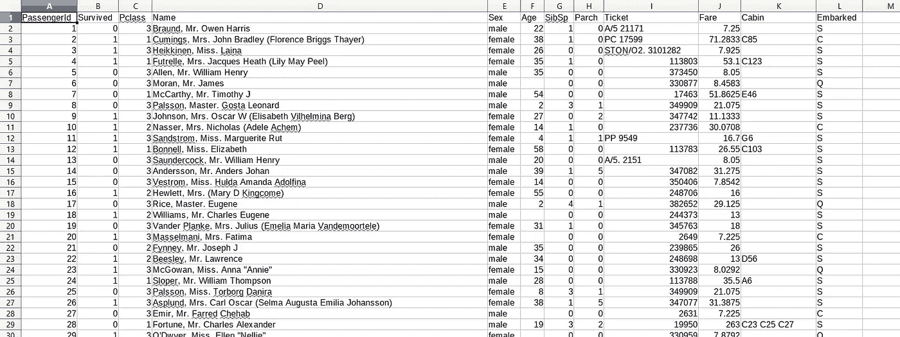

# 清理泰坦尼克号数据集[第 1 天-# 30 日]

> 原文：<https://medium.com/analytics-vidhya/cleaning-the-titanic-dataset-day-1-30daysofml-5cc19294176b?source=collection_archive---------3----------------------->

## *导入、清理、缩放和理解数据。*


照片由[米卡·鲍梅斯特](https://unsplash.com/@mbaumi?utm_source=medium&utm_medium=referral)在 [Unsplash](https://unsplash.com?utm_source=medium&utm_medium=referral) 上拍摄

我们正在使用来自 Kaggle 的 Titanic 数据集，这是数据科学的 hello-world。先决条件是对编程语言如何工作有所了解，对统计学及其术语有基本的理解，以及足够的热情。

点击从[下载数据集。](https://www.kaggle.com/c/titanic)

**理解数据集**

数据集看起来像这样。



我知道数据集有两个文件，但不要太担心，测试和训练用于不同的目的，我将很快解释，但现在，我们必须清理两个数据集。

还有 **PassengerID** :这只是给每个乘客的唯一 ID。

还有**活了下来:**这是一个布尔值，0 代表死亡，1 代表他们还活着。老实说，对于数据科学入门来说，这似乎有点病态。

接下来是 **Pclass:** 这位乘客坐在几等舱？1，2 或 3。

Sibsp 指船上兄弟姐妹或配偶的数量..

同样， **Parch** 表示船上父母或子女的数量。

**上船**是上船的地点，船从哪里上船或停在哪里，什么人什么时候上船。C =瑟堡；Q =皇后镇；S =南安普敦

**车票**是票号，**年龄、性别、姓名**是给定的，**舱位**是舱位号。现在，让我们编码。

这里有一个简单但有效的清理数据集的方法。

导入测试和训练(稍后您将理解测试和训练的重要性)

```
#Import the titanic datasettest<-read.csv(file=”D:/titanic_kaggle/test.csv”)train<-read.csv(file=”D:/titanic_kaggle/train.csv”)
```

添加了一个名为“isTrain”的列。这是因为我正在连接这两个数据集。我可以只运行函数两次，但是我很懒！

```
#Add a column called istrain to help separate test and train datatest$istrain<-FALSEtrain$istrain<-TRUE
```

添加了一个名为“Survived”的列进行测试，因为我们需要相同数量的列来运行下一个 *rbind* 函数。我们在每一行都输入了一个 Nulltype 值，因为在预测之后，我们无论如何都会替换那个值(稍后会有更多的介绍！)

```
#Add column to test
test$Survived<-NA#Join the datasets together
full<-rbind(train,test)
```

我们用“S”替换“已装船”列中的空行，这不会有太大的区别。

```
#When we do print(titanic.full$Embarked=’’) it will print TRUE for all the NULL values of the Column Embarked.
#So what we want to do now is get rid of the Null values#As they mess with the process of visualisation and prediction 
#Now Let’s go ahead and replace the missing values with dummy valuesfull[full$Embarked==’’,”Embarked”]<-’S’summary(full$Embarked)
```

我们现在用中间值代替年龄和票价的空行。

```
#Let’s do the same for age and Fare now!#We fill missing values with median since that will not mess up final median
summary(is.na(full$Age))full[is.na(full$Age),”Age”]<-median(full$Age,na.rm=TRUE)full[is.na(full$Age),”Age”]<-median(full$Age,na.rm=TRUE)
```

我们将各自的测试和训练数据集放回数据集中(末尾的逗号实际上是 R 的一个怪癖)。

```
train<-full[full$istrain==TRUE,]test<-full[full$istrain==FALSE,]
```

**复制代码的依据:**

[https://gist . github . com/AbhinavMir/644 D5 CFB 6 dafe 7 f 351 c 54 b 38 CFC 44545 # file-data cleaning-r](https://gist.github.com/AbhinavMir/644d5cfb6dafe7f351c54b38cfc44545#file-datacleaning-r)

**推荐 YouTube 视频:**

【https://www.youtube.com/watch?v=Zx2TguRHrJE 