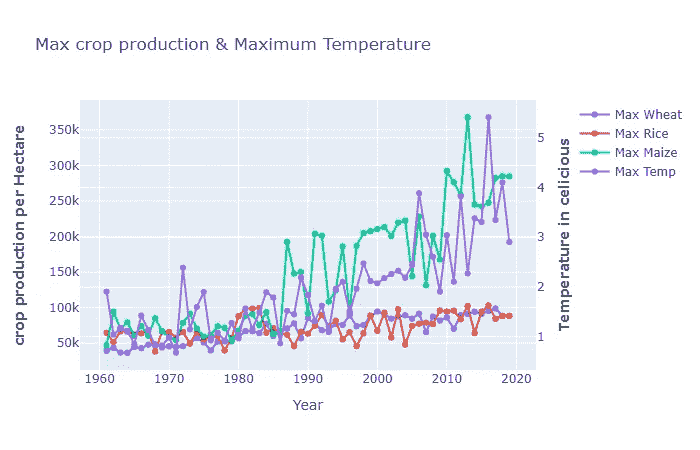
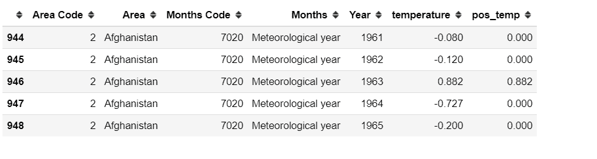
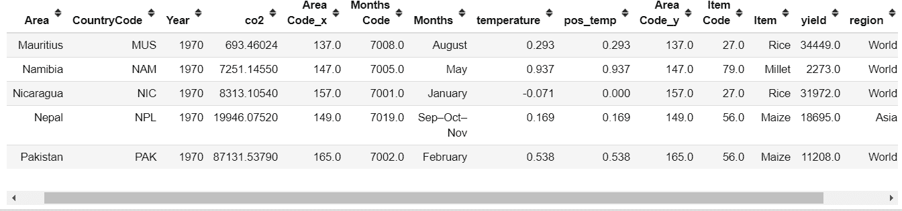
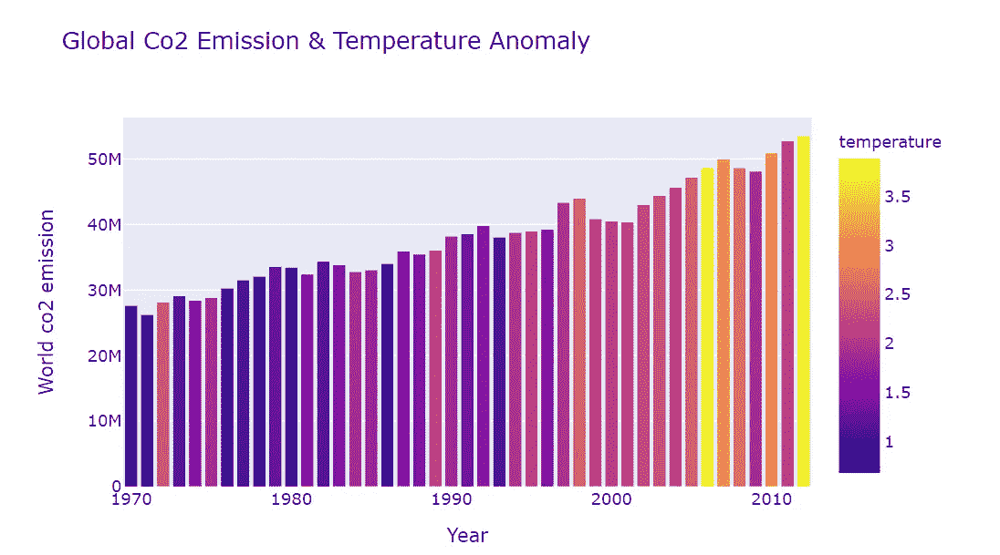

# 用 Plotly 实现气候变化可视化

> 原文：<https://medium.com/analytics-vidhya/climate-change-visualization-with-plotly-99905ae8d3bf?source=collection_archive---------13----------------------->


[来源](https://www.google.com/search?q=global+warming+&tbm=isch&ved=2ahUKEwiLzrvqz4bpAhX0hHIEHZBFBRMQ2-cCegQIABAA&oq=global+warming+&gs_lcp=CgNpbWcQAzIECCMQJzICCAAyAggAMgIIADICCAAyAggAMgIIADICCAAyAggAMgIIAFCPFFiGGGCbIGgAcAB4AIABOIgBlAGSAQEzmAEAoAEBqgELZ3dzLXdpei1pbWc&sclient=img&ei=ysWlXovBJfSJytMPkIuVmAE&bih=888&biw=1920&rlz=1C1CHBF_enUS714US714#imgrc=UmCdj533FPpH4M)

气候变化是人类面临的最紧迫的挑战之一，农业深受其影响。农民尤其受到极端天气条件的影响，包括干旱、酷热、洪水和其他变化的气候趋势。我很好奇气候变化对农作物产量的影响，并决定以此为主题做我的顶点项目。对于这篇博客，我将使用[粮农组织的全球作物产量](http://www.fao.org/faostat/en/#data/QC)数据集和 Plotly 进行可视化。

Plotly Python 库( [plotly.py](https://plotly.com/python/) )是一个交互式、[开源](https://github.com/plotly/plotly.py)绘图库，支持 40 多种独特的图表类型，涵盖了广泛的统计、金融、地理、科学和三维用例，构建于 Plotly JavaScript 库( [plotly.js](https://plotly.com/javascript/) )之上，plotly.py 使 Python 用户能够创建漂亮的交互式基于 web 的可视化，可以在 Jupyter 笔记本中显示，保存到独立的 HTML 文件中，或作为

# 装置

plotly.py 可以使用 pip 安装

`pip install plotly==4.6.0`

`conda install -c plotly plotly=4.6.0`

# Plotly 组件

Plotly 中的主要组件是轨迹、数据和布局。

**轨迹**是要绘制的数据参数的字典，以及关于颜色和线型的信息。

**数据**由图表中的图表列表组成，其中每个图表称为一个轨迹。

**布局**形成剧情的观感。包括背景、网格、字体等。所有的组成部分在被输入到一个 Plotly 函数时都会产生必要的交互图形。

开始我们的可视化首先我们需要导入 Plotly。

```
*from plotly.offline import iplot**import plotly.graph_objects as go*
```

让我们看看同一轴上最高作物产量和最高温度异常之间的关系。类似于分剧情。我们可以很容易地做到这一点，只需将“secondary_y”子情节选项设置为 True。

```
from plotly.subplots import make_subplots# Create figure with secondary y-axis *fig = make_subplots(specs=[[{“secondary_y”: True}]])**fig.add_trace(go.Scatter(x=df_cropw_max[“Year”], y=df_cropw_max[“yield”], mode=”lines+markers”, name=”Max Wheat”),secondary_y=False,)**fig.add_trace( go.Scatter(x=df_cropr_max[“Year”], y=df_cropr_max[“yield”], mode=”lines+markers”, name=”Max Rice”), secondary_y=False,)**fig.add_trace(go.Scatter(x=df_cropm_max[“Year”], y=df_cropm_max[“yield”], mode=”lines+markers”, name=”Max Maize”),secondary_y=False,)

fig.add_trace(go.Scatter(x=df_temp_metro_max[“Year”], y=df_temp_metro_max[“temperature”], mode=”lines+markers”, name=”Max Temp”),secondary_y=True,)**fig.update_layout( title_text=”Max crop production & Maximum Temperature”)
fig.update_xaxes(title_text=”Year”)
fig.update_yaxes(title_text=”crop production per Hectare“, secondary_y=False)
fig.update_yaxes(title_text=”Temperature in celicious “, secondary_y=True)
fig.show()*
```



**剧情表达:**

[Plotly Express](https://plotly.com/python/plotly-express/) 是 Plotly 易于使用的高级接口，[对“整洁”的数据](https://plotly.com/python/px-arguments/)进行操作。它是 plotly.py 的包装器，为复杂的图表提供简单的语法。只需一个导入和一行代码，您就可以制作丰富的交互式图形，如地图和动画。

**Choropleth 地图:**

choropleth 地图是一种交互式地理彩色热图，用于在地理区域的顶部绘制数据。现在将看到一些高度互动的情节

全球变暖是我们不断变化的气候的最大组成部分之一，它是由自然和人为原因引起的地表温度升高。让我们通过使用 Plotly express 和 choropleth 地图和动画，来看看全球变暖是如何影响世界不同地区的。下面是数据:



各国全球气温异常

首先，我们需要导入 plotly express。

```
*import plotly.express as px**fig=px.choropleth(df_temp_metro,locations=”Area”,
locationmode=”countrynames”,animation_frame=”Year”,
animation_group=”Area”,color=”pos_temp”,
color_continuous_scale= ‘reds’ , hover_name=”Area”, 
title = ‘Global Temperature Anomaly’)**fig.show()*
```

这幅图清楚地表明地球正在变暖。

**条形图**

人类活动和牲畜排放的温室气体是气候变化的重要驱动力，将热量滞留在地球大气中，引发全球变暖。让我们形象化地描述二氧化碳排放和温度异常随时间变化的关系。



全球二氧化碳排放、温度异常和作物产量

```
*import plotly.express as px**fig = px.bar(df_temp_co2, x=’Year’, y=’co2',
hover_data=[‘co2’, ‘temperature’], color=’temperature’, 
title= ‘Global Co2 Emission & Temperature Anomaly’, 
labels={‘co2’:’World co2 emission’}, height=400)
fig.show()*
```



该图清楚地表明，当二氧化碳排放量增加时，温度会升高。

**带动画的散点图**

随着时间的推移，二氧化碳排放、温度异常和作物产量之间的关系如何？这里，我们试图在一个图上显示 4 个不同的变量。我们只需使用" *facet_col"* 选项并选择我们想要显示的属性/列*来分割绘图。我想看看气候变化对世界各地农作物产量的影响，所以我选择了这个地区作为我的 facet_col。*

```
*fig = px.scatter(df_crop_temp_co2_reg, x=”temperature”,y=”co2", animation_frame=”Year”, animation_group=”Area”,size=”yield”, color=”region”, hover_name=”Area”, facet_col=”region”,size_max=45)fig.show()*
```

**将 Plotly 图表导出为 HTML**

要将可视化导出为 HTML 文件:

```
**import** **plotly.io** **as** **pio**
pio.write_html(fig, file='temp.html', auto_open=**True**)
```

## 上传可视化到 Plotly

要将可视化上传到您的 Plotly 帐户，首先，您需要使用

`!pip install chart_studio`

然后使用导入它

`import chart_studio`

要从您的笔记本连接到它，您将需要您的 Plotly 帐户的用户名和 API 密钥。然后按如下方式设置您的凭据:

```
username = '' # your username
api_key = '' # your api key keychart_studio.tools.set_credentials_file(username=username, api_key=api_key)
```

使用以下代码行将可视化上传到您的帐户:

```
import chart_studio.plotly as py
py.plot(fig, filename = 'file name', auto_open=True)
```

好吧！我们看到了如何使用 Plotly 制作非常互动的可视化效果，将其导出到 HTML，并上传到 Plotly 帐户。

感谢您的阅读！

参考资料:

[](https://towardsdatascience.com/how-to-create-a-plotly-visualization-and-embed-it-on-websites-517c1a78568b) [## 如何创建一个 Plotly 可视化，并将其嵌入网站

### Plotly 是一个开源的、易于使用的 python 图表库。Plotly.express 是作为 Plotly.py 的包装器构建的…

towardsdatascience.com](https://towardsdatascience.com/how-to-create-a-plotly-visualization-and-embed-it-on-websites-517c1a78568b) [](/plotly/introducing-plotly-express-808df010143d) [## ✨推出 Plotly 快递✨

### Plotly Express 是一个新的高级 Python 可视化库:它是 Plotly.py 的包装器，公开了一个简单的…

medium.com](/plotly/introducing-plotly-express-808df010143d)