# 攀登斐波纳契数列

> 原文：<https://medium.com/analytics-vidhya/climbing-the-fibonacci-sequence-d2066b0b20aa?source=collection_archive---------7----------------------->

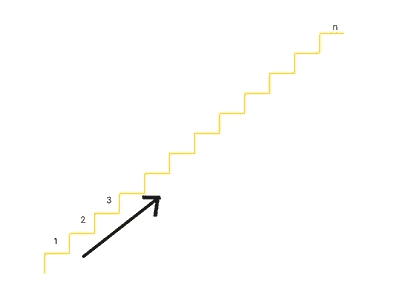

爬楼梯问题

T **何故事从一个问题开始**
昨天我在解一个很有名的 DP 问题，[爬楼梯](https://leetcode.com/problems/climbing-stairs/)。
问题相当简单。你正在爬楼梯。需要 n 步才能到达顶端。每次你可以爬 1 或 2 级台阶。有多少种不同的方式可以让你爬上顶峰？

**解决方案**
解决方案也很简单。
假设我们已经爬上了一些台阶，我们还剩下一些 **i** 台阶到达顶端。假设， **NoOfWays(i)** 是一个函数，它返回到达顶端的第 **i** 步的攀登路径数。

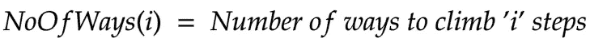

如果我们向上爬一步，那么我们就剩下(i-1)步了。利用上面的公式，攀登的方式数(i -1)步= NoOfWays(i-1)。类似地，如果我们爬了两步，那么我们剩下(i-2)步，使用公式，爬(i -2)步的方法数= NoOfWays(i-2)。
因为我们只能用两种方式中的一种来攀爬，所以攀爬的方式如下

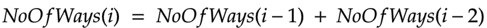

对于基本情况，我们知道 NoOfWays(1) = 1 和 NoOfWays(2) = 2，因此我们可以说

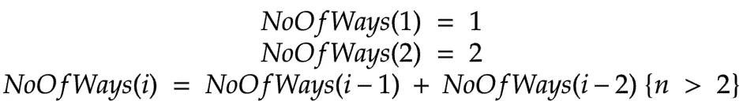

有了这个递推关系，我们就可以确定爬 **n 步**到达顶端的路数。这正式解决了问题。

**现在解决了，一切都好了，但是这个问题有什么特别的呢？**答案是**结果是**。

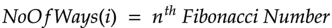

颠倒上述等式，我们可以说

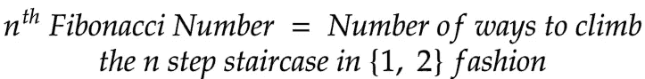

> 使用上述斐波纳契数列的表示，我们可以证明与斐波纳契数列相关的各种恒等式和规则。

比方说，Fib(n)代表 nᵗʰ斐波纳契数。

**卷积定理**

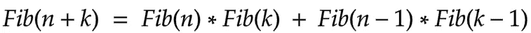

显然，等式的左边代表了爬(n + k)级楼梯的方式的数量。
爬(n + k)级楼梯的任务也可以用两种方式中的一种来完成。

*   案例 1:如果我们每次攀登都踏上第 n 级台阶
*   情况 2:如果我们每次都跳过第 n 步

在第一种情况下，

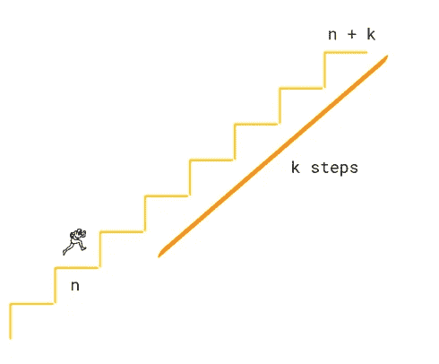

自从我们踏上 nᵗʰ台阶。那么我们一定已经以无止境的方式爬了 n 步，还剩下 k 步可以爬得更远。攀登的路线数=无路线数(n) *无路线数(k)

在第二种情况下，

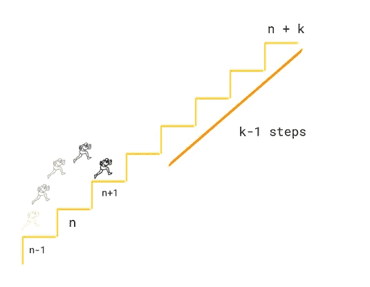

因为我们跳过了 nᵗʰ这一步。那我们一定是爬到了(n-1)ᵗʰ)台阶，跳到了(n + 1)ᵗʰ)台阶。因此，攀登的方式数=无向度(n-1) *无向度(k-1)

上面讨论的情况是相互排斥的(即不可能有一条路径同时存在于两种情况中)并且穷尽了可能性的空间(即爬上整个楼梯的方式的总数)

我们可以这么说，

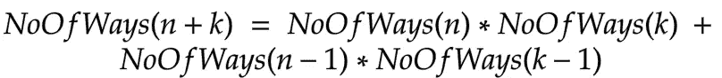

由于 NoOfWays(n) = Fib(n)，因此

这就证明了斐波那契数的卷积定理。

**进一步洞察**
将 k = n，k = n +1 代入上式

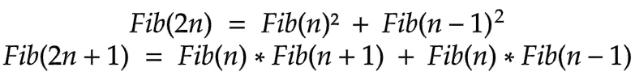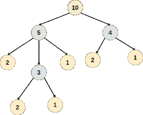

T(n) = 2*T(n/2) + O(1)当 N 是偶数时
T(n) = 3*T(n/2) + O(1)当 N 是奇数时
利用上面的结果我们可以计算出 **O(log N)中的第 N 个斐波那契数。**

同样，我们可以用这种表示方法推导出斐波那契数列的如下求和(我假设的，我还没想到)

*   Running Sum，Fib(n)+Fib(n-1)+Fib(n-2)…+Fib(0)= Fib(n+2)-1
    (更新:此处 有我对这个公式的解释的链接[)](/@sci.agarg/fibonacci-sequence-running-sum-b6f441741cdc)
*   偶数项之和，Fib(0) + Fib(2) + Fib(4) …+ Fib(2n) = Fib(2n+1)

我发现其他一些有用的表述

*   Fib(n) =仅使用 1 和 2 得到总和(= n)的方法的数量。
*   Fib(n) =使用 **1 x 1** 正方形和 **2 x 1** 多米诺骨牌平铺 **n x 1** 棋盘的方法数量(另一个 DP 问题)

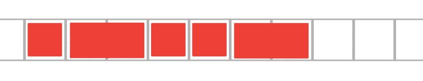

**快结束时…** 所有这些都让我想到了一个问题，这个问题很简单，我已经知道了逻辑和解决方法，但是，直到那时我还没有反过来看。然后，我在谷歌上查找了一些受欢迎的属性，并在它们身上进行了尝试，结果很好。
这个想法不是唯一的，可能有一些更好的序列表示，这肯定已经在之前讨论过了。但是我觉得很酷，就分享给你了。我还相信，像这样的表示有助于解决复杂修改的类似问题，这些问题很难只用数学方程来解码。我希望你喜欢这个主意。

那是我的部分