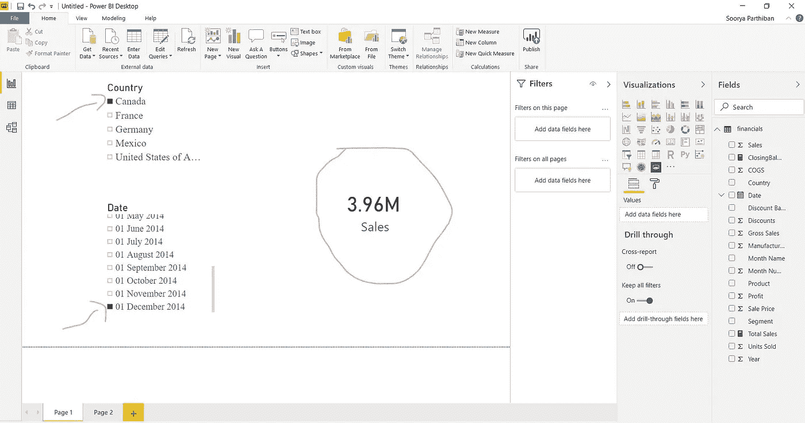
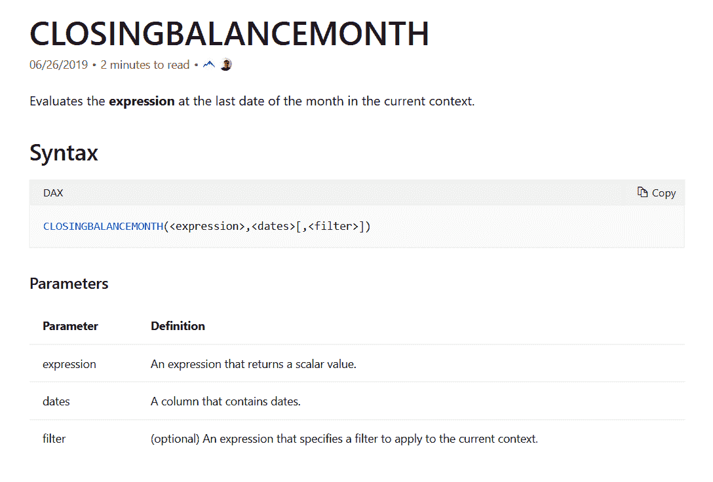
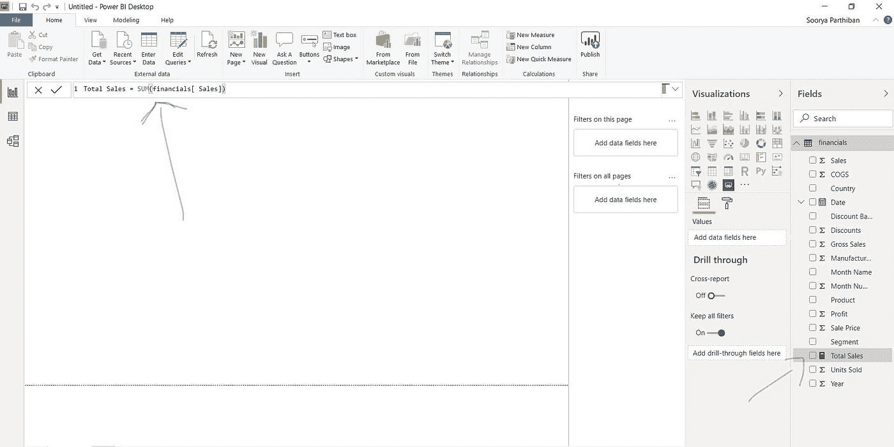
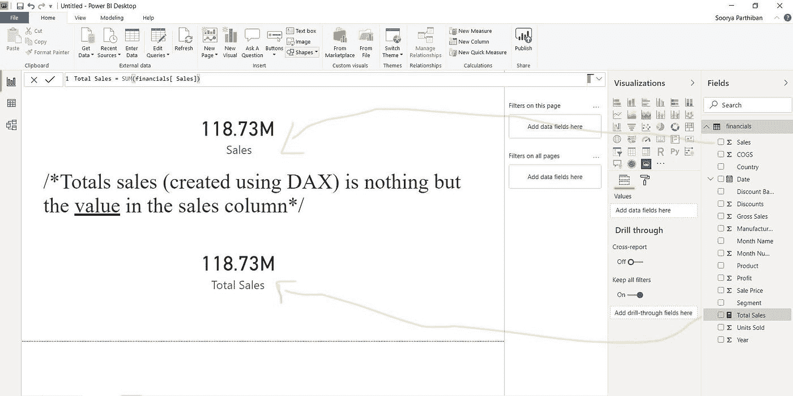
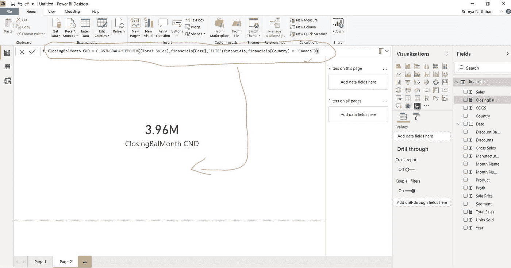
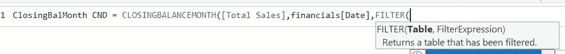
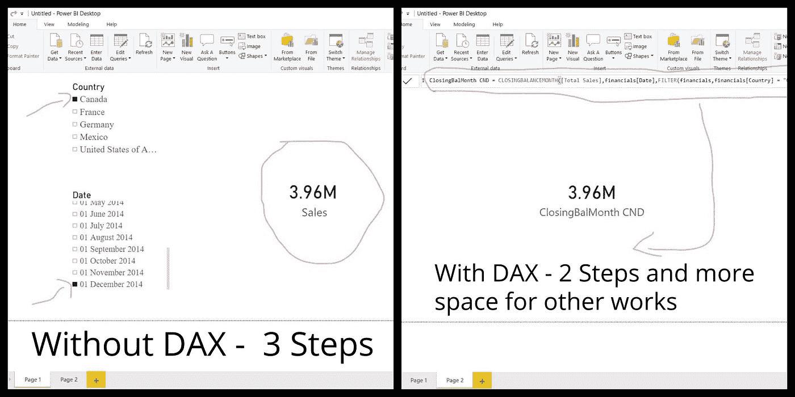

# #DataBlogSpp2:来自#MSPOWERBI 的 CLOSINGBALANCEMONTH() #Dax 函数

> 原文：<https://medium.com/analytics-vidhya/closingbalancemonth-dax-function-from-mspowerbi-2d8f47d9d3bd?source=collection_archive---------16----------------------->

大家好！很高兴在另一个博客里见到大家。

今天让我们来看看 DAX 的一个有趣的函数集，名为时间智能函数。顾名思义，微软的这些预定义功能真的很强大，让我们的生活变得很轻松。

在这组函数中，我将按字母顺序解释这些函数，所以第一个函数是 CLOSINGBALANCEMONTH()。好了，先不说功能，你是不是很好奇你信用卡的期末余额？如果你是首席执行官、会计师、统计学家或数据分析师/科学家？然后你必须计算特定月份/季度/年度的期末余额，对吗？CLOSINGBALANCEMONTH()函数使您的工作更加容易、快速和准确。

正如您在第一个截图中看到的，我们添加了两个分别带有国家名称和日期的切片器，以及一个显示期末余额的卡片。这是计算特定国家/地区(在此数据集中)每月期末余额的传统方法。这个过程有更多的步骤，并且在画布中占据更多的空间。

现在来了 DAX 函数 CLOSINGBALANCEMONTH()，来自微软页面的详细描述作为截图加入，大家看看吧。

因此，这个函数最多可以有 3 个参数。第一个参数是一个表达式，这意味着我们应该提到一个基本上包含**“NUMBERS”**的列。第二个参数是日期，我们应该提到一个包含数据的列，最后，我们有一个过滤器(这是一个可选参数),我们用它来返回特定值的期末余额，在我们的例子中，我们需要加拿大的期末余额。我认为这个解释非常直截了当，可以理解。

现在，我们创建另一个名为“总销售额”的列，或者使用 SUM() DAX 函数复制销售列。您可以使用 sales 列本身，但是这里我想区分使用 CLOSINGBALANCEMONTH(\)函数和传统方法计算的期末余额。

我在这里附上了两张卡片，它们显示了“销售额”列和“总销售额”列的值，它们是相同的。

我们到了高潮，到了你们都在等待的部分！！要编写 DAX 函数，右键单击**表名(这里是“财务”)**，然后单击**新度量。**

默认情况下，新列的名称将为“measure ”,我们可以为它取一个合适的名称，如“ClosingBalMonth CND ”,然后让我们开始编写代码。如前所述，表达式是包含数字**的列，因此可以计算并返回。我们添加了[Total_Sales]列作为表达式(我们之前创建了这个列，还记得吗？)，在日期中，我们添加了财务[日期]。**

过滤器是这个函数的一个有趣的部分，作为一个表达式，它仍然接受两个参数。

我说过，我们需要在过滤器中添加 FilterExpression 和 Table 作为参数。让我们从最后开始，FilterExpression 只不过是我们的主题的位置，即我们需要**加拿大**的期末余额，它在哪里？在**【国家】**一栏对吗？我国专栏存在于何处？在**财务**表对吗？

确定**过滤表达式的参数时，总是从后面开始。想想我们的主题，她住在哪里？好的，financials[Country]=“Canada”(主题名)，想想这个列在哪里，它在 financials 表中。我在下面附上了一张图片，这将从视觉上解释它。**

成功执行该函数后，我们将获得一个新列，其中包含加拿大的月末余额值。下面是 DAX 方法和非 DAX 方法的直观比较。

希望你喜欢。谢谢，祝您愉快:)