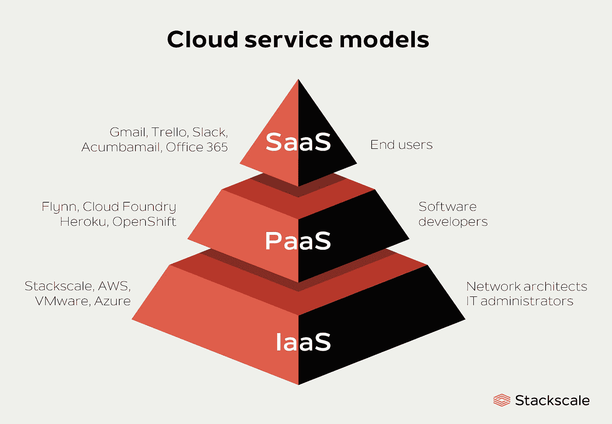
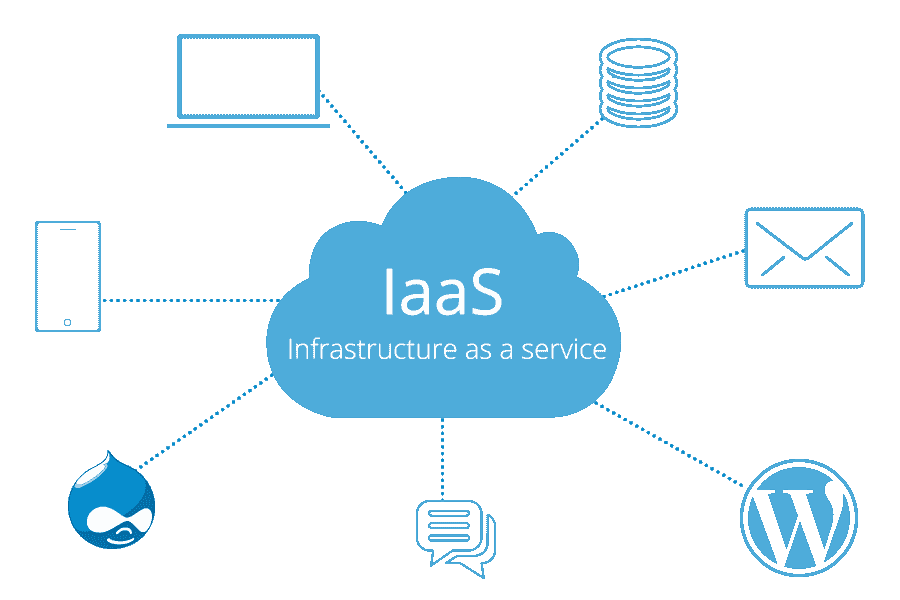
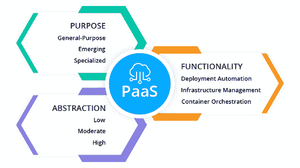
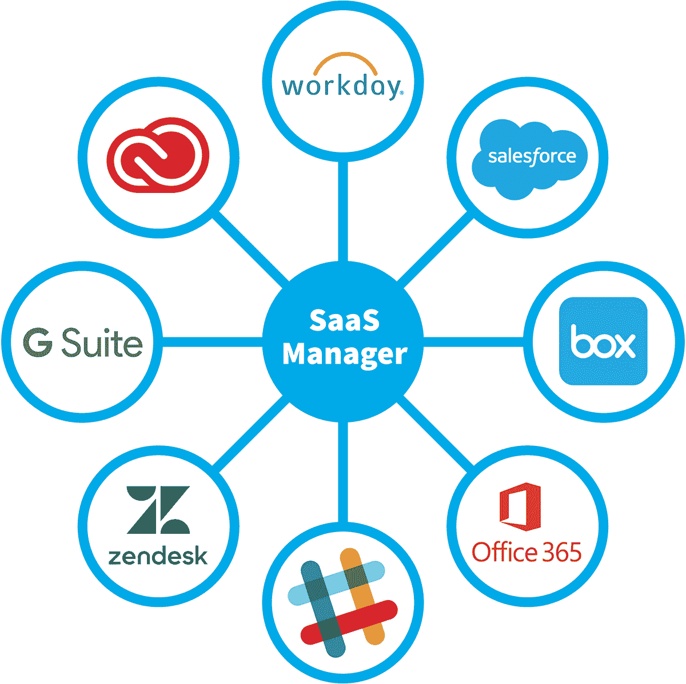
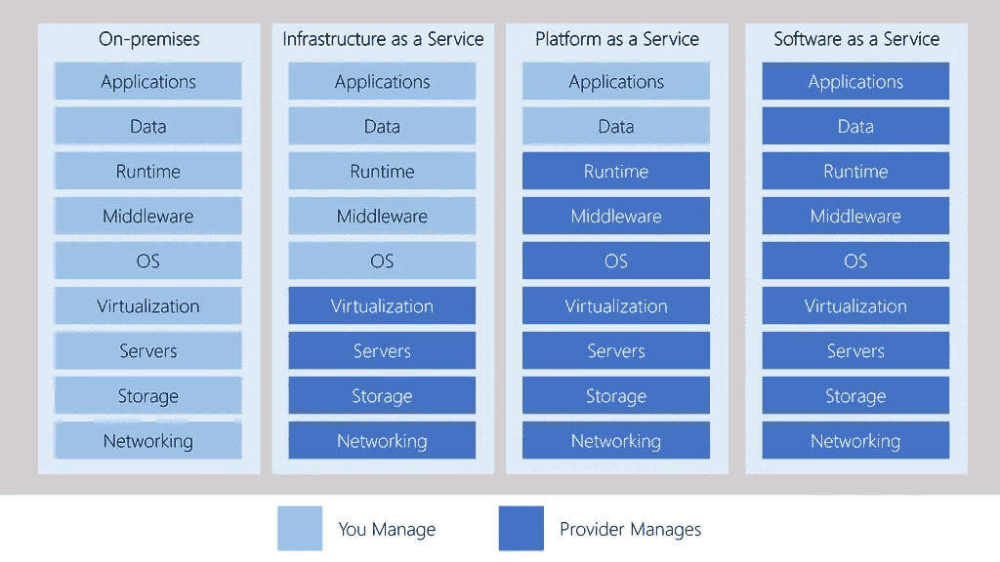
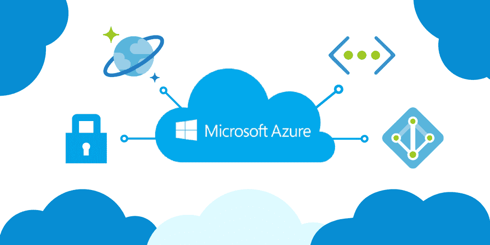

# 云计算和 Azure

> 原文：<https://medium.com/analytics-vidhya/cloud-computing-and-azure-fef414b68a11?source=collection_archive---------20----------------------->

说到云计算，有三大类。理解它们是很重要的，因为它们被用于对话、文档和培训。

今天，我们将学习所有关于云的大惊小怪是怎么回事。

# IaaS 对 PaaS 对 SaaS

其中每一种都有自己的优势和差异，有必要了解 SaaS、PaaS 和 IaaS 之间的差异，以便知道如何最好地选择一种

基本模型可视化

‌

# 基础设施即服务(IaaS)

基础设施即服务是云服务中最灵活的类别。

‌As 顾名思义，IaaS 通过互联网将虚拟化的计算资源分配给用户。

简单地说，当你建立一个技术企业(无论其规模大小)或建立一个个人项目时，你需要 IaaS 为你提供的某些基础设施。

它提供了专门属于虚拟化硬件(也称为计算基础架构)的资源。IaaS 环境中的产品包括网络连接、虚拟服务器空间、负载平衡器和 IP 地址。‌

有了 IaaS，您可以租用硬件，而不是购买硬件。这是一种即时计算基础架构，通过 internet‌进行调配和管理

# 平台即服务(PaaS)

像 IaaS 一样，PaaS 包括基础架构(服务器、存储和网络),还包括中间件、开发工具、商业智能(BI)服务、数据库管理系统等。PaaS 旨在支持完整的 web 应用生命周期:构建、测试、部署、管理和更新。

‌

PaaS 为您提供的应用类型:

*   AWS 弹性豆茎
*   Windows Azure
*   赫罗库
*   谷歌应用引擎

‌

## PaaS 通常用于以下场景:

*   发展框架。
*   分析或商业智能。

# 软件即服务(SaaS)

‌

SaaS 是为最终客户集中托管和管理的软件。它通常基于一种架构，其中一个版本的应用程序用于所有客户，并通过按月或按年订阅获得许可。Office 365、Skype 和 Dynamics CRM Online 是 SaaS 软件的完美范例。

SaaS 产品是一个所有用户都可以使用的互联网软件。你最喜欢的许多互联网平台都是 SaaS——谷歌应用程序、DropBox 或 Canva。

‌

# 云服务概述

需要理解的一点是，这些类别是相互叠加的。例如，PaaS 通过提供一个抽象级别在 IaaS 之上添加了一个层。抽象的好处是隐藏了您可能不关心的细节，这样您就可以更快地开始编码。

抽象的一个方面是您对底层硬件的控制更少。下图显示了您和您的服务提供商在每个云服务类别中管理的资源列表。

# 微软 Azure

基本上，微软 Azure 是微软创建的云计算服务，用于通过微软管理的数据中心构建、测试、部署和管理应用程序和服务。

‌

Azure 是微软的云计算平台。它提供了 100 多种服务，使您能够做任何事情，从在虚拟机上运行现有应用程序到探索新的软件模式，如智能机器人和混合现实。‌

以下是你在 Azure:‌能找到的几种服务

*   **计算**能够运行您的应用的虚拟机和容器等服务
*   **数据库**提供关系和 NoSQL 选择的服务
*   **身份**帮助您认证和保护用户的服务
*   **联网**服务将您的数据中心连接到云，提供高可用性或托管您的 DNS 域
*   **存储**解决方案可以容纳大量结构化和非结构化数据
*   **人工智能和机器学习**服务可以分析数据、文本、图像、理解语音，并使用数据进行预测——改变农业、医疗保健和更多领域的世界。

‌

> 来源:

[微软 Azure](https://en.wikipedia.org/wiki/Microsoft_Azure)

[https://www . BMC . com/blogs/SaaS-vs-PAAs-vs-iaas-what-the-difference-and-how-to-choose/](https://www.bmc.com/blogs/saas-vs-paas-vs-iaas-whats-the-difference-and-how-to-choose/)

[en.wikipedia.org](https://en.wikipedia.org/wiki/Microsoft_Azure)

[https://docs . Microsoft . com/en-us/learn/paths/azure-fundamentals/](https://docs.microsoft.com/en-us/learn/paths/azure-fundamentals/)