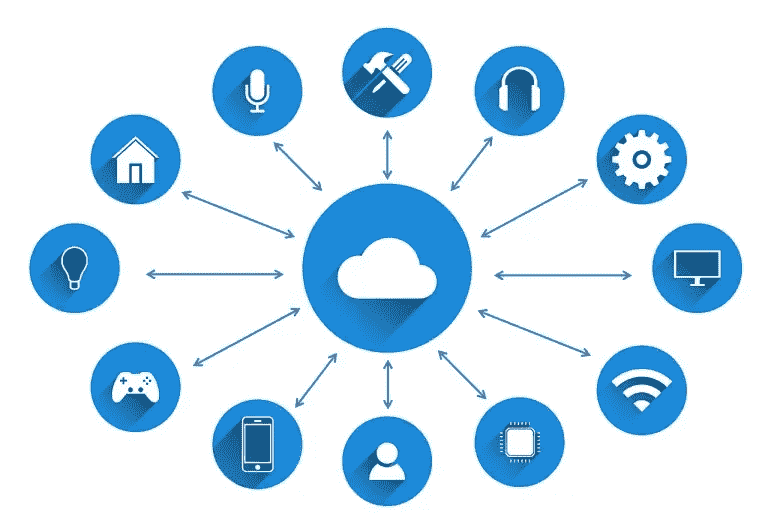

# 虚拟云计算基础

> 原文：<https://medium.com/analytics-vidhya/cloud-computing-fundamentals-for-dummies-cfbab5dd9e9e?source=collection_archive---------22----------------------->

来源:[https://www . fast metrics . com/blog/tech/what-is-cloud-computing/](https://www.fastmetrics.com/blog/tech/what-is-cloud-computing/)

云计算到处都在制造噪音。但是云计算到底是什么？它是如何工作的？为什么要用？让我们到处寻找这些问题的答案。

## 什么是云计算？

“云”基本上是指互联网或通过互联网访问的服务器。服务器由软件和硬件组成，使其能够通过网络提供服务。这些服务器被称为位于全球各地的“数据中心”，而“计算”指的是某种基于互联网的计算，而“云计算”指的是通过互联网访问和存储数据。

通过使用云基础设施，客户不必维护自己运行硬件和软件的物理系统，而是将这一负担转移到通过互联网提供云计算的公司，如亚马逊网络服务(AWS)。

## 为什么选择云计算？

来源:[https://5 . I mimg . com/data 5/KB/NX/KE/SELLER-10803960/cloud-computing-service-500 x500 . png](https://5.imimg.com/data5/KB/NX/KE/SELLER-10803960/cloud-computing-service-500x500.png)

假设你需要一辆车。通常你会出去买一个。然后你必须把它停在车库里，定期维修，支付任何维修费用。基本上是一大堆责任。但是，如果你的需求发生了变化，现在敞篷车或微型车更适合你，会发生什么呢？你支付另一辆车及其维修(升级或降级)。

然而，考虑使用汽车租赁服务。您可以根据自己的动态需求升级或降级，只需拿起汽车并开始驾驶。不用担心额外的费用——维护、修理、换车、寻找停车位..你可以边走边付，等你开完车再还回来。

这是云计算的基本思想——你租你需要的车并开始驾驶它，当你完成后归还它。

**效率/成本降低:**云计算不需要硬件投资，大大削减了资本支出。您不需要投资购买和维护硬件和设备或庞大的数据中心。现收现付，享受现金流友好型模式。

**灵活性:**它是具有动态需求的成长型企业或缺乏投资资本的企业家的理想选择。它能够根据市场需求或产品创新轻松扩展或缩小规模，而无需在物理基础设施上投入一分钱。

**灾难恢复:**将您的数据存储在云上可确保数据始终可用——它提供了从断电等中断中快速恢复的能力。当你的数据存储在本地计算机上时，你可能会因为失败或故障而丢失数据，但在云计算中这种情况发生的可能性很小。

**安全性:**数据安全和隐私是当今的一个主要问题。云提供商通过引入身份验证、访问控制和加密以及针对敏感数据的更复杂的选项来维护数据保护。

**控制:**云可以完全控制你的数据——你可以决定哪个用户可以访问什么级别的数据。例如，交换电子邮件曾经是一种规范——人们通过电子邮件附件交换文档或文件，由于名称和内容重叠，这经常导致混乱。但是有了云，你可以通过将文件分配给特定的员工来简化你的工作。由于许多员工可以在一个版本的文档上工作，每个人都看到相同的版本，这有助于更大的可见性和协作(想想谷歌文档)。

## 云计算是如何工作的？

云计算使用虚拟化。虚拟化使我们能够拥有一台作为物理计算机运行的虚拟计算机，其硬件可以使用互联网浏览器(或云计算软件)从任何地方访问。通常这些计算机也被称为虚拟机。

虚拟机在使用托管它们的硬件方面效率更高。我们可以旋转几个虚拟机，这样一个服务器变成几个服务器，一个数据中心变成多个数据中心。所有这一切都有可能归功于“沙盒”，即几个虚拟机可以在同一个物理基础架构上运行。

即使服务器宕机，云服务器也始终在线，因为云提供商拥有跨多个区域备份数据的资源。

## 云计算服务模式

来源:[https://www . cloud flare . com/learning/cloud/what-is-the-cloud/](https://www.cloudflare.com/learning/cloud/what-is-the-cloud/)

**基础设施即服务(IaaS):** 它是基础服务模式之一。它允许组织在虚拟化环境中租赁计算资源，如服务器和存储空间。服务器在服务提供商的数据中心运行，但完全由组织管理。这就像租赁一块土地——用你自己的材料创造你想要的任何东西。

**平台即服务(PaaS):** 在这种模式中，服务器运行在服务提供商的数据中心，完全由服务提供商管理和托管。您不必为计算资源付费，而是为创建和操作应用程序所需的工具付费；操作系统、开发软件等工具。

**软件即服务(SaaS):** 在这种模式中，应用程序由云服务提供商托管和管理，用户通过互联网访问。这就像租房子一样，房东维护房子，但房客可以像自己的房子一样使用它。

## 云计算部署模型

来源:[https://www . parallels . com/blogs/ras/cloud-computing-services/](https://www.parallels.com/blogs/ras/cloud-computing-services/)

**私有云:**是一个组织全资拥有的服务器和数据中心。它以更高的成本提供了更高的安全性。

**公共云:**它是由外部云服务提供商提供的服务，维护所有的物理基础设施，但该服务是公开提供的。例如 Dropbox，Google Drive。

**混合云:**顾名思义，是公有云和私有云的结合。组织可以将其私有云用于某些服务，将公共云用于其他服务。

***感谢阅读！***

*如果你喜欢这篇文章，*请*点击鼓掌👏按钮几下，以示支持。*