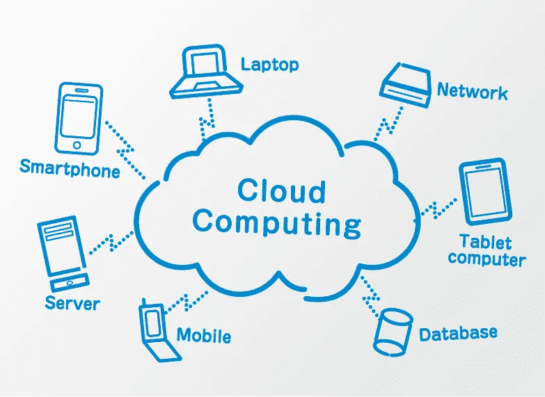
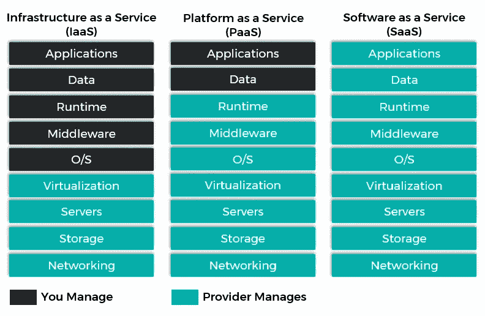

# 云计算简介和迈向亚马逊网络服务的第一步

> 原文：<https://medium.com/analytics-vidhya/cloud-computing-introduction-and-1st-step-towards-amazon-web-services-22344ac7178e?source=collection_archive---------18----------------------->

云计算

在这篇文章中，我将主要关注云计算的基本介绍，我们将尝试逐步了解云计算的方法，这是我第一篇关于亚马逊网络服务的文章，亚马逊网络服务将是 IT 行业的未来。很多人问我，开始云计算职业生涯或学习云计算有什么先决条件吗？为此，伙计们，我想让每个人都明白，迈向云计算，不需要任何硬性的编程语言先决条件。编程语言是你在云计算之旅的中途将要学习的东西，不要太担心这部分。我将带你了解如何学习？学哪种编程语言？就云计算而言，您到底需要在哪里应用编程语言逻辑？我会一步一步的引导你，就像我之前告诉你的，这只是你旅程的开始。只有一件事我希望你们都学会，即计算机设备的基础，这是必须的。如果我谈论计算机设备的基础知识，我指的是计算机硬件，如 CPU、RAM、ROM、操作系统(LINUX、WINDOWS)、内存、存储(仅定义)，我确信如果你正在阅读这篇文章，你知道所有这些非常基础的东西，因为这将帮助你将所有云计算资源与你对计算机设备的基本理解联系起来。

首先，我将用一些实时的例子向你解释非常基础的云计算。为了理解这个术语，我们将打破这个术语，并试图理解它的意思是什么？云+计算造就了云计算，而云意味着“互联网”，计算意味着“计算机”，所以在很高的层面上，我们可以说，计算机存在于某个地方，我们不知道它的确切位置，我们正在借助互联网访问该计算机。在非常基础的层面上，我们不需要知道计算机实际上在哪里，但是一旦我们向前推进，我们将引入一个名为“数据中心”的关键词，这一点我们将在后面理解。术语计算机指的是计算机的基本组件，即 CPU、RAM、ROM、硬盘驱动器等。

我会给你一个非常基本的例子，假设你打算买一台笔记本电脑，你的第一步是什么？，您将会搜索一些问题的答案，例如我需要购买哪家公司的笔记本电脑，惠普、戴尔、联想还是其他。我的工作量是多少，我的意思是基本上为什么你需要笔记本电脑是为了玩游戏吗？来制作 Youtube 视频？用于学习活动？此外，基于这一点，你会计划，如果你的目的是玩游戏，你肯定需要高处理器，如果你的目的是制作 Youtube 视频，你肯定会寻找一些高 GPU 或显卡或更多。只是为了不同的目的，你需要不同的配置系统。决定之后，你去市场，你会得到由 CPU、RAM、ROM、硬盘、操作系统和所有不同组件组成的系统。在这种情况下，你的计算机与你在一起，所以你不需要任何互联网来访问你的计算机资源，因为你有它的硬件部分，但在云计算的情况下，你没有硬件资源，硬件资源存在于其他地方，即所谓的数据中心。因此，要访问虚拟资源，你需要互联网连接。

现在，我们已经了解了家中的计算机和数据中心的计算机之间的基本区别。现在，我将带你了解云上的**电脑相对于家庭电脑的一些优势。**其中一些列举如下:

1.  如果你家里有一台**电脑**，如果你想增加你的硬盘或者增加它的内存将会非常困难。我不是说这不可能，这是可能的。要做到这一点，你需要支付更多的费用，你需要再次进入市场，你需要寻找存储供应商、内存供应商，所有这些都需要你付出大量努力才能实现。现在想想云上的**电脑**，如果你想增加内存、只读存储器、存储空间或任何东西，只需点击一下鼠标。我可以说，这是一个非常简单的任务，唯一需要的就是活跃的互联网连接，稍后我会一步一步地告诉你如何在云上实现这些。现在，我只想提醒大家，通过云获取资源或增加或减少计算机能力是一件非常简单的事情
2.  第二，假设你已经开发了一些东西或者你有一些产品，你想开一家自己的创业公司，你想与全世界分享你的产品，你不能在本地笔记本电脑上做，我的意思是，无论你将在本地笔记本电脑上部署什么，对该资源或产品的访问将仅限于你，所以在这种情况下，你需要使用云或任何其他本地供应商。在高级部署部分，请理解，您正在阅读此博客或任何内容，就像您正在访问 Youtube 或打开 google.com 一样，您能够做到这一点，因为所有这些都部署在任何服务器上的云上，服务器只是高级计算机。

我认为现在我们已经在很高的层面上理解了云计算的基础。现在，我们将试着理解我们到底需要做些什么来让计算机通过云。因此，要让这些计算机通过云，我们需要首先搜索或选择云提供商供应商。我们可以向供应商索要我们需要的任何资源。不要紧张或担心，我们不需要亲自拜访供应商，或者我们不需要向人们支付任何费用来获得计算机上的云。这是非常简单的任务。IT 市场上有许多供应商，如谷歌、微软、亚马逊、数字海洋等等。我列出了一些市场领先的供应商。你需要在我列出的所有供应商中选择任何一个供应商，他们都将为你提供相同的东西，并且都有自己的计划，就像亚马逊过去给你 1 年的免费计算量一样。微软曾经免费给你大约 13500 美元，一旦你选择继续使用微软，谷歌有他们自己的一些计划，就像每个供应商都有自己的好处，但在高层次上，如果你已经开始学习云计算，一切都是免费的，直到你没有成为这个领域的专家，相信我的话。

亚马逊提供 AWS(亚马逊网络服务)。谷歌提供谷歌云平台(GCP)，微软提供 Azure。所以基本上这些地方是你可以购买你的电脑的地方。你可以根据你的兴趣自由选择任何供应商，但我将使用 AWS(亚马逊网络服务)进行我的所有演示工作，或者向你解释云计算的每个组件或资源，同时我将告诉你如何在 Azure 上使用可选的东西，因为我对 AWS 和 Azure 都有所了解。

现在来看最重要的部分，这是深入了解云计算概念的最佳部分。只是想知道，当您从任何供应商处订购时，是谁或谁负责为您提供资源。我的意思是，假设你选择了 AWS，现在你在 AWS 上创建了一个免费帐户，现在你还订购了计算机(不要深入了解如何订购，所有人都认为你已经订购了)，你如何获得可供你使用的资源？这是一个非常重要的问题。有一种叫做**虚拟机管理程序**的东西，它负责为您分配存储、内存、RAM、ROM、您订购的任何类型的实例，订购后，您可能会重新订购以更改配置，您可以通过云轻松做到这一点，这要感谢虚拟机管理程序。同样，您现在不需要了解虚拟机管理程序的详细信息，也不需要知道它是如何工作的，它过去是如何调度的等等。AWS 使用 XEN 虚拟机管理程序来完成资源调配。现在你只需要把这件事记在心里。

我们已经基本了解了云计算是如何工作的，以及谁是云的供应商。现在，我们将深入了解云计算的基本架构，这是必要的，因为在信息技术行业，我们正在为人们构建一个解决方案，在这些现代技术的帮助下，我们正在让普通人的生活越来越轻松。如果你想逐步了解数据科学或机器学习，你可以搜索更多我写的文章。同时，我也为对机器学习或数据科学感兴趣的候选人写文章，最后我的目标是如何在云计算平台上充分利用数据科学或机器学习模型。现在来看看云计算的架构。

云计算架构分为基于提供商的**和基于消费者的**两种风格。**提供商只不过是过去为你提供资源的供应商，而消费者是过去消费服务的人。首先，我们将从供应商的角度来看。**

基于提供商，云计算分为 3 类，第一类**公共云**第二类**私有云**第三类**混合云。**我们将从很高的层面来看待这三种类型

1.  **公共云:**当服务通过面向公众开放的网络提供时，云被称为“公共云”。公共云服务可能是免费的，但是，对于服务提供商向公众提供的服务(应用程序、存储和其他资源)以及通过不可信网络进行通信时，安全考虑可能会有很大不同。我们使用的 AWS、Azure 或 GCP 都属于公有云。所有定制或 UI 部分对所有公共云用户都是一样的。
2.  **私有云:**私有云是专为单个组织运营的云基础设施，由内部或第三方管理，由内部或外部托管。实施私有云项目需要大量参与来虚拟化业务环境，并且需要组织重新评估关于现有资源的决策。从技术上来说，公共云和私有云架构之间可能几乎没有区别，您只需要记住一点，私有云的数据中心独立于公共云的数据中心之一，有时云供应商会根据私有云用户的需求来构建基础架构。AWS 也为美国政府提供私有云，没有人可以访问这些私有云网络，除非你提供了访问权限。
3.  **混合云:**混合云是公共云和私有环境(如私有云和内部资源)的组合，它们仍然是不同的实体，但却绑定在一起，提供了多种部署模式的优势。我们可以认为资源是公共云和私有云的组合。主要是在银行和医院，人们过去更喜欢混合云结构。

我们已经成功地讲述了公共云、私有云和混合云之间的区别。从高层次来说，我们需要了解我们必须应对公共云，我们将继续将公共云作为支柱，并继续前进，因为正如我在上面提到的那样，公共云易于调配。我们还讨论过，公共云和私有云之间没有太大的区别，唯一的区别是安全配置，所有不同的组织都有自己的安全方法，一旦您与任何企业合作，您就会知道这一点。

现在我们将从消费者的角度来看待这些概念。基于消费者，云服务主要分为 **3** 种类型，即**基础设施即服务(iaas)、平台即服务(Paas)和软件即服务(Saas)。**为了让您理解这 3 个术语，我们将举一个非常常见的例子，我建议您看一下下面这个例子的直觉，然后我们将把它与云方面的 saas、pass 和 iaas 联系起来

假设你想吃披萨，基本上你有三种选择。第一，你会买餐具，买所有的材料，在家里做披萨。第二种选择是你可能会拜访你的朋友或亲戚，他们会准备好披萨餐具，只不过你需要购买食材，然后你就可以做披萨。第三种选择是你可以在网上订购披萨。所以有三种方法:

*   首先，你肯定需要支付更多的钱，因为你需要花钱购买餐具，你需要投资购买原料，第三，你需要努力做比萨饼。
*   第二种方式，你必须支付一些较少的金额，因为你要花钱去你的朋友或亲戚家，他们有比萨饼用具设置，你需要花在购买原料上。
*   在第三种方式中，只有你需要有活跃的互联网连接，你将订购比萨饼，你将在你家门口得到它。

对于我和你这样的人来说，第三个选择是最好的选择，但是想想那些想开披萨店并且想为他们吃披萨的人，第二个和第一个选择可能会更好。所以我想说的是，根据人们的需求，他们会选择不同的方案。同样，云消费者也是如此，我指的是云客户。每个人都有自己的需求，基于他们的需求，他们通常选择 iaas、paas 和 saas。现在回到披萨的例子，在第一个案例中，我们管理从购买器皿、配料到制作披萨的所有事情，所以这是一种 IAAS(基础设施即服务)。在第二种情况下，我们只是购买食材和制作披萨，所以这是一种(Paas)平台即服务，第三种情况下，我什么都不管，这是软件即服务(saas)。现在不用担心，我会在下面给你 saas、paas 和 iaas 的云定义

1.  **SaaS:** 软件即服务(SaaS)的服务模式包括云提供商在云中安装和维护软件，用户通过互联网(或内部网)从云中运行软件。用户的客户端机器不需要安装任何特定于应用的软件，因为云应用在云中运行。你曾经在互联网上使用过 MS office、MS word 或 MS excel 吗？如果没有，我强烈推荐现在使用它。，因为这是 saas 的例子。你不需要做安装或任何配置就可以通过互联网使用微软办公软件。只有你将需要微软帐户。
2.  **PaaS:** 平台即服务是云计算服务，向用户提供应用平台和数据库即服务。这相当于应用平台和数据库的传统(非云计算)交付中的中间件。在这种情况下，您将管理应用程序和数据，我的意思是，只有您必须专注于您的应用程序的开发，其余部分，如管理网络、存储和服务器，将由您的云提供商负责。亚马逊 Lambda 是这种交付方式的一个很好的例子。这是信息技术市场的未来架构，因为在这种情况下，计算将完全没有服务器。我将在以后的文章中深入讨论这一部分。
3.  **IaaS:** 基础架构即服务采用物理硬件并完全虚拟化(例如，所有服务器、网络、存储和系统管理都存在于云中)。这相当于传统(非云计算)方法中的基础设施和硬件运行在云中。您需要按月付费，或者您需要提前提供这种交付方式。Amazon EC2 是这种情况的最好例子。在我接下来的文章中，我将再次深入讨论 EC2。到目前为止，你可以把它想象成从你的云提供商那里获得虚拟服务器，并从操作系统层面配置每一个细节。这在工业上也有广泛的应用。

有关更多细节，我附上一张图片，它将在非常高的水平上解释 Paas，Iaas 和 Saas

Iaas、Saas 和 Paas

我们已经看到了云计算的基础知识，以及基于提供商和消费者的云类型的完整架构。如果你对机器学习、深度学习、数据科学或 python 感兴趣，我强烈推荐你查看我的另一个博客，我在下面附上了链接。我计划从第一步开始就介绍云计算以及我们如何在数据科学领域使用这项技术。因此，请跟随我的旅程，我相信这将是非常有益的，它将导致从基础到高水平的知识发展。在下一篇博客中，我将尝试介绍 web 服务，因为我们需要先了解什么是 web 服务，才能迈向亚马逊 Web 服务(AWS)。最重要的是，如果你对这篇文章有任何疑问，请在下面的评论框中发表，我将非常乐意帮助你或详细解释你的疑问。

 [## Keras 嵌入层和手套预训练逐步嵌入的程序实现

### Keras 嵌入层是神经网络的第一个输入层。在转换我们的原始输入数据后…

medium.com](/@akash97715/keras-embedding-layer-and-programetic-implementation-of-glove-pre-trained-embeddings-step-by-step-7a4b2fa71544) 

# 敬请关注