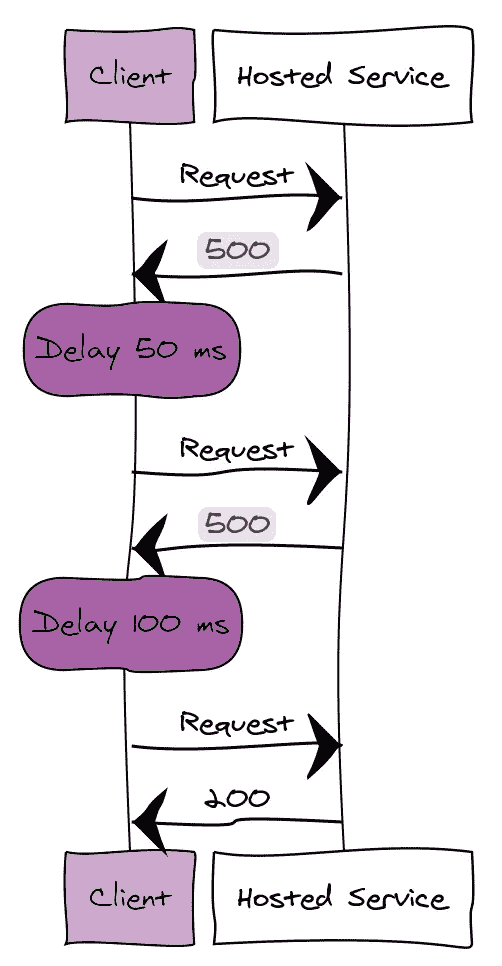
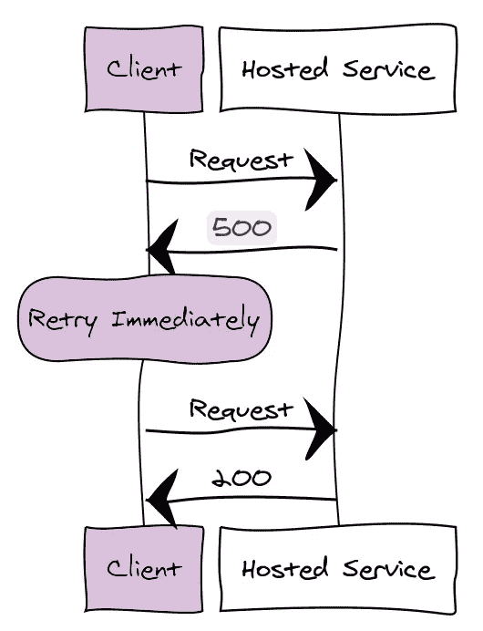

# 云设计模式:第 1 部分

> 原文：<https://medium.com/analytics-vidhya/cloud-design-patterns-part-1-32123d76ad96?source=collection_archive---------27----------------------->


# **重试模式**

与云中运行的元素进行通信的应用程序必须对这种环境中可能发生的瞬时故障保持敏感。故障包括组件和服务的网络连接暂时中断、服务暂时不可用或服务繁忙时出现超时。

这些故障通常是自我纠正的，如果触发故障的动作在适当的延迟后重复，它很可能是成功的。例如，正在处理大量并发请求的数据库服务可以实现一个节流策略，该策略会暂时拒绝任何进一步的请求，直到其工作负载减轻为止。尝试访问数据库的应用程序可能会连接失败，但如果它在一段时间后再次尝试，它可能会成功。

如果应用程序在尝试向远程服务发送请求时检测到故障，它可以通过使用以下策略来处理故障:

*   **取消。**如果故障表明失败不是暂时的，或者如果重复的话不太可能成功，应用程序应该取消操作并报告一个异常。
*   **重试。**如果报告的特定故障异常或罕见，则可能是由异常情况引起的，例如网络数据包在传输过程中损坏
*   **延迟后重试。**如果故障是由更常见的连接或繁忙故障引起的，网络或服务可能需要一段时间来纠正连接问题或清除工作积压。应用程序应该在重试请求之前等待一段合适的时间。

定义适当的重试次数和间隔。几次尝试后，可能需要放弃并返回一个失败。在尝试下一个请求之前等待也是一个好习惯。这可以避免给已经过载的服务增加过多的负载。

典型策略使用以下类型的重试间隔:

*   **指数回退。**应用程序在第一次重试之前会等待一小段时间，然后在随后的每次重试之间以指数方式增加次数。例如，它可能会在 50 毫秒、100 毫秒、200 毫秒等之后重试该操作。
*   **增量区间。**应用程序在第一次重试之前会等待一段时间，然后在每次后续重试之间逐渐增加次数。例如，它可能会在 50 毫秒、100 毫秒、200 毫秒等之后重试该操作。



*   **有规律的间隔。**应用程序在每次尝试之间等待相同的时间。例如，它可能每 3 秒重试一次操作。
*   **立即重试。**有时，瞬时故障非常短暂，可能是由网络数据包冲突或硬件组件中的峰值等事件引起的。在这种情况下，立即重试操作是合适的，因为如果在应用程序组装和发送下一个请求的时间内故障已经清除，则重试操作可能会成功。但是，不应该有超过一次的立即重试尝试，如果立即重试失败，您应该切换到替代策略，例如指数回退或回退操作。



*   **随机化。**上述任何重试策略可能包括随机化，以防止客户端的多个实例同时发送后续重试尝试。例如，一个实例可能在 3 秒、11 秒、28 秒等之后重试操作，而另一个实例可能在 4 秒、12 秒、26 秒等之后重试操作。随机化是一种有用的技术，可以与其他策略结合使用。

一般原则是，对后台操作使用指数后退策略，对交互式操作使用立即或定期重试策略。在这两种情况下，您都应该选择延迟和重试次数，以便所有重试尝试的最大延迟都在所需的端到端延迟要求范围内。

***代码为 Java 中的重试模式***

```
package util;

import java.util.Arrays;
import java.util.function.Supplier;

public final class Util {

    /**
     * Retry to run a function a few times, retry if specific exceptions occur.
     *
     * @param timeoutExceptionClasses what exceptions should lead to retry. Default: any exception
     */
    public static <T> T retry(Supplier<T> function, int maxRetries, Class<? extends Exception>... timeoutExceptionClasses) {
        timeoutExceptionClasses = timeoutExceptionClasses.length == 0 ? new Class[]{Exception.class} : timeoutExceptionClasses;
        int retryCounter = 0;
        Exception lastException = null;
        while (retryCounter < maxRetries) {
            try {
                return function.get();
            } catch (Exception e) {
                lastException = e;
       if(Arrays.stream(timeoutExceptionClasses).noneMatch(tClass ->
                        tClass.isAssignableFrom(e.getClass())
                ))
                    throw lastException instanceof RuntimeException    ?((RuntimeException) lastException) :
                            new RuntimeException(lastException);
                else {
                    retryCounter++;
                    System.err.println("FAILED - Command failed on retry " + retryCounter + " of " + maxRetries);
                    e.printStackTrace();
                    if (retryCounter >= maxRetries) {
                        break;
                    }
                }
            }
        }
        throw lastException instanceof RuntimeException ?
                ((RuntimeException) lastException) :
                new RuntimeException(lastException);
    }

    /** Manual test method */
    public static void main(String... args) throws Exception {
        retry(() -> {
            System.out.println(5 / 0);
            return null;
        }, 5, Exception.class);
    }
}
```

# 断路器模式

在分布式环境中，对远程资源和服务的调用可能会由于瞬时故障而失败，例如网络连接缓慢或超时，或者当资源过量使用或暂时不可用时。这些故障通常会在很短的时间内自行纠正，健壮的云应用程序应该准备好通过使用*重试模式*等策略来处理它们。

但是，可能会出现由于意外事件导致故障的情况，这可能需要更长的时间来修复。这些故障的严重程度从部分失去连接到服务完全失败不等。在这些情况下，应用程序不断重试不太可能成功的操作可能是没有意义的。相反，应用程序应该迅速接受操作已经失败，并相应地处理这个失败。

此外，如果某项服务非常繁忙，系统某个部分的故障可能会导致级联故障。例如，调用服务的操作可以被配置为实现超时，并且如果服务在该时间段内没有响应，则用失败消息进行回复。

*断路器*模式可以防止应用程序反复尝试执行可能失败的操作。允许它继续，而无需等待故障被修复或浪费 CPU 周期，同时它确定故障是长期持续的。断路器模式还使应用程序能够检测故障是否已经解决。如果问题似乎已经解决，应用程序可以尝试调用操作。

断路器模式的目的不同于重试模式。重试模式使应用程序能够在期望成功的情况下重试操作。断路器模式防止应用程序执行可能失败的操作。应用程序可以通过使用重试模式来结合这两种模式，以通过断路器调用操作。然而，重试逻辑应该对断路器返回的任何异常敏感，并且如果断路器指示故障不是瞬时的，则放弃重试尝试。

断路器充当可能失败的操作的代理。代理应该监视最近发生的失败次数，并使用该信息来决定是允许操作继续进行还是简单地立即返回一个异常。

代理可以实现为状态机，具有模拟电路断路器功能的以下状态:

*   **关闭。**来自应用程序的请求被路由到操作。代理维护最近失败次数的计数，并且如果对操作的调用不成功，则代理递增该计数。如果在给定的时间段内，最近的故障数量超过指定的阈值，则代理被置于*打开状态*。此时，代理启动超时定时器，当该定时器到期时，代理被置于*半开状态*。超时计时器的目的是在允许应用程序再次尝试执行操作之前，给系统时间来修复导致失败的问题。
*   **打开。来自应用程序的请求立即失败，并向应用程序返回一个异常。**
*   **半开。**来自应用程序的有限数量的请求被允许通过并调用操作。如果这些请求成功，则认为之前导致故障的故障已经修复，断路器切换到闭合状态(故障计数器复位)。如果任何请求失败，断路器认为故障仍然存在，因此它回复到断开状态，并重启超时计时器，以给系统更多时间从故障中恢复。

***Java 中断路器模式的代码***

你可以用网飞·海斯特里克斯实现断路器模式。下面的代码可以更好地解释解决方案。

下面是根据学校名称获取学校详细信息的应用程序。

Pom.xml 如下

```
<**dependencies**>
   <**dependency**>
      <**groupId**>org.springframework.boot</**groupId**>
      <**artifactId**>spring-boot-starter-actuator</**artifactId**>
   </**dependency**>
   <**dependency**>
      <**groupId**>org.springframework.cloud</**groupId**>
      <**artifactId**>spring-cloud-starter-hystrix</**artifactId**>
   </**dependency**>
   <**dependency**>
      <**groupId**>org.springframework.cloud</**groupId**>
      <**artifactId**>spring-cloud-starter-hystrix-dashboard</**artifactId**>
   </**dependency**>
   <**dependency**>
      <**groupId**>org.springframework.boot</**groupId**>
      <**artifactId**>spring-boot-starter-data-rest</**artifactId**>
   </**dependency**>
   <**dependency**>
      <**groupId**>org.springframework.boot</**groupId**>
      <**artifactId**>spring-boot-starter-web</**artifactId**>
   </**dependency**>

   <**dependency**>
      <**groupId**>org.springframework.boot</**groupId**>
      <**artifactId**>spring-boot-starter-test</**artifactId**>
      <**scope**>test</**scope**>
   </**dependency**>
</**dependencies**>

<**dependencyManagement**>
   <**dependencies**>
      <**dependency**>
         <**groupId**>org.springframework.cloud</**groupId**>
         <**artifactId**>spring-cloud-dependencies</**artifactId**>
         <**version**>${spring-cloud.version}</**version**>
         <**type**>pom</**type**>
         <**scope**>import</**scope**>
      </**dependency**>
   </**dependencies**>
</**dependencyManagement**>
```

主要的类如下

```
**import** org.springframework.boot.SpringApplication;
**import** org.springframework.boot.autoconfigure.SpringBootApplication;
**import** org.springframework.cloud.client.circuitbreaker.EnableCircuitBreaker;
**import** org.springframework.cloud.netflix.hystrix.dashboard.EnableHystrixDashboard;

@SpringBootApplication
@EnableHystrixDashboard
@EnableCircuitBreaker
**public class** SpringHystrixSchoolServiceApplication {

   **public static void** main(String[] args) {
      SpringApplication.run(SpringHystrixSchoolServiceApplication.**class**, args);
   }
}
```

我们用`*@EnableCircuitBreaker*` 来指定我们需要为这个应用启用断路器。

下面是 RestController

```
**import** org.springframework.beans.factory.annotation.Autowired;
**import** org.springframework.web.bind.annotation.PathVariable;
**import** org.springframework.web.bind.annotation.RequestMapping;
**import** org.springframework.web.bind.annotation.RequestMethod;
**import** org.springframework.web.bind.annotation.RestController;

**import** com.example.springhystrixschoolservice.delegate.StudentService;

@RestController
**public class** SchoolServiceController {

   @Autowired
   StudentService studentService;

   @RequestMapping(value = **"/getSchoolDetails/{schoolname}"**, method = RequestMethod.GET)
   **public** String getStudents(@PathVariable String schoolname) {
      System.out.println(**"Going to call student service to get data!"**);
      **return** studentService.callStudentServiceAndGetData(schoolname);
   }

}
```

最后，服务代码如下

```
**import** java.util.Date;

**import** org.springframework.beans.factory.annotation.Autowired;
**import** org.springframework.context.annotation.Bean;
**import** org.springframework.core.ParameterizedTypeReference;
**import** org.springframework.http.HttpMethod;
**import** org.springframework.stereotype.Service;
**import** org.springframework.web.client.RestTemplate;

**import** com.netflix.hystrix.contrib.javanica.annotation.HystrixCommand;

@Service
**public class** StudentService {
   @Autowired
   RestTemplate restTemplate;

   @HystrixCommand(fallbackMethod = **"callStudentServiceAndGetData_Fallback"**)
   **public** String callStudentServiceAndGetData(String schoolname) {
      System.out.println(**"Getting School details for "** + schoolname);
      String response = restTemplate
            .exchange(**"http://localhost:8098/getStudentDetailsForSchool/{schoolname}"** , HttpMethod.GET
            , **null** , **new** ParameterizedTypeReference<String>() {
         }, schoolname).getBody();

      System.out.println(**"Response Received as "** + response + **" -  "** + **new** Date());

      **return "NORMAL FLOW !!! - School Name -  "** + schoolname + **" :::  Student Details "** + response + **" -  "** + **new** Date();
   }

   @SuppressWarnings(**"unused"**)
   **private** String callStudentServiceAndGetData_Fallback(String schoolname) {
      System.out.println(**"Student Service is down!!! fallback route enabled..."**);
      **return "CIRCUIT BREAKER ENABLED!!!No Response From Student Service at this moment. Service will be back shortly - "** + **new** Date();
   }

   @Bean
   **public** RestTemplate restTemplate() {
      **return new** RestTemplate();
   }
}
```

如果你仔细观察，我们在方法`*callStudentServiceAndGetData*`上使用了`*HystrixCommand*` 和回退方法。网飞的 Hystrix 库提供了断路器模式的实现。当您将断路器应用于一个方法时，Hystrix 会监视对该方法的失败调用，如果失败累积到某个阈值，Hystrix 会断开电路，以便后续调用自动失败。当电路打开时，Hystrix 将调用重定向到方法，并将它们传递给指定的回退方法。

Spring Cloud 网飞 Hystrix 寻找任何带有`@HystrixCommand`注释的方法，并将该方法包装在一个连接到断路器的代理中，以便 Hystrix 可以监控它。

感谢您的阅读！如果你喜欢，请鼓掌👏为了它。