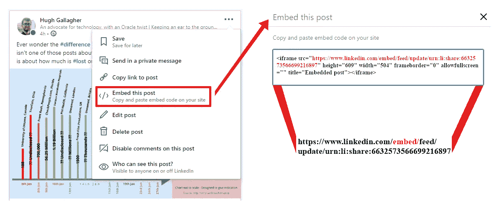
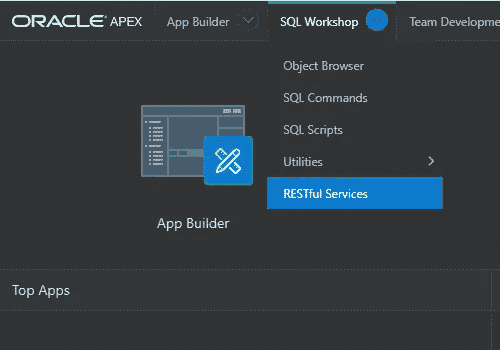
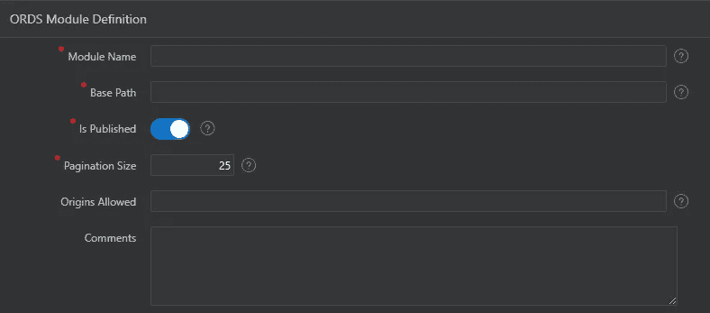
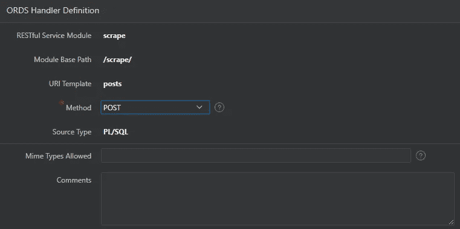
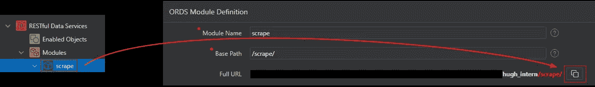
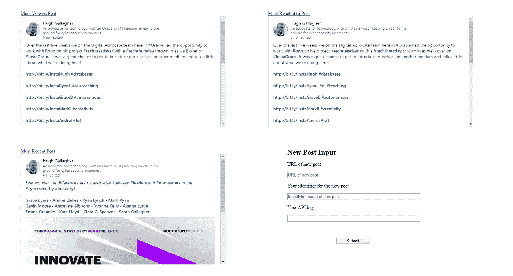

# 云网络抓取器——代码

> 原文：<https://medium.com/analytics-vidhya/cloud-web-scraper-the-code-d2081b8d5787?source=collection_archive---------11----------------------->

欢迎再次回来(或者可能是第一次)。继续设置基于云的 web scraper 的旅程，我将最终使用实际代码来简化抓取过程，并设置我们将使用的必要的数据库表和 API。(API 将在 Oracle APEX 上构建，因此如果您不使用 Oracle 云，这一部分对您来说可能有点多余)。

如果您无意中发现了这一点，并想知道我已经看了什么，您会发现我已经谈到了[设置 Oracle 云环境](/analytics-vidhya/cloud-web-scraper-the-setup-c542ca77c6ae)，以及[设置两个虚拟机(VM)中的一个作为 web 服务器](/analytics-vidhya/cloud-web-scraper-the-web-server-1a5b57cc8e4)。

# 数据库

直入主题，让我们用这个项目需要的所有表格建立我们的数据库！这将保存我们收集的数据，以便可以随时查看和跟踪。在我们将所有需要的 SQL 放在一起之前，请前往 [Oracle Cloud](https://www.oracle.com/cloud/sign-in.html) 上的数据仓库页面。从那里单击数据库名称，然后移动到“工具”选项卡，并单击“打开 APEX”按钮。


当它打开时，您将被要求创建另一个(非管理员)用户和一个工作区。在我的例子中，我使用了“HUGH_INTERN”作为两者，因此有必要适当地用您自己的用户名替换它。完成后，使用“工具”选项卡导航回页面。这次我们将单击“打开 SQL Developer Web”选项。现在我们将设置数据库。

下面您将找到每个表的 SQL。这很长，所以我会尽量简单地解释一下。然而，当您开始设置表时，它可以一次性运行。

```
-- table to hold each post information
CREATE TABLE HUGH_INTERN.POST_TABLE 
    ( 
     URL              VARCHAR2 (150) , 
     DATE_OF_CREATION DATE  NOT NULL , 
     IDENTIFIER       VARCHAR2 (60)  NOT NULL,
    ) 
    TABLESPACE DATA 
    LOGGING 
;-- create and add primary key
CREATE UNIQUE INDEX HUGH_INTERN.POST_TABLE_PK ON HUGH_INTERN.POST_TABLE 
    ( 
     URL ASC 
    ) 
    TABLESPACE DATA 
    LOGGING 
;ALTER TABLE HUGH_INTERN.POST_TABLE 
    ADD CONSTRAINT POST_TABLE_PK PRIMARY KEY ( URL ) 
    USING INDEX HUGH_INTERN.POST_TABLE_PK ;-- create table to hold daily scraped data for each post
CREATE TABLE HUGH_INTERN.STAT_TABLE 
    ( 
     COLLECTION_DATE DATE , 
     POST_REACTS     NUMBER (*,0) , 
     POST_VIEWS      NUMBER (*,0) , 
     POST_URL        VARCHAR2 (160) 
    ) 
    TABLESPACE DATA 
    LOGGING 
;-- create and add primary key
CREATE UNIQUE INDEX HUGH_INTERN.STAT_TABLE_PK ON HUGH_INTERN.STAT_TABLE 
    ( 
     COLLECTION_DATE ASC , 
     POST_URL ASC 
    ) 
    TABLESPACE DATA 
    LOGGING 
;ALTER TABLE HUGH_INTERN.STAT_TABLE 
    ADD CONSTRAINT STAT_TABLE_PK PRIMARY KEY ( COLLECTION_DATE, POST_URL ) 
    USING INDEX HUGH_INTERN.STAT_TABLE_PK ;-- create table to hold 'API key'
CREATE TABLE HUGH_INTERN.API_KEYS
 (
     KEY_VALUE VARCHAR2 (64)
    )
 TABLESPACE DATA 
    LOGGING 
;-- create and add primary key
CREATE UNIQUE INDEX HUGH_INTERN.API_KEYS_PK ON HUGH_INTERN.API_KEYS 
    ( 
     KEY_VALUE ASC
    ) 
    TABLESPACE DATA 
    LOGGING 
;ALTER TABLE HUGH_INTERN.API_KEYS 
    ADD CONSTRAINT API_KEYS_PK PRIMARY KEY ( KEY_VALUE ) 
    USING INDEX HUGH_INTERN.API_KEYS_PK ;
```

我们创建的第一个表是 HUGH_INTERN 工作区中的 POST_TABLE。该表包含 3 条信息；URL、创建日期和标识符。

网址来自你要刮的帖子。如果你还希望建立一个 web 服务器来显示一些信息(特别是以我所做的同样的方式)，这需要以一种非常特殊的方式获得。我复制了嵌入的 URL，这样以后我就可以显示一个 iframe，并从 URL 中删除' embed/'文本。



正如您稍后将看到的，当您添加新帖子时，创建日期将通过 API 生成。最后，标识符只是一个用来标识文章的简短文本字符串。本质上只是一个人类可读的名称。例如，我与这篇文章分享的帖子可能会被赋予标识符“Web Scraper The Code”。

下一个表是 STAT_TABLE。这是每天访问日志统计每个职位。因此，它需要 POST_URL(如上所述，与 URL 相同)和 COLLECTION_DATE 来惟一地标识每个表行。绑定到每一行的是 POST_REACTS 和 POST_VIEWS。简而言之，分别是帖子的回复数和帖子的浏览量。

最后是小的 API_KEYS 表。你可以自己决定是否需要这个。这是一种非常简单的方式来增加谁可以添加到数据库中的安全性。所有的添加都将通过一个 API，这本身就是一个额外的安全层。在这里，我保存了一个 64 字符的散列字，作为添加到数据库时必须提供的键。

## API



接下来，我们将回到 Oracle APEX 来设置我们所有的 API。在 Oracle APEX 主页上，打开下拉菜单“SQL Workshop”，然后选择“RESTful Services”选项。

从这里，您将需要登录到您在上面创建的工作区，同时创建用户。登录后，在屏幕中央寻找标有“模块”的部分。如果您将鼠标悬停在上面，请单击应该显示“添加模块”的小加号。



你会看到一张需要填写的表格。在我的例子中，我对“模块名”和“基路径”使用了几乎相同的名称:分别是“scrape”和“/scrape/”。如果您更改“已发布”滑块，将会更改 API 的可用性。“分页大小”指的是 API 将返回多少结果，这也可以在每个 API 中进一步细化。

当你进入模块菜单时，你需要点击“创建模板”按钮来创建你的 API。您需要提供一个“URI 模板”名称，我们将从一个名为“帖子”的模板开始。这将保存我们的 GET 和 POST 方法，供 web scraper 使用。



创建模板后，在模板菜单中单击“创建处理程序”。你会看到左边图片中的菜单。在“方法”下拉菜单中，选择“获取”，并在“源类型”中选择“收集查询”。然后在菜单下方的“源”中添加以下内容:

```
select URL
from HUGH_INTERN.POST_TABLE JOIN HUGH_INTERN.STAT_TABLE 
ON URL=POST_URL 
WHERE COLLECTION_DATE = (SELECT MAX(COLLECTION_DATE) FROM HUGH_INTERN.STAT_TABLE WHERE URL = POST_URL GROUP BY POST_URL) 
ORDER BY COLLECTION_DATE ASC
```

这将返回数据库中的 URL 列表，按照从最早抓取到最近抓取的顺序排列。这种排序的原因是，由于 LinkedIn 超时，python 脚本偶尔会无法抓取一些页面。因为它被设计为每天晚上运行，所以它引导我们找到了“最终正确”的方法。这是不理想的，但不幸的是无法帮助。

导航回模板以创建另一个处理程序。这次我们将创建一个 POST 方法 API。这个将用于记录我们收集的与每个帖子相关的统计数据。当您选择一个 POST 方法时，源类型将变为 PL/SQL，这就是我们想要的。其来源如下:

```
BEGIN
    INSERT INTO HUGH_INTERN.STAT_TABLE(COLLECTION_DATE, POST_REACTS, POST_VIEWS, POST_URL)
    VALUES (CURRENT_DATE,:GETREACT,:GETVIEW,:GETURL);
    UPDATE HUGH_INTERN.POST_TABLE
    WHERE URL = :GETURL;
    COMMIT;
END;
```

上面每个以冒号(:)开头的变量表示它是在 POST 请求的头中发送的。“CURRENT_DATE”只是以日期格式传递 API 运行时的本地时间。

接下来，我们将创建另一个模板来处理一些网页可视化。在这种情况下，我称之为“观想”。像以前一样，我们将创建一个 GET 和 POST 方法。我将提供代码，然后简要讨论每一个。

```
--GET
SELECT URL
FROM HUGH_INTERN.POST_TABLE  
WHERE DATE_OF_CREATION = (SELECT MAX(DATE_OF_CREATION) FROM HUGH_INTERN.POST_TABLE)
```

上面的 GET API 将返回您正在跟踪的最近添加的帖子。这仅仅是为了将它与网页上浏览最多和反应最强烈的帖子放在一起。

```
--POST
DECLARE
    API_KEY_COUNT NUMBER;
    NEW_POST NUMBER;
BEGIN
    SELECT COUNT(1) INTO API_KEY_COUNT FROM HUGH_INTERN.API_KEYS WHERE KEY_VALUE = :API_KEY;
    SELECT COUNT(1) INTO NEW_POST FROM HUGH_INTERN.POST_TABLE WHERE URL = :GETURL;
    IF (API_KEY_COUNT) = 1 THEN
        IF (NEW_POST) = 0 THEN
            INSERT INTO HUGH_INTERN.POST_TABLE(DATE_OF_CREATION, URL, IDENTIFIER)
            VALUES (CURRENT_DATE,:GETURL,:GETIDENTIFIER);
            COMMIT;
        END IF;
    ELSE
        DBMS_OUTPUT.PUT_LINE('Invalid API Key');
    END IF;
END;
```

上面的帖子 API 用于将需要跟踪的新帖子插入数据库。这将出现在网页上。DECLARE 语句允许我们在 PL/SQL 代码中创建变量。API_KEY_COUNT 通过返回值 1 来检查我们的(相当初级的)API 键是惟一的，并且在 API 表上。以类似的方式，NEW_POST 通过返回值 0 来检查我们正在添加的文章是否已经在数据库中。如果这两个值都满足，那么新帖子将被添加到数据库中。

我们的最后两个模板是“maxViews”和“maxReacts”。这两个函数用来保存 GET 处理程序，这两个处理程序将分别返回具有最多浏览量的帖子和具有最多反应的帖子。像前面一样创建这些模板，并在每个模板中创建一个 GET 处理程序。

因为这两个 GET 方法非常相似，所以我将提供这两个方法的代码，然后讨论一般的工作方式，同时指出它们的区别。

```
--maxViews
SELECT URL
FROM HUGH_INTERN.POST_TABLE 
JOIN HUGH_INTERN.STAT_TABLE ON URL=POST_URL 
WHERE POST_VIEWS = (SELECT MAX(POST_VIEWS) FROM HUGH_INTERN.STAT_TABLE)-------maxReacts
SELECT URL 
FROM HUGH_INTERN.POST_TABLE 
JOIN HUGH_INTERN.STAT_TABLE ON URL=POST_URL 
WHERE POST_REACTS = (SELECT MAX(POST_REACTS) FROM HUGH_INTERN.STAT_TABLE)
```

如您所见，两个 GET 方法都将查询与 STAT_TABLE 连接的 POST_TABLE，以找到哪个帖子(分别)有最多的浏览量或反应，并返回找到的帖子的 URL。

## Python 代码(Web 抓取位)

所以 python 代码相对较长(本文也是如此)，所以你可以在我的 [GitHub](https://github.com/HughGDA/LIWebScraper/blob/master/python_scraper.py) 上找到它来阅读。我将确保它被注释，但是我将在这里画出它的一些更关键的部分(连同相关的行号)。

使 python 脚本正常工作的关键编辑如下:

*   在第 11 行，将[Full URL Here]替换为您的模块的完整 URL。如下，点击下拉菜单中的模块名称，然后点击完整 URL 旁边的复制按钮进行复制。
*   编辑。Python 文件附带的 env 文件。将[您的密码]替换为您的 LinkedIn 密码，将[您的电子邮件地址]替换为与您的 LinkedIn 帐户关联的电子邮件地址。



## 自动化

那么，我们如何自动化刮擦过程呢？通过内置的 cron 守护进程写入 crontab 文件。

在你的 Web Scraper 虚拟机上(如果你正在学习我的教程)，保存 python 和。env 文件(我们将在下一节返回 html 文件)。记下 python 文件的路径。这可以通过运行以下命令轻松完成:

```
readlink -f [PYTHON FILE NAME]
```

复制路径，我们将把它添加到 crontab 中。为此，请使用以下命令:

```
sudo EDITOR=nano crontab -e
```

“EDITOR=nano”不是必需的，但是 nano 是我选择的文本编辑器，所以我明确地确保它是 crontab 打开的那个编辑器。将以下几行添加到打开的文件中:

```
PATH = [$PATH]:[Path to gecko]
0 2 * * * /usr/bin/python3 [Path to Python] >> [Path to Log] 2>&1
```

我已经讨论过 Python 之路]已经解释过了。[日志路径]只是一个保存 python 文件输出的文件；例如，任何打印声明、遇到的异常等。你可以自己决定。您可以简单地将它保存到与 python 文件相同的目录中。请记住，路径还需要日志文件的名称，类似于“webscraper.log”的名称就足够了。

我现在将解释路径线。[$PATH]将被您的 PATH 变量替换。这是通过运行以下命令获得的:

```
echo $PATH
```

只需复制它的输出，并用它替换[$PATH]。[壁虎之路]将被你的壁虎之路所取代。这是根据[我的关于设置云环境的教程](/analytics-vidhya/cloud-web-scraper-the-setup-c542ca77c6ae)安装的。如果您已经学习了该教程，那么它应该已经在您的 path 变量中了，但是 crontab 中的这个附加内容是为了精确，以确保 python 脚本可以找到它。

## 基本网页



现在，最后我们将看看如何设置一个非常基本的网页来查看我们收集的一些结果。这个文件可以在我的 GitHub 上找到，还有 python 和。环境文件。与 python 文件非常相似，我不会将代码放在本文中，而是简单地讨论您需要进行的一些编辑。

在第 7 行和第 63 行，像以前一样用模块 URL 替换[MODULE_URL HERE]。然后只需将文件保存到服务器网页的位置。如果使用默认的 Apache 设置，就像这里设置的那样，它应该是'/var/www/html/'。将它保存为“index.html ”,你的网页就可以运行了。

它将显示你最常浏览的帖子，对帖子的最大反应，最近的帖子，以及一个将帖子添加到数据库的表单。这是在 2x2 网格上完成的，如上图所示。

我意识到这篇文章比预期的扩展了一点，但是这结束了我的多部分 web scraper 教程。我希望你喜欢它！

问题，评论？你可以在 [LinkedIn](https://www.linkedin.com/in/hugh-gallagher/) 上找到我。

> **所有观点均为本人观点，不代表甲骨文**