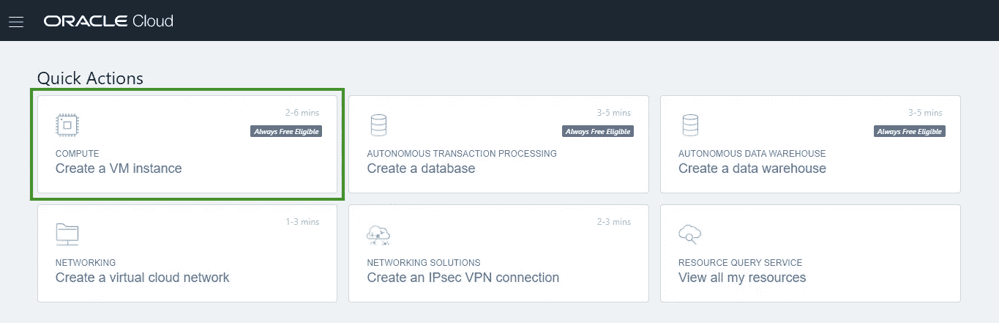
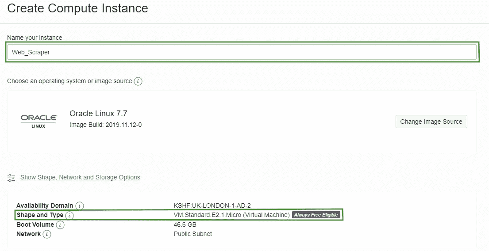
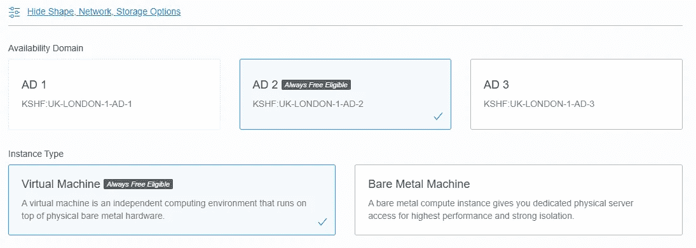
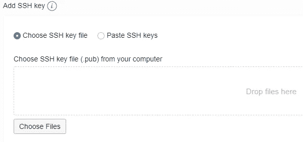
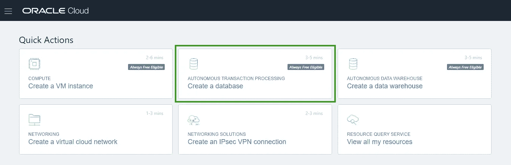
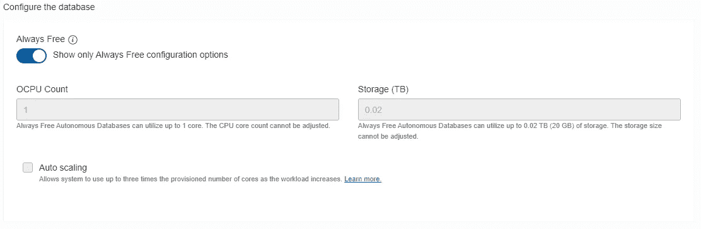

# 云 Web Scraper —设置

> 原文：<https://medium.com/analytics-vidhya/cloud-web-scraper-the-setup-c542ca77c6ae?source=collection_archive---------3----------------------->

如果你对网络抓取的概念不熟悉，我建议你阅读我写的这篇文章。他们是我将在这个刮擦系统上建立的想法。

我整理的东西开始时是一个有点笨重的 python 脚本，我会在本地运行它，从 LinkedIn 中抓取一些我自己的统计数据，并将输出保存到电子表格中。我一直在努力改进它，现在它运行在一个基于云的虚拟机上。这台机器将输出保存到数据库中，然后可以通过第二台运行小型 web 服务器的虚拟机进行可视化。

这种可视化显示了最近被抓取的帖子、具有最高浏览量的帖子和具有最高反应量的帖子。最重要的是，有一个简单的表单可以将新帖子插入到抓取列表中。

在本文中，我将详细介绍如何设置两个虚拟机和数据库。我将在后面的单独文章中继续介绍抓取和可视化数据的代码和脚本，以及在其中一个虚拟机上设置 web 服务器的代码和脚本。


## 设置虚拟机

首先，我们将使用甲骨文云(坚持免费层产品)，所以你需要[注册一个账户](http://bit.ly/OCTrialLink)。一旦你设置好你的账户，你应该会在主页上看到一个“快速行动”菜单。从这里，我们将开始设置虚拟机实例。



我们有两个虚拟机需要设置，它们都具有相同的设置。由于这种情况，我将运行一次设置。



首先，单击“创建虚拟机实例”按钮。您将进入一个页面，详细介绍虚拟机的设置。这里要做的第一件事是命名您的 VM 实例，使用有意义的名称使事情更容易进行。例如，在这些文章中，我将把他们称为“*网络爬虫*和“*可视化者*”。

接下来，确保“形状和类型”旁边有“*始终免费合格的*”标签(假设您想留在免费层)。您仍然需要打开“显示形状、网络和存储选项”菜单，但是如果这不在空闲层内，您需要选择不同的“*可用性域*”，直到在“更改形状”菜单中出现“*始终免费合格的*”形状。对于“英国-伦敦”地区，我发现' *AD 2* '应该提供正确的形状。



在“显示形状、网络和存储选项”菜单中，几乎在底部，有一个选项是“*不分配公共 IP 地址*”或“*分配公共 IP 地址*”。您需要将其更改为“*分配公共 IP 地址*”，以便我们可以远程访问虚拟机。



将 IP 地址设置为 public 后，您需要滚动到页面底部来上传您的公共 SSH 密钥。您可以使用任何工具来生成您的公钥-私钥对，您将在远程访问中使用它们。在我的例子中，我使用了“油灰键生成器”。如果您也这样做，请确保在“密钥”下拉菜单中选择了“SSH-2 RSA 密钥”。

生成密钥后，点击“保存私钥”按钮，将密钥保存在安全的地方。然后从密钥生成器窗口的框中复制公钥。将此粘贴到纯文本文件中，并使用文件类型'保存它。酒吧。点击“保存公钥”按钮，保存公钥的格式与窗口中显示的格式略有不同。

回到虚拟机设置页面点击“选择文件”按钮，并选择您的 ***公共*** 键。完成后，点击页面底部的“创建”。您需要等待几分钟，以便调配和启动虚拟机。同样，由于我们将使用两个虚拟机，因此您需要执行两次。



## 设置数据库

接下来，数据库设置更加简单。点击“快速操作”按钮，当您重定向到设置页面时，像命名虚拟机一样命名数据库。接下来，您需要向下滚动，确保“选择工作负载类型”设置为“*数据仓库*”，并且“选择部署类型”设置为“*无服务器*”。

这两个选项下面是“配置数据库”菜单。在这里你会发现一个“*永远免费*”滑块。确保此选项已打开(滑块后面的蓝色背景)。



最后，您需要向下滚动到下一部分，并设置您的管理员密码。确保您使用了安全的密码，并且您记住了它。设置完成后，滚动到页面底部，点击“创建自治数据库”按钮。

正如我之前所说的，我将介绍 python、SQL、HTML 等。在我的下一篇文章中。但是我将在这里介绍 WebScraper 所需的各种包和库，以防您同时想自己尝试这些概念。

因为我们使用的是 Oracle Linux(除非您更改了虚拟机上的默认设置)，所以首先要说明的是，它是一个 Red Hat Linux。在很大程度上，这种区别对我们来说是无关紧要的。然而，我们需要注意的是，我们将不会使用通常的“apt-get”包处理程序。在 Red Hat 发行版中，处理程序是“yum”。给我的一天带来一点快乐和幽默的启示。

## 包和 Python 库

首先，我将介绍我们需要的包，然后是 python 库(将使用 python 脚本进行抓取)。要安装它，您需要访问虚拟机实例。为此，您可以 SSH 到实例中；如果你不知道如何查看我写的这篇短文，我会告诉你如何去做。

```
$ sudo yum install python3
$ sudo yum install python3-pip
$ sudo yum install firefox
$ sudo yum install xorg-x11-utils.x86_64
$ sudo yum install xorg-x11-server-Xvfb.x86_64
```

*python3* 是为了能够执行 python 代码， *python3-pip* 是为了安装 python 库。我们将使用“ *firefox* 浏览器来浏览 LinkedIn，以便搜集我们想要的信息。

看起来神秘的' *xorg-x11-utils.x86_64* '让我们可以访问'*屏幕*命令。这允许我们启动一个“屏幕”，一个与终端窗口无关的终端实例，在这里我们可以设置代码运行。这使得我们可以避免终端窗口关闭时停止任何正在运行的代码或命令的问题。这在测试抓取时非常有用，因为代码执行的时间可能会超过连接超时，因此当终端断开连接时会失败。

最后，第二个 xorg，'*xorg-X11-server-xvfb . x86 _ 64*'，允许我们运行虚拟显示。这很重要，因为我们设置的虚拟机是无头的(没有显示器/其他显示器)，而 Firefox 需要一个显示器与之交互。

在所有的 yum 安装之后，是 python 库的时候了。这就是我们将使用' *pip3* '工具的地方。

```
$ sudo pip3 install pyvirtualdisplay
$ sudo pip3 install selenium
$ sudo pip3 install python-dotenv
$ sudo pip3 install webdriverdownloader
```

pyvirtualdisplay 允许我们从 python 脚本中与虚拟显示器进行交互。这是操作的基本要求，但同样重要。selenium 可以说是我们正在下载的最重要的库，因为它将控制浏览器以方便我们的抓取。

*一个‘的使用’。env*’文件不是必需的，但是它使共享脚本和文件变得更加简洁。我将在中包含的内容。如果你愿意，env 文件可以简单地硬编码到你的 python 脚本中。' *python-dotenv* '库将允许我们使用'*。env* 文件与我们的 python 脚本。

另一个有用但不重要的包含是' *webdriverdownloader* '。为了让 Firefox 在 Selenium 上正常工作，我们需要一个 web 驱动程序，在这里是 Gecko 驱动程序。虽然你可以去下载并手动安装，这个库只是简化了过程。安装后，运行以下命令:

```
$ python3
>>> from webdriverdownloader import GeckoDriverDownloader
>>> GeckoDriverDownloader().download_and_install()
```

一旦运行完成，您就可以下载并安装 Gecko 驱动程序了！最后要做的是将' *geckodriver* '添加到 PATH 变量中。这是按如下方式完成的:

```
$ readlink -f geckodriver
```

通过突出显示输出来复制该语句的输出，这将把它添加到剪贴板。在下一个语句中，当您进入“粘贴输出”时，只需右击鼠标，这将粘贴最后一个复制到剪贴板的项目。

```
$ export PATH=$PATH:'paste output'
```

最后，当我们自动运行 python 脚本时，为了使 Gecko 驱动程序可以被 VM 访问，将 PATH 变量复制到 sudo 用户的“crontab”文件中:

```
$ echo $PATH
```

像以前一样复制这个的输出。

```
$ sudo EDITOR=nano crontab -e
```

这将打开 sudo 用户的 crontab 文件，以 nano 作为编辑器。你可以使用任何你觉得最舒服的编辑器，但是我将假设使用 nano。将以下内容添加到文件中:

```
PATH='paste output'
```

然后按 ctrl+x 退出编辑器，按“y”保存所做的更改。这让我们的 WebScraper 虚拟机为 python 脚本的到来做好了准备。

几周后，当我讨论在 Visualiser 上设置 web 服务器时，请回来查看！

问题，评论？你可以在 LinkedIn 上找到我。

> *所有观点均为我个人观点，与甲骨文无关*