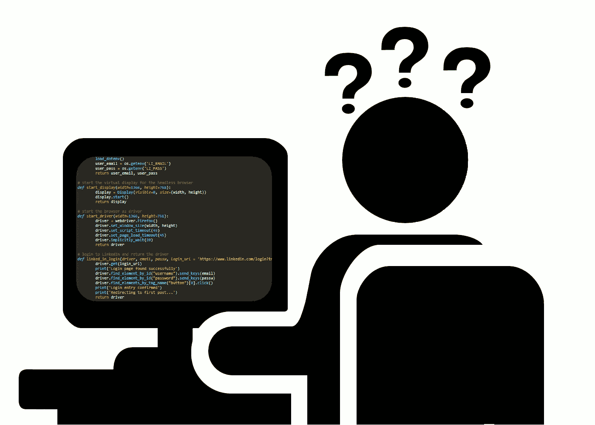
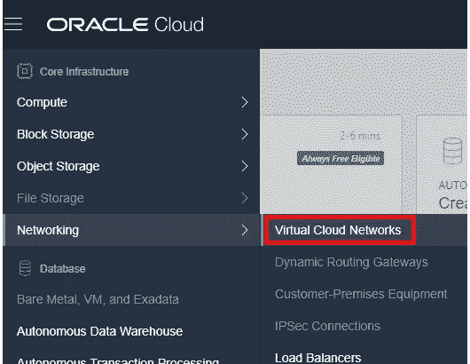
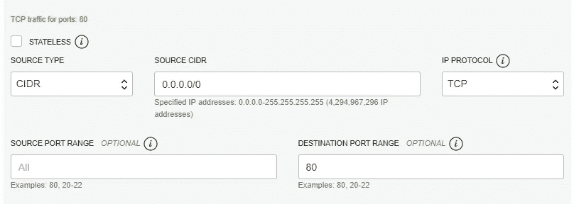

# 云网络抓取器——网络服务器

> 原文：<https://medium.com/analytics-vidhya/cloud-web-scraper-the-web-server-1a5b57cc8e4?source=collection_archive---------19----------------------->

这是我的网络抓取系列的第 2 部分，但是也可以独立完成。如果你是新来的:欢迎！如果你在第一部结束后还在这里:欢迎回来！

我们将着眼于设置一个虚拟机(VM ),用于可视化我们的 web scraper 收集的数据。但是它可以用于任何类型的基于 HTML 的网站。



这个设置专门针对 Oracle Linux 7.7，它只会影响安装包时的一些命名约定(与类 Ubuntu 发行版相比)，比如使用' yum '而不是' apt-get '。

## 服务器设置

按照你自己的规范或者按照我在[上一篇文章](/analytics-vidhya/cloud-web-scraper-the-setup-c542ca77c6ae)中的设置过程设置你的虚拟机，确保它当前正在运行。接下来，我们将通过 SSH 获得对它的远程访问。如果你不知道如何做，看看我写的这篇短文。

现在我们要安装这个包来运行我们的 web 服务器。这非常简单，只需要一个命令:

```
$ sudo yum install httpd
```

安装完成后，就可以开始配置 web 服务器了。首先，我们需要找到配置文件(httpd.conf)的位置。默认情况下，这应该是' */etc/httpd/conf/'* ，但这可能因人而异。为了确保运行这个命令(大写的“V”):

```
$ httpd -V
```

结果将是所安装的服务器的版本，以及几个已定义变量的信息。你要寻找这条线:

```
 -D HTTPD_ROOT="[location of root here]"
```

在“[location of root here]”目录中，您应该可以找到' *conf* '目录，以及其中的' *httpd.conf'* 文件。这里有几个关键行需要编辑/添加。请记住在您的调用前添加“sudo”以编辑该文件；例如'`$ sudo nano [location of root here]/conf/httpd.conf`'。如果您使用的是“nano”文本编辑器，您可以使用“ctrl+w”打开一个搜索栏来搜索文本并找到所需的部分。

确保在以“Listen:Allows you bind Apache…”开头的注释文本块下，添加或编辑一行内容为“Listen 0.0.0.0:80”。或者，如果您愿意，您可以从默认端口 80 改为监听另一个端口。如果您决定这样做:确保它不会干扰其他端口上侦听的任何内容，并记下您为以后选择的端口。

接下来向下滚动到(或搜索)以“document root:The directory from that…”开始的注释块。添加或编辑以下第一行:“document root”/var/www/html”。这是我们将要放置 html 文件的目录。接下来，您需要使用以下内容创建此目录:

```
$ sudo mkdir /var/www
$ sudo mkdir /var/www/html
```

为了便于测试，在 html 目录中添加一个“index.html”文件。如果您没有想要使用的，只需复制以下内容:

```
<!DOCTYPE html>
<html>
     <head>
          <title></title>
     </head>
     <body>
          Hello, this is a test file
     </body>
</html>
```

并将其添加到新文件中，如下所示:

```
$ cd /var/www/html
$ sudo nano index.html
  [right click the mouse to paste the copied text]
  [press ctrl+x, then y when prompted to save]
```

现在我们已经设置好了 web 服务器，并准备好了一个测试文件。让我们检查一下服务器是否真的在运行。运行命令'`service httpd status`'。查找返回的以“Active:”开头的行。它会告诉你服务是“非活动的”还是“活动的(正在运行)”。如果它处于非活动状态，只需运行命令'`sudo service httpd start`'。然后再次运行状态命令。

## 对安全性列表的更改

现在我们已经有了服务器，让我们前往 Oracle cloud 站点(如果您是从本系列的第 1 部分开始的),更改一些安全设置，以便外部世界可以访问您的服务器上的 web 页面。如果你像我一样，想通过电脑浏览器浏览网页，这是很有必要的。



一旦您返回并登录，打开屏幕左上方的下拉菜单。向下移动到“*网络”*，点击“*虚拟云网络*”。除非您自己做了任何更改，否则这会将您带到一个列出了一个网络的表格——类似于“*VirtualCloudNetwork-…*”的内容，后跟一串与其创建日期和时间相关的数字。点击此处，然后在下一页上列出'*公共子网*，最后在下一页上点击'*【此处网络名称】*【默认安全列表】。



新的入口规则设置

现在，这就是我们正在寻找的:'*入口规则*表，以及'*添加入口规则*按钮。现在点击那个按钮。

我们的新规则将允许外部访问端口 80，或者您在上面选择的任何一个端口。这将允许它向任何拥有该 IP 地址的人提供我们创建的网页。只需复制上图/左图中提供的设置(取决于您的设备)，根据需要更改端口号。然后点击“*添加入口规则*”，你的网络就排序了。

最后，在我们可以访问 web 服务器之前，回到您的虚拟机并运行以下命令:

```
sudo firewall-cmd --add-service http --permanent
```

这允许虚拟机接受 HTTP 流量，而“- permanent”使其在虚拟机重启之间保持不变。

已经介绍了 VM 和数据库设置过程，并且设置了 web 服务器，我的下一篇文章将(最终)讨论 web 抓取！请在几周后继续关注。

问题，评论？你可以在 LinkedIn 上找到我。

> **所有观点均为我个人观点，不代表甲骨文**