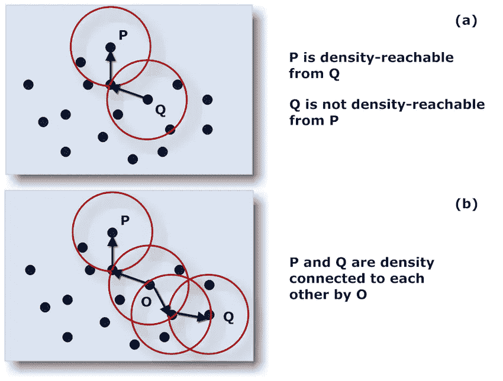
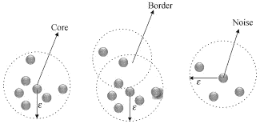
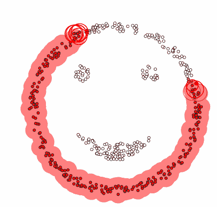
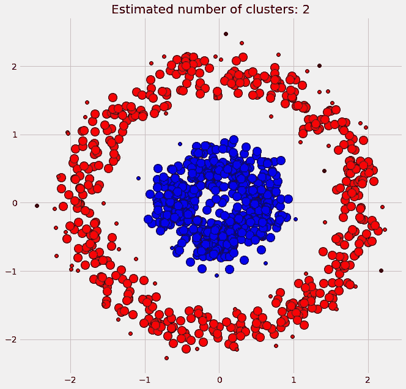
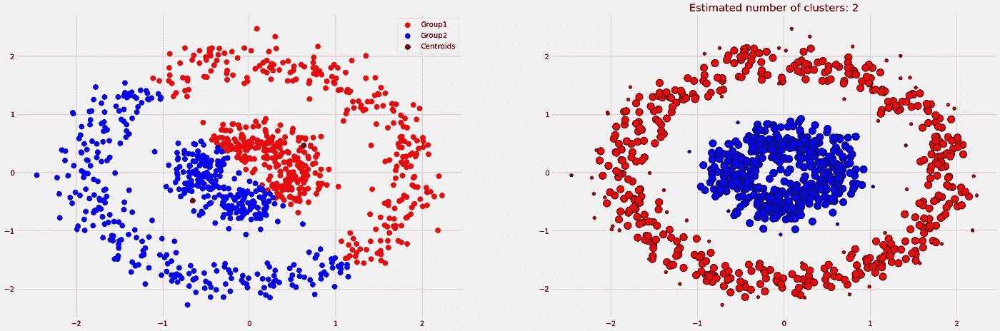

# 使用 DBSCAN 的聚类分析:基于密度的带噪声应用程序空间聚类

> 原文：<https://medium.com/analytics-vidhya/cluster-analysis-with-dbscan-density-based-spatial-clustering-of-applications-with-noise-6ade1ec23555?source=collection_archive---------4----------------------->

C 聚类分析(luster Analysis)是一种无监督的机器学习方法，将数据点划分为簇或组，使得一个簇/组中的所有数据点具有相似的属性或特征。聚类分析有四个主要类别:分区方法(K-means)、层次方法(BIRCH)、基于密度的方法(DBSCAN)和基于网格的方法。

通常，所有的聚类算法都有相同的方法，即寻找数据点之间的相似性并将它们分组在一起。这里我们将重点介绍基于密度的聚类方法 DBSCAN(含噪声应用的基于密度的空间聚类)方法。

***什么是基于密度的聚类？*** It 是一种在数据中识别与众不同的聚类的方法，其核心思想是，一个聚类是一组高数据点密度，通过低数据点密度的区域与其他此类聚类分开。主要思想是找到高度密集的区域，并将它们视为一个集群。它可以很容易地从大量包含噪声和异常值的数据中发现不同形状和大小的簇。

DBSCAN 算法使用两个主要参数:

*   **minPts:** 被认为是密集的区域中聚集在一起的点的最小数量(阈值)，即可以形成一个聚类的数据点的最小数量
*   **eps (ε):** 用于定位任意点邻域内的点的距离度量。

该算法考虑了两个概念，称为密度可达性和密度连通性。

*   **密度可达性**:如果一个点与另一个点在特定距离(eps)之内，则该点可以从另一个点到达，这表明一个集群有多稠密可以到达。
*   **密度连接:** DBSCAN 涉及基于传递性的链接方法，以确定点是否位于特定的簇中。例如，如果 a- > b- > c- > d，其中 p- > q 表示 q 在 p 的邻域内，则 a 点和 d 点可以连通。

密度可达性和密度连通性

在这种方法中，有三种不同类型的数据点:

1.  **核心数据点:**距离“ε”内至少有“minPts”的数据点。
2.  **边界数据点:**距离核心数据点“ε”以内的数据点，但不是核心点。
3.  **噪声数据点:**既不是核心数据点也不是边界数据点的数据点。

点的类型

**DBS can 聚类的算法步骤**

1.  最初，它从一个随机的未访问的起始数据点开始。'ɛ'距离内的所有点都被归类为邻域点。
2.  它需要邻域内最小数量的“minPts”点来开始聚类过程。否则，该点将被标记为“噪声”
3.  距离'ɛ'以内的所有点都成为同一个集群的一部分。对添加到群集组的所有新点重复该过程。继续下去，直到它访问并标记该聚类的'ɛ'邻域内的每个点。
4.  在该过程完成时，它从新的未访问点再次开始，从而导致发现更多的聚类或噪声。在该过程的最后，确保将每个点标记为聚类或噪声。

DBSCAN 的工作

现在，让我们使用来自 [sklearn.datasets](https://scikit-learn.org/stable/modules/generated/sklearn.datasets.make_circles.html#sklearn.datasets.make_circles) 和 DBSCAN 模块的样本数据集实现相同的功能，其中'**【ε】'为 0.3，' **minPts'** 为 10。**

之后，执行相同的操作，我们可以发现，它将所有数据点分类为两个圆形聚类，并且离群数据点(黑色中的数据点)被视为噪声。

聚类的输出

现在问题来了，“当我们有更简单的算法作为 k-means 时，为什么要进行 DBSCAN？”
K-means 算法倾向于只形成**球形簇**。当数据本质上不是球形时，即在所有方向上变化相等时，它会失败。此外，K-means 对异常值敏感，所以基本上数据点的微小变化可能会影响聚类结果。此外，DBSCAN 自己检测集群的数量，不需要任何先验知识。然而，K-means 不是这种情况，我们需要在建模之前决定聚类‘K’的数量**。**

****

**K 均值和 DBSCAN 的区别**

**这里可以参考 **GitHub 代码**:[https://GitHub . com/kavyagajjar/Clustering/blob/main/DBS can/Cluster _ Analysis _ with _ DBS can . ipynb](https://github.com/kavyagajjar/Clustering/blob/main/DBSCAN/Cluster_Analysis_with_DBSCAN.ipynb)**

**此外，请参考此[链接](https://scikit-learn.org/stable/auto_examples/cluster/plot_cluster_comparison.html#sphx-glr-auto-examples-cluster-plot-cluster-comparison-py)了解不同集群技术之间的差异**