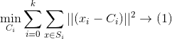

# 聚类作为矩阵分解

> 原文：<https://medium.com/analytics-vidhya/clustering-as-matrix-factorization-65b871cf2ab9?source=collection_archive---------10----------------------->

图片来源— [科技危机](https://techcrunch.com/2019/03/18/how-to-build-the-matrix/)

这篇博客文章试图简要介绍如何在 K-means 聚类中使用矩阵分解来聚类相似的数据点。

K 均值聚类中的主要目标函数由下式给出:

图 1

其中 K 是聚类的数量，Si 是属于聚类 I 的所有点的集合，x 是数据点，Ci 是第 I 个聚类。(x-Ci)指点 x 到质心 Ci 的距离。

我们必须记住，只有当且仅当 x 属于簇 Si 时，才计算(x-Ci)。如果数据点 x 不属于聚类 Si，则(x-Ci)的值为 0。

在我们将上述目标函数转换为矩阵分解问题之前，让我们定义一个新的名为 Z 的 k×n 维矩阵，其中 k 是质心/聚类的数量，n 是数据点的总数。

图 2

图 3

以下是 Z 的属性:

图 4

让我们举个例子来理解 z 的这个性质。如果 Z₂₃ = 1，它暗示数据点 x₃属于聚类集 S₂，并且它的质心是 C₂.如果 Z₃₂ = 0，这意味着数据点 x₂不属于聚类集 S₃，因此 C₃不是 x₂.的质心

所以，基本上矩阵 Z 告诉你哪些数据点属于哪个聚类，什么是它的质心，什么不是。

如果我们在由图 1 中的等式表示的目标函数中使用 Z 的这个属性，我们得到，

图 5

图 6

等式 1 和等式 2 给出了相同的结果。用矩阵形式表示等式 2，我们得到:

图 7

图 8

这里，Z 具有稀疏列，即，在其每一列中只有一个值是 1，而其余的值是 0，因为每个数据点只能有一个质心。

设 Cᵢ是 c 的 iᵗʰ行，Zⱼ是 z 的 jᵗʰ列，那么，

图 9

所以，当我们做 C * Z 的时候，

图 10

这里，等式(3)右侧只有一项非零，因为每个数据点只能有一个质心，而其余项为零。

因此，C * Z 有效地只迎合那些属于一个聚类的数据点。

总之，使用未知矩阵 C & Z，我们预测已知矩阵 x。因此，这是一个矩阵分解问题。在这个过程中，当我们找到 C 时，我们已经找到了 x 中每个数据点的质心。因此，这也是一个聚类问题。