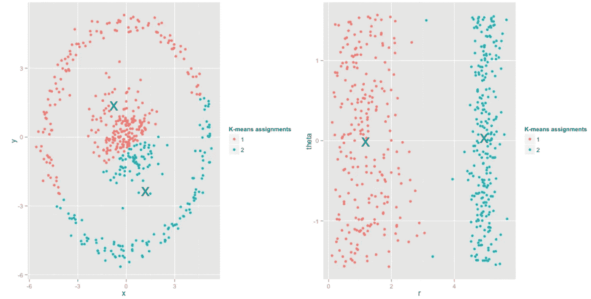
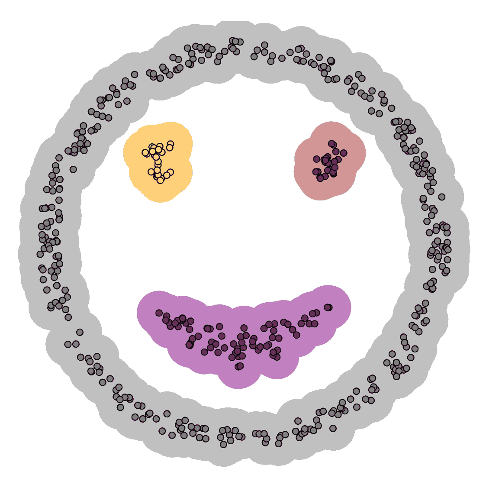
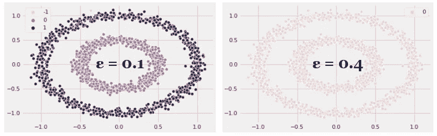

# 集群:物以类聚，人以群分

> 原文：<https://medium.com/analytics-vidhya/clustering-birds-of-a-feather-flock-together-8ae84657b997?source=collection_archive---------22----------------------->

亚历克斯·霍利奥克在 [Unsplash](https://unsplash.com/s/photos/flock-together?utm_source=unsplash&utm_medium=referral&utm_content=creditCopyText) 上拍摄的照片

将数据点分组到组(簇)中，使得组中的点彼此比组外的点更“相似”的任务称为聚类。但是如何知道一个数据点是否与另一个数据点相似呢？这种定义相似性的行为是各种聚类方法相互区分的原因——K-Means 通过数据点与聚类质心的接近程度来定义相似性，而 DBSCAN 通过将相同密度区域内的数据点组合在一起来定义相似性。

在本文中，我们将看看这两种在无监督机器学习中经常使用的聚类方法，并在 Python 中实现它们。所以让我们开始吧！

# k 均值

K-Means 聚类分析算法是一种硬聚类分析，即一个数据点只能完全属于一个聚类(与软聚类分析方法相反，在软聚类分析方法中，每个数据点都被分配了一个概率或可能性来属于给定的聚类)。

K-Means 算法通过以下步骤进行迭代:

1.  **指定所需的聚类数 k。**
2.  以某种方式初始化 K 个簇形心。质心不一定是数据点本身，但可以在数据域内生成。
3.  **将每个数据点分配到其最近的聚类质心**。“最接近”是通过最小化欧几里德距离(或 L2 范数)来定义的，欧几里德距离是向量值平方之和的平方根(想想 2D 的毕达哥拉斯定理)。
4.  **通过计算每个聚类内所有点的平均值并设置新的质心值，重新分配 K 个聚类质心**。
5.  计算每个质心从其先前值改变的距离
6.  重复步骤 3、4 和 5，直到每个质心变化的距离低于预定义的阈值，或者直到达到预定义的迭代次数。

## k-意味着假设和限制

值得注意的是，K-Means 减少了组内平方和，即每个组内观察值的方差。换句话说，平方和小的集群比平方和大的集群更紧凑。此外，随着一个聚类内的观察数量的增加，平方和也变得更大。因此， **K-Means 在数据点被组织成** [**【凸状】**](https://en.wikipedia.org/wiki/Convex_set) **、球状集群并且在每个集群内包含大致相同数量的点**时效果最佳。

在下图中，K-Means 很难将左侧的数据点聚类成两个组，而将数据集从笛卡尔坐标转换到极坐标会产生合理的聚类分配。因此，**在对数据集应用聚类算法之前，重要的一点是可视化并理解数据集**。

来源:[http://varianceexplained.org/r/kmeans-free-lunch/](http://varianceexplained.org/r/kmeans-free-lunch/)

此外，由于 K-Means 要求预定义聚类数，因此选择正确的 K 值很重要，但也很困难，尤其是当您无法可视化数据集中的所有维度时。但是，当要选择的聚类数不清楚时，您可以使用[肘方法](https://en.wikipedia.org/wiki/Elbow_method_(clustering))或[侧影方法](https://en.wikipedia.org/wiki/Silhouette_(clustering))来确定 K 的最佳选择。

# 基于密度的噪声应用空间聚类

[基于密度的带噪声应用空间聚类](https://www.aaai.org/Papers/KDD/1996/KDD96-037.pdf)或简称为 DBSCAN，于 1996 年提出，它根据点的密度组织聚类，与 K-Means 不同，它在没有用户输入的情况下确定要生成的聚类数。此外，DBSCAN 允许我们通过将噪声定义为密度点低于聚类的区域来对噪声进行分类(不同于 K-Means)。例如，K-Means 很难适应下面的分布，而 DBSCAN 能够根据点的密度正确识别聚类。

来源:[https://www . naftaliharris . com/blog/visualizing-DBS can-clustering/](https://www.naftaliharris.com/blog/visualizing-dbscan-clustering/)

DBSCAN 中有两个关键概念/超参数— *MinPts* 和 *Eps* :

1.  对于聚类中的每个点，在其邻域中必须至少有指定的最小数量的点( *MinPts* )，即邻域中的密度必须超过某个阈值。参数 *MinPts* 主要控制算法对噪声的容忍程度。
2.  邻域被定义为点( *Eps* )周围的空间，其形状由选择的距离函数决定，即当在 2D 空间中使用曼哈顿距离时，邻域的形状是矩形的。与 K-Means 类似，DBSCAN 最常用的距离函数是欧几里德距离。

使用这两个超参数，DBSCAN 将数据点分为三类:*核心点、*或聚类内部的点、*边界点、*或聚类边缘上的点，以及*噪声*，或不属于任何聚类的点。

## DBSCAN 假设和限制

因为参数 *Eps* 控制数据点的局部邻域并影响聚类分配，所以适当选择它是至关重要的，并且它通常不能保留默认值。如果设置得太大，集群将合并到另一个集群中，如果 *Eps* 足够大，最终返回一个集群。如果设置过小，大多数数据点根本不会被聚类或归类为噪声。下图显示了选择正确的 *Eps* 值的重要性。

改变ε值的影响

此外，DBSCAN 难以处理包含密度差异很大的聚类的数据集，因为无法为每个聚类定制参数 *Eps* 和 *MinPts* 。对于高维数据，欧几里德距离的标准选择受到影响，这使得为 *Eps* 找到合适的值具有挑战性。因此，对于 K-Means，**在对数据集应用聚类算法之前** **可视化和理解数据集是很重要的**。

# 履行

[参考下面的笔记本](https://github.com/jissac/ScratchML/blob/master/Clustering.ipynb)了解 K-Means 和 DBSCAN 的从头开始的 Python 实现，以及与流行的 Scikit-Learn 算法实现的比较。希望它能帮助你理解这两种算法的内部工作原理以及每种算法背后的假设！

# 摘要

总之，K-Means 和 DBSCAN 是两种强大的算法，当您有一个未标记的数据集需要聚类成组时可以使用。然而，**请记住您选择的模型所基于的假设** —为了从模型中获得正确的预测，了解数据集并对其进行预处理是必不可少的。另外，请务必阅读 Scikit-Learn 集群文档，以了解其他集群算法！

# 参考/有用链接:

https://scikit-learn.org/stable/modules/clustering.html

[https://support . minitab . com/en-us/minitab/18/help-and-how-to/modeling-statistics/multivarial/how-to/cluster-k-means/interpret-the-results/all-statistics-and-graphs/](https://support.minitab.com/en-us/minitab/18/help-and-how-to/modeling-statistics/multivariate/how-to/cluster-k-means/interpret-the-results/all-statistics-and-graphs/)

[https://www.aaai.org/Papers/KDD/1996/KDD96-037.pdf](https://www.aaai.org/Papers/KDD/1996/KDD96-037.pdf)