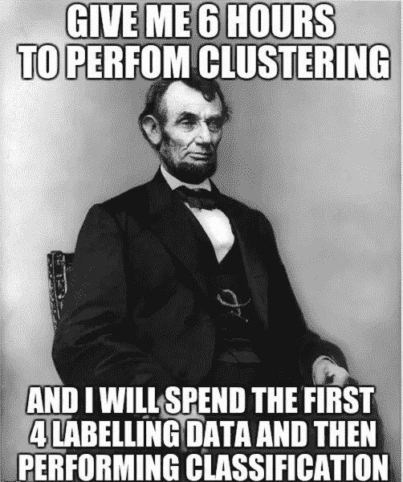
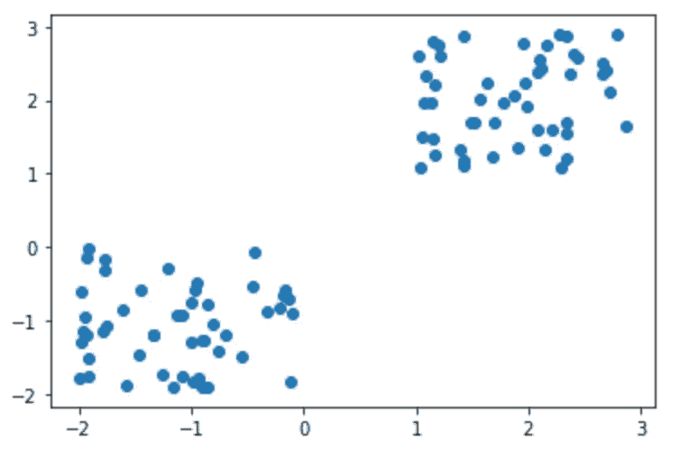
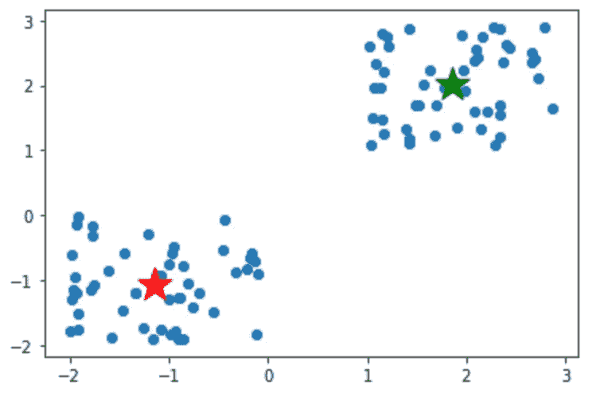

# 聚类数据

> 原文：<https://medium.com/analytics-vidhya/clustering-data-2c1b28b72472?source=collection_archive---------23----------------------->

简而言之，数据聚类就是将数据点划分为数据组，我们将具有相似特征的组分离出来，并将它们分配到聚类中。

我们为什么要这么做？好吧，我们试着用一个例子来理解这一点。假设您是一家汽车租赁公司的主管，您想开始为客户提供公司车队的服务。你会怎么做？您可以单独调查每个客户，这将非常耗时且耗费大量资源。研究每笔交易/每名客户的租赁详情，并为他们每个人制定策略，如何？绝对不行。



但是…如果你能把所有的顾客分成三组，比如商务旅客、休闲旅客和学生，那会怎么样呢？现在，您可以针对这些群体定制您公司的车队产品。那就是聚类。我们把商务旅客分成一个部分，度假者分成另一个部分，等等。

现在我们知道了什么是聚类，以及它为什么会有帮助，让我们来讨论一种特定类型的聚类算法:K-Means。

K-Means 是最简单和最流行的无监督机器学习算法之一。无监督的机器学习将仅使用输入变量(也称为自变量)从给定的一组数据中做出推断(我们不会用 K-Means 预测任何东西)。

K-Means 从一组随机选择的质心开始，作为每个聚类的起始点，然后遍历这些聚类以优化每个质心的位置。当发生以下两种情况之一时，K-Means 将停止优化质心:质心已经稳定，这意味着它们的值没有变化，因为聚类成功，或者已经达到我们指定的迭代次数。

K-Means 速度很快，可以在数千甚至数百万个数据点上运行，但也有缺点。首先，当一些数据点比其他数据点分布得更密集时，它不能很好地工作。其次，由数据科学家来选择聚类的数量( *k* )，这需要一个明智的定性决策。让我们快速浏览一下为 k-means 导入适当库的过程，以及一个示例:

**步骤 1(导入库):**

```
import numpy as np 
import pandas as pd
import matplotlib.pyplot as plt
from sklearn.cluster import KMeans
```

**第二步(生成一些要使用的数据):**

```
X = -2 * np.random.rand(100,2)X1 = 1 + 2 * np.random.rand(50, 2)X[50:100, :] = X1plt.scatter(X[:, 0], X[:, 1])
```

在上面的代码框中，我们生成了 100 个随机数据点，分成两组，每组 50 个点。Matplotlib 然后为我们绘制数据，如下所示:



**第三步(K 均值和聚类中心):**

```
km = KMeans(n_clusters = 2)km.fit(X)
```

请注意，我们在上面选择了 2 的 k 值，因为我们显然有两个数据集群。

```
km.cluster_centers_
```

**步骤 4(绘制质心):**

```
plt.scatter(X[:, 0], X[:, 1])plt.scatter(-1.14772566, -1.0781176, marker = '*', color = 'red', s = 500)plt.scatter(1.85158417, 2.02497047, marker = '*', color = 'green', s = 500)plt.show();
```

上面的代码看起来很复杂，但它所做的只是从我们随机生成的数据中绘制出原始的分散点，然后绘制出星形的质心。质心的坐标来自我们在步骤 3 中运行的 km.cluster_centers_ code。



**第五步(测试):**

```
km.labels_
```

下面是上面代码的输出:

```
array([0, 0, 0, 0, 0, 0, 0, 0, 0, 0, 0, 0, 0, 0, 0, 0, 0, 0, 0, 0, 0, 0,
       0, 0, 0, 0, 0, 0, 0, 0, 0, 0, 0, 0, 0, 0, 0, 0, 0, 0, 0, 0, 0, 0,
       0, 0, 0, 0, 0, 0, 1, 1, 1, 1, 1, 1, 1, 1, 1, 1, 1, 1, 1, 1, 1, 1,
       1, 1, 1, 1, 1, 1, 1, 1, 1, 1, 1, 1, 1, 1, 1, 1, 1, 1, 1, 1, 1, 1,
       1, 1, 1, 1, 1, 1, 1, 1, 1, 1, 1, 1])
```

我们在上面看到的是我们散点图的文本版本:一半的数据点在聚类 0 中，另一半在聚类 1 中。

K-Means 是迄今为止最流行的无监督机器学习算法。理解起来并不复杂，甚至解释起来也不复杂，而且很快给你结果。还有其他更复杂的无监督算法，但 K-Means 非常适合初学者。试试吧！