# 聚类地理位置:DBSCAN

> 原文：<https://medium.com/analytics-vidhya/clustering-geo-location-dbscan-cadb33b0442e?source=collection_archive---------0----------------------->

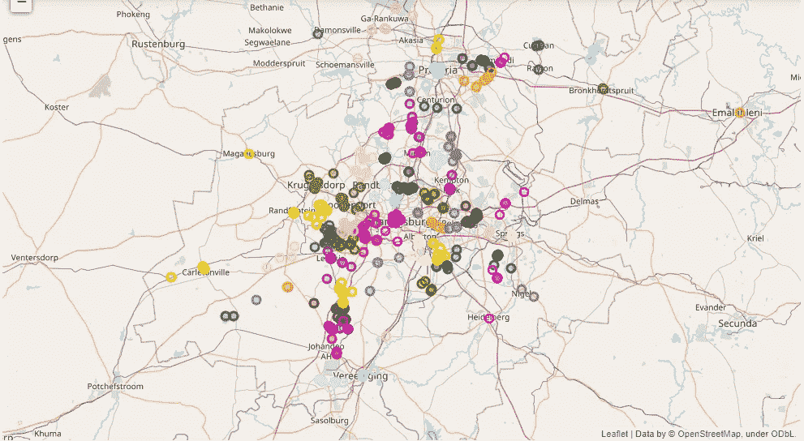

# **聚类**

C **聚类是大型数据库中知识发现的主要数据挖掘方法之一。它是根据相似性对大型数据集进行分组的过程。聚类分析是许多工程和科学应用领域的主要工具，包括数据分割、** [**连续属性的离散化**](https://g.co/kgs/6XeZQx) **、数据简化、离群点检测、噪声过滤、模式识别和图像处理**

# **DBSCAN ( *带噪声的应用程序的基于密度的空间聚类* )**

**DBSCAN *(含噪声应用的基于密度的空间聚类)是一种重要的空间聚类技术，在众多应用中被广泛采用。DBSCAN 是一种用于机器学习的聚类方法，用于将高密度的聚类与低密度的聚类分开。鉴于 DBSCAN 是一种基于密度的聚类算法，它在寻找数据中具有高密度观测值的区域，而不是观测值不太密集的区域方面做得很好。***

**目录**

**1: *探索性数据分析***

**2: *可视化地理数据***

**3:聚类强度/性能指标**

**4: *K 均值聚类***

**5:*DBS can***

**6:*hdb scan***

**7: *处理异常值***

> **“我们有出租车停靠点位置，并且想要定义这些出租车的关键集群，在那里我们可以为在该区域运营的所有出租车建立服务站”。**

# **先决条件**

我们必须安装笔记本中没有内置的外部库。

1.  **HDBSCAN**

```
**#installing HDBSCAN 
!pip install hdbscan**
```

**2。叶子**

```
**!pip install folium**
```

**3。正则表达式**

```
**!pip install re**
```

# **让我们开始编码**

***导入库***

```
**import matplotlib
%matplotlib inline
%config InlineBackend.figure_format = 'svg'
import matplotlib.pyplot as plt
plt.style.use('ggplot')****import pandas as pd
import numpy as np
import seaborn as sns
from tqdm import tqdm****from sklearn.cluster import KMeans, DBSCAN
from sklearn.metrics import silhouette_score
from sklearn.datasets import make_blobs
from sklearn.neighbors import KNeighborsClassifier****from ipywidgets import interactive****from collections import defaultdict****import hdbscan
import folium
import re****cols = ['#e6194b', '#3cb44b', '#ffe119', '#4363d8', '#f58231', '#911eb4',
        '#46f0f0', '#f032e6', '#bcf60c', '#fabebe', '#008080', '#e6beff', 
        '#9a6324', '#fffac8', '#800000', '#aaffc3', '#808000', '#ffd8b1', 
        '#000075', '#808080']*10****sns.set(style="white")** 
```

# 探索性数据分析

```
df = pd.read_csv('taxi_data.csv')
df.head()
```

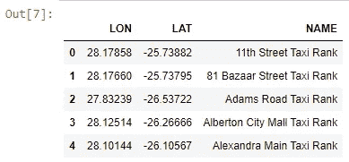

```
df.duplicated(subset=['LON', 'LAT']).values.any()
**output:TRUE**df.isna().values.any()
**output:TRUE**
```

**删除 NaN &重复行**

```
print(f'Before dropping NaNs and dupes\t:\tdf.shape = {df.shape}')
df.dropna(inplace=True)
df.drop_duplicates(subset=['LON', 'LAT'], keep='first', inplace=True)
print(f'After dropping NaNs and dupes\t:\tdf.shape = {df.shape}')**output**
**Before dropping NaNs and dupes	:	df.shape = (838, 3)
After dropping NaNs and dupes	:	df.shape = (823, 3)**
```

**散点图可视化**

```
X = np.array(df[[‘LON’, ‘LAT’]], dtype=’float64')
plt.scatter(X[:,0], X[:,1], alpha=0.2, s=50)
```

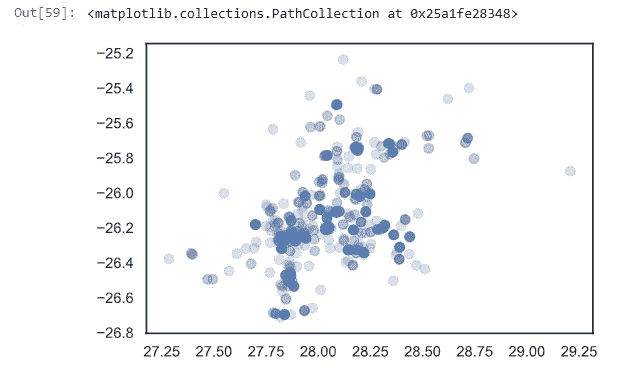

# 可视化地理数据

```
m = folium.Map(location=[df.LAT.mean(), df.LON.mean()], zoom_start=9, 
               tiles='OpenStreet Map')for _, row in df.iterrows():
    folium.CircleMarker(
        location=[row.LAT, row.LON],
        radius=5,
        popup=re.sub(r'[^a-zA-Z ]+', '', row.NAME),
        color='#1787FE',
        fill=True,
        fill_colour='#1787FE'
    ).add_to(m) m
```

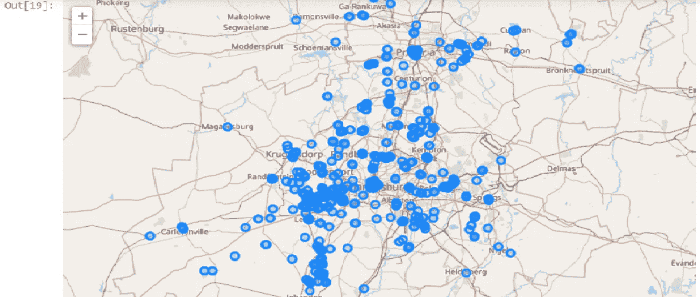

# 聚类强度/性能指标

**绩效指标**用于衡量企业的**行为、活动和绩效。这应该是在一个范围内测量所需数据的数据形式，允许形成支持总体业务目标实现的基础。**

```
X_blobs, _ = make_blobs(n_samples=1000, centers=10, n_features=2, 
                        cluster_std=0.5, random_state=4)plt.scatter(X_blobs[:,0], X_blobs[:,1], alpha=0.2)
```

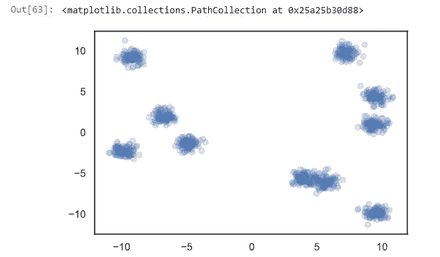

```
class_predictions = np.load('sample_clusters.npy')unique_clusters = np.unique(class_predictions)
for unique_cluster in unique_clusters:
    X = X_blobs[class_predictions==unique_cluster]
    plt.scatter(X[:,0], X[:,1], alpha=0.2, c=cols[unique_cluster])
```

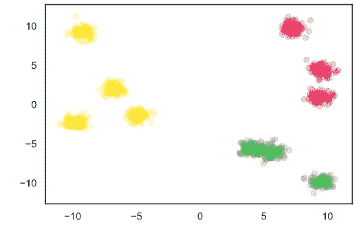

```
silhouette_score(X_blobs, class_predictions)
**output:0.6657220862867241**
```

```
class_predictions = np.load('sample_clusters_improved.npy')
unique_clusters = np.unique(class_predictions)
for unique_cluster in unique_clusters:
    X = X_blobs[class_predictions==unique_cluster]
    plt.scatter(X[:,0], X[:,1], alpha=0.2, c=cols[unique_cluster])
```

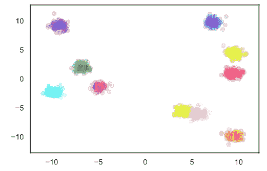

```
silhouette_score(X_blobs, class_predictions)
**output:0.7473587799908298**
```

# k 均值聚类

```
X_blobs, _ = make_blobs(n_samples=1000, centers=50, 
                        n_features=2, cluster_std=1, random_state=4)
data = defaultdict(dict)
for x in range(1,21):
    model = KMeans(n_clusters=3, random_state=17, 
                   max_iter=x, n_init=1).fit(X_blobs)

    data[x]['class_predictions'] = model.predict(X_blobs)
    data[x]['centroids'] = model.cluster_centers_
    data[x]['unique_classes'] = np.unique(class_predictions)def f(x):
    class_predictions = data[x]['class_predictions']
    centroids = data[x]['centroids']
    unique_classes = data[x]['unique_classes']for unique_class in unique_classes:
            plt.scatter(X_blobs[class_predictions==unique_class][:,0], 
                        X_blobs[class_predictions==unique_class][:,1], 
                        alpha=0.3, c=cols[unique_class])
    plt.scatter(centroids[:,0], centroids[:,1], s=200, c='#000000', marker='v')
    plt.ylim([-15,15]); plt.xlim([-15,15])
    plt.title('How K-Means Clusters')interactive_plot = interactive(f, x=(1, 20))
output = interactive_plot.children[-1]
output.layout.height = '350px'
interactive_plotX = np.array(df[['LON', 'LAT']], dtype='float64')
k = 70
model = KMeans(n_clusters=k, random_state=17).fit(X)
class_predictions = model.predict(X)
df[f'CLUSTER_kmeans{k}'] = class_predictionsdf.head()
```

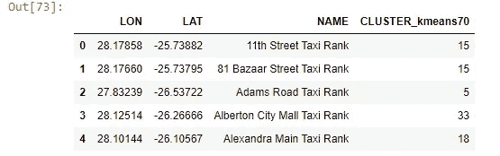

```
def create_map(df, cluster_column):
    m = folium.Map(location=[df.LAT.mean(), df.LON.mean()], zoom_start=9, tiles='OpenStreet Map')for _, row in df.iterrows():if row[cluster_column] == -1:
            cluster_colour = '#000000'
        else:
            cluster_colour = cols[row[cluster_column]]folium.CircleMarker(
            location= [row['LAT'], row['LON']],
            radius=5,
            popup= row[cluster_column],
            color=cluster_colour,
            fill=True,
            fill_color=cluster_colour
        ).add_to(m)

    return mm = create_map(df, 'CLUSTER_kmeans70')
print(f'K={k}')
print(f'Silhouette Score: {silhouette_score(X, class_predictions)}')m.save('kmeans_70.html')**OUTPUT:
K=99
Silhouette Score: 0.6971082963940812**m
```

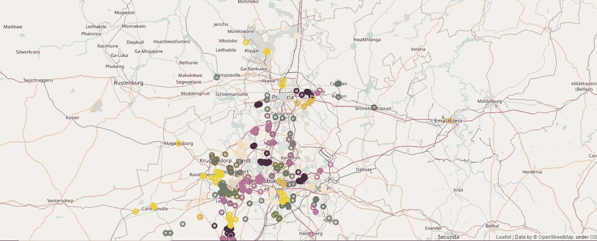

```
best_silhouette, best_k = -1, 0for k in tqdm(range(2, 100)):
    model = KMeans(n_clusters=k, random_state=1).fit(X)
    class_predictions = model.predict(X)

    curr_silhouette = silhouette_score(X, class_predictions)
    if curr_silhouette > best_silhouette:
        best_k = k
        best_silhouette = curr_silhouette

print(f'K={best_k}')
print(f'Silhouette Score: {best_silhouette}')
```

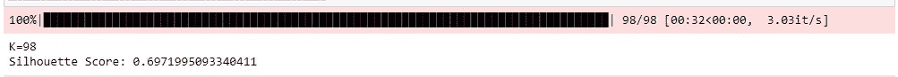

# 基于密度的噪声应用空间聚类

基于密度的含噪声应用空间聚类

**用于索引某些值的代码**

```
dummy = np.array([-1, -1, -1, 2, 3, 4, 5, -1])new = np.array([(counter+2)*x if x==-1 else x for counter, x in enumerate(dummy)])model = DBSCAN(eps=0.01, min_samples=5).fit(X)
class_predictions = model.labels_df['CLUSTERS_DBSCAN'] = class_predictionsm = create_map(df, 'CLUSTERS_DBSCAN')print(f'Number of clusters found: {len(np.unique(class_predictions))}')
print(f'Number of outliers found: {len(class_predictions[class_predictions==-1])}')print(f'Silhouette ignoring outliers: {silhouette_score(X[class_predictions!=-1], class_predictions[class_predictions!=-1])}')no_outliers = 0
no_outliers = np.array([(counter+2)*x if x==-1 else x for counter, x in enumerate(class_predictions)])
print(f'Silhouette outliers as singletons: {silhouette_score(X, no_outliers)}')
```

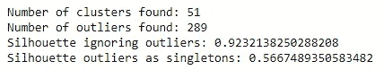

```
m
```

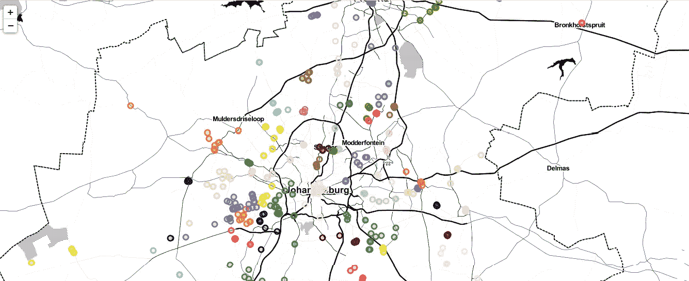

```
hdbscan.HDBSCAN?
```

# 处理异常值

一个**离群值**是一个明显偏离其余对象的对象。它们可能是由测量或执行错误引起的。异常数据的分析被称为异常分析或异常挖掘。

```
classifier = KNeighborsClassifier(n_neighbors=1)df_train = df[df.CLUSTER_HDBSCAN!=-1]
df_predict = df[df.CLUSTER_HDBSCAN==-1]X_train = np.array(df_train[['LON', 'LAT']], dtype='float64')
y_train = np.array(df_train['CLUSTER_HDBSCAN'])X_predict = np.array(df_predict[['LON', 'LAT']], dtype='float64')classifier.fit(X_train, y_train) **KNeighborsClassifier(algorithm='auto', leaf_size=30, metric='minkowski',
                     metric_params=None, n_jobs=None, n_neighbors=1, p=2,
                     weights='uniform')**predictions = classifier.predict(X_predict)
df['CLUSTER_hybrid'] = df['CLUSTER_HDBSCAN']
df.loc[df.CLUSTER_HDBSCAN==-1, 'CLUSTER_hybrid'] = predictions
m = create_map(df, 'CLUSTER_hybrid')
m
```

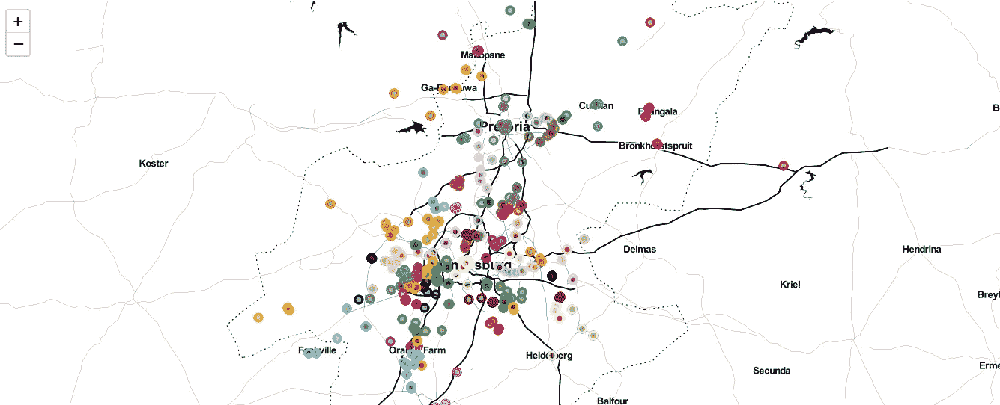

```
class_predictions = df.CLUSTER_hybrid
print(f'Number of clusters found: {len(np.unique(class_predictions))}')
print(f'Silhouette: {silhouette_score(X, class_predictions)}')m.save('hybrid.html')**OUTPUT
Number of clusters found: 66
Silhouette: 0.5849126494706486** df['CLUSTER_hybrid'].value_counts().plot.hist(bins=70, alpha=0.4, 
                                              label='Hybrid')
df['CLUSTER_kmeans70'].value_counts().plot.hist(bins=70, alpha=0.4,
                                               label='K-Means (70)')
plt.legend()
plt.title('Comparing Hybrid and K-Means Approaches')
plt.xlabel('Cluster Sizes')**OUTPUT
Text(0.5, 0, 'Cluster Sizes')**
```

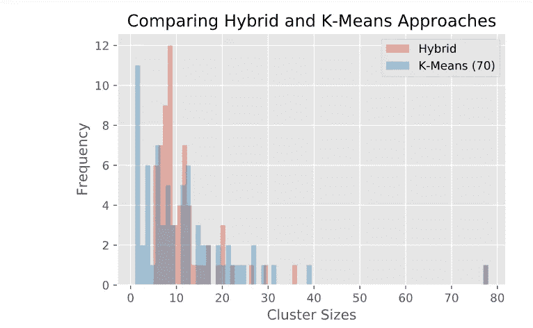

> **如果你想自己运行代码，可以通过 google colab 链接:**

[](https://colab.research.google.com/drive/1MMzPZDuVUkuU_JDvqpflyMcSw7H3iwoy?usp=sharing) [## 谷歌联合实验室

colab.research.google.com](https://colab.research.google.com/drive/1MMzPZDuVUkuU_JDvqpflyMcSw7H3iwoy?usp=sharing)